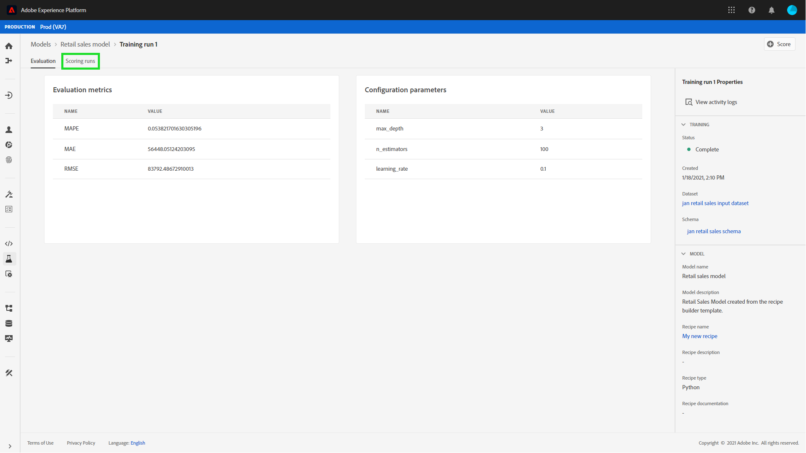

# Pontuar um modelo na interface do usuário do Data Science Workspace

>[!NOTE]
>
>O Data Science Workspace não está mais disponível para compra.
>
>Esta documentação destina-se aos clientes existentes com direitos anteriores ao Data Science Workspace.

A pontuação no Adobe Experience Platform [!DNL Data Science Workspace] pode ser obtida alimentando dados de entrada em um Modelo treinado existente. Os resultados da pontuação são armazenados e visualizados em um conjunto de dados de saída especificado como um novo lote.

Este tutorial demonstra as etapas necessárias para pontuar um Modelo na interface do usuário [!DNL Data Science Workspace].

## Introdução

Para concluir este tutorial, você deve ter acesso a [!DNL Experience Platform]. Se você não tiver acesso a uma organização no [!DNL Experience Platform], fale com o administrador do sistema antes de continuar.

Este tutorial requer um modelo treinado. Se você não tiver um Modelo treinado, siga o [treinamento e avalie um Modelo na interface do usuário](./train-evaluate-model-ui.md) tutorial antes de continuar.

## Criar uma nova execução de pontuação

Uma execução de pontuação é criada usando configurações otimizadas de uma execução treinamento previamente concluída e avaliada. O conjunto de configurações ideais para um Modelo é normalmente determinado pela revisão treinamento executar métricas de avaliação.

Encontre o melhor treinamento executado para usar suas configurações para pontuação. Em seguida, abra a execução de treinamento desejada selecionando o hiperlink anexado ao seu nome.

Na guia **[!UICONTROL Avaliação]** da execução de treinamento, selecione **[!UICONTROL Pontuação]**, localizado na parte superior direita da tela. Um novo fluxo de trabalho de pontuação é iniciado.

Selecione o conjunto de dados de pontuação de entrada e selecione **[!UICONTROL Próximo]**.

Selecione o conjunto de dados de pontuação de saída, esse é o conjunto de dados de saída dedicado em que os resultados da pontuação são armazenados. Confirme sua seleção e selecione **[!UICONTROL Próximo]**.

A etapa final no fluxo de trabalho solicita que você configure a execução de pontuação. Essas configurações são usadas pelo modelo para a execução de pontuação.
Observe que não é possível remover parâmetros herdados que foram definidos durante a criação dos modelos. Você pode editar ou reverter parâmetros não herdados clicando duas vezes no valor ou selecionando o ícone de reversão enquanto passa o mouse sobre a entrada.

Revise e confirme as configurações de pontuação e selecione **[!UICONTROL Concluir]** para criar e executar a execução de pontuação. Você será direcionado para a guia **[!UICONTROL Execuções de Pontuação]** e a nova execução de pontuação com o status **[!UICONTROL Pendente]** será exibida.

Uma execução de pontuação pode ser exibida com um dos seguintes status:
- Pending
- Concluído
- Com falha
- Executando

Os status são atualizados automaticamente. Vá para a próxima etapa se o status for **[!UICONTROL Concluído]** ou **[!UICONTROL Falha]**.

## resultados de pontuação Exibir

Para visualização pontuação de resultados, start selecionando uma treinamento corrida.

Você é redirecionado para a página de execuções de treinamento **[!UICONTROL Avaliação]**. Próximo à parte superior da página de avaliação da execução de treinamento, selecione a guia **[!UICONTROL Execuções de Pontuação]** para exibir uma lista de execuções de pontuação existentes.

Em seguida, selecione uma execução de pontuação para exibir os detalhes da execução.

Se a execução de pontuação selecionada tiver um status de &quot;Concluído&quot; ou &quot;Falha&quot;, o link **[!UICONTROL Exibir Logs de Atividade]** será disponibilizado. Se uma execução de pontuação falhar, os logs de execução podem fornecer informações úteis para determinar o motivo da falha. Para baixar os logs de execução, selecione **[!UICONTROL Exibir Logs de Atividades]**.

O popover **[!UICONTROL Exibir logs de atividades]** é exibido. Selecione um URL para baixar automaticamente os logs associados.

Você também tem a opção de exibir seus resultados de pontuação selecionando **[!UICONTROL Visualizar conjunto de dados de resultados de pontuação]**.

É fornecida uma pré-visualização do conjunto de dados de saída.

Para o conjunto completo de resultados de pontuação, selecione o link **[!UICONTROL Conjunto de Dados de Resultados de Pontuação]**, localizado na coluna direita.

## Próximas etapas

Isso tutorial o orientaram pelas etapas de pontuação de dados usando um modelo treinado em [!DNL Data Science Workspace]. Siga o tutorial na [publicação de um modelo como um serviço no interface](./publish-model-service-ui.md) para permitir que os usuários de sua organização marquem dados, fornecendo fácil acesso a um Serviço de aprendizado de máquina.
