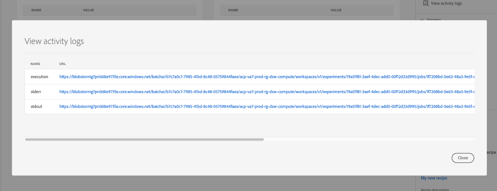

# Treine e avalie um modelo na interface do usuário do Data Science Workspace

No Adobe Experience Platform Data Science Workspace, um Modelo de aprendizado de máquina é criado incorporando uma Receita existente apropriada para a intenção do Modelo. O Modelo é então treinado e avaliado para otimizar sua eficiência e eficácia operacional ajustando seus hiperparâmetros associados. Receitas são reutilizáveis, o que significa que vários Modelos podem ser criados e adaptados a fins específicos com uma única Receita.

Este tutorial percorre as etapas para criar, treinar e avaliar um Modelo.

## Introdução

Para concluir este tutorial, você deve ter acesso a [!DNL Experience Platform]. Se você não tiver acesso a uma Organização IMS em [!DNL Experience Platform], fale com o administrador do sistema antes de continuar.

Este tutorial requer uma Receita existente. Se você não tiver uma Receita, siga o tutorial [Importar uma Receita empacotada na interface do usuário](./import-packaged-recipe-ui.md) antes de continuar.

## Criar um modelo

No Experience Platform, selecione a guia **[!UICONTROL Models]** localizada na navegação à esquerda e selecione a guia Procurar para exibir seus Modelos existentes. Selecione **[!UICONTROL Create Model]** próximo à parte superior direita da página para iniciar um processo de criação de Modelo.

Navegue pela lista de Receitas existentes, localize e selecione a Receita a ser usada para criar o Modelo e selecione **[!UICONTROL Next]**.

Selecione um conjunto de dados de entrada apropriado e selecione **[!UICONTROL Next]**. Isso definirá o conjunto de dados de treinamento de entrada padrão para o Modelo.

Forneça um nome para o Modelo e revise as configurações padrão do Modelo. As configurações padrão foram aplicadas durante a criação da Receita, revisar e modificar os valores de configuração clicando duas vezes nos valores.

Para fornecer um novo conjunto de configurações, selecione **[!UICONTROL Upload New Config]** e arraste um arquivo JSON contendo configurações de Modelo para a janela do navegador. Selecione **[!UICONTROL Finish]** para criar o Modelo.

>[!NOTE]
>
>As configurações são exclusivas e específicas para a Receita pretendida, isso significa que as configurações para a Receita de Vendas de Varejo não funcionarão para a Receita Recommendations do Produto. Consulte a seção [reference](#reference) para obter uma lista de configurações de Receita de Vendas de Varejo.

## Criar uma Execução de Treinamento

No Experience Platform, selecione a guia **[!UICONTROL Models]** localizada na navegação à esquerda e selecione a guia Procurar para exibir seus Modelos existentes. Localize e selecione o hiperlink anexado ao nome do Modelo que você deseja treinar.

Todos os treinamentos existentes são executados com seus status de treinamento atuais. Para Modelos criados usando a interface do usuário [!DNL Data Science Workspace], uma execução de treinamento é gerada e executada automaticamente usando as configurações padrão e o conjunto de dados de treinamento de entrada.

Crie uma nova execução de treinamento selecionando **[!UICONTROL Train]** próximo ao canto superior direito da página Visão geral do modelo.

Selecione o conjunto de dados de entrada de treinamento para a execução de treinamento e selecione **[!UICONTROL Next]**.

As configurações padrão fornecidas durante a criação do Modelo são mostradas, são alteradas e modificadas adequadamente clicando duas vezes nos valores. Selecione **[!UICONTROL Finish]** para criar e executar a execução do treinamento.

>[!NOTE]
>
>As configurações são exclusivas e específicas para a Receita pretendida, isso significa que as configurações para a Receita de Vendas de Varejo não funcionarão para a Receita Recommendations do Produto. Consulte a seção [reference](#reference) para obter uma lista de configurações de Receita de Vendas de Varejo.

## Avaliar o modelo

No Experience Platform, selecione a guia **[!UICONTROL Models]** localizada na navegação à esquerda e selecione a guia Procurar para exibir seus Modelos existentes. Localize e selecione o hiperlink anexado ao nome do Modelo que deseja avaliar.

Todos os treinamentos existentes são executados com seus status de treinamento atuais. Com várias execuções de treinamento concluídas, as métricas de avaliação podem ser comparadas em diferentes execuções de treinamento no gráfico de avaliação do modelo. Selecione uma métrica de avaliação usando a lista suspensa acima do gráfico.

A métrica Erro médio de porcentagem absoluta (MAPE) expressa a precisão como uma porcentagem do erro. Isso é usado para identificar o Experimento com melhor desempenho. Quanto menor o MAPE, melhor.

A métrica &quot;Precisão&quot; descreve a porcentagem de Instâncias relevantes em comparação ao total de *Instâncias recuperadas*. A precisão pode ser vista como a probabilidade de um resultado selecionado aleatoriamente estar correto.

A seleção de uma execução de treinamento específica fornece os detalhes dessa execução, abrindo a página de avaliação. Isso pode ser feito mesmo antes da execução ser concluída. Na página de avaliação, é possível ver outras métricas de avaliação, parâmetros de configuração e visualizações específicas da execução de treinamento.

Também é possível baixar registros de atividades para ver os detalhes da execução. Os registros são particularmente úteis para execuções com falha para ver o que deu errado.

Os hiperparâmetros não podem ser treinados e um Modelo deve ser otimizado testando diferentes combinações de hiperparâmetros. Repita esse processo de treinamento e avaliação do Modelo até chegar a um Modelo otimizado.

## Próximas etapas

Este tutorial o orientou pela criação, treinamento e avaliação de um Modelo em [!DNL Data Science Workspace]. Depois de chegar a um Modelo otimizado, você pode usar o Modelo treinado para gerar insights seguindo o tutorial [Pontuar um modelo na interface do usuário](./score-model-ui.md) .

## Referência {#reference}

### Configurações de receita de vendas de varejo

Os hiperparâmetros determinam o comportamento de treinamento do Modelo, modificando Hiperparâmetros afetará a precisão e precisão do Modelo:

| Hiperparâmetro | Descrição | Intervalo recomendado |
| --- | --- | --- |
| learning_rate | A taxa de aprendizado reduz a contribuição de cada árvore por learning_rate. Há uma compensação entre learning_rate e n_estimators. | 0,1 |
| n_estimatadores | O número de estágios de reforço a serem executados. O aumento de gradiente é bastante robusto para se adaptar demais, de modo que um grande número geralmente resulta em melhor desempenho. | 100 |
| profundidade_máxima | Profundidade máxima dos estimadores de regressão individuais. A profundidade máxima limita o número de nós na árvore. Ajuste este parâmetro para obter o melhor desempenho; o melhor valor depende da interação das variáveis de entrada. | 3 |

Parâmetros adicionais determinam as propriedades técnicas do Modelo:

| Chave de parâmetro | Tipo | Descrição |
| ----- | ----- | ----- |
| `ACP_DSW_INPUT_FEATURES` | String | Lista de atributos de esquema de entrada separados por vírgula. |
| `ACP_DSW_TARGET_FEATURES` | String | Lista de atributos de esquema de saída separados por vírgula. |
| `ACP_DSW_FEATURE_UPDATE_SUPPORT` | Booleano | Determina se os recursos de entrada e saída são modificáveis |
| `tenantId` | String | Essa ID garante que os recursos criados sejam namespacados corretamente e contidos na organização IMS. [Siga as etapas ](../../xdm/api/getting-started.md#know-your-tenant_id) aqui para localizar sua ID de locatário. |
| `ACP_DSW_TRAINING_XDM_SCHEMA` | String | O schema de entrada usado para treinar um Modelo. |
| `evaluation.labelColumn` | String | Rótulo de coluna para visualizações de avaliação. |
| `evaluation.metrics` | String | Lista separada por vírgulas de métricas de avaliação a serem usadas para avaliar um Modelo. |
| `ACP_DSW_SCORING_RESULTS_XDM_SCHEMA` | String | O schema de saída usado para pontuar um Modelo. |
