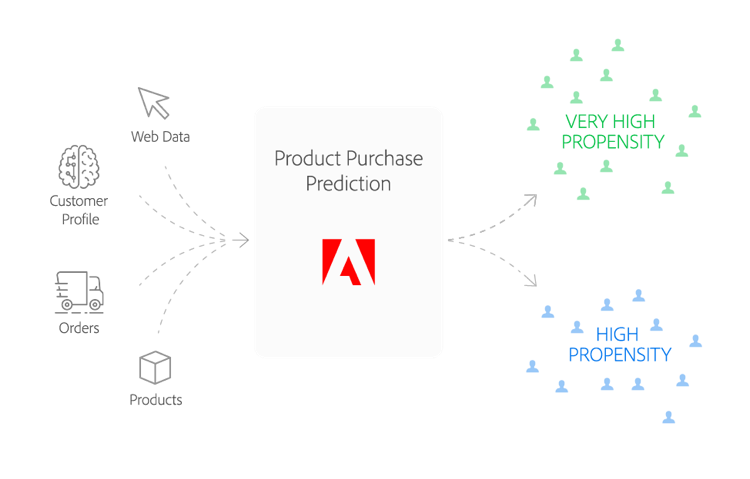

# Receita de previsão de compra do produto

A fórmula Previsão de compra do produto permite prever a probabilidade de um determinado tipo de evento de compra do cliente - uma compra de produto, por exemplo.

O documento a seguir responderá perguntas como:
* Para quem esta receita foi criada?
* O que esta receita faz?

## Para quem esta receita foi criada?

Sua marca busca impulsionar as vendas trimestrais de sua linha de produtos por meio de promoções eficazes e direcionadas para seus clientes. No entanto, nem todos os clientes são iguais e você quer o seu dinheiro. Quem você quer? Quais dos seus clientes têm maior probabilidade de responder sem achar sua promoção intrusiva? Como personalizar suas promoções para cada cliente? Em quais canais você deve confiar e quando você deve enviar as promoções?

## O que esta receita faz?

A fórmula Previsão de compra do produto utiliza o aprendizado de máquina para prever o comportamento de compra do cliente. Ele faz isso aplicando um classificador de floresta aleatória personalizado e um Modelo de Dados de Experiência em Duas Pontas (XDM) para prever a probabilidade de um evento de compra. O modelo utiliza dados de entrada que incorporam informações de perfil do cliente e histórico de compras anteriores, além de padrões para parâmetros de configuração predeterminados determinados determinados pelos nossos cientistas de dados para aprimorar a precisão preditiva.

## Schema de dados

Essa fórmula usa [esquemas XDM](../../xdm/home.md) para modelar os dados. O esquema usado para esta fórmula é mostrado abaixo:

| Nome do campo | Tipo |
| --- | --- |
| userId | String |
| genderRatio | Número |
| ageY | Número |
| ageM | Número |
| optinEmail | Booleano |
| optinMobile | Booleano |
| optinAddress | Booleano |
| criado | Número inteiro |
| totalOrders | Número |
| totalItems | Número |
| orderDate1 | Número |
| ShippingDate1 | Número |
| totalPrice1 | Número |
| tax1 | Número |
| orderDate2 | Número |
| ShippingDate2 | Número |
| totalPrice2 | Número |

## Algoritmo

Primeiro, o conjunto de dados de treinamento no schema *ProductPredição* é carregado. A partir daqui, o modelo é treinado usando um [random forest classificfier](https://scikit-learn.org/stable/modules/generated/sklearn.ensemble.RandomForestClassifier.html). Classificador Random forest é um tipo de algoritmo conjunto que se refere a um algoritmo que combina vários algoritmos para obter um desempenho preditivo aprimorado. A ideia por trás do algoritmo é que o classificador random forest cria várias árvores de decisão e as mescla para criar uma previsão mais precisa e estável.

Esse processo começa com a criação de um conjunto de árvores de decisão que seleciona aleatoriamente subconjuntos de dados de treinamento. Depois, calcula-se a média dos resultados de cada árvore de decisão.
