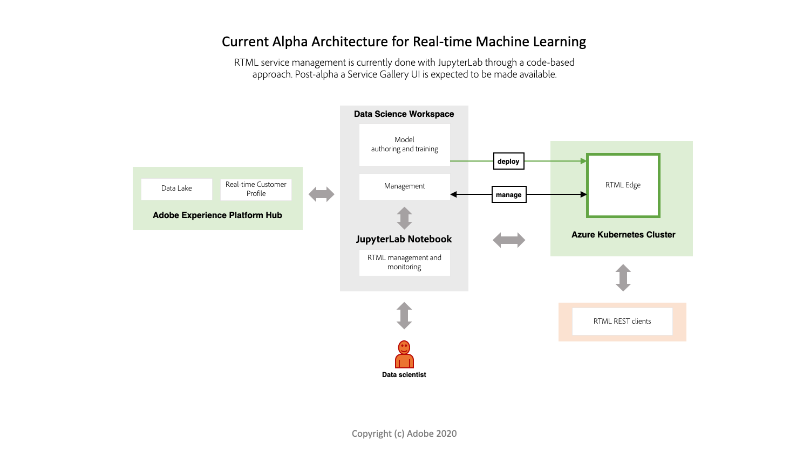

# Visão geral do aprendizado de máquina em tempo real (Alpha)

>[!IMPORTANT]
>
>O Aprendizado de máquina em tempo real ainda não está disponível para todos os usuários. Esse recurso está em alfa e ainda está sendo testado. Este documento está sujeito a alterações.

O Aprendizado de máquina em tempo real pode melhorar consideravelmente a relevância do conteúdo de experiência digital para os usuários finais. Isso é possibilitado aproveitando a inferência em tempo real e o aprendizado contínuo no [!DNL Experience Edge].

Uma combinação de computação contínua no Hub e no [!DNL Edge] reduz drasticamente a latência tradicionalmente envolvida no fornecimento de experiências hiper-personalizadas que são relevantes e responsivas. Assim, o Real-time Machine Learning fornece inferências com uma latência incrivelmente baixa para a tomada de decisão síncrona. Os exemplos incluem renderização de conteúdo personalizado da página da Web ou exibição de uma oferta ou desconto para reduzir o churn e aumentar as conversões em uma loja da Web.

## Arquitetura de aprendizado de máquina em tempo real {#architecture}

Os diagramas a seguir fornecem uma visão geral para a arquitetura de aprendizado de máquina em tempo real. Atualmente, o alpha tem uma versão mais simplificada.

## Fluxo de trabalho de aprendizado de máquina em tempo real

O fluxo de trabalho a seguir descreve as etapas e resultados típicos envolvidos na criação e utilização de um modelo de Aprendizagem de máquina em tempo real.

### Assimilação de dados e preparações

Os dados são assimilados e transformados com o [!DNL Experience Data Model] (XDM) na Adobe Experience Platform. Esses dados são usados para treinamento em modelo. Para saber mais sobre o XDM, visite a [Visão geral do XDM](../../xdm/home.md).

### Criação

Crie um modelo de aprendizado de máquina em tempo real criando-o do zero ou trazendo-o como um modelo ONNX serializado pré-treinado em notebooks Jupyter da Adobe Experience Platform.

### Implantação

Implante o modelo em [!DNL Experience Edge] para criar um serviço de Aprendizagem de Máquina em Tempo Real na [!UICONTROL Galeria de Serviços] usando o endpoint da API de Previsão.

### Inferência

Use o endpoint da API REST de previsão para gerar insights de aprendizado de máquina em tempo real.

### Delivery

Os profissionais de marketing podem então definir segmentos e regras que mapeiam pontuações de aprendizado de máquina em tempo real para experiências usando o Adobe Target. Isso permite que os visitantes do site da sua marca tenham uma experiência hiper-personalizada de mesma página ou da próxima em tempo real.

## Funcionalidade atual

No momento, o Aprendizado de máquina em tempo real está em alfa. A funcionalidade descrita abaixo está sujeita a alterações à medida que mais recursos e nós são disponibilizados.

>[!NOTE]
>
> Limitações alfa:
> - Atualmente, somente modelos baseados em ONNX são compatíveis.
> - As funções usadas em nós não podem ser serializadas. Por exemplo, uma função lambda usada em um nó Pandas.
> - Há um período de espera de 20 segundos após a implantação de [!DNL Edge] ser feita manualmente.
> - Para um aprendizado profundo, seus dados precisam ser enviados de tal forma que quando `df.values` for chamado, ele retorne uma matriz aceitável pelo modelo DL. Isso ocorre porque o nó de pontuação do modelo ONNX usa `df.values` e envia a saída para pontuar em relação ao modelo.

### Recursos:

|  | Alfa (maio) |
| --- | --- |
| **Recursos** | - Usar o modelo de notebook RTML, criar, testar e implantar um modelo de aprendizado de máquina personalizado.   - Suporte para importar modelos pré-treinados de aprendizagem de máquina.   - SDK do Real-time Machine Learning.   - Conjunto inicial de nós de criação.   - Implantado no Adobe Experience Platform Hub. |
| **Disponibilidade** | América do Norte |
| **Nós de criação** | - Painéis   - ScikitLearn   - ONNXNode   - Split   - ModelUpload   - OneHotEncoder |
| **Tempos de execução da pontuação** | ONNX |

## Próximas etapas

Você pode começar seguindo o guia [introdução](./getting-started.md). Este guia aborda a configuração de todos os pré-requisitos necessários para criar um modelo de aprendizado de máquina em tempo real.

