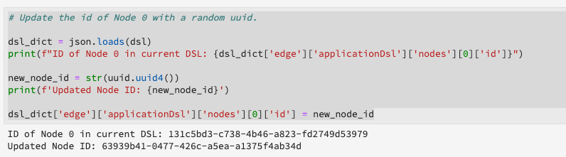

# Gerenciar notebooks de aprendizado de máquina em tempo real (Alpha)

>[!IMPORTANT]
>
>O Aprendizado de máquina em tempo real ainda não está disponível para todos os usuários. Esse recurso está em alfa e ainda está sendo testado. Este documento está sujeito a alterações.

O guia a seguir descreve as etapas necessárias para criar um aplicativo de Aprendizagem de máquina em tempo real. Uso do Adobe fornecido **[!UICONTROL ML em tempo real]** Modelo de notebook Python, este guia aborda o treinamento de um modelo, a criação de um DSL, a publicação de DSL no Edge e a pontuação da solicitação. Conforme você avança com a implementação do modelo de aprendizado de máquina em tempo real, espera-se modificar o modelo para atender às necessidades do conjunto de dados.

## Crie um notebook de aprendizado de máquina em tempo real

Na interface do usuário do Adobe Experience Platform, selecione **[!UICONTROL Notebooks]** de dentro **Ciência de dados**. Em seguida, selecione **[!UICONTROL JupyterLab]** e permita que o ambiente seja carregado.


O [!DNL JupyterLab] o iniciador é exibido. Role para baixo até *Aprendizagem de máquina em tempo real* e selecione o **[!UICONTROL ML em tempo real]** notebook. Um modelo é aberto contendo células de bloco de notas de exemplo com um conjunto de dados de exemplo.


## Importar e descobrir nós

Comece importando todos os pacotes necessários para o seu modelo. Certifique-se de que qualquer pacote que você planeja usar na criação do nó seja importado.

>[!NOTE]
>
>Sua lista de importações pode ser diferente de acordo com o modelo que você deseja fazer. Essa lista será alterada à medida que novos nós forem adicionados ao longo do tempo. Consulte a [guia de referência do nó](./node-reference.md) para obter uma lista completa de nós disponíveis.

```python
from pprint import pprint
import pandas as pd
import numpy as np
import json
import uuid
from shutil import copyfile
from pathlib import Path
from datetime import date, datetime, timedelta
from platform_sdk.dataset_reader import DatasetReader

from rtml_nodelibs.nodes.standard.preprocessing.json_to_df import JsonToDataframe
from rtml_sdk.edge.utils import EdgeUtils
from rtml_sdk.graph.utils import GraphBuilder
from rtml_nodelibs.nodes.standard.ml.onnx import ONNXNode
from rtml_nodelibs.core.nodefactory import NodeFactory as nf
from rtml_nodelibs.nodes.standard.preprocessing.pandasnode import Pandas
from rtml_nodelibs.nodes.standard.preprocessing.one_hot_encoder import OneHotEncoder
from rtml_nodelibs.nodes.standard.ml.artifact_utils import ModelUpload
from rtml_nodelibs.core.nodefactory import NodeFactory as nf
from rtml_nodelibs.core.datamsg import DataMsg
```

A célula de código a seguir imprime uma lista de nós disponíveis.

```python
# Discover Nodes
pprint(nf.discover_nodes())
```


## Treinamento de um modelo de aprendizado de máquina em tempo real

Usando uma das opções a seguir, você gravará [!DNL Python] código para ler, pré-processar e analisar dados. Em seguida, você precisa treinar seu próprio modelo ML, serializá-lo no formato ONNX e depois carregá-lo na loja de modelos de Aprendizagem de Máquina em Tempo Real.

- [Treinamento em seu próprio modelo em notebooks JupyterLab](#training-your-own-model)
- [Fazer upload de seu próprio modelo ONNX pré-treinado para notebooks JupyterLab](#pre-trained-model-upload)

### Treinamento em seu próprio modelo {#training-your-own-model}

Comece carregando seus dados de treinamento.

>[!NOTE]
>
>No **ML em tempo real** modelo, o [conjunto de dados CSV de seguro automóvel](https://github.com/adobe/experience-platform-dsw-reference/tree/master/datasets/insurance) é capturado de [!DNL Github].


Se quiser usar um conjunto de dados do Adobe Experience Platform, exclua o comentário da célula abaixo. Em seguida, é necessário substituir `DATASET_ID` com o valor apropriado.


Para acessar um conjunto de dados em seu [!DNL JupyterLab] bloco de anotações, selecione o **Dados** na navegação à esquerda de [!DNL JupyterLab]. O **[!UICONTROL Conjuntos de dados]** e **[!UICONTROL Esquemas]** diretórios são exibidos. Selecionar **[!UICONTROL Conjuntos de dados]** e clique com o botão direito do mouse, em seguida, selecione o **[!UICONTROL Explorar dados no notebook]** no menu suspenso do conjunto de dados que você deseja usar. Uma entrada de código executável é exibida na parte inferior do notebook. Essa célula tem seu `dataset_id`.


Depois de concluído, clique com o botão direito do mouse e exclua a célula gerada na parte inferior do bloco de notas.

### Propriedades de treinamento

Usando o modelo fornecido, modifique qualquer uma das propriedades de treinamento em `config_properties`.

```python
config_properties = {
    "train_records_limit":1000000,
    "n_estimators": "80",
    "max_depth": "5",
    "ten_id": "_experienceplatform"  
}
```

### Prepare seu modelo

Usar o **[!UICONTROL ML em tempo real]** , é necessário analisar, pré-processar, treinar e avaliar seu modelo ML. Isso é feito aplicando transformações de dados e criando um pipeline de treinamento.

**Transformações de dados**

O **[!UICONTROL ML em tempo real]** modelos **Transformações de dados** A célula precisa ser modificada para funcionar com seu próprio conjunto de dados. Normalmente, isso envolve renomear colunas, rollup de dados e preparação de dados/engenharia de recursos.

>[!NOTE]
>
>O exemplo a seguir foi condensado para fins de legibilidade usando `[ ... ]`. Visualize e expanda a *ML em tempo real* seção transformações de dados de modelos para a célula de código completa.

```python
df1.rename(columns = {config_properties['ten_id']+'.identification.ecid': 'ecid',
                     [ ... ]}, inplace=True)
df1 = df1[['ecid', 'km', 'cartype', 'age', 'gender', 'carbrand', 'leasing', 'city', 
       'country', 'nationality', 'primaryuser', 'purchase', 'pricequote', 'timestamp']]
print("df1 shape 1", df1.shape)
#########################################
# Data Rollup
######################################### 
df1['timestamp'] = pd.to_datetime(df1.timestamp)
df1['hour'] = df1['timestamp'].dt.hour.astype(int)
df1['dayofweek'] = df1['timestamp'].dt.dayofweek

df1.loc[(df1['purchase'] == 'yes'), 'purchase'] = 1
df1.purchase.fillna(0, inplace=True)
df1['purchase'] = df1['purchase'].astype(int)

[ ... ]

print("df1 shape 2", df1.shape)

#########################################
# Data Preparation/Feature Engineering
#########################################      

df1['carbrand'] = df1['carbrand'].str.lower()
df1['country'] = df1['country'].str.lower()
df1.loc[(df1['carbrand'] == 'vw'), 'carbrand'] = 'volkswagen'

[ ... ]

df1['age'].fillna(df1['age'].median(), inplace=True)
df1['gender'].fillna('notgiven', inplace=True)

[ ... ]

df1['city'] = df1.groupby('country')['city'].transform(lambda x: x.fillna(x.mode()))
df1.dropna(subset = ['pricequote'], inplace=True)
print("df1 shape 3", df1.shape)
print(df1)

#grouping
grouping_cols = ['carbrand', 'cartype', 'city', 'country']

for col in grouping_cols:
    df_idx = pd.DataFrame(df1[col].value_counts().head(6))

    def grouping(x):
        if x in df_idx.index:
            return x
        else:
            return "Others"
    df1[col] = df1[col].apply(lambda x: grouping(x))

def age(x):
    if x < 20:
        return "u20"
    elif x > 19 and x < 29:
    [ ... ]
    else: 
        return "Others"

df1['age'] = df1['age'].astype(int)
df1['age_bucket'] = df1['age'].apply(lambda x: age(x))

df_final = df1[['hour', 'dayofweek','age_bucket', 'gender', 'city',  
   'country', 'carbrand', 'cartype', 'leasing', 'pricequote', 'purchase']]
print("df final", df_final.shape)

cat_cols = ['age_bucket', 'gender', 'city', 'dayofweek', 'country', 'carbrand', 'cartype', 'leasing']
df_final = pd.get_dummies(df_final, columns = cat_cols)
```

Execute a célula fornecida para ver um exemplo de resultado. A tabela de saída retornou do `carinsurancedataset.csv` o conjunto de dados retorna as modificações definidas.


**Gasoduto de treinamento**

Em seguida, é necessário criar o pipeline de treinamento. Isso será semelhante a qualquer outro arquivo de pipeline de treinamento, exceto que é necessário converter e gerar um arquivo ONNX.

Usando as transformações de dados definidas na célula anterior, modifique o modelo . O código a seguir destacado abaixo é usado para gerar um arquivo ONNX no pipeline de recursos. Consulte a *ML em tempo real* modelo para a célula completa do código do pipeline.

```python
#for generating onnx
def generate_onnx_resources(self):        
    install_dir = os.path.expanduser('~/my-workspace')
    print("Generating Onnx")
        
    from skl2onnx import convert_sklearn
    from skl2onnx.common.data_types import FloatTensorType
        
    # ONNX-ification
    initial_type = [('float_input', FloatTensorType([None, self.feature_len]))]

    print("Converting Model to Onnx")
    onx = convert_sklearn(self.model, initial_types=initial_type)
             
    with open("model.onnx", "wb") as f:
        f.write(onx.SerializeToString())
            
    print("Model onnx created")
```

Depois de concluir o pipeline de treinamento e modificar seus dados por meio de transformações de dados, use a seguinte célula para executar o treinamento.

```python
model = train(config_properties, df_final)
```

### Gerar e carregar um modelo ONNX

Depois de concluir uma execução de treinamento bem-sucedida, você precisa gerar um modelo ONNX e fazer upload do modelo treinado para a loja de modelos Aprendizagem de Máquina em Tempo Real . Depois de executar as células a seguir, o modelo ONNX aparece no painel esquerdo ao lado de todos os outros notebooks.

```python
import os
import skl2onnx, subprocess

model.generate_onnx_resources()
```

>[!NOTE]
>
>Altere o `model_path` valor da string (`model.onnx`) para alterar o nome do modelo.

```python
model_path = "model.onnx"
```

>[!NOTE]
>
>A célula a seguir não pode ser editada ou excluída e é necessária para que seu aplicativo de Aprendizagem de máquina em tempo real funcione.

```python
model = ModelUpload(params={'model_path': model_path})
msg_model = model.process(None, 1)
model_id = msg_model.model['model_id']
 
print("Model ID: ", model_id)
```


### Fazer upload de seu próprio modelo ONNX pré-treinado {#pre-trained-model-upload}

Usar o botão de upload localizado em [!DNL JupyterLab] fazer upload de seu modelo ONNX pré-treinado para [!DNL Data Science Workspace] ambiente de notebooks.


Em seguida, altere a `model_path` valor da string na variável *ML em tempo real* notebook para corresponder ao nome do modelo ONNX. Depois de concluir, execute o *Definir caminho do modelo* e, em seguida, execute o *Fazer upload do modelo para a loja de modelos RTML* célula. A localização do modelo e a ID do modelo são retornadas na resposta quando bem-sucedidas.


## Criação de linguagem específica do domínio (DSL)

Esta seção descreve a criação de um DSL. Você criará os nós que incluem qualquer pré-processamento de dados junto com o nó ONNX. Em seguida, um gráfico DSL é criado usando nós e bordas. Bordas conectam nós usando o formato baseado em tupla (node_1, node_2). O gráfico não deve ter ciclos.

>[!IMPORTANT]
>
>O uso do nó ONNX é obrigatório. Sem o nó ONNX, o aplicativo não terá êxito.

### Criação de nós

>[!NOTE]
>
> É provável que você tenha vários nós com base no tipo de dados que está sendo usado. O exemplo a seguir descreve apenas um único nó no *ML em tempo real* modelo . Consulte a *ML em tempo real* modelos *Criação de nós* para a célula de código completa.

O nó Pandas abaixo usa `"import": "map"` para importar o nome do método como uma string nos parâmetros, em seguida, insira os parâmetros como uma função de mapa. O exemplo abaixo faz isso usando `{'arg': {'dataLayerNull': 'notgiven', 'no': 'no', 'yes': 'yes', 'notgiven': 'notgiven'}}`. Depois de colocar o mapa no lugar, você tem a opção de definir `inplace` as `True` ou `False`. Definir `inplace` as `True` ou `False` com base em se você deseja aplicar transformação no local ou não. Por padrão `"inplace": False` cria uma nova coluna. O suporte para fornecer um novo nome de coluna é definido para ser adicionado em uma versão subsequente. A última linha `cols` pode ser um nome de coluna único ou uma lista de colunas. Especifique as colunas em que deseja aplicar a transformação. Neste exemplo `leasing` é especificado. Para obter mais informações sobre os nós disponíveis e como usá-los, visite o [guia de referência do nó](./node-reference.md).

```python
# Renaming leasing column using Pandas Node
leasing_mapper_node = Pandas(params={'import': 'map',
                                'kwargs': {'arg': {
                                    'dataLayerNull': 'notgiven', 
                                    'no': 'no', 
                                    'yes': 'yes', 
                                    'notgiven': 'notgiven'}},
                                'inplace': True,
                                'cols': 'leasing'})
```

### Crie o gráfico DSL

Com seus nós criados, a próxima etapa é unir os nós para criar um gráfico.

Comece listando todos os nós que fazem parte do gráfico, criando uma matriz.

```python
nodes = [json_df_node, 
        to_datetime_node,
        hour_node,
        dayofweek_node,
        age_fillna_node,
        carbrand_fillna_node,
        country_fillna_node,
        cartype_primary_nationality_km_fillna_node,
        carbrand_mapper_node,
        cartype_mapper_node,
        country_mapper_node,
        gender_mapper_node,
        leasing_mapper_node,
        age_to_int_node,
        age_bins_node,
        dummies_node, 
        onnx_node]
```

Em seguida, conecte os nós com bordas. Cada tupla é uma [!DNL Edge] conexão.

>[!TIP]
>
> Como os nós são linearmente dependentes um do outro (cada nó depende da saída do nó anterior), você pode criar links usando uma compreensão simples da lista Python. Adicione suas próprias conexões se um nó depender de várias entradas.

```python
edges = [(nodes[i], nodes[i+1]) for i in range(len(nodes)-1)]
```

Depois que os nós estiverem conectados, crie o gráfico. A célula abaixo é obrigatória e não pode ser editada ou excluída.

```python
dsl = GraphBuilder.generate_dsl(nodes=nodes, edges=edges)
pprint(json.loads(dsl))
```

Uma vez concluído, um `edge` é retornado contendo cada um dos nós e os parâmetros que foram mapeados para eles.


## Publicar no Edge (Hub)

>[!NOTE]
>
>O Aprendizado de máquina em tempo real é temporariamente implantado e gerenciado pelo Adobe Experience Platform Hub. Para obter mais detalhes, visite a seção de visão geral em [Arquitetura de aprendizado de máquina em tempo real](./home.md#architecture).

Agora que você criou um gráfico DSL, é possível implantar o gráfico na [!DNL Edge].

>[!IMPORTANT]
>
>Não publicar em [!DNL Edge] frequentemente, isso pode sobrecarregar a variável [!DNL Edge] nós. Não é recomendado publicar o mesmo modelo várias vezes.

```python
edge_utils = EdgeUtils()
(edge_location, service_id) = edge_utils.publish_to_edge(dsl=dsl)
print(f'Edge Location: {edge_location}')
print(f'Service ID: {service_id}')
```

### Atualização do DSL e republicação no Edge (opcional)

Se não precisar atualizar o DSL, pule para [pontuação](#scoring).

>[!NOTE]
>
>As células a seguir só são necessárias se você quiser atualizar um DSL existente que foi publicado no Edge.

Seus modelos provavelmente continuarão a se desenvolver. Em vez de criar um serviço totalmente novo, é possível atualizar um serviço existente com seu novo modelo. Você pode definir um nó que deseja atualizar, atribuí-lo uma nova ID e fazer upload novamente do novo DSL para a [!DNL Edge].

No exemplo abaixo, o nó 0 é atualizado com uma nova ID.

```python
# Update the id of Node 0 with a random uuid.

dsl_dict = json.loads(dsl)
print(f"ID of Node 0 in current DSL: {dsl_dict['edge']['applicationDsl']['nodes'][0]['id']}")

new_node_id = str(uuid.uuid4())
print(f'Updated Node ID: {new_node_id}')

dsl_dict['edge']['applicationDsl']['nodes'][0]['id'] = new_node_id
```



Após atualizar a ID do nó, é possível republicar um DSL atualizado na borda.

```python
# Republish the updated DSL to Edge
(edge_location_ret, service_id, updated_dsl) = edge_utils.update_deployment(dsl=json.dumps(dsl_dict), service_id=service_id)
print(f'Updated dsl: {updated_dsl}')
```

Você retorna o DSL atualizado.


## Pontuação {#scoring}

Depois de publicar em [!DNL Edge], a pontuação é feita por uma solicitação de POST de um cliente. Normalmente, isso pode ser feito de um aplicativo cliente que precisa de pontuações ML. Você também pode fazer isso do Postman. O **[!UICONTROL ML em tempo real]** O modelo usa EdgeUtils para demonstrar esse processo.

>[!NOTE]
>
>É necessário um pequeno tempo de processamento antes do início da pontuação.

```python
# Wait for the app to come up
import time
time.sleep(20)
```

Usando o mesmo esquema usado no treinamento, dados de pontuação de amostra são gerados. Esses dados são usados para criar um dataframe de pontuação e depois convertidos em um dicionário de pontuação. Consulte a *ML em tempo real* modelo para a célula de código completa.


### Pontuação em relação ao endpoint da borda

Use a seguinte célula na *ML em tempo real* modelo para pontuação em relação ao seu [!DNL Edge] serviço.


Quando a pontuação estiver concluída, a variável [!DNL Edge] URL, Carga e saída pontuada do [!DNL Edge] são retornadas.

## Liste seus aplicativos implantados do [!DNL Edge]

Para gerar uma lista dos aplicativos implantados no momento no [!DNL Edge], execute a seguinte célula de código. Esta célula não pode ser editada ou excluída.

```python
services = edge_utils.list_deployed_services()
print(services)
```

A resposta retornada é uma matriz dos serviços implantados.

```json
[
    {
        "created": "2020-05-25T19:18:52.731Z",
        "deprecated": false,
        "id": "40eq76c0-1c6f-427a-8f8f-54y9cdf041b7",
        "type": "edge",
        "updated": "2020-05-25T19:18:52.731Z"
    }
]
```

## Excluir um aplicativo implantado ou uma ID de serviço do [!DNL Edge] (opcional)

>[!CAUTION]
>
>Essa célula é usada para excluir seu aplicativo Edge implantado. Não use a seguinte célula, a menos que seja necessário excluir um [!DNL Edge] aplicativo.

```python
if edge_utils.delete_from_edge(service_id=service_id):
    print(f"Deleted service id {service_id} successfully")
else:
    print(f"Failed to delete service id {service_id}")
```

## Próximas etapas

Seguindo o tutorial acima, você treinou e carregou com êxito um modelo ONNX na loja de modelos de Aprendizagem de Máquina em Tempo Real . Além disso, você classificou e implantou seu modelo de Aprendizagem de máquina em tempo real. Se quiser saber mais sobre os nós disponíveis para criação de modelo, visite o [guia de referência do nó](./node-reference.md).
