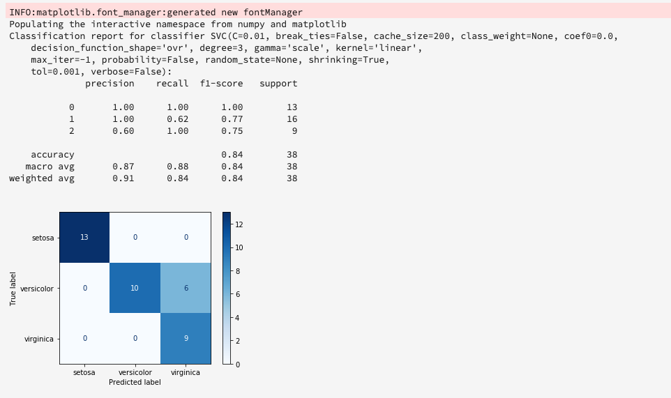
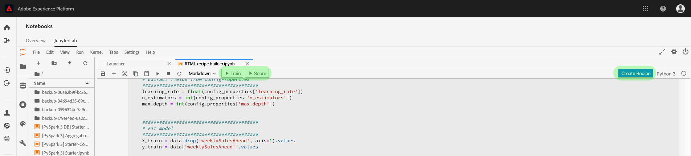
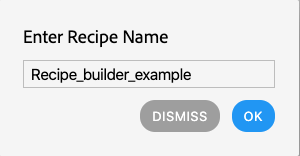

# Treinamento de um modelo para aprendizado de máquina em tempo real

>[!IMPORTANT]
>O aprendizado de máquina em tempo real ainda não está disponível para todos os usuários. Esse recurso está em alfa e ainda está sendo testado. Este documento está sujeito a mudanças.

Este documento fornece um tutorial para fazer upload de um modelo ONNX para a loja de modelos de aprendizado de máquina em tempo real.

Usando uma das opções a seguir, você gravará um código python para ler, pré-processar e analisar dados. Em seguida, você precisa treinar seu próprio modelo ML, serializá-lo no formato ONNX e finalmente carregá-lo na loja de modelos de aprendizado de máquina em tempo real. Além disso, até o final do tutorial, você receberá uma ID de modelo que identifica o modelo treinado para uso no tutorial [de](./scoring-ml-model.md)pontuação.

* [Treinamento de um modelo usando um notebook Python](#training-model-python-notebook)
* [Treinamento de um modelo usando seu próprio modelo ONNX](#train-using-own-onnx-model)
* [Treinamento de um modelo usando o modelo do construtor de receitas](#train-using-recipe-builder)
* [Treinamento de um modelo usando o fluxo de trabalho da fórmula do Data Science Workplace](#recipe-workflow-train-model)


## Treinar um modelo usando um notebook Python {#training-model-python-notebook}

Na interface do usuário da plataforma Adobe Experience, selecione **[!UICONTROL Notebooks]** na *Data Science*. Em seguida, selecione **[!UICONTROL JupyterLab]** e aguarde algum tempo para o ambiente carregar.


Start selecionando o notebook **Python 3** em branco no iniciador JupyterLab.


### Dados de acesso {#access-data}

Em seguida, selecione o conjunto de dados que deseja usar. Para acessar um conjunto de dados no seu notebook JupyterLab, selecione a guia **Dados** na navegação à esquerda de JupyterLab. Os diretórios *Conjuntos* de dados e *Schemas* são exibidos. Selecione **[!UICONTROL Conjuntos de dados]** e clique com o botão direito do mouse e selecione a opção **[!UICONTROL Explorar dados no notebook]** no menu suspenso no conjunto de dados que deseja usar. Uma entrada de código executável é exibida no seu notebook.


### Prepare seu modelo

Use o seguinte modelo para analisar, pré-processar, treinar e avaliar seu modelo ML. Para obter um exemplo completo, use as capturas de tela fornecidas abaixo deste modelo:

```python
from sklearn import svm, metrics
from sklearn.model_selection import train_test_split


data = df[input_columns]
target = df[target_column]
# Create a classifier: a support vector classifier
classifier = svm.SVC(gamma=0.001)

# Split data into train and test subsets
X_train, X_test, y_train, y_test = train_test_split(
    data, target, test_size=0.5, shuffle=False)

# We train the classifier
classifier.fit(X_train, y_train)

# Now do predictions
predicted = classifier.predict(X_test)


print("Classification report for classifier %s:\n%s\n"
      % (classifier, metrics.classification_report(y_test, predicted)))
disp = metrics.plot_confusion_matrix(classifier, X_test, y_test)
disp.figure_.suptitle("Confusion Matrix")
print("Confusion matrix:\n%s" % disp.confusion_matrix)
```

>[!NOTE]
>O exemplo abaixo usa a biblioteca scikit-learn em vez de carregar os dados de um conjunto de dados Adobe Experience Platform.


**Saída**



### Carregar o modelo

Depois de concluir a etapa anterior, é necessário serializar o modelo em um formato ONNX e carregá-lo na loja Aprendizagem de máquina em tempo real. Isso retorna o `model_id` usado no [próximo tutorial](#next-steps).

Use o seguinte modelo para converter para o ONNX e fazer upload do seu conjunto de dados:

```python
from rtml_nodelibs.nodes.standard.ml.artifact_utils
import ModelUpload
from rtml_nodelibs.core.nodefactory
import NodeFactory as nf
from skl2onnx.common.data_types
import FloatTensorType
from skl2onnx
import convert_sklearn

########## Save sklearn model in ONNX format at model_path ##########
inputs = [('features', FloatTensorType([None, X_train.shape[1]]))]
model_onnx = convert_sklearn(classifier, 'ScikitLearnModel', inputs)

model_path = "model.onnx"
os.environ["ONNX_MODEL_PATH"] = model_path

with open(model_path, "wb") as f:
  f.write(model_onnx.SerializeToString())

  ########## Upload the model from model_path to RTML model store ##########
  model = ModelUpload(params = {
    'model_path': model_path
  })

msg_model = model.process(None, 1)

model_id = msg_model.model['model_id']

print("Model ID : ", model_id)
```

**Resposta**


Depois de receber seu `model_id`, copie-o e siga para as [próximas etapas](#next-steps).


## Treinamento de um modelo usando seu próprio modelo ONNX {#train-using-own-onnx-model}

Na interface do usuário da plataforma Adobe Experience, selecione **[!UICONTROL Notebooks]** na *Data Science*. Em seguida, selecione **[!UICONTROL JupyterLab]** e aguarde algum tempo para o ambiente carregar.


Usando o botão de upload localizado em notebooks JupyterLab, carregue seu modelo ONNX para o ambiente de notebooks Data Science Workspace.


Em seguida, crie um novo bloco de anotações em branco selecionando o ícone de bloco de anotações em branco em Python 3 no lançador do JupyterLab.


No bloco de anotações em branco, copie e cole o seguinte:

>[!NOTE]
> Certifique-se de fornecer o modelo `model_path` ONNX que você carregou.

```python
from rtml_nodelibs.nodes.standard.ml.artifact_utils import ModelUpload
from rtml_nodelibs.core.nodefactory import NodeFactory as nf
 
model_path = <path/to/onnx_model>
########## Upload the model from model_path to RTML model store ##########
model = ModelUpload(params={'model_path': model_path})
 
msg_model = model.process(None, 1)
 
model_id = msg_model.model['model_id']
 
print("Model ID : ", model_id)
```

Depois de executar a célula acima, um `model_id` é retornado. Copie a ID do modelo a ser usada no [próximo tutorial](#next-steps).

## Treinar um modelo usando um modelo de fórmula pré-construído {#train-using-recipe-builder}

Na interface do usuário da plataforma Adobe Experience, selecione **[!UICONTROL Notebooks]** na *Data Science*. Em seguida, selecione **[!UICONTROL JupyterLab]** e aguarde algum tempo para o ambiente carregar.


Em seguida, siga o tutorial de [criação de uma receita usando notebooks](../jupyterlab/create-a-recipe.md) de Júpiter. Após a conclusão, é necessário modificar o arquivo pipeline.py para que a inferência em tempo real funcione.

>[!NOTE]
>O modelo fornecido pela Data Science Workspace precisa ser modificado para se ajustar ao seu conjunto de dados.

Certifique-se de salvar seu modelo no formato ONNX e definir a variável de ambiente como `ONNX_MODEL_PATH`. O exemplo abaixo mostra como modificar o arquivo de pipeline usando o modelo do construtor de receitas.

```python
def train(configProperties, data):

  print("Train Start")

########## Extract fields from configProperties ##########
learning_rate = float(configProperties['learning_rate'])
n_estimators = int(configProperties['n_estimators'])
max_depth = int(configProperties['max_depth'])

########## Fit model ##########
X_train = data.drop('weeklySalesAhead', axis = 1).values
y_train = data['weeklySalesAhead'].values

seed = 1234
model = GradientBoostingRegressor(learning_rate = learning_rate,
  n_estimators = n_estimators,
  max_depth = max_depth,
  random_state = seed)

model.fit(X_train, y_train)

########## Save sklearn model in ONNX format at model_path ##########
inputs = [('features', FloatTensorType([None, X_train.shape[1]]))]
model_onnx = convert_sklearn(model, 'ScikitLearnModel', inputs)

model_path = "retail_sales_model.onnx"
os.environ["ONNX_MODEL_PATH"] = model_path

with open(model_path, "wb") as f:
  f.write(model_onnx.SerializeToString())

print("Train Complete")

return model
```

Depois de modificar o arquivo pipeline.py, execute **[!UICONTROL Training]** e **[!UICONTROL Scoring]**. Depois de concluído, selecione o botão **[!UICONTROL Criar receita]** .



Uma caixa de diálogo de nomeação é exibida. Insira o nome da receita e selecione **[!UICONTROL OK]**. Uma nova caixa de diálogo é exibida alertando que a criação da receita começou. Aguarde até que a receita seja criada.




Depois que uma fórmula é criada, ela pode ser visualizada selecionando Receitas **[!UICONTROL de]** Visualização na caixa de diálogo fornecida ou navegando até **[!UICONTROL Modelos]** e, em seguida, selecionando **[!UICONTROL Receitas]** na navegação superior esquerda. Uma lista de fórmulas classificadas por data de criação é exibida. Confirme se sua nova receita está no topo.


Selecione sua receita. A página de visão geral da fórmula é exibida. Na navegação superior direita, selecione **[!UICONTROL Criar modelo]**.


Em seguida, selecione um conjunto de dados apropriado. Em seguida, clique em **[!UICONTROL Avançar]** na navegação superior direita.


A página de configuração é aberta. Forneça um nome para o modelo e analise as configurações padrão do modelo. As configurações padrão são aplicadas durante a criação da fórmula. Revise e modifique os valores de configuração clicando nos valores com o duplo. Para fornecer um novo conjunto de configurações, clique em **[!UICONTROL Carregar nova configuração]** e arraste um arquivo JSON que contém configurações de modelo para a janela do navegador. Selecione **[!UICONTROL Concluir]** para criar o modelo.


Depois que o modelo é criado, você precisa aguardar a conclusão da execução do treinamento. Quando uma execução de treinamento bem-sucedida for concluída, você poderá selecionar a execução de treinamento para visualização dos detalhes.

Selecione uma execução de treinamento. Depois de selecionada, uma caixa de diálogo de propriedades é exibida à direita. Nessa caixa de diálogo, selecione Logs **[!UICONTROL de Atividade de]** Visualização.


A janela de diálogo Logs *de Atividade da* Visualização é exibida. Selecione o URL para os registros do *usuário* para baixar os registros e ver os detalhes da execução.


Os registros são particularmente úteis para execuções com falha para ver o que deu errado. Mas, nesse caso, você está procurando o modelo `model-id` correspondente ao ONNX que você fez. Copie a ID do modelo.

>[!NOTE]
>Você não precisa executar um trabalho de pontuação. A pontuação da borda do Aprendizado de máquina em tempo real é abordada na [próxima etapa](#next-steps).


## Treinamento de um modelo usando o fluxo de trabalho da fórmula do Data Science Workplace {#recipe-workflow-train-model}

Este é o melhor método a ser usado se você estiver familiarizado com o código Docker, git e Packet Python. O uso do fluxo de trabalho da Data Science Workspace proporciona a você a maior flexibilidade e liberdade na criação de suas receitas. Você pode obter uma imagem básica mais leve e criar seu próprio ambiente, depurar sua receita com mais facilidade, clonar receitas pré-criadas para reproduzir com qualquer serviço da Data Science Workspace, agendar as execuções da receita e muito mais.

### Criar um schema

A primeira etapa exige que você tenha um schema de dados para seu conjunto de dados. Um schema pode ser criado por meio da interface do usuário da plataforma Adobe Experience ou das APIs da plataforma.

>[!NOTE]
>Se você já tiver os dados que deseja usar na Adobe Experience Platform, pule para [criar uma receita](#create-a-python-recipe)Python.

* [Criar um schema usando o tutorial da interface do editor de schemas](../../xdm/tutorials/create-schema-ui.md)
* [Criar um schema usando o tutorial da API do editor de schemas](../../xdm/tutorials/create-schema-api.md)

### Ingressar seus dados

Em seguida, você precisa ingerir dados usando o schema que acabou de criar. Isso pode ser feito usando a API ou a interface do usuário da plataforma.

>[!NOTE]
>Se você já tiver os dados que deseja usar na Adobe Experience Platform, pule para [criar uma receita](#create-a-python-recipe)Python.

* [Ingressar dados no tutorial da interface do usuário da Adobe Experience Platform](../../ingestion/tutorials/ingest-batch-data.md)
* [Ingressar dados no tutorial da API da Adobe Experience Platform](../../ingestion/batch-ingestion/api-overview.md)

### Criar uma fórmula Python {#create-a-python-recipe}

Receba start de criação com arquivos de origem de empacotamento para criar um arquivo. Os arquivos de origem definem a lógica e os algoritmos de aprendizado da máquina usados para resolver um problema específico em mãos. Use o tutorial a seguir para criar uma imagem Python Docker.

* [Empacotar arquivos de origem em uma fórmula](../models-recipes/package-source-files-recipe.md)

Para concluir a próxima etapa, é necessário ter uma imagem do Docker em um Registro de Container do Azure junto com o URL da imagem correspondente. Selecione um dos links do tutorial abaixo para concluir a criação de uma fórmula Python:

* [Importar uma receita empacotada na interface do usuário](../models-recipes/import-packaged-recipe-ui.md)
* [Importar uma Receita empacotada usando a API](../models-recipes/import-packaged-recipe-api.md)

### Criar uma execução de treinamento

Na Adobe Experience Platform Data Science Workspace, um Modelo de aprendizado de máquina é criado pela incorporação de uma Receita existente apropriada para a intenção do Modelo. O Modelo é então treinado e avaliado para otimizar sua eficiência e eficácia operacional, ajustando seus hiperparâmetros associados.

* [Treinar e avaliar um modelo na interface do usuário](../models-recipes/train-evaluate-model-ui.md)
* [Treinar e avaliar um modelo na API](../models-recipes/train-evaluate-model-api.md)

>[!IMPORTANT]
>No arquivo pipeline.py para sua fórmula, salve o modelo no formato ONNX dentro `model_path` e defina a variável de ambiente como `ONNX_MODEL_PATH`. O tempo de execução procura essa variável de ambiente específica.

```python
def train(configProperties, data):
 
    print("Train Start")
 
    ########## Extract fields from configProperties ##########

    learning_rate = float(configProperties['learning_rate'])
    n_estimators = int(configProperties['n_estimators'])
    max_depth = int(configProperties['max_depth'])
 
 
    
    ########## Fit model ##########
    
    X_train = data.drop('weeklySalesAhead', axis=1).values
    y_train = data['weeklySalesAhead'].values
 
    seed = 1234
    model = GradientBoostingRegressor(learning_rate=learning_rate,
                                      n_estimators=n_estimators,
                                      max_depth=max_depth,
                                      random_state=seed)
 
    model.fit(X_train, y_train)
     
    ########## Save sklearn model in ONNX format at model_path ##########
    inputs = [('features', FloatTensorType([None, X_train.shape[1]]))]
    model_onnx = convert_sklearn(model, 'ScikitLearnModel', inputs)
 
    model_path = "retail_sales_model.onnx"
    os.environ["ONNX_MODEL_PATH"] = model_path
 
    with open(model_path, "wb") as f:
        f.write(model_onnx.SerializeToString())
 
    print("Train Complete")
 
    return model
```

Depois que o modelo é criado, você precisa aguardar a conclusão da execução do treinamento. Quando uma execução de treinamento bem-sucedida for concluída, você poderá selecionar a execução de treinamento para visualização de seus detalhes. Selecione uma execução de treinamento. Depois de selecionada, uma caixa de diálogo de propriedades é exibida à direita, selecione **[!UICONTROL Visualização Atividade Logs]**.


A janela de diálogo Logs *de Atividade da* Visualização é exibida. Selecione o URL para os registros do *usuário* para baixar os registros e ver os detalhes da execução.


Os registros são particularmente úteis para execuções com falha para ver o que deu errado. Mas, nesse caso, você está procurando o modelo `model-id` correspondente ao ONNX que você fez. Copie a ID do modelo.


Você não precisa executar um trabalho de pontuação na receita. A pontuação da borda do aprendizado de máquina em tempo real é abordada no [próximo tutorial](#next-steps).

## Próximas etapas {#next-steps}

Seguindo um dos tutoriais acima, você treinou e carregou com êxito um modelo ONNX para a loja de modelos de Aprendizagem de Máquinas em Tempo Real e tem um `model_id` que identifica seu modelo. Continue com o próximo tutorial para saber como [Pontuar seu modelo](./scoring-ml-model.md)de aprendizado de máquina em tempo real.