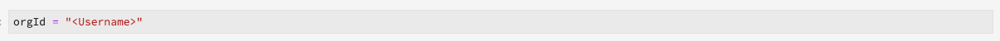

# Guias de migração de receitas e notebooks

>[!NOTE]
>Os notebooks e as receitas que usam Python/R não são afetados. A migração se aplica somente às receitas e notebooks PySpark/Spark existentes.

Os guias a seguir descrevem as etapas e informações necessárias para migrar receitas e notebooks existentes.

- [Guias de migração de receita](#recipe-migration)
- [Guias de migração de notebook](#notebook-migration)

## Guias de migração de receita {#recipe-migration}

Alterações recentes na Data Science Workspace exigem que as receitas existentes do Spark e do PySpark sejam atualizadas. Use os workflows a seguir para auxiliar na transição de suas receitas.

- [Guia de migração do Spark](#spark-migration-guide)
   - [Modificar como você lê e grava conjuntos de dados](#read-write-recipe-spark)
   - [Download da fórmula de amostra](#download-sample-spark)
   - [Adicionar o arquivo docker](#add-dockerfile-spark)
   - [Verificar dependências](#change-dependencies-spark)
   - [Preparar scripts docker](#prepare-docker-spark)
   - [criar a receita com o docker](#create-recipe-spark)
- [Guia de migração do PySpark](#pyspark-migration-guide)
   - [Modificar como você lê e grava conjuntos de dados](#pyspark-read-write)
   - [Download da fórmula de amostra](#pyspark-download-sample)
   - [Adicionar o arquivo docker](#pyspark-add-dockerfile)
   - [Preparar scripts docker](#pyspark-prepare-docker)
   - [criar a receita com o docker](#pyspark-create-recipe)

## Guia de migração do Spark {#spark-migration-guide}

O artefato de fórmula gerado pelas etapas de compilação agora é uma imagem Docker que contém seu arquivo binário .jar. Além disso, a sintaxe usada para ler e gravar conjuntos de dados usando o SDK da plataforma foi alterada e requer que você modifique o código da fórmula.

O vídeo a seguir foi criado para auxiliar na compreensão das alterações necessárias para as receitas do Spark:

>[!VIDEO](https://video.tv.adobe.com/v/33243)

### Conjuntos de dados de leitura e gravação (Spark) {#read-write-recipe-spark}

Antes de criar a imagem do Docker, analise os exemplos para ler e gravar conjuntos de dados no SDK da plataforma, fornecido nas seções abaixo. Se você estiver convertendo fórmulas existentes, seu código SDK da plataforma precisa ser atualizado.

#### Ler um conjunto de dados

Esta seção descreve as alterações necessárias para ler um conjunto de dados e usa o exemplo [helper.escala](https://github.com/adobe/experience-platform-dsw-reference/blob/master/recipes/scala/src/main/scala/com/adobe/platform/ml/helper/Helper.scala) , fornecido pela Adobe.

Com as atualizações das receitas do Spark, vários valores precisam ser adicionados e alterados. Primeiro, não `DataSetOptions` é mais usado. Replace `DataSetOptions` with `QSOption`. Além disso, são necessários novos `option` parâmetros. Tanto `QSOption.mode` quanto `QSOption.datasetId` são necessários. Por último, `orgId` e `serviceApiKey` é necessário mudar para `imsOrg` e `apiKey`. Analise a tabela a seguir para obter uma comparação sobre a leitura de conjuntos de dados:

<table>
  <th>Modo antigo de ler um conjunto de dados</th>
  <th>Nova maneira de ler um conjunto de dados</th>
  <tr>
  <td>
  <pre class="JSON language-JSON hljs">
  var df = sparkSession.read.format("com.adobe.platform.dataset") .option(DataSetOptions.orgId, orgId) .option(DataSetOptions.serviceToken, serviceToken) .option(DataSetOptions.userToken, userToken) .option(DataSetOptions.serviceApiKey, apiKey, iKey) .load(dataSetId)
</pre>
  </td>
  <td>
<pre class="JSON language-JSON hljs">
importe com.adobe.platform.query.QSOption

var df = sparkSession.read.format(&quot;com.adobe.platform.query&quot;).option(QSOption.userToken&quot;, {userToken}).option(QSOption.serviceToken, {serviceToken}).option(QSOption.imsOrg, {orgId}).option(QSOption.apiKey, {000000000000000000000000000000000000000000000 apiKey}).option(QSOption.mode, &quot;interative&quot;).option(QSOption.datasetId, {dataSetId}).load()
</pre>
</td>
  </tr>
</table>

>[!TIP]
> O modo interativo expira se os query estiverem em execução por mais de 10 minutos. Se você estiver ingerindo mais de alguns gigabytes de dados, é recomendável alternar para o modo &quot;lote&quot;. O modo de lote demora mais para ser start, mas pode lidar com conjuntos maiores de dados.

#### Gravar em um conjunto de dados

Esta seção descreve as alterações necessárias para gravar um conjunto de dados usando o exemplo [ScoringDataSaver.escala](https://github.com/adobe/experience-platform-dsw-reference/blob/master/recipes/scala/src/main/scala/com/adobe/platform/ml/ScoringDataSaver.scala) , fornecido pela Adobe.

Com as atualizações das receitas do Spark, vários valores precisam ser adicionados e alterados. Primeiro, não `DataSetOptions` é mais usado. Replace `DataSetOptions` with `QSOption`. Além disso, são necessários novos `option` parâmetros. `QSOption.datasetId` é necessário e substitui a necessidade de carregar o `{dataSetId}` em `.save()`. Por último, `orgId` e `serviceApiKey` é necessário mudar para `imsOrg` e `apiKey`. Analise a tabela a seguir para obter uma comparação sobre a gravação de conjuntos de dados:

<table>
  <th>Modo antigo de escrever um conjunto de dados</th>
  <th>Nova maneira de escrever um conjunto de dados</th>
  <tr>
  <td>
  <pre class="JSON language-JSON hljs">
  df.write.format("com.adobe.platform.dataset") .option(DataSetOptions.orgId, orgId) .option(DataSetOptions.serviceToken, serviceToken) .option(DataSetOptions.userToken, userToken) .option(DataSetOptions.serviceApiKey, apiKey) .save (scoringResultsDataSetId)
</pre>
  </td>
  <td>
<pre class="JSON language-JSON hljs">
importe com.adobe.platform.query.QSOption

df.write.format(&quot;com.adobe.platform.query&quot;).option(QSOption.userToken&quot;, {userToken}).option(QSOption.serviceToken, {serviceToken}).option(QSOption.imsOrg, {orgId}).option(QSOption.apiKey) .option(QSOption.datasetId, {dataSetId}).save()
</pre>
</td>
  </tr>
</table>

### Pacote de arquivos de origem baseados em Docker (Spark) {#package-docker-spark}

Start navegando até o diretório onde sua receita está localizada.

As seções a seguir usam a nova receita de vendas de varejo Scala que pode ser encontrada no repositório [Github público da](https://github.com/adobe/experience-platform-dsw-reference)Data Science Workspace.

### Baixar a fórmula de amostra (Spark) {#download-sample-spark}

A fórmula de amostra contém arquivos que precisam ser copiados para a sua receita existente. Para clonar o Github público que contém todas as receitas de amostra, insira o seguinte no terminal:

```BASH
git clone https://github.com/adobe/experience-platform-dsw-reference.git
```

A fórmula Scala está localizada no diretório a seguir `experience-platform-dsw-reference/recipes/scala/retail`.

### Adicionar o arquivo Dockerfile (Spark) {#add-dockerfile-spark}

É necessário um novo arquivo na pasta de fórmula para usar o fluxo de trabalho baseado no docker. Copie e cole o arquivo Dockerfile da pasta de receitas localizada em `experience-platform-dsw-reference/recipes/scala/Dockerfile`. Opcionalmente, você também pode copiar e colar o código abaixo em um novo arquivo chamado `Dockerfile`.

>[!IMPORTANT]
> O arquivo jar de exemplo mostrado abaixo `ml-retail-sample-spark-*-jar-with-dependencies.jar` deve ser substituído pelo nome do arquivo jar de sua receita.

```scala
FROM adobe/acp-dsw-ml-runtime-spark:0.0.1

COPY target/ml-retail-sample-spark-*-jar-with-dependencies.jar /application.jar
```

### Alterar dependências (Spark) {#change-dependencies-spark}

Se você estiver usando uma fórmula existente, serão necessárias alterações no arquivo pom.xml para dependências. Altere a versão de dependência do model-authoring-sdk para 1.0.0. Em seguida, atualize a versão do Spark no arquivo pom para 2.4.3 e a versão Scala para 2.11.12.

```json
<groupId>com.adobe.platform.ml</groupId>
<artifactId>authoring-sdk_2.11</artifactId>
<version>1.0.0</version>
<classifier>jar-with-dependencies</classifier>
```

### Preparar os scripts do Docker (Spark) {#prepare-docker-spark}

As receitas do Spark não usam mais Artefatos binários e exigem a criação de uma imagem do Docker. Caso ainda não o tenha feito, [baixe e instale o Docker](https://www.docker.com/products/docker-desktop).

Na fórmula de amostra Scala fornecida, você pode encontrar os scripts `login.sh` e `build.sh` localizados em `experience-platform-dsw-reference/recipes/scala/` . Copie e cole esses arquivos em sua receita existente.

A estrutura da pasta agora deve ser semelhante ao exemplo a seguir (os arquivos recém-adicionados são destacados):


A próxima etapa é acompanhar os arquivos de origem do [pacote em um tutorial de fórmula](./models-recipes/package-source-files-recipe.md) . Este tutorial tem uma seção que descreve como criar uma imagem mais âncora para uma receita Scala (Spark). Após a conclusão, você receberá a imagem do Docker em um Registro de Container do Azure junto com o URL da imagem correspondente.

### Criar uma fórmula (Spark) {#create-recipe-spark}

Para criar uma fórmula, você deve primeiro concluir o tutorial de arquivos [de origem do](./models-recipes/package-source-files-recipe.md) pacote e ter o URL da imagem do docker pronto. Você pode criar uma receita com a interface do usuário ou a API.

Para criar sua receita usando a interface do usuário, siga o tutorial [importar uma receita empacotada (UI)](./models-recipes/import-packaged-recipe-ui.md) para Scala.

Para criar sua receita usando a API, siga o tutorial de [importação de uma receita empacotada (API)](./models-recipes/import-packaged-recipe-api.md) para Scala.

## Guia de migração do PySpark {#pyspark-migration-guide}

O artefato de fórmula gerado pelas etapas de compilação agora é uma imagem Docker que contém seu arquivo binário .ova. Além disso, a sintaxe usada para ler e gravar conjuntos de dados usando o SDK da plataforma foi alterada e requer que você modifique o código da fórmula.

O vídeo a seguir foi criado para auxiliar na compreensão das alterações necessárias para as receitas do PySpark:

>[!VIDEO](https://video.tv.adobe.com/v/33048?learn=on&quality=12)

### Conjuntos de dados de leitura e gravação (PySpark) {#pyspark-read-write}

Antes de criar a imagem do Docker, analise os exemplos para ler e gravar conjuntos de dados no SDK da plataforma, fornecido nas seções abaixo. Se você estiver convertendo fórmulas existentes, seu código SDK da plataforma precisa ser atualizado.

#### Ler um conjunto de dados

Esta seção descreve as alterações necessárias para ler um conjunto de dados usando o exemplo [helper.py](https://github.com/adobe/experience-platform-dsw-reference/blob/master/recipes/pyspark/pysparkretailapp/helper.py) , fornecido pela Adobe.

Com as atualizações das receitas do Spark, vários valores precisam ser adicionados e alterados. Primeiro, não `DataSetOptions` é mais usado. Replace `DataSetOptions` with `qs_option`. Além disso, são necessários novos `option` parâmetros. Tanto `qs_option.mode` quanto `qs_option.datasetId` são necessários. Por último, `orgId` e `serviceApiKey` é necessário mudar para `imsOrg` e `apiKey`. Analise a tabela a seguir para obter uma comparação sobre a leitura de conjuntos de dados:

<table>
  <th>Modo antigo de ler um conjunto de dados</th>
  <th>Nova maneira de ler um conjunto de dados</th>
  <tr>
  <td>
  <pre class="JSON language-JSON hljs">
dataset_options = get_dataset_options(spark.sparkContext)

pd = spark.read.format(&quot;com.adobe.platform.dataset&quot;).option(dataset_options.serviceToken(), service_token).option(dataset_options.userToken(), user_token).option(dataset_options.orgId(), org_id).option(dataset_options.serviceApiKey(), api_key).load(dataset_id)
</pre>
</td>
  <td>
<pre class="JSON language-JSON hljs">
qs_option = spark_context._jvm.com.adobe.platform.query.QSOption

pd = sparkSession.read.format(&quot;com.adobe.platform.query&quot;).option(qs_option.userToken, {userToken}).option(qs_option.serviceToken, {serviceToken}).option(qs_option.imsOrg, {orgId}).option(qs_option.apiKey, {api Key}).option(qs_option.mode, &quot;interative&quot;).option(qs_option.datasetId, {dataSetId}).load()
</pre>
</td>
  </tr>
</table>

>[!TIP]
> O modo interativo expira se os query estiverem em execução por mais de 10 minutos. Se você estiver ingerindo mais de alguns gigabytes de dados, é recomendável alternar para o modo &quot;lote&quot;. O modo de lote demora mais para ser start, mas pode lidar com conjuntos maiores de dados.

#### Gravar em um conjunto de dados

Esta seção descreve as alterações necessárias para gravar um conjunto de dados usando o exemplo [data_saver.py](https://github.com/adobe/experience-platform-dsw-reference/blob/master/recipes/pyspark/pysparkretailapp/data_saver.py) , fornecido pela Adobe.

Com as atualizações das receitas do PySpark, vários valores precisam ser adicionados e alterados. Primeiro, não `DataSetOptions` é mais usado. Replace `DataSetOptions` with `qs_option`. Além disso, são necessários novos `option` parâmetros.  `qs_option.datasetId` é necessário e substitui a necessidade de carregar o `{dataSetId}` em `.save()` . Por último, `orgId` e `serviceApiKey` é necessário mudar para `imsOrg` e `apiKey`. Analise a tabela a seguir para obter uma comparação sobre a leitura de conjuntos de dados:

<table>
  <th>Modo antigo de escrever um conjunto de dados</th>
  <th>Nova maneira de escrever um conjunto de dados</th>
  <tr>
  <td>
  <pre class="JSON language-JSON hljs">
df.write.format("com.adobe.platform.dataset") .option(DataSetOptions.orgId, orgId) .option(DataSetOptions.serviceToken, serviceToken) .option(DataSetOptions.userToken, userToken) .option(DataSetOptions.serviceApiKey, apiKey) .save (scoringResultsDataSetId)
</pre>
  </td>
  <td>
<pre class="JSON language-JSON hljs">
qs_option = spark_context._jvm.com.adobe.platform.query.QSOption

scored_df.write.format(&quot;com.adobe.platform.query&quot;).option(qs_option.userToken, {userToken}).option(qs_option.serviceToken, {serviceToken}).option(qs_option.imsOrg, {orgId}).option(qs_option.apiKey, {apiKey}).option(qs_option.datasetId, {dataSetId}).save()
</pre>
</td>
  </tr>
</table>

### Pacote de arquivos de origem baseados em Docker (PySpark) {#pyspark-package-docker}

Start navegando até o diretório onde sua receita está localizada.

Neste exemplo, a nova receita PySpark Retail Sales é usada e pode ser encontrada no repositório [](https://github.com/adobe/experience-platform-dsw-reference)Github público da Data Science Workspace.

### Download da fórmula de amostra (PySpark) {#pyspark-download-sample}

A fórmula de amostra contém arquivos que precisam ser copiados para a sua receita existente. Para clonar o Github público que contém todas as receitas de amostra, insira o seguinte no terminal.

```BASH
git clone https://github.com/adobe/experience-platform-dsw-reference.git
```

A receita do PySpark está localizada no diretório a seguir `experience-platform-dsw-reference/recipes/pyspark`.

### Adicionar o arquivo Dockerfile (PySpark) {#pyspark-add-dockerfile}

É necessário um novo arquivo na pasta de fórmula para usar o fluxo de trabalho baseado no docker. Copie e cole o arquivo Dockerfile da pasta de receitas localizada em `experience-platform-dsw-reference/recipes/pyspark/Dockerfile`. Opcionalmente, você também pode copiar e colar o código abaixo e criar um novo arquivo chamado `Dockerfile`.

>[!IMPORTANT]
> O arquivo de exemplo de ovo mostrado abaixo `pysparkretailapp-*.egg` deve ser substituído pelo nome do arquivo de ovos da sua receita.

```scala
FROM adobe/acp-dsw-ml-runtime-pyspark:0.0.1
RUN mkdir /recipe

COPY . /recipe

RUN cd /recipe && \
    ${PYTHON} setup.py clean install && \
    rm -rf /recipe

RUN cp /databricks/conda/envs/${DEFAULT_DATABRICKS_ROOT_CONDA_ENV}/lib/python3.6/site-packages/pysparkretailapp-*.egg /application.egg
```

### Preparar os scripts do Docker (PySpark) {#pyspark-prepare-docker}

As receitas do PySpark não usam mais Artefatos binários e exigem a criação de uma imagem do Docker. Caso ainda não o tenha feito, baixe e instale o [Docker](https://www.docker.com/products/docker-desktop).

Na fórmula de amostra PySpark fornecida, você pode encontrar os scripts `login.sh` e `build.sh` localizados em `experience-platform-dsw-reference/recipes/pyspark` . Copie e cole esses arquivos em sua receita existente.

A estrutura da pasta agora deve ser semelhante ao exemplo a seguir (os arquivos recém-adicionados são destacados):


Sua receita está pronta para ser criada usando uma imagem Docker. A próxima etapa é acompanhar os arquivos de origem do [pacote em um tutorial de fórmula](./models-recipes/package-source-files-recipe.md) . Este tutorial tem uma seção que descreve como criar uma imagem mais âncora para uma receita do PySpark (Spark 2.4). Após a conclusão, você receberá a imagem do Docker em um Registro de Container do Azure junto com o URL da imagem correspondente.

### Criar uma fórmula (PySpark) {#pyspark-create-recipe}

Para criar uma fórmula, você deve primeiro concluir o tutorial de arquivos [de origem do](./models-recipes/package-source-files-recipe.md) pacote e ter o URL da imagem do docker pronto. Você pode criar uma receita com a interface do usuário ou a API.

Para criar sua receita usando a interface do usuário, siga o tutorial [importar uma receita empacotada (UI)](./models-recipes/import-packaged-recipe-ui.md) para o PySpark.

Para criar sua receita usando a API, siga o tutorial de [importação de uma receita empacotada (API)](./models-recipes/import-packaged-recipe-api.md) para o PySpark.

## Guias de migração de notebook {#notebook-migration}

Alterações recentes nos notebooks JupyterLab exigem que você atualize os notebooks PySpark e Spark 2.3 existentes para 2.4. Com essa mudança, o JupyterLab Launcher foi atualizado com novos notebooks iniciais. Para obter um guia passo a passo sobre como converter seus notebooks, selecione um dos seguintes guias:

- [Guia de migração do PySpark 2.3 para o 2.4](#pyspark-notebook-migration)
- [Guia de migração do Spark 2.3 para o Spark 2.4 (Scala)](#spark-notebook-migration)

O vídeo a seguir foi criado para ajudar a entender as mudanças necessárias para os notebooks JupyterLab:

>[!VIDEO](https://video.tv.adobe.com/v/33444?quality=12&learn=on)

## Guia de migração de notebooks PySpark 2.3 a 2.4 {#pyspark-notebook-migration}

Com a introdução do PySpark 2.4 aos notebooks JupyterLab, os novos notebooks Python com PySpark 2.4 agora usam o kernel Python 3 em vez do kernel PySpark 3. Isso significa que o código existente em execução no PySpark 2.3 não é suportado no PySpark 2.4.

>[!IMPORTANT] O PySpark 2.3 está obsoleto e está definido para ser removido em uma versão subsequente. Todos os exemplos existentes estão definidos para serem substituídos por exemplos do PySpark 2.4.

Para converter seus notebooks PySpark 3 (Spark 2.3) existentes em Spark 2.4, siga os exemplos abaixo:

### Kernel

Os notebooks PySpark 3 (Spark 2.4) usam o kernel Python 3 em vez do kernel PySpark obsoleto usado nos notebooks PySpark 3 (Spark 2.3 - obsoleto).

Para confirmar ou alterar o kernel na interface do usuário do JupyterLab, selecione o botão do kernel localizado na barra de navegação superior direita do seu notebook. Se você estiver usando um dos notebooks iniciadores predefinidos, o kernel será pré-selecionado. O exemplo abaixo usa o notebook PySpark 3 (Spark 2.4) *Aggregation* starter.


Selecionar o menu suspenso abre uma lista de kernels disponíveis.


Para notebooks PySpark 3 (Spark 2.4), selecione o kernel Python 3 e confirme clicando no botão **Selecionar** .


## Inicializando sparkSession

Todos os notebooks Spark 2.4 exigem que você inicialize a sessão com o novo código estereotipado.

<table>
  <th>Notebook</th>
  <th>PySpark 3 (Spark 2.3 - obsoleto)</th>
  <th>PySpark 3 (Spark 2.4)</th>
  <tr>
  <th>Kernel</th>
  <td align="center">PySpark 3</td>
  <td align="center">Python 3</td>
  </tr>
  <tr>
  <th>Código</th>
  <td>
  <pre class="JSON language-JSON hljs">
  faísca
</pre>
  </td>
  <td>
  <pre class="JSON language-JSON hljs">
de pyspark.sql import SparkSessionSpark = SparkSession.builder.getOrCreate()
</pre>
  </td>
  </tr>
</table>

As imagens a seguir destacam as diferenças na configuração para PySpark 2.3 e PySpark 2.4. Este exemplo usa os notebooks iniciais de *Agregação* fornecidos no JupyterLab Launcher.

**Exemplo de configuração para 2.3 (obsoleto)**


**Exemplo de configuração para 2.4**


## Usando mágica de %dataset {#magic}

Com a introdução do Spark 2.4, a magia `%dataset` personalizada é fornecida para uso nos novos notebooks PySpark 3 (Spark 2.4) (kernel Python 3).

**Uso**

`%dataset {action} --datasetId {id} --dataFrame {df}`

**Descrição**

Um comando mágico personalizado da Data Science Workspace para ler ou escrever um conjunto de dados de um notebook Python (kernel Python 3).

- **{action}**: O tipo de ação a ser executada no conjunto de dados. Duas ações estão disponíveis &quot;read&quot; ou &quot;write&quot;.
- **—datasetId {id}**: Usado para fornecer a ID do conjunto de dados para leitura ou gravação. Este é um argumento obrigatório.
- **—dataFrame {df}**: Os pandas dataframe. Este é um argumento obrigatório.
   - Quando a ação é &quot;lida&quot;, {df} é a variável na qual os resultados da operação de leitura do conjunto de dados estão disponíveis.
   - Quando a ação é &quot;write&quot;, esse dataframe {df} é gravado no conjunto de dados.
- **—modo (opcional)**: Os parâmetros permitidos são &quot;batch&quot; e &quot;interative&quot;. Por padrão, o modo é definido como &quot;interativo&quot;. Recomenda-se usar o modo &quot;lote&quot; ao ler grandes quantidades de dados.

**Exemplos**

- **Exemplo** de leitura: `%dataset read --datasetId 5e68141134492718af974841 --dataFrame pd0`
- **Exemplo** de gravação: `%dataset write --datasetId 5e68141134492718af974842 --dataFrame pd0`

## Carregar em um dataframe no LocalContext

Com a introdução do Spark 2.4, a magia [`%dataset`](#magic) personalizada é fornecida. A tabela a seguir destaca as principais diferenças para carregar os dados nos notebooks PySpark (Spark 2.3) e PySpark (Spark 2.4):

<table>
  <th>Notebook</th>
  <th>PySpark 3 (Spark 2.3 - obsoleto)</th>
  <th>PySpark 3 (Spark 2.4)</th>
  <tr>
  <th>Kernel</th>
  <td align="center">PySpark 3</td>
  <td align="center">Python 3</td>
  </tr>
  <tr>
  <th>Código</th>
  <td>
  <pre class="JSON language-JSON hljs">
dataset_options = sc._jvm.com.adobe.platform.dataset.DataSetOptions

pd0 = spark.read.format(&quot;com.adobe.platform.dataset&quot;).option(dataset_options.orgId(), &quot;310C6D375BA5248F0A494212@AdobeOrg&quot;).load(&quot;5e68141134492718af974844&quot;)
</pre>
</td>
  <td>
  <pre class="JSON language-JSON hljs">
%dataset read —datasetId 5e68141134492718af974844 —dataFrame pd0
</pre>
  </td>
  </tr>
</table>

| Elemento | Descrição |
| ------- | ----------- |
| pd0 | Nome do objeto de dataframe do painel a ser usado ou criado. |
| [%dataset](#magic) | Magia personalizada para acesso a dados no kernel Python3. |

As imagens a seguir destacam as principais diferenças no carregamento de dados para PySpark 2.3 e PySpark 2.4. Este exemplo usa os notebooks iniciais de *Agregação* fornecidos no JupyterLab Launcher.

**Carregamento de dados no PySpark 2.3 (conjunto de dados Luma) - obsoleto**


**Carregando dados no PySpark 2.4 (conjunto de dados Luma)**

Com o PySpark 3 (Spark 2.4) `sc = spark.sparkContext` é definido no carregamento.


**Carregamento de dados da plataforma Experience Cloud no PySpark 2.3 - obsoleto**


**Carregamento de dados da plataforma Experience Cloud no PySpark 2.4**

Com o PySpark 3 (Spark 2.4), a definição `org_id` e `dataset_id` não é mais necessária. Além disso, `df = spark.read.format` foi substituído por uma mágica personalizada [`%dataset`](#magic) para facilitar a leitura e a gravação de conjuntos de dados.


| Elemento | descrição |
| ------- | ----------- |
| [%dataset](#magic) | Magia personalizada para acesso a dados no kernel Python3. |

>[!TIP] —mode pode ser definido como `interactive` ou `batch`. O padrão para —mode é `interactive`. Recomenda-se usar o `batch` modo ao ler grandes quantidades de dados.

## Criação de um dataframe local

Com o PySpark 3 (Spark 2.4), não há mais suporte para `%%` faísca. As seguintes operações não podem mais ser utilizadas:

- `%%help`
- `%%info`
- `%%cleanup`
- `%%delete`
- `%%configure`
- `%%local`

A tabela a seguir descreve as alterações necessárias para converter query `%%sql` minúsculos:

<table>
  <th>Notebook</th>
  <th>PySpark 3 (Spark 2.3 - obsoleto)</th>
  <th>PySpark 3 (Spark 2.4)</th>
  <tr>
  <th>Kernel</th>
  <td align="center">PySpark 3</td>
  <td align="center">Python 3</td>
  </tr>
  <tr>
  <th>Código</th>
      <td>
         <pre class="JSON language-JSON hljs">%%sql -o dfselect * de sparkdf
</pre>
         <pre class="JSON language-JSON hljs"> %%sql -o df -n limitselect * de sparkdf
</pre>
         <pre class="JSON language-JSON hljs">%%sql -o df -qselect * de sparkdf
</pre>
         <pre class="JSON language-JSON hljs"> %%sql -o df -r fractionselect * de sparkdf
</pre>
      </td>
      <td>
         <pre class="JSON language-JSON hljs">
df = spark.sql(''' SELECT * FROM sparkdf''')
</pre>
         <pre class="JSON language-JSON hljs">
df = spark.sql(''' SELECT * FROM sparkdf LIMIT ''')
</pre>
         <pre class="JSON language-JSON hljs">
df = spark.sql(''' SELECT * FROM sparkdf LIMIT ''')
</pre>
         <pre class="JSON language-JSON hljs">
sample_df = df.sample(fraction)
</pre>
      </td>
   </tr>
</table>

>[!TIP] Também é possível especificar uma amostra de semente opcional, como um booleano comReplacement, fração de duplo ou uma semente longa.

As imagens a seguir destacam as principais diferenças para a criação de um dataframe local no PySpark 2.3 e no PySpark 2.4. Este exemplo usa os notebooks iniciais de *Agregação* fornecidos no JupyterLab Launcher.

**Criar dados locais PySpark 2.3 - obsoleto**


**Criar dados locais PySpark 2.4**

Com o PySpark 3 (Spark 2.4), o `%%sql` Sparkmágico não é mais suportado e foi substituído pelo seguinte:


## Gravar em um conjunto de dados

Com a introdução do Spark 2.4, é fornecida magia [`%dataset`](#magic) personalizada que torna a gravação de conjuntos de dados mais limpa. Para gravar em um conjunto de dados, use o seguinte exemplo do Spark 2.4:

<table>
  <th>Notebook</th>
  <th>PySpark 3 (Spark 2.3 - obsoleto)</th>
  <th>PySpark 3 (Spark 2.4)</th>
  <tr>
  <th>Kernel</th>
  <td align="center">PySpark 3</td>
  <td align="center">Python 3</td>
  </tr>
  <tr>
  <th>Código</th>
  <td>
  <pre class="JSON language-JSON hljs">
userToken = spark.sparkContext.getConf().get("spark.wire.appMasterEnv.USER_TOKEN")serviceToken = spark.sparkContext.getConf().get("spark.wire.appMasterEnv.SERVICE_TOKEN")serviceApiKey = spark sparkContext.getConf().get("spark.wire.appMasterEnv.SERVICE_API_KEY")

dataset_options = sc._jvm.com.adobe.platform.dataset.DataSetOptions

pd0.write.format(&quot;com.adobe.platform.dataset&quot;).option(dataset_options.orgId(), &quot;310C6D375BA5248F0A494212@AdobeOrg&quot;).option(dataset_options.userToken(), userToken).option(dataset_options.serviceToken(), serviceToken).option(dataset_options.serviceApiKey(), serviceApiKey).save(&quot;5e68141134492718af974844&quot;)
</pre>
</td>
  <td>
  <pre class="JSON language-JSON hljs">
%dataset write —datasetId 5e68141134492718af974844 —dataFrame pd0

pd0.description()pd0.show(10, Falso)
</pre>
</td>
  </tr>
</table>

| Elemento | descrição |
| ------- | ----------- |
| pd0 | Nome do objeto de dataframe do painel a ser usado ou criado. |
| [%dataset](#magic) | Magia personalizada para acesso a dados no kernel Python3. |

>[!TIP] —mode pode ser definido como `interactive` ou `batch`. O padrão para —mode é `interactive`. Recomenda-se usar o `batch` modo ao ler grandes quantidades de dados.

As imagens a seguir destacam as principais diferenças para gravar dados de volta na Plataforma no PySpark 2.3 e no PySpark 2.4. Este exemplo usa os notebooks iniciais de *Agregação* fornecidos no JupyterLab Launcher.

**Gravação de dados de volta para Platform PySpark 2.3 - obsoleto**



**Gravação de dados de volta para Platform PySpark 2.4**

Com o PySpark 3 (Spark 2.4), a magia `%dataset` personalizada elimina a necessidade de definir valores como `userToken`, `serviceToken`, `serviceApiKey`e `.option`. Além disso, `orgId` não é mais necessário definir.


## Guia de migração do notebook Spark 2.3 para Spark 2.4 (Scala) {#spark-notebook-migration}

Com a introdução do Spark 2.4 aos notebooks JupyterLab, os notebooks Spark (Spark 2.3) existentes agora estão usando o kernel Scala em vez do kernel Spark. Isso significa que o código existente em execução no Spark (Spark 2.3) não é suportado no Scala (Spark 2.4). Além disso, todos os novos notebooks Spark devem usar o Scala (Spark 2.4) no iniciador do JupyterLab.

>[!IMPORTANT] O Spark (Spark 2.3) está obsoleto e definido para ser removido em uma versão subsequente. Todos os exemplos existentes estão definidos para serem substituídos por exemplos Scala (Spark 2.4).

Para converter seus notebooks Spark (Spark 2.3) existentes em Scala (Spark 2.4), siga os exemplos abaixo:

## Kernel

Os notebooks Scala (Spark 2.4) usam o Kernel Scala em vez do kernel Spark obsoleto usado nos notebooks Spark (Spark 2.3 - obsoleto).

Para confirmar ou alterar o kernel na interface do usuário do JupyterLab, selecione o botão do kernel localizado na barra de navegação superior direita do seu notebook. O *módulo Selecionar kernel* é exibido. Se você estiver usando um dos notebooks iniciadores predefinidos, o kernel será pré-selecionado. O exemplo abaixo usa o notebook Scala *Clustering* no JupyterLab Launcher.


Selecionar o menu suspenso abre uma lista de kernels disponíveis.


Para notebooks Scala (Spark 2.4), selecione o kernel Scala e confirme clicando no botão **Selecionar** .


## Inicializando SparkSession {#initialize-sparksession-scala}

Todos os notebooks Scala (Spark 2.4) exigem que você inicialize a sessão com o seguinte código estereotipado:

<table>
  <th>Notebook</th>
  <th>Spark (Spark 2.3 - obsoleto)</th>
  <th>Scala (Spark 2.4)</th>
  <tr>
  <th>Kernel</th>
  <td align="center">Faísca</td>
  <td align="center">Scala</td>
  </tr>
  <tr>
  <th>código</th>
  <td align="center">
  nenhum código é obrigatório
  </td>
  <td>
  <pre class="JSON language-JSON hljs">
importe org.apache.spark.sql.{ SparkSession }val spark = SparkSession .builder() .master("local") .getOrCreate()
</pre>
  </td>
  </tr>
</table>

A imagem Scala (Spark 2.4) abaixo destaca a principal diferença na inicialização do sparkSession com o kernel do Spark 2.3 Spark e o kernel do Spark 2.4 Scala. Este exemplo usa os notebooks iniciais *Clustering* fornecidos no JupyterLab Launcher.

**Spark (Spark 2.3 - obsoleto)**

O Spark (Spark 2.3 - obsoleto) usa o kernel do Spark e, portanto, não era necessário definir o Spark.

**Scala (Spark 2.4)**

O uso do Spark 2.4 com o kernel Scala exige que você defina `val spark` e importe `SparkSesson` para ler ou gravar:


## dados do Query

Com o Scala (Spark 2.4), não há mais suporte para `%%` faísca. As seguintes operações não podem mais ser utilizadas:

- `%%help`
- `%%info`
- `%%cleanup`
- `%%delete`
- `%%configure`
- `%%local`

A tabela a seguir descreve as alterações necessárias para converter query `%%sql` minúsculos:

<table>
  <th>Notebook</th>
  <th>Spark (Spark 2.3 - obsoleto)</th>
  <th>Scala (Spark 2.4)</th>
  <tr>
  <th>Kernel</th>
  <td align="center">Faísca</td>
  <td align="center">Scala</td>
  </tr>
  <tr>
  <th>código</th>
    <td>
       <pre class="JSON language-JSON hljs">
%%sql -o dfselect * de sparkdf
</pre>
         <pre class="JSON language-JSON hljs">
%%sql -o df -n limitselect * de sparkdf
</pre>
         <pre class="JSON language-JSON hljs">
%%sql -o df -qselect * de sparkdf
</pre>
         <pre class="JSON language-JSON hljs">
%%sql -o df -r fractionselect * de sparkdf
</pre>
      </td>
      <td>
         <pre class="JSON language-JSON hljs">
val df = spark.sql(''' SELECT * FROM sparkdf''')
</pre>
         <pre class="JSON language-JSON hljs">
val df = spark.sql(''' SELECT * FROM sparkdf LIMIT limit''')
</pre>
         <pre class="JSON language-JSON hljs">
val df = spark.sql(''' SELECT * FROM sparkdf LIMIT limit''')
</pre>
         <pre class="JSON language-JSON hljs">
val sample_df = df.sample(fraction) </pre>
      </td>
   </tr>
</table>

A imagem Scala (Spark 2.4) abaixo destaca as principais diferenças na criação de query com o kernel Spark 2.3 Spark e o kernel Scala do Spark 2.4. Este exemplo usa os notebooks iniciais *Clustering* fornecidos no JupyterLab Launcher.

**Spark (Spark 2.3 - obsoleto)**

O notebook Spark (Spark 2.3 - obsoleto) usa o kernel do Spark. O kernel Spark suporta e usa `%%sql` faísca.


**Scala (Spark 2.4)**

O kernel Scala não suporta mais `%%sql` magia cintilante. É necessário converter o código de magia existente.


## Ler um conjunto de dados {#notebook-read-dataset-spark}

No Spark 2.3, você precisava definir variáveis para `option` valores usados para ler dados ou usar os valores brutos na célula de código. No Scala, é possível usar `sys.env("PYDASDK_IMS_USER_TOKEN")` para declarar e retornar um valor, isso elimina a necessidade de definir variáveis como `var userToken`. No exemplo Scala (Spark 2.4) abaixo, `sys.env` é usado para definir e retornar todos os valores necessários para a leitura de um conjunto de dados.

<table>
  <th>Notebook</th>
  <th>Spark (Spark 2.3 - obsoleto)</th>
  <th>Scala (Spark 2.4)</th>
  <tr>
  <th>Kernel</th>
  <td align="center">Faísca</td>
  <td align="center">Scala</td>
  </tr>
  <tr>
  <th>código</th>
  <td>
  <pre class="JSON language-JSON hljs">

importe com.adobe.platform.dataset.DataSetOptions

var df1 = spark.read.format(&quot;com.adobe.platform.dataset&quot;).option(DataSetOptions.orgId, &quot;310C6D375BA5248F0A494212@AdobeOrg&quot;).option(DataSetOptions.batchId, &quot;dbe154d3-197a-4e6c-80f8-9b7025eea2b9&quot;).load(&quot;5e68141134492718af974844&quot;)
</pre>
</td>
  <td>
  <pre class="JSON language-JSON hljs">

importe org.apache.spark.sql.{Dataset, SparkSession}val spark = SparkSession.builder().master(&quot;local&quot;).getOrCreate()

val df1 = spark.read.format(&quot;com.adobe.platform.query&quot;).option(&quot;user-token&quot;, sys.env(&quot;PYDASDK_IMS_USER_TOKEN&quot;))).option(&quot;ims-org&quot;, sys.env(&quot;IMS_ORG_ID&quot;).option(&quot;api-key&quot;, sys.env (&quot;PYDASDK_IMS_CLIENT_ID&quot;).option(&quot;service-token&quot;, sys.env(&quot;PYDASDK_IMS_SERVICE_TOKEN&quot;)).option(&quot;modo&quot;, &quot;interativo&quot;).option(&quot;dataset-id&quot;, &quot;5e681413449 2718af974844&quot;).load()
</pre>
</td>
  </tr>
</table>

| direcionado | descrição |
| ------- | ----------- |
| df1 | Uma variável que representa o dataframe dos Pandas usado para ler e gravar dados. |
| user-token | Seu token de usuário que é obtido automaticamente usando `sys.env("PYDASDK_IMS_USER_TOKEN")`. |
| service-token | Seu token de serviço que é obtido automaticamente usando `sys.env("PYDASDK_IMS_SERVICE_TOKEN")`. |
| ims-org | Sua id ims-org que é buscada automaticamente usando `sys.env("IMS_ORG_ID")`. |
| api-key | Sua chave de API que é obtida automaticamente usando `sys.env("PYDASDK_IMS_CLIENT_ID")`. |

As imagens abaixo destacam as principais diferenças no carregamento de dados com o Spark 2.3 e o Spark 2.4. Este exemplo usa os notebooks iniciais *Clustering* fornecidos no JupyterLab Launcher.

**Spark (Spark 2.3 - obsoleto)**

O notebook Spark (Spark 2.3 - obsoleto) usa o kernel do Spark. As duas células a seguir mostram um exemplo de carregamento do conjunto de dados com uma ID de conjunto de dados especificada no intervalo de datas de (2019-3-21, 2019-3-29).


**Scala (Spark 2.4)**

O notebook Scala (Spark 2.4) usa o kernel Scala, que requer mais valores na configuração, como realçado na primeira célula de código. Além disso, `var mdata` requer mais `option` valores a serem preenchidos. Neste bloco de anotações, o código mencionado anteriormente para [inicializar o SparkSession](#initialize-sparksession-scala) está incluído na célula de `var mdata` código.


>[!TIP] No Scala, é possível usar `sys.env()` para declarar e retornar um valor de dentro `option`. Isso elimina a necessidade de definir variáveis se você sabe que elas só serão usadas uma única vez. O exemplo a seguir toma `val userToken` o exemplo acima e o declara em linha dentro de `option`:
> 
```scala
> .option("user-token", sys.env("PYDASDK_IMS_USER_TOKEN"))
> ```

## Gravar em um conjunto de dados

Semelhante à [leitura de um conjunto de dados](#notebook-read-dataset-spark), a gravação em um conjunto de dados requer `option` valores adicionais descritos na tabela abaixo. No Scala, é possível usar `sys.env("PYDASDK_IMS_USER_TOKEN")` para declarar e retornar um valor, isso elimina a necessidade de definir variáveis como `var userToken`. No exemplo Scala abaixo, `sys.env` é usado para definir e retornar todos os valores necessários para gravar em um conjunto de dados.

<table>
  <th>Notebook</th>
  <th>Spark (Spark 2.3 - obsoleto)</th>
  <th>Scala (Spark 2.4)</th>
  <tr>
  <th>Kernel</th>
  <td align="center">Faísca</td>
  <td align="center">Scala</td>
  </tr>
  <tr>
  <th>código</th>
  <td>
  <pre class="JSON language-JSON hljs">

importe com.adobe.platform.dataset.DataSetOptions

var userToken = spark.sparkContext.getConf.getOption(&quot;spark.wire.appMasterEnv.USER_TOKEN&quot;).getvar serviceToken = spark.sparkContext.getConf.getOption(&quot;spark.wire.appMasterEnv.SERVICE_TOKEN&quot;).getvar ApiKey = spark.sparkContext.getConf.getOption(&quot;spark.wire.appMasterEnv.SERVICE_API_KEY&quot;).get

df1.write.format(&quot;com.adobe.platform.dataset&quot;).option(DataSetOptions.orgId, &quot;310C6D375BA5248F0A494212@AdobeOrg&quot;).option(DataSetOptions.userToken, userToken).option(DataSetOptions.serviceToken, serviceToken).option(DataSetOptions.serviceApiKey, serviceApiKey) .save(&quot;5e68141134492718af974844&quot;)
</pre>
</td>
  <td>
  <pre class="JSON language-JSON hljs">

importe org.apache.spark.sql.{Dataset, SparkSession}val spark = SparkSession.builder().master(&quot;local&quot;).getOrCreate()

df1.write.format(&quot;com.adobe.platform.query&quot;).option(&quot;user-token&quot;, sys.env(&quot;PYDASDK_IMS_USER_TOKEN&quot;)).option(&quot;service-token&quot;, sys.env(&quot;PYDASDK_IMS_SERVICE_TOKEN&quot;).option(&quot;ims-org&quot;, sys s.env(&quot;IMS_ORG_ID&quot;).option(&quot;api-key&quot;, sys.env(&quot;PYDASDK_IMS_CLIENT_ID&quot;)).option(&quot;mode&quot;, &quot;interative&quot;).option(&quot;dataset-id&quot;, &quot;5e6814134927 118af974844&quot;).save()
</pre>
</td>
  </tr>
</table>

| direcionado | descrição |
| ------- | ----------- |
| df1 | Uma variável que representa o dataframe dos Pandas usado para ler e gravar dados. |
| user-token | Seu token de usuário que é obtido automaticamente usando `sys.env("PYDASDK_IMS_USER_TOKEN")`. |
| service-token | Seu token de serviço que é obtido automaticamente usando `sys.env("PYDASDK_IMS_SERVICE_TOKEN")`. |
| ims-org | Sua id ims-org que é buscada automaticamente usando `sys.env("IMS_ORG_ID")`. |
| api-key | Sua chave de API que é obtida automaticamente usando `sys.env("PYDASDK_IMS_CLIENT_ID")`. |