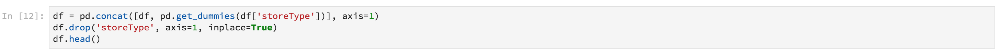

# [!DNL Data Science Workspace] explicação passo a passo

Este documento fornece uma apresentação para Adobe Experience Platform [!DNL Data Science Workspace]. Este tutorial descreve um fluxo de trabalho geral do cientista de dados e como eles podem abordar e resolver um problema usando o aprendizado de máquina.

## Pré-requisitos

- Uma conta Adobe ID registrada
   - A conta do Adobe ID deve ter sido adicionada a uma organização com acesso ao Adobe Experience Platform e [!DNL Data Science Workspace].

## Caso de uso de varejo

Um varejista enfrenta muitos desafios para se manter competitivo no mercado atual. Uma das principais preocupações do varejista é decidir sobre o preço ideal de um produto e prever tendências de venda. Com um modelo de previsão preciso, um varejista poderia encontrar a relação entre as políticas de demanda e de preços e tomar decisões otimizadas de preços para maximizar as vendas e a receita.

## Solução do cientista de dados

A solução de um cientista de dados é aproveitar a riqueza de informações históricas fornecidas por um varejista, prever tendências futuras e otimizar decisões de preços. Essa apresentação usa dados de vendas anteriores para treinar um modelo de aprendizado de máquina e usa o modelo para prever tendências de vendas futuras. Com isso, você pode gerar insights para ajudar a fazer alterações de preços ideais.

Essa visão geral reflete as etapas que um cientista de dados passaria para pegar um conjunto de dados e criar um modelo para prever vendas semanais. Este tutorial aborda as seguintes seções no Notebook de vendas de varejo de amostra no Adobe Experience Platform [!DNL Data Science Workspace]:

- [Configuração](#setup)
- [Exploração de dados](#exploring-data)
- [Engenharia de recursos](#feature-engineering)
- [Treinamento e verificação](#training-and-verification)

### Notebooks em [!DNL Data Science Workspace]

Na interface do usuário do Adobe Experience Platform, selecione **[!UICONTROL Notebooks]** na guia **[!UICONTROL Data Science]** para trazê-lo até a página de visão geral [!UICONTROL Notebooks]. Nessa página, selecione a guia [!DNL JupyterLab] para iniciar o ambiente [!DNL JupyterLab]. A landing page padrão para [!DNL JupyterLab] é **[!UICONTROL Launcher]**.


Este tutorial usa [!DNL Python] 3 em [!DNL JupyterLab Notebooks] para mostrar como acessar e explorar os dados. Na página do Launcher, há amostras de blocos de anotações fornecidos. O bloco de anotações de **[!UICONTROL Retail Sales]** amostra é usado nos exemplos fornecidos abaixo.

### Configuração {#setup}

Com o bloco de notas de vendas de varejo aberto, a primeira coisa a fazer é carregar as bibliotecas necessárias para o seu fluxo de trabalho. A lista a seguir fornece uma breve descrição para cada uma das bibliotecas usadas nos exemplos em etapas posteriores.

- **numpy**: Biblioteca de computação científica que adiciona suporte para matrizes e matrizes grandes e multidimensionais
- **pandas**: Biblioteca que oferece estruturas de dados e operações usadas para manipulação e análise de dados
- **matplotlib.pyplot**: Biblioteca de fotos que fornece uma experiência semelhante à MATLAB ao criar
- **seaborn** : Biblioteca de visualização de dados de interface de alto nível baseada em matplotlib
- **aprendizado**: Biblioteca de aprendizado de máquina que apresenta classificação, regressão, vetor de suporte e algoritmos de cluster
- **avisos**: Biblioteca que controla mensagens de aviso

### Explorar dados {#exploring-data}

#### Carregar dados

Depois que as bibliotecas forem carregadas, você poderá começar a examinar os dados. O código [!DNL Python] a seguir usa a estrutura de dados `DataFrame` do pandas e a função [read_csv()](https://pandas.pydata.org/pandas-docs/stable/generated/pandas.read_csv.html#pandas.read_csv) para ler o CSV hospedado em [!DNL Github] nos pandas DataFrame:


A estrutura de dados DataFrame dos painéis é uma estrutura de dados bidimensional rotulada como. Para ver rapidamente as dimensões dos seus dados, você pode usar `df.shape`. Isso retorna uma tupla que representa a dimensionalidade do DataFrame:


Por fim, é possível visualizar a aparência dos dados. Você pode usar `df.head(n)` para exibir as primeiras `n` linhas do DataFrame:


#### Resumo estatístico

Podemos aproveitar a biblioteca de painéis [!DNL Python's] para obter o tipo de dados de cada atributo. A saída da chamada a seguir fornecerá informações sobre o número de entradas e o tipo de dados para cada uma das colunas:

```PYTHON
df.info()
```


Essas informações são úteis, pois conhecer o tipo de dados de cada coluna nos permitirá saber como tratar os dados.

Agora vamos olhar para o resumo estatístico. Somente os tipos de dados numéricos serão mostrados para que `date`, `storeType` e `isHoliday` não tenham saída:

```PYTHON
df.describe()
```


Com isso, você pode ver que há 6435 instâncias para cada característica. Além disso, são fornecidas informações estatísticas como média, desvio padrão (std), mín, máx e interquartis. Isso nos fornece informações sobre o desvio dos dados. Na próxima seção, você acessará a visualização que funciona junto com essas informações para nos fornecer uma compreensão completa dos seus dados.

Olhando para os valores mínimo e máximo de `store`, você pode ver que há 45 armazenamentos exclusivos que os dados representam. Há também `storeTypes` que diferenciam o que é uma loja. você pode ver a distribuição de `storeTypes` fazendo o seguinte:


Isso significa que 22 lojas são de `storeType A` , 17 são `storeType B` e 6 são `storeType C`.

#### Visualizar dados

Agora que você sabe os valores do quadro de dados, é necessário complementar com visualizações para tornar as coisas mais claras e fáceis de identificar os padrões. Esses gráficos também são úteis ao transmitir resultados para um público-alvo.

#### Gráficos Univariáveis

Gráficos de variação única são gráficos de uma variável individual. Um gráfico universal comum usado para visualizar seus dados são gráficos de caixa e de uísque.

Usando seu conjunto de dados de varejo de antes, você pode gerar a caixa e o gráfico de uísque para cada uma das 45 lojas e suas vendas semanais. O gráfico é gerado usando a função `seaborn.boxplot` .


Um gráfico de caixa e uísque é usado para mostrar a distribuição de dados. As linhas externas do gráfico mostram os quartis superior e inferior enquanto a caixa se estende pelo intervalo interquartil. A linha na caixa marca a mediana. Quaisquer pontos de dados mais de 1,5 vezes o quartil superior ou inferior são marcados como um círculo. Esses pontos são considerados outliers.

Em seguida, você pode traçar as vendas semanais com o tempo. Você só mostrará a saída do primeiro armazenamento. O código no notebook gera 6 lotes correspondentes a 6 das 45 lojas em nosso conjunto de dados.


Com esse diagrama, você pode comparar as vendas semanais durante um período de 2 anos. É fácil ver picos de venda e padrões de vale ao longo do tempo.

#### Gráficos multivariados

Os gráficos multivariados são usados para ver a interação entre variáveis. Com a visualização, os cientistas de dados podem ver se há correlações ou padrões entre as variáveis. Um gráfico multivariado comum usado é uma matriz de correlação. Com uma matriz de correlação, as dependências entre várias variáveis são quantificadas com o coeficiente de correlação.

Usando o mesmo conjunto de dados de varejo, você pode gerar a matriz de correlação.


Observe a diagonal dos que estão no centro. Isso mostra que, ao comparar uma variável a si mesma, ela tem uma correlação positiva completa. Uma correlação positiva forte terá uma magnitude mais próxima de 1, enquanto correlações fracas estarão mais próximas de 0. A correlação negativa é mostrada com um coeficiente negativo que mostra uma tendência inversa.

### Engenharia de recursos {#feature-engineering}

Nesta seção, a engenharia de recursos é usada para fazer modificações no seu conjunto de dados de varejo executando as seguintes operações:

- Adicionar colunas de semana e ano
- Converter storeType em uma variável de indicador
- Converter isHoliday em uma variável numérica
- Prever semanalmenteVendas da próxima semana

#### Adicionar colunas de semana e ano

O formato atual para a data (`2010-02-05`) pode dificultar a diferenciação de dados para cada semana. Por causa disso, você deve converter a data para conter semana e ano.


Agora, a semana e a data são as seguintes:


#### Converter storeType em variável de indicador

Em seguida, você deseja converter a coluna storeType em colunas representando cada `storeType`. Há 3 tipos de armazenamento, (`A`, `B`, `C`), a partir dos quais você está criando 3 novas colunas. O valor definido em cada é um valor booleano em que &quot;1&quot; é definido dependendo do que foi `storeType` e `0` para as outras 2 colunas.



A coluna `storeType` atual é solta.

#### Converter isHoliday em tipo numérico

A próxima modificação é alterar o booleano `isHoliday` para uma representação numérica.


#### Prever semanalmenteVendas da próxima semana

Agora, é possível adicionar vendas semanais anteriores e futuras a cada um dos conjuntos de dados. Você pode fazer isso compensando seu `weeklySales`. Além disso, a diferença `weeklySales` é calculada. Isso é feito subtraindo `weeklySales` ao `weeklySales` da semana anterior.


Como você está compensando os conjuntos de dados 45 dos `weeklySales` para frente e 45 conjuntos de dados para trás para criar novas colunas, o primeiro e o último 45 pontos de dados têm valores NaN. Você pode remover esses pontos do conjunto de dados usando a função `df.dropna()` que remove todas as linhas que têm valores NaN.


Um resumo do conjunto de dados após as modificações é mostrado abaixo:


### Treinamento e verificação {#training-and-verification}

Agora, é hora de criar alguns modelos dos dados e selecionar qual modelo é o melhor desempenho para prever vendas futuras. Você avaliará os 5 algoritmos a seguir:

- Regressão Linear
- Árvore de decisão
- Floresta Aleatória
- Aumento de gradiente
- K Vizinhos

#### Dividir conjunto de dados em subconjuntos de treinamento e teste

Você precisa de uma maneira de saber a precisão de seu modelo em prever valores. Essa avaliação pode ser feita alocando parte do conjunto de dados para usar como validação e o restante como dados de treinamento. Como `weeklySalesAhead` é o valor futuro real de `weeklySales`, você pode usar isso para avaliar a precisão do modelo em prever o valor. A divisão é feita abaixo:


Agora você tem `X_train` e `y_train` para preparar os modelos e `X_test` e `y_test` para avaliação posterior.

#### Algoritmos de verificação de pontos

Nesta seção, você declara todos os algoritmos em uma matriz chamada `model`. Em seguida, você percorre essa matriz e, para cada algoritmo, insere seus dados de treinamento com `model.fit()`, que cria um modelo `mdl`. Usando esse modelo, você pode prever `weeklySalesAhead` com seus dados `X_test`.


Para a pontuação, você está pegando a diferença percentual média entre o `weeklySalesAhead` previsto com os valores reais nos dados `y_test`. Como você quer minimizar a diferença entre sua previsão e o resultado real, o Gradient Boosting Regressor é o modelo com melhor desempenho.

#### Visualizar previsões

Por fim, você visualiza seu modelo de previsão com os valores de vendas semanais reais. A linha azul representa os números reais, enquanto a cor verde representa sua previsão usando o aumento de gradiente. O código a seguir gera 6 gráficos que representam 6 dos 45 armazenamentos em seu conjunto de dados. Somente `Store 1` é mostrado aqui:


## Próximas etapas

Este documento cobriu um fluxo de trabalho geral do cientista de dados para resolver um problema de vendas de varejo. Para resumir:

- Carregue as bibliotecas necessárias para o seu fluxo de trabalho.
- Depois que as bibliotecas forem carregadas, você poderá começar a ver os dados usando resumos estatísticos, visualizações e gráficos.
- Em seguida, a engenharia de recursos é usada para fazer modificações no seu conjunto de dados de varejo.
- Por fim, crie modelos de dados e selecione qual modelo é o melhor desempenho para prever vendas futuras.

Quando estiver pronto, comece lendo o [Guia do usuário do JupyterLab](./jupyterlab/overview.md) para obter uma visão geral rápida dos notebooks no Adobe Experience Platform Data Science Workspace. Além disso, se você estiver interessado em saber mais sobre Modelos e Receitas, comece lendo o tutorial [retail sales schema e conjunto de dados](./models-recipes/create-retails-sales-dataset.md) . Este tutorial o prepara para tutoriais subsequentes do Data Science Workspace que podem ser visualizados na [página de tutoriais](../tutorials/data-science-workspace.md) do Data Science Workspace.
