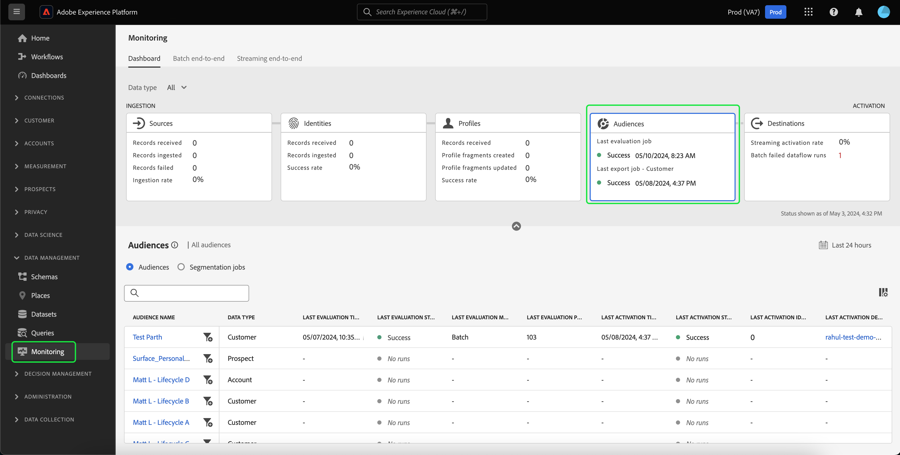

# Monitorar fluxos de dados para públicos na interface

O Serviço de segmentação permite criar públicos-alvo por meio de definições de segmento ou outras fontes da [!DNL Real-Time Customer Profile] dados. A Platform fornece fluxos de dados para rastrear de forma transparente esse fluxo de dados de origens para destinos.

Use o painel de monitoramento para ver uma representação visual da atividade dos dados em um público-alvo, incluindo o status da segmentação dos seus dados. Leia o tutorial para obter instruções sobre como usar o painel de monitoramento para monitorar a segmentação de dados usando a interface do usuário do Experience Platform, permitindo rastrear o status dos trabalhos de ativação, avaliação e exportação de público-alvo.

## Introdução {#getting-started}

Este manual necessita de uma compreensão funcional dos seguintes componentes da Adobe Experience Platform:

- [Fluxos de dados](../home.md): os fluxos de dados são uma representação de trabalhos de dados que movem os dados pela Plataforma. Os fluxos de dados são configurados em diferentes serviços, ajudando a mover dados dos conectores de origem para os conjuntos de dados de destino para [!DNL Identity] e [!DNL Profile], e para [!DNL Destinations].
   - [O fluxo de dados é executado](../../sources/notifications.md): as execuções de fluxo de dados são os trabalhos agendados recorrentes com base na configuração de frequência dos fluxos de dados selecionados.
- [Segmentação](../../segmentation/home.md): a segmentação permite criar públicos-alvo a partir dos dados do Perfil do cliente em tempo real.
   - [Trabalhos de ativação](../../destinations/ui/activation-overview.md): um trabalho de ativação é usado para ativar o público-alvo para um destino especificado.
   - [Trabalhos de avaliação](../../segmentation/tutorials/evaluate-a-segment.md#evaluate-a-segment): um trabalho de avaliação é um processo assíncrono que avalia o público-alvo.
   - [Exportar trabalhos](../../segmentation/api/export-jobs.md): um trabalho de exportação é um processo assíncrono usado para manter membros do público-alvo em conjuntos de dados.
- [Sandboxes](../../sandboxes/home.md): [!DNL Experience Platform] O fornece sandboxes virtuais que particionam uma única [!DNL Platform] em ambientes virtuais separados para ajudar a desenvolver aplicativos de experiência digital.

## Painel de monitoramento de públicos-alvo {#monitoring-audiences-dashboard}

>[!CONTEXTUALHELP]
>id="platform_monitoring_segments"
>title="Públicos-alvo"
>abstract="A exibição de públicos-alvo contém informações sobre todos os públicos-alvo da organização, além de informações sobre os trabalhos de ativação e avaliação."

Para acessar o **[!UICONTROL Públicos-alvo]** painel, selecione **[!UICONTROL Monitoramento]** no painel de navegação esquerdo. Uma vez no **[!UICONTROL Monitoramento]** selecione a **[!UICONTROL Públicos-alvo]** cartão.

No principal **[!UICONTROL Públicos-alvo]** painel, o **[!UICONTROL Públicos-alvo]** mostra o status e a data do último trabalho de avaliação e do último trabalho de exportação.

O próprio painel contém métricas para públicos-alvo e trabalhos de segmentação. Por padrão, o painel mostra as métricas de público-alvo das últimas 24 horas. Para saber mais sobre a visualização de trabalhos de segmentação, leia a [monitoramento de trabalhos de segmentação](#monitoring-segmentation-jobs-dashboard) seção.

>[!IMPORTANT]
>
>Atualmente, somente os públicos-alvo que estão ativados para [destinos em lote (baseados em arquivo)](../../destinations/destination-types.md#file-based) são compatíveis com o painel de monitoramento de públicos-alvo.

As seguintes métricas estão disponíveis para essa visualização de painel:

| Métrica | Descrição |
| ------ | ----------- |
| **[!UICONTROL Nome do público]** | O nome do público-alvo. |
| **[!UICONTROL Tipo de dados]** | O tipo de dados do público. Os valores possíveis incluem **[!UICONTROL Cliente]**, **[!UICONTROL Conta]**, e **[!UICONTROL Cliente Potencial]**. Você pode exibir para públicos-alvo de um tipo de dados especificado usando o [!UICONTROL Tipo de dados] filtro acima da faixa de opções de cartões. |
| **[!UICONTROL Carimbo de data e hora da última avaliação]** | A data e a hora em que o último trabalho de avaliação do público-alvo foi executado. |
| **[!UICONTROL Status da última avaliação]** | O status do último trabalho de avaliação do público-alvo. Os valores possíveis incluem **[!UICONTROL Sucesso]**, **[!UICONTROL Nenhuma execução]**, e **[!UICONTROL Failed]**. |
| **[!UICONTROL Último método de avaliação]** | O método de avaliação do público. Como somente a segmentação em lote é compatível, o único valor possível é **[!UICONTROL Lote]**. |
| **[!UICONTROL Últimos perfis de avaliação]** | O número de perfis que foram avaliados no último trabalho de avaliação do público-alvo. |
| **[!UICONTROL Carimbo de data/hora da última ativação]** | A data e a hora em que o último trabalho de ativação do público-alvo foi executado. |
| **[!UICONTROL Status da última ativação]** | O status do último trabalho de ativação do público-alvo. Os valores possíveis incluem **[!UICONTROL Sucesso]**, **[!UICONTROL Nenhuma execução]**, e **[!UICONTROL Failed]**. |
| **[!UICONTROL Identidades da última ativação]** | O número de identidades que foram ativadas no último trabalho de ativação do público-alvo. |
| **[!UICONTROL Destino da última ativação]** | O nome do destino em que o último trabalho de ativação do público-alvo foi ativado. |

Você pode filtrar os resultados para um público-alvo específico e visualizar seus trabalhos de segmentação selecionando o ícone de filtro (). Os trabalhos de segmentação são classificados em ordem cronológica, com os trabalhos de segmentação mais recentes aparecendo primeiro.

O painel de público-alvo filtrado é exibido. A variável **[!UICONTROL Públicos-alvo]** mostra o status e a data do último trabalho de avaliação e do último trabalho de ativação.

O próprio painel exibe a hora e o status dos últimos trabalhos de avaliação e ativação, um gráfico que mostra a contagem de perfis da avaliação de público-alvo e as métricas para os trabalhos de segmentação que foram executados. Por padrão, o painel mostra as métricas de trabalho de segmentação das últimas 24 horas.

As seguintes métricas estão disponíveis para essa visualização de painel:

| Métrica | Descrição |
| ------ | ----------- |
| **[!UICONTROL Início do trabalho]** | A data e a hora em que o trabalho de segmentação foi iniciado. |
| **[!UICONTROL Tipo]** | Indica o tipo do trabalho de segmentação. Os dois tipos de trabalho compatíveis são **ativação** e **avaliação** tarefas. |
| **[!UICONTROL Trabalho concluído]** | A data e a hora em que o trabalho de segmentação foi concluído. |
| **[!UICONTROL Tempo de processamento]** | O tempo necessário para a conclusão do trabalho de segmentação. |
| **[!UICONTROL Status da tarefa]** | O status do trabalho de segmentação. Os valores compatíveis incluem **[!UICONTROL Sucesso]**, **[!UICONTROL Em andamento]**, e **[!UICONTROL Failed]**. |
| **[!UICONTROL Contagem de perfis]** | O número de perfis que o trabalho de segmentação está avaliando. Cada usuário deve ter um perfil exclusivo. |
| **[!UICONTROL Identidade ativada]** | O número de identidades que o trabalho de segmentação está ativando. Cada perfil pode ter várias identidades. Por exemplo, um perfil pode ter um email, um número de telefone e um número de fidelidade como identidades. |
| **[!UICONTROL Nome do destino]** | O nome do destino em que o trabalho de segmentação está sendo ativado. |

Você pode filtrar ainda mais para um trabalho de segmentação específico e ver seus detalhes selecionando o ícone de filtro (). Há dois tipos diferentes de trabalhos de segmentação que podem ser filtrados: trabalhos de ativação e trabalhos de avaliação.

### Detalhes do trabalho de ativação {#activation-job-details}

A página de detalhes da execução do fluxo de dados do trabalho de ativação mostra informações sobre as métricas de execução, os erros de execução do fluxo de dados e os públicos-alvo relacionados ao trabalho de segmentação. Um trabalho de ativação é usado para ativar seu público-alvo para um destino especificado.

As seguintes métricas estão disponíveis para essa visualização de painel:

| Métrica | Descrição |
| ------ | ----------- |
| **[!UICONTROL Perfis recebidos]** | O número total de perfis recebidos no fluxo de ativação. |
| **[!UICONTROL Identidades ativadas]** | O número total de identidades ativadas com êxito para o destino, com base nos perfis recebidos. |
| **[!UICONTROL Identidades excluídas]** | O número total de identidades que foram excluídas de serem ativadas para o destino, com base nos perfis recebidos. Essas identidades podem ser excluídas devido à ausência de atributos ou violações de consentimento. |
| **[!UICONTROL Tamanho dos dados]** | O tamanho do fluxo de dados que está sendo ativado. |
| **[!UICONTROL Total de arquivos]** | O número total de arquivos ativados no fluxo de dados. |
| **[!UICONTROL Status]** | O status atual do trabalho de ativação. |
| **[!UICONTROL Início da execução do fluxo de dados]** | A data e a hora em que o trabalho de ativação foi iniciado. |
| **[!UICONTROL Fim da execução do fluxo de dados]** | A data e a hora em que o trabalho de ativação terminou. |
| **[!UICONTROL ID de execução do fluxo de dados]** | A ID do trabalho de ativação atual. |
| **[!UICONTROL ID da Organização IMS]** | A ID da organização à qual o trabalho de ativação pertence. |
| **[!UICONTROL Nome do destino]** | O nome do destino no qual os dados estão sendo ativados. |

Na seção públicos-alvo, é possível ver uma lista de públicos-alvo que foram ativados como parte do trabalho de ativação.

Para a seção Públicos-alvo, as seguintes métricas estão disponíveis:

| Métrica | Descrição |
| ------ | ----------- |
| **[!UICONTROL Nome]** | O nome do público-alvo que foi ativado. |
| **[!UICONTROL Identidades ativadas]** | O número total de identidades ativadas com êxito para o destino, com base nos perfis recebidos. |
| **[!UICONTROL Identidades excluídas]** | O número total de identidades que foram excluídas de serem ativadas para o destino, com base nos perfis recebidos. Essas identidades podem ser excluídas devido à ausência de atributos ou violação de consentimento. |
| **[!UICONTROL Status da última execução do fluxo de dados]** | O status do último trabalho de ativação executado para esse público-alvo. |
| **[!UICONTROL Data da última execução do fluxo de dados]** | A data e a hora do último trabalho de ativação executado para esse público-alvo. |

Além disso, você pode exibir detalhes sobre os erros de execução do fluxo de dados. Na seção erros de execução do fluxo de dados, é possível exibir as identidades que falharam ou que foram excluídas. A seção de erros inclui detalhes sobre o código de erro e o número de identidades que falharam ou foram excluídas.

### Detalhes do trabalho de avaliação {#evaluation-job-details}

A página de detalhes da execução do fluxo de dados do trabalho de avaliação mostra informações sobre as métricas e os públicos-alvo da execução relacionados ao trabalho de segmentação.

As seguintes métricas estão disponíveis para essa visualização de painel:

| Métrica | Descrição |
| ------ | ----------- |
| **[!UICONTROL Total de perfis]** | O número total de perfis que estão sendo avaliados. |
| **[!UICONTROL Status]** | O status do trabalho de avaliação. Os possíveis status do trabalho de avaliação incluem **[!UICONTROL Sucesso]** e **[!UICONTROL Failed]**. |
| **[!UICONTROL Início do trabalho]** | A data e a hora em que o trabalho de avaliação foi iniciado. |
| **[!UICONTROL Fim do trabalho]** | A data e a hora em que o trabalho de avaliação terminou. |
| **[!UICONTROL Tipo de trabalho]** | O tipo de trabalho de segmentação. Neste caso, será sempre um **[!UICONTROL Avaliação de segmento]** tarefa. |
| **[!UICONTROL Tipo de avaliação]** | O tipo de avaliação que está sendo feita. Isso pode ser **[!UICONTROL Lote]** ou **[!UICONTROL Streaming]**. |
| **[!UICONTROL ID da tarefa]** | A ID do trabalho de avaliação. |
| **[!UICONTROL ID da Organização IMS]** | A ID da organização à qual o trabalho de avaliação pertence. |
| **[!UICONTROL Nome do público]** | O nome do público-alvo que está sendo avaliado. |
| **[!UICONTROL ID de público]** | A ID do público-alvo que está sendo avaliado. |

No [!UICONTROL Públicos-alvo] você pode ver uma lista de públicos-alvo que estão sendo avaliados como parte do trabalho de avaliação. Você pode filtrar a lista de públicos-alvo por nome usando a barra de pesquisa.

>[!IMPORTANT]
>
>Atualmente, essa visualização de painel aceita até 800 métricas de público-alvo.

Para o [!UICONTROL Públicos-alvo] , as seguintes métricas estão disponíveis:

| Métrica | Descrição |
| ------ | ----------- |
| **[!UICONTROL Nome]** | O nome do público-alvo que está sendo avaliado. |
| **[!UICONTROL Contagem de perfis]** | O número de perfis que estão sendo avaliados. |

## Painel de monitoramento de trabalhos de segmentação {#monitoring-segmentation-jobs-dashboard}

>[!CONTEXTUALHELP]
>id="platform_monitoring_segment_jobs"
>title="Trabalhos de segmentação"
>abstract="A visualização de trabalhos de segmentação contém informações sobre os trabalhos de avaliação e exportação para todos os públicos-alvo."

Para acessar o **[!UICONTROL Trabalhos de segmentação]** painel, selecione **[!UICONTROL Trabalhos de segmentação]** no [!UICONTROL Públicos-alvo] painel. A variável [!UICONTROL Monitoramento] o painel contém métricas e informações sobre os trabalhos de avaliação e exportação.

>[!NOTE]
>
>Somente **trabalhos de avaliação de segmentação** são compatíveis com o monitoramento por público-alvo. Os trabalhos de exportação de segmentação só oferecem suporte ao monitoramento no nível da organização.

Use o [!UICONTROL Trabalhos de segmentação] painel para entender se a avaliação e a exportação de perfis ocorrem no prazo e sem exceções, de modo que os serviços downstream para ativação de destino possam ter os dados de perfil avaliados mais recentemente.

As seguintes métricas estão disponíveis para trabalhos de segmentação:

| Métrica | Descrição |
| ------ | ----------- |
| **[!UICONTROL Trabalho de segmentação]** | Indica o nome do trabalho de segmentação. |
| **[!UICONTROL Tipo]** | Indica o tipo de trabalho de segmentação - exportação ou avaliação. Observe que, em ambos os casos, o trabalho de segmentação avalia ou exporta **all** públicos-alvo pertencentes a uma organização. Para saber mais sobre processos de exportação, leia o guia no [exportar ponto de extremidade de trabalhos](../../segmentation/api/export-jobs.md). Para saber mais sobre tarefas de avaliação, leia o tutorial em [avaliação de uma definição de segmento](../../segmentation/tutorials/evaluate-a-segment.md#evaluate-a-segment). |
| **[!UICONTROL Início do trabalho]** | A data e a hora em que o trabalho de segmentação foi iniciado. |
| **[!UICONTROL Fim do trabalho]** | A data e a hora em que o trabalho de segmentação foi concluído. |
| **[!UICONTROL Status]** | O status do trabalho concluído. Os possíveis status do trabalho de segmentação incluem sucesso ou falha. |
