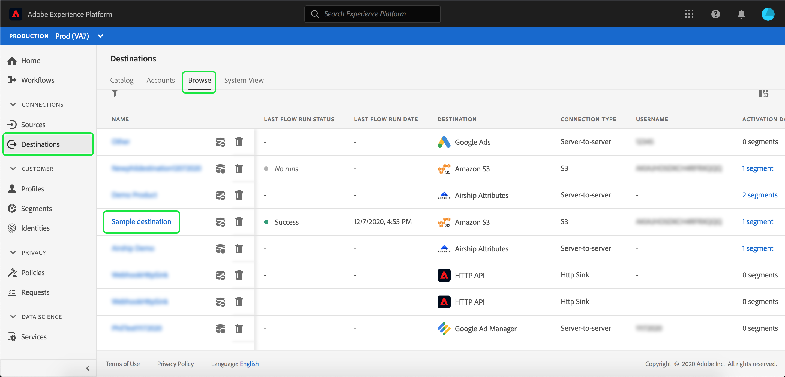

# Monitorar fluxos de dados para destinos na interface do usuário

Os destinos permitem ativar seus dados do Adobe Experience Platform para inúmeros parceiros externos. Este tutorial fornece instruções sobre como você pode monitorar os fluxos de dados para seus destinos usando a interface do usuário do Experience Platform.

## Introdução

Este tutorial requer uma compreensão funcional dos seguintes componentes do Adobe Experience Platform:

- [Destinos](../../destinations/home.md): Os destinos são integrações pré-criadas com aplicativos comumente usados que permitem a ativação simplificada de dados da Platform para campanhas de marketing entre canais, campanhas por email, anúncios direcionados e muitos outros casos de uso.
- [Sandboxes](../../sandboxes/home.md):  [!DNL Experience Platform] O fornece sandboxes virtuais que particionam uma única  [!DNL Platform] instância em ambientes virtuais separados para ajudar a desenvolver aplicativos de experiência digital.

## Monitorar fluxos de dados

No espaço de trabalho **[!UICONTROL Destinations]** na interface do usuário da plataforma, navegue até a guia **[!UICONTROL Browse]** e selecione o nome de um destino que deseja visualizar.

Uma lista de fluxos de dados existentes é exibida. Nesta página, há uma lista de fluxos de dados visualizáveis, incluindo informações sobre seu destino, nome de usuário, número de fluxos de dados e status.

Consulte a tabela a seguir para obter mais informações sobre status:

| Status | Descrição |
| ------ | ----------- |
| Ativado | O status `Enabled` indica que um fluxo de dados está ativo e assimila dados de acordo com o agendamento fornecido. |
| Desativado | O status `Disabled` indica que um fluxo de dados está inativo e não está assimilando dados. |
| Processamento | O status `Processing` indica que um fluxo de dados ainda não está ativo. Esse status geralmente é encontrado imediatamente após a criação de um novo fluxo de dados. |
| Erro | O status `Error` indica que o processo de ativação de um fluxo de dados foi interrompido. |

## [!UICONTROL Dataflow runs]

A guia [!UICONTROL Dataflow runs] fornece dados de métrica no fluxo de dados que são executados para destinos em lote. Uma lista de execuções individuais e suas métricas específicas é exibida, juntamente com os seguintes totais para registros de perfil:

- **[!UICONTROL Profile records activated]**: A contagem total de registros de perfil que foram criados ou atualizados para ativação.
- **[!UICONTROL Profile records skipped]**: A contagem total de registros de perfil que são ignorados para ativação com base em saídas de perfil ou atributos ausentes.

>[!NOTE]
>
>As execuções de fluxo de dados são geradas com base na frequência de agendamento do fluxo de dados de destino. Uma execução de fluxo de dados separada é feita para cada política de mesclagem aplicada a um segmento.

Para exibir os detalhes de uma execução específica do fluxo de dados, selecione a hora de início da execução na lista. A página de detalhes de uma execução do fluxo de dados contém informações adicionais, como o tamanho dos dados processados e uma lista de erros que ocorreram com detalhes para o diagnóstico de erros.

