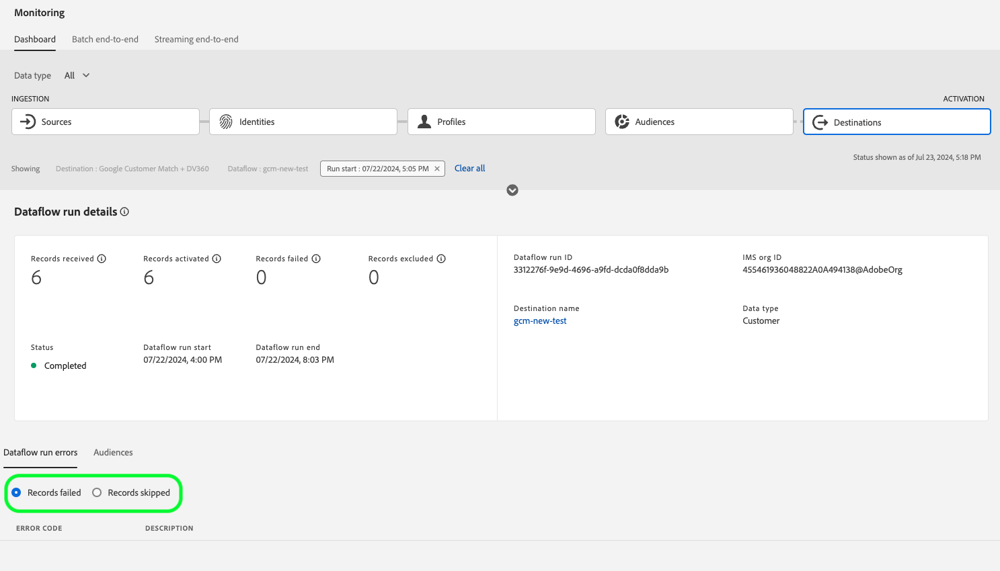

# Monitorar fluxos de dados para destinos na interface do usuário

Os destinos permitem ativar seus dados do Adobe Experience Platform para inúmeros parceiros externos. A plataforma facilita o processo de rastreamento do fluxo de dados para seus destinos, fornecendo transparência com fluxos de dados.

O painel de monitoramento fornece uma representação visual da jornada de um fluxo de dados, incluindo o destino para o qual os dados são ativados. Este tutorial fornece instruções sobre como monitorar os fluxos de dados diretamente no espaço de trabalho de destinos ou usar o painel de monitoramento para monitorar os fluxos de dados para seus destinos usando a interface do usuário do Experience Platform.

## Introdução

Este guia requer uma compreensão funcional dos seguintes componentes do Adobe Experience Platform:

- [Fluxos de dados](../home.md): Os fluxos de dados são uma representação de trabalhos de dados que movem dados pela Plataforma. Os fluxos de dados são configurados em diferentes serviços, ajudando a mover dados de conectores de origem para conjuntos de dados de destino, para [!DNL Identity] e [!DNL Profile]e para [!DNL Destinations].
   - [Execuções do fluxo de dados](../../sources/notifications.md): As execuções de fluxo de dados são trabalhos agendados recorrentes com base na configuração de frequência de fluxos de dados selecionados.
- [Destinos](../../destinations/home.md): Os destinos são integrações pré-criadas com aplicativos comumente usados que permitem a ativação simplificada de dados da Platform para campanhas de marketing entre canais, campanhas por email, anúncios direcionados e muitos outros casos de uso.
- [Sandboxes](../../sandboxes/home.md): [!DNL Experience Platform] fornece sandboxes virtuais que particionam uma única [!DNL Platform] em ambientes virtuais separados para ajudar a desenvolver aplicativos de experiência digital.

## Monitorar fluxos de dados no espaço de trabalho Destinos

No **[!UICONTROL Destinos]** na interface do usuário da plataforma, navegue até o **[!UICONTROL Procurar]** e selecione o nome de um destino que deseja visualizar.

Uma lista de fluxos de dados existentes é exibida. Nesta página, há uma lista de fluxos de dados visualizáveis, incluindo informações sobre seu destino, nome de usuário, número de fluxos de dados e status.

Consulte a tabela a seguir para obter mais informações sobre status:

| Status | Descrição |
| ------ | ----------- |
| Ativado | O `Enabled` status indica que um fluxo de dados está ativo e exporta dados de acordo com o agendamento fornecido. |
| Desativado | O `Disabled` status indica que um fluxo de dados está inativo e não está exportando dados. |
| Processamento | O `Processing` status indica que um fluxo de dados ainda não está ativo. Esse status geralmente é encontrado imediatamente após a criação de um novo fluxo de dados. |
| Erro | O `Error` status indica que o processo de ativação de um fluxo de dados foi interrompido. |

### O fluxo de dados é executado para destinos de transmissão

Para destinos de transmissão, a variável [!UICONTROL Execuções do fluxo de dados] A guia fornece uma atualização por hora para dados de métrica em suas execuções de fluxo de dados. As estatísticas mais proeminentes rotuladas são para identidades.

As identidades representam as diferentes facetas de um perfil. Por exemplo, se um perfil contiver um número de telefone e um endereço de email, esse perfil terá duas identidades.

Uma lista de execuções individuais e suas métricas específicas é exibida, juntamente com os seguintes totais para identidades:

- **[!UICONTROL Identidades ativadas]**: A contagem total de identidades de perfil que foram criadas ou atualizadas para ativação.
- **[!UICONTROL Identidades excluídas]**: O número total de identidades de perfil que são ignoradas para ativação com base em atributos ausentes e violação de consentimento.
- **[!UICONTROL Falha de identidades]**: O número total de identidades de perfil que não estão ativadas para o destino devido a erros.

Cada execução de fluxo de dados individual mostra os seguintes detalhes:

- **[!UICONTROL Início da execução do fluxo de dados]**: A hora em que a execução do fluxo de dados começou.
- **[!UICONTROL Tempo de processamento]**: O tempo necessário para o processamento do fluxo de dados.
- **[!UICONTROL Perfis recebidos]**: O número total de perfis recebidos no fluxo de dados.
- **[!UICONTROL Identidades ativadas]**: O número total de identidades de perfil que foram ativadas com êxito para o destino selecionado.
- **[!UICONTROL Identidades excluídas]**: O número total de identidades de perfil que são excluídas para ativação com base em atributos ausentes e violação de consentimento.
- **[!UICONTROL Falha de identidades]** O número total de identidades de perfil que não estão ativadas para o destino devido a erros.
- **[!UICONTROL Taxa de ativação]**: A porcentagem de identidades recebidas que foram ativadas ou ignoradas com êxito. A fórmula a seguir demonstra como esse valor é calculado:
   
- **[!UICONTROL Status]**: Representa o estado em que o fluxo de dados está: ou [!UICONTROL Concluído] ou [!UICONTROL Processamento]. [!UICONTROL Concluído] significa que todas as identidades para a execução do fluxo de dados correspondente foram exportadas dentro do período de uma hora. [!UICONTROL Processamento] significa que a execução do fluxo de dados ainda não foi concluída.

Para exibir os detalhes de uma execução específica do fluxo de dados, selecione a hora de início da execução na lista.

A página de detalhes de uma execução do fluxo de dados contém informações adicionais, como o número de perfis recebidos, o número de identidades ativadas, o número de identidades falhadas e o número de identidades excluídas.

A página de detalhes também exibe uma lista de identidades que falharam e identidades que foram excluídas. As informações das identidades com falha e excluída são exibidas, incluindo código de erro, contagem de identidades e descrição. Por padrão, a lista exibe as identidades com falha. Para mostrar identidades ignoradas, selecione o **[!UICONTROL Identidades excluídas]** alternar.

### O fluxo de dados é executado para destinos em lote

Para destinos de lote, a variável [!UICONTROL Execuções do fluxo de dados] A guia fornece dados de métrica em suas execuções de fluxo de dados. Uma lista de execuções individuais e suas métricas específicas é exibida, juntamente com os seguintes totais para identidades:

- **[!UICONTROL Identidades ativadas]**: A contagem de identidades de perfil individuais ativadas com êxito para o destino selecionado.
- **[!UICONTROL Identidades excluídas]**: A contagem de identidades de perfil individuais excluídas para ativação do destino selecionado, com base nos atributos ausentes e na violação de consentimento.

Cada execução de fluxo de dados individual mostra os seguintes detalhes:

- **[!UICONTROL Início da execução do fluxo de dados]**: A hora em que a execução do fluxo de dados começou.
- **[!UICONTROL Tempo de processamento]**: O tempo que levou para a execução do fluxo de dados ser processada.
- **[!UICONTROL Perfis recebidos]**: O número total de perfis recebidos no fluxo de dados. Esse valor é atualizado a cada 60 minutos.
- **[!UICONTROL Identidades ativadas]**: O número total de identidades de perfil que foram ativadas com êxito para o destino selecionado.
- **[!UICONTROL Identidades excluídas]**: O número total de identidades de perfil que são excluídas para ativação com base em atributos ausentes e violação de consentimento.
- **[!UICONTROL Status]**: Representa o estado em que o fluxo de dados está. Pode ser um dos três estados: [!UICONTROL Sucesso], [!UICONTROL Falha]e [!UICONTROL Processamento]. [!UICONTROL Sucesso] significa que o fluxo de dados está ativo e exporta dados de acordo com o agendamento fornecido. [!UICONTROL Falha] significa que a ativação dos dados foi suspensa devido a erros. [!UICONTROL Processamento] significa que o fluxo de dados ainda não está ativo e geralmente é encontrado quando um novo fluxo de dados é criado.

Para exibir detalhes de uma execução específica do fluxo de dados, selecione a hora de início da execução na lista.

>[!NOTE]
>
>As execuções de fluxo de dados são geradas com base na frequência de agendamento do fluxo de dados de destino. Uma execução de fluxo de dados separada é feita para cada política de mesclagem aplicada a um segmento.

A página de detalhes de um fluxo de dados, além dos detalhes mostrados na lista de fluxos de dados, exibe informações mais específicas sobre o fluxo de dados:

- **[!UICONTROL Tamanho dos dados]**: O tamanho do fluxo de dados que está sendo exportado.
- **[!UICONTROL Total de arquivos]**: O número total de arquivos exportados no fluxo de dados.
- **[!UICONTROL Última atualização]**: A hora em que a execução do fluxo de dados foi atualizada pela última vez.

A página de detalhes também exibe uma lista de identidades que falharam e identidades que foram excluídas. As informações das identidades com falha e excluída são exibidas, incluindo o código de erro e a descrição. Por padrão, a lista exibe as identidades com falha. Para mostrar identidades excluídas, selecione a variável **[!UICONTROL Identidades excluídas]** alternar.

## Painel de monitoramento de destinos {#monitoring-destinations-dashboard}

Para acessar o [!UICONTROL Monitoramento] painel, selecione **[!UICONTROL Monitoramento]** () no painel de navegação esquerdo. Uma vez no [!UICONTROL Monitoramento] página, selecione [!UICONTROL Destinos]. O [!UICONTROL Monitoramento] o painel contém métricas e informações sobre as tarefas de execução de destino.

No centro do painel está o painel Ativation , que contém métricas e gráficos que exibem dados sobre a taxa de ativação dos dados exportados para destinos.

Por padrão, os dados exibidos contêm as taxas de ativação das últimas 24 horas. Selecionar **[!UICONTROL Últimas 24 horas]** para ajustar o período de tempo dos registros exibidos. As opções disponíveis incluem **[!UICONTROL Últimas 24 horas]**, **[!UICONTROL Últimos 7 dias]** e **[!UICONTROL Últimos 30 dias]**. Como alternativa, você pode selecionar as datas na janela pop-up do calendário que aparece. Depois de selecionar as datas, selecione **[!UICONTROL Aplicar]** para ajustar o período de tempo das informações apresentadas.

>[!NOTE]
>
>A captura de tela a seguir mostra a taxa de ativação dos últimos 30 dias em vez das últimas 24 horas. Pode ajustar o período de tempo selecionando **[!UICONTROL Últimos 30 dias]**.

O gráfico é exibido por padrão e você pode desativá-lo para expandir a lista de destinos abaixo. Selecione o **[!UICONTROL Métricas e gráficos]** para desativar os gráficos.

O **[!UICONTROL Ativation]** O painel exibe uma lista de destinos que contêm pelo menos uma conta existente. Essa lista também inclui informações sobre os perfis recebidos, registros de perfil ativados, falha em registros de perfil, registros de perfil ignorados, total de fluxos de dados com falha e a última data atualizada para esses destinos.

Também é possível filtrar a lista de destinos para exibir apenas a categoria de destinos selecionada. Selecione o **[!UICONTROL Meus destinos]** e selecione o tipo de destino para o qual deseja filtrar.

Além disso, você pode inserir um destino na barra de pesquisa para isolá-lo em um único destino. Se quiser ver os fluxos de dados do destino, selecione o filtro  ao lado dele para ver uma lista de seus fluxos de dados ativos.

Se quiser exibir todos os fluxos de dados existentes em todos os destinos, selecione **[!UICONTROL Fluxos de dados]**.

Uma lista de fluxos de dados é exibida, agrupada por destino. Você pode ver detalhes adicionais de um fluxo de dados específico localizando o destino que deseja monitorar, selecionando o filtro  ao seu lado e, em seguida, selecionando o filtro  ao lado do fluxo de dados, você deseja obter mais informações.

A página de execução do fluxo de dados exibe informações sobre as execuções do fluxo de dados, incluindo a hora de início da execução do fluxo de dados, o tempo de processamento, os perfis recebidos, as identidades ativadas, as identidades excluídas, as identidades falharam, a taxa de ativação e o status. Para ver mais detalhes sobre uma execução específica do fluxo de dados, selecione o filtro  ao lado da hora de início da execução do fluxo de dados.

A página de detalhes do fluxo de dados, além dos detalhes mostrados na lista de fluxos de dados, exibe informações mais específicas sobre o fluxo de dados:

- **[!UICONTROL ID de execução do fluxo de dados]**: A ID do fluxo de dados.
- **[!UICONTROL ID da organização IMS]**: A organização IMS à qual o fluxo de dados pertence.
- **[!UICONTROL Última atualização]**: A hora em que a execução do fluxo de dados foi atualizada pela última vez.

A página de detalhes também exibe uma lista de identidades que falharam e identidades que foram excluídas. As informações das identidades com falha e excluída são exibidas, incluindo código de erro, contagem de identidades e descrição. Por padrão, a lista exibe as identidades com falha. Para mostrar identidades ignoradas, selecione o **[!UICONTROL Identidades excluídas]** alternar.

## Próximas etapas

Seguindo este guia, agora você sabe como monitorar os fluxos de dados para destinos de lote e streaming, incluindo todas as informações relevantes, como tempo de processamento, taxa de ativação e status. Para saber mais sobre os fluxos de dados na Platform, leia o [visão geral dos fluxos de dados](../home.md). Para saber mais sobre destinos, leia a seção [visão geral dos destinos](../../destinations/home.md).