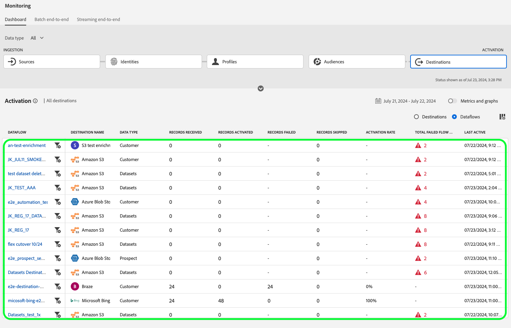

# Monitorar fluxos de dados para destinos na interface do

Use os vários destinos no catálogo do Experience Platform para ativar seus dados do Experience Platform para inúmeros parceiros externos. O Experience Platform facilita o processo de rastreamento do fluxo de dados para seus destinos ao fornecer transparência aos fluxos de dados.

O painel de monitoramento fornece uma representação visual da jornada de um fluxo de dados, incluindo o destino em que os dados estão sendo ativados, o tipo de dados que você está visualizando, dados exportados por execução de fluxo de dados e muito mais.

Este tutorial fornece instruções sobre como monitorar fluxos de dados diretamente no espaço de trabalho de destinos ou usar o painel de monitoramento para monitorar fluxos de dados para seus destinos usando a interface do usuário do Experience Platform.

## Introdução {#getting-started}

Este manual necessita de uma compreensão funcional dos seguintes componentes da Adobe Experience Platform:

- [Fluxos de dados](../home.md): os fluxos de dados são uma representação de trabalhos de dados que movem dados pela Experience Platform. Os fluxos de dados são configurados em diferentes serviços, ajudando a mover dados dos conectores de origem para conjuntos de dados de destino, para [!DNL Identity] e [!DNL Profile] e para [!DNL Destinations].
   - [Execuções de fluxo de dados](../../sources/notifications.md): as execuções de fluxo de dados são os trabalhos agendados recorrentes com base na configuração de frequência dos fluxos de dados selecionados.
- [Destinos](../../destinations/home.md): os destinos são integrações pré-criadas com aplicativos usados com frequência que permitem a ativação contínua de dados do Experience Platform para campanhas de marketing entre canais, campanhas de email, publicidade direcionada e muitos outros casos de uso.
- [Sandboxes](../../sandboxes/home.md): [!DNL Experience Platform] fornece sandboxes virtuais que particionam uma única instância do [!DNL Experience Platform] em ambientes virtuais separados para ajudar a desenvolver aplicativos de experiência digital.

## Monitorar fluxos de dados no espaço de trabalho de Destinos {#monitor-dataflows-in-the-destinations-workspace}

No espaço de trabalho **[!UICONTROL Destinations]** na interface do usuário do Experience Platform, navegue até a guia **[!UICONTROL Browse]** e selecione o nome de um destino que deseja exibir.

Uma lista de fluxos de dados existentes é exibida. Nesta página há uma lista de fluxos de dados visualizáveis, incluindo informações sobre seu destino, nome de usuário, número de fluxos de dados e status.

Consulte a tabela a seguir para obter mais informações sobre status:

| Status | Descrição |
| ------ | ----------- |
| Habilitado | O status `Enabled` indica que um fluxo de dados está ativo e está exportando dados de acordo com o agendamento fornecido. |
| Desabilitado | O status `Disabled` indica que um fluxo de dados está inativo e não está exportando dados. |
| Processamento | O status `Processing` indica que um fluxo de dados ainda não está ativo. Esse status geralmente é encontrado imediatamente após a criação de um novo fluxo de dados. |
| Erro | O status `Error` indica que o processo de ativação de um fluxo de dados foi interrompido. |

### O fluxo de dados é executado para destinos de transmissão {#dataflow-runs-for-streaming-destinations}

>[!CONTEXTUALHELP]
>id="platform_monitoring_dataflow_run_details_activation_streaming"
>title="Detalhes de execução do fluxo de dados"
>abstract="Os detalhes de execução do fluxo de dados de destino contêm informações sobre o status de ativação de um público-alvo e métricas obtidas do Perfil do cliente em tempo real para gerar identidades exclusivas. Para saber mais, revise o guia de definições de métricas."

>[!CONTEXTUALHELP]
>id="platform_monitoring_profiles_received_streaming"
>title="Perfis recebidos"
>abstract="O número total de perfis recebidos no fluxo de dados. Esse valor é atualizado a cada 60 minutos."

>[!CONTEXTUALHELP]
>id="platform_destinations_dataflow_identitiesactivated_streaming"
>title="Identidades ativadas"
>abstract="A contagem de identidades de perfil individuais ativadas com êxito para o destino selecionado. Essa métrica inclui identidades que são criadas, atualizadas e removidas de públicos-alvo exportados."

>[!CONTEXTUALHELP]
>id="platform_destinations_dataflow_identitiesexcluded_streaming"
>title="Identidades excluídas"
>abstract="A contagem de registros de perfil individuais excluídos da ativação do destino selecionado com base em atributos ausentes e violação de consentimento."

>[!CONTEXTUALHELP]
>id="platform_destinations_dataflow_identitiesfailed_streaming"
>title="Falha de identidades"
>abstract="A contagem de identidades de perfil individuais que falharam no destino selecionado. Verifique o diagnóstico de erro para obter detalhes."

Para destinos de transmissão, a guia [!UICONTROL Dataflow runs] fornece uma atualização por hora para os dados de métrica em suas execuções de fluxo de dados. As estatísticas mais proeminentes rotuladas são para identidades.

As identidades representam as diferentes facetas de um perfil. Por exemplo, se um perfil contiver um número de telefone e um endereço de email, esse perfil terá duas identidades.

Uma lista de execuções individuais e suas métricas específicas é exibida, juntamente com os seguintes totais de identidades:

- **[!UICONTROL Identities activated]**: o número total de identidades de perfil ativadas com êxito para o destino selecionado. Essa métrica inclui identidades que são criadas, atualizadas e removidas de públicos-alvo exportados.
- **[!UICONTROL Identities excluded]**: O número total de identidades de perfil que são ignoradas para ativação com base em atributos ausentes e violação de consentimento.
- **[!UICONTROL Identities failed]**: O número total de identidades de perfil que não estão ativadas para o destino devido a erros.

Cada execução de fluxo de dados individual mostra os seguintes detalhes:

- **[!UICONTROL Dataflow run start]**: A hora em que a execução do fluxo de dados começou. Para execuções de fluxo de dados de transmissão, o Experience Platform captura as métricas com base no início da execução do fluxo de dados, na forma de métricas por hora. Isso significa que, para execuções de fluxo de dados de transmissão, se uma execução de fluxo de dados tiver começado, por exemplo, em 10:30PM, a métrica mostrará a hora de início como 10:00 PM na interface do usuário.
- **[!UICONTROL Processing time]**: o tempo necessário para a execução do fluxo de dados ser processada.
   - Para **[!UICONTROL completed]** execuções, a métrica de tempo de processamento sempre mostra uma hora.
   - Para execuções de fluxo de dados que ainda estão em um estado **[!UICONTROL processing]**, a janela para capturar todas as métricas permanece aberta por mais de uma hora, para processar todas as métricas que correspondem à execução do fluxo de dados. Por exemplo, uma execução de fluxo de dados iniciada às 9h00 pode permanecer em um estado de processamento por uma hora e trinta minutos para capturar e processar todas as métricas. :30 A duração do tempo de processamento é diretamente afetada pelas tentativas feitas como resultado da falha de resposta do destino. Em seguida, quando a janela de processamento fechar e o status da execução do fluxo de dados atualizar para **concluído**, o tempo de processamento exibido será alterado para uma hora.
- **[!UICONTROL Profiles received]**: O número total de perfis recebidos no fluxo de dados.
- **[!UICONTROL Identities activated]**: O número total de identidades de perfil ativadas com êxito para o destino selecionado como parte da execução do fluxo de dados. Essa métrica inclui identidades que são criadas, atualizadas e removidas de públicos-alvo exportados.
- **[!UICONTROL Identities excluded]**: O número total de identidades de perfil que são excluídas da ativação com base em atributos ausentes e violação de consentimento.
- **[!UICONTROL Identities failed]** O número total de identidades de perfil que não estão ativadas para o destino devido a erros.

  >[!IMPORTANT]
  >
  > A partir de março de 2025, a Adobe está lançando uma atualização para aumentar a precisão dos relatórios para destinos de transmissão. Esse aprimoramento garante um melhor alinhamento entre os relatórios no Experience Platform e as plataformas de destino.
  >
  > Antes desta atualização, **[!UICONTROL Identities failed]** incluía todas as tentativas de ativação. Após essa atualização, somente a última tentativa de ativação será incluída na contagem total.
  > 
  > Esse aprimoramento se aplica a todos os destinos de streaming.
  > Após esse aprimoramento, os usuários de destinos de streaming podem ver uma queda esperada em sua contagem **[!UICONTROL Identities failed]**.

- **[!UICONTROL Activation rate]**: a porcentagem de identidades recebidas que foram ativadas com êxito. A fórmula a seguir demonstra como esse valor é calculado:
  
- **[!UICONTROL Status]**: representa o estado em que o fluxo de dados está: [!UICONTROL Completed] ou [!UICONTROL Processing]. [!UICONTROL Completed] significa que todas as identidades para a execução do fluxo de dados correspondente foram exportadas dentro do período de uma hora. [!UICONTROL Processing] significa que a execução do fluxo de dados ainda não foi concluída.

Para exibir os detalhes de uma execução de fluxo de dados específica, selecione a hora de início da execução na lista.

A página de detalhes de uma execução de fluxo de dados contém informações adicionais, como o número de perfis recebidos, o número de identidades ativadas, o número de identidades que falharam e o número de identidades excluídas.

A página de detalhes também exibe uma lista de identidades que falharam e as que foram excluídas. As informações das identidades com falha e excluída são exibidas, incluindo o código de erro, a contagem de identidades e a descrição. Por padrão, a lista exibe as identidades com falha. Para mostrar as identidades ignoradas, selecione o botão de alternância **[!UICONTROL Identities excluded]**.

#### Monitoramento de execução de fluxo de dados no nível do público-alvo para destinos de transmissão {#audience-level-dataflow-runs-for-streaming-destinations}

Você pode exibir informações sobre as identidades ativadas, excluídas ou com falha em um nível de público-alvo, para cada público que faz parte do fluxo de dados.

O monitoramento no nível do público-alvo para destinos de streaming só está disponível para determinados destinos. Consulte a seção [exibição de nível de público-alvo](#audience-level-view) para obter uma lista de destinos com suporte.

>[!NOTE]
>
>O número **[!UICONTROL Profiles received]** na guia **[!UICONTROL Audiences]** nem sempre corresponde ao número de perfis recebidos para a execução do fluxo de dados. Isso ocorre porque um determinado perfil pode fazer parte de mais de um público-alvo sendo ativado na execução do fluxo de dados.

### Execuções de fluxo de dados para destinos em lote {#dataflow-runs-for-batch-destinations}

>[!CONTEXTUALHELP]
>id="platform_monitoring_dataflow_run_details_activation"
>title="Detalhes de execução do fluxo de dados"
>abstract="Os detalhes de execução do fluxo de dados de destino contêm informações sobre o status de ativação de um público-alvo e métricas obtidas do Perfil do cliente em tempo real para gerar identidades exclusivas. Para saber mais, revise o guia de definições de métricas."
>additional-url="https://experienceleague.adobe.com/docs/experience-platform/dataflows/ui/monitor-destinations.html?lang=pt-BR#dataflow-runs-for-streaming-destinations" text="O fluxo de dados é executado para destinos de transmissão"

>[!CONTEXTUALHELP]
>id="platform_monitoring_profiles_received_batch"
>title="Perfis recebidos"
>abstract="O número total de perfis recebidos no fluxo de dados. Esse valor é atualizado a cada 60 minutos."

>[!CONTEXTUALHELP]
>id="platform_destinations_dataflow_identitiesactivated_batch"
>title="Identidades ativadas"
>abstract="A contagem de identidades de perfil individuais ativadas com êxito para o destino selecionado. Essa métrica inclui identidades que são criadas, atualizadas e removidas de públicos-alvo exportados."

>[!CONTEXTUALHELP]
>id="platform_destinations_dataflow_identitiesexcluded_batch"
>title="Identidades excluídas"
>abstract="A contagem de registros de perfil individuais excluídos da ativação do destino selecionado com base em atributos ausentes e violação de consentimento."

Para destinos em lote, a guia [!UICONTROL Dataflow runs] fornece dados de métrica sobre suas execuções de fluxo de dados. Uma lista de execuções individuais e suas métricas específicas é exibida, juntamente com os seguintes totais de identidades:

- **[!UICONTROL Identities activated]**: o número total de identidades de perfil ativadas com êxito para o destino selecionado. Essa métrica inclui identidades que são criadas, atualizadas e removidas de públicos-alvo exportados.
- **[!UICONTROL Identities excluded]**: A contagem de identidades de perfil individuais excluídas da ativação para o destino selecionado, com base nos atributos ausentes e na violação de consentimento.

Cada execução de fluxo de dados individual mostra os seguintes detalhes:

- **[!UICONTROL Dataflow run start]**: A hora em que a execução do fluxo de dados começou.
- **[!UICONTROL Audience]**: O nome do público associado a cada execução de fluxo de dados.
- **[!UICONTROL Processing time]**: O tempo necessário para a execução do fluxo de dados ser processada.
- **[!UICONTROL Profiles received]**: O número total de perfis recebidos no fluxo de dados. Esse valor é atualizado a cada 60 minutos.
- **[!UICONTROL Identities activated]**: O número total de identidades de perfil ativadas com êxito para o destino selecionado como parte da execução do fluxo de dados. Essa métrica inclui identidades que são criadas, atualizadas e removidas de públicos-alvo exportados.
- **[!UICONTROL Identities excluded]**: O número total de identidades de perfil que são excluídas da ativação com base em atributos ausentes e violação de consentimento.
- **[!UICONTROL Status]**: representa o estado em que o fluxo de dados está. Pode ser um destes três estados: [!UICONTROL Success], [!UICONTROL Failed] e [!UICONTROL Processing]. [!UICONTROL Success] significa que o fluxo de dados está ativo e está exportando dados de acordo com o agendamento fornecido. [!UICONTROL Failed] significa que a ativação de dados foi suspensa devido a erros. [!UICONTROL Processing] significa que o fluxo de dados ainda não está ativo e geralmente é encontrado quando um novo fluxo de dados é criado.

Para exibir detalhes de uma execução de fluxo de dados específica, selecione a hora de início da execução na lista.

>[!NOTE]
>
>As execuções de fluxo de dados são geradas com base na frequência de programação do fluxo de dados de destino. Uma execução de fluxo de dados separada é feita para cada [política de mesclagem](../../profile/merge-policies/overview.md) aplicada a um público.

A página de detalhes de um fluxo de dados, além dos detalhes mostrados na lista de fluxos de dados, exibe informações mais específicas sobre o fluxo de dados:

- **[!UICONTROL Size of data]**: O tamanho do fluxo de dados que está sendo exportado.
- **[!UICONTROL Total files]**: o número total de arquivos exportados no fluxo de dados.
- **[!UICONTROL Last updated]**: A hora em que a execução do fluxo de dados foi atualizada pela última vez.

A página de detalhes também exibe uma lista de identidades que falharam e as que foram excluídas. As informações das identidades com falha e excluída são exibidas, incluindo o código e a descrição do erro. Por padrão, a lista exibe as identidades com falha. Para mostrar identidades excluídas, selecione a opção **[!UICONTROL Identities excluded]**.

### Exibir no monitoramento {#view-in-monitoring}

Você também pode optar por exibir informações avançadas sobre um determinado fluxo de dados, que é executado no painel de monitoramento. Para exibir informações sobre um fluxo de dados no painel de monitoramento:

1. Navegue até **[!UICONTROL Connections]** > **[!UICONTROL Destinations]** > guia **[!UICONTROL Browse]**
2. Navegue até o fluxo de dados que deseja inspecionar.
3. Selecione o símbolo de reticências e o  **[!UICONTROL View in monitoring]**.

>[!SUCCESS]
>
>Agora é possível exibir informações sobre o fluxo de dados e seu fluxo de dados associado no painel de monitoramento. Leia a seção abaixo para obter mais informações.

## Painel de monitoramento de destinos {#monitoring-destinations-dashboard}

>[!NOTE]
>
>Atualmente, a funcionalidade de monitoramento de destinos tem suporte para todos os destinos no Experience Platform *except* the [Adobe Target](/help/destinations/catalog/personalization/adobe-target-connection.md) and [Custom Personalization](/help/destinations/catalog/personalization/custom-personalization.md) destinations.

>[!CONTEXTUALHELP]
>id="platform_monitoring_activation"
>title="Activation"
>abstract="A visualização da ativação de destino contém informações sobre o status de ativação de um público-alvo e as métricas obtidas do Perfil do cliente em tempo real para gerar identidades exclusivas."

Para acessar o painel [!UICONTROL Monitoring], selecione **[!UICONTROL Monitoring]** () na navegação à esquerda. Na página [!UICONTROL Monitoring], selecione [!UICONTROL Destinations]. O painel [!UICONTROL Monitoring] contém métricas e informações sobre os trabalhos de execução de destino.

Use o painel [!UICONTROL Destinations] para ter uma ideia geral da integridade dos fluxos de ativação. Comece obtendo insights em um nível agregado para todos os destinos de lote e transmissão e depois analise detalhadamente as exibições de fluxos de dados, execuções de fluxo de dados e públicos ativados para obter uma análise detalhada dos dados de ativação. As telas no painel [!UICONTROL Monitoring] fornecem insights acionáveis por meio de métricas e descrições de erros para ajudá-lo a solucionar problemas que possam surgir em seus cenários de ativação.

É possível filtrar as informações exibidas por tipo de dados - clientes, contas (somente para o Adobe Real-Time CDP B2B edition), clientes potenciais e enriquecimento da conta. Leia mais sobre essas opções no [guia do painel de monitoramento](/help/dataflows/ui/monitor.md#monitoring-dashboard-overview).

No centro do painel está o painel [!UICONTROL Activation], que contém métricas e gráficos que exibem dados sobre a taxa de ativação dos dados exportados para destinos de streaming, bem como sobre as execuções de fluxo de dados em lote com falha para destinos em lote.

Por padrão, os dados exibidos contêm as informações de ativação das últimas 24 horas. Selecione **[!UICONTROL Last 24 hours]** para ajustar o intervalo de tempo dos registros exibidos. As opções disponíveis incluem **[!UICONTROL Last 24 hours]**, **[!UICONTROL Last 7 days]** e **[!UICONTROL Last 30 days]**. Como alternativa, você pode selecionar as datas na janela pop-up do calendário exibida. Depois de selecionar as datas, selecione **[!UICONTROL Apply]** para ajustar o intervalo de tempo das informações mostradas.

>[!NOTE]
>
>A captura de tela a seguir mostra a taxa de ativação e as execuções do fluxo de dados em lote para os últimos 30 dias, em vez das últimas 24 horas. Você pode ajustar o período selecionando **[!UICONTROL Last 30 days]**.

Use o ícone de seta () para expandir ou descartar os cartões na parte superior da tela, que mostram rapidamente informações sobre os detalhes de ativação, com base no tipo de destino - streaming ou lote:

- **[!UICONTROL Streaming activation rate]**: representa a porcentagem de identidades recebidas que foram ativadas ou ignoradas com êxito. A fórmula usada para calcular essa porcentagem está descrita mais acima nesta página, na seção [Execuções de fluxo de dados para destinos de streaming](#dataflow-runs-for-streaming-destinations).
- **[!UICONTROL Batch failed dataflow runs]**: representa o número de execuções de fluxo de dados com falha no intervalo de tempo selecionado.

O gráfico **[!UICONTROL Activation]** é exibido por padrão e você pode desabilitá-lo para expandir a lista de destinos abaixo. Selecione o botão **[!UICONTROL Metrics and graphs]** para desabilitar os gráficos.

O painel **[!UICONTROL Activation]** exibe uma lista de destinos que contêm pelo menos uma conta existente. Esta lista também inclui informações sobre os perfis recebidos, identidades ativadas, identidades com falha, identidades excluídas, taxa de ativação, total de fluxos de dados com falha e a última data atualizada para esses destinos. Nem todas as métricas estão disponíveis para todos os tipos de destino. A tabela abaixo descreve as métricas e informações disponíveis por tipo de destino.

| Métrica | Tipo de destino |
|--------------------------------------|-----------------------|
| **[!UICONTROL Records received]** | Streaming e lote |
| **[!UICONTROL Records activated]** | Streaming e lote |
| **[!UICONTROL Records failed]** | Transmissão |
| **[!UICONTROL Records skipped]** | Streaming e lote |
| **[!UICONTROL Data type]** | Streaming e lote |
| **[!UICONTROL Activation rate]** | Transmissão |
| **[!UICONTROL Total failed dataflows]** | Lote |
| **[!UICONTROL Last updated]** | Streaming e lote |

{style="table-layout:auto"}

Também é possível filtrar a lista de destinos para exibir apenas a categoria de destinos selecionada. Selecione a lista suspensa **[!UICONTROL My destinations]** e selecione a [categoria de destino](/help/destinations/destination-types.md#categories) para a qual você deseja filtrar.

Além disso, você pode inserir um destino na barra de pesquisa para isolar em um único destino. Se quiser ver os fluxos de dados do destino, selecione o filtro  ao lado dele para ver uma lista de seus fluxos de dados ativos.

Para exibir todos os fluxos de dados existentes em todos os destinos, selecione **[!UICONTROL Dataflows]**.

Uma lista de fluxos de dados é exibida, classificada pela última execução do fluxo de dados. Você pode ver detalhes adicionais para um fluxo de dados específico localizando o destino que deseja monitorar, selecionando o filtro  ao lado dele e, em seguida, selecionando o filtro  ao lado do fluxo de dados sobre o qual deseja obter mais informações.

Depois de selecionar um fluxo de dados para inspeção adicional, a página de detalhes do fluxo de dados contém um botão que permite ver os dados ativados no fluxo de dados, divididos por execuções de fluxo de dados ou públicos.

### Exibição de execuções de fluxo de dados {#dataflow-runs-view}

Quando **[!UICONTROL Dataflow runs]** é selecionado, você pode ver uma lista de execuções de fluxo de dados para o fluxo de dados selecionado e mais informações sobre cada execução.

>[!INFO]
>
>Para fluxos de dados para destinos de transmissão, uma execução de fluxo de dados é dividida em janelas por hora. Cada janela por hora gera uma ID de execução de fluxo de dados correspondente.
>
>Para fluxos de dados para destinos em lote, cada público-alvo tem uma execução de fluxo de dados correspondente gerada, com base na frequência agendada de ativação de público-alvo. Por exemplo, se você configurar uma ativação diária agendada para cinco públicos-alvo no mesmo fluxo de dados de destino, haverá cinco execuções de fluxo de dados separadas geradas todos os dias.

Use o botão **[!UICONTROL Show failures only]** para exibir apenas as execuções com falha para um fluxo de dados.

### Exibição no nível do público {#segment-level-view}

Quando **[!UICONTROL Audiences]** é selecionado, você vê uma lista de públicos que foram ativados para o fluxo de dados selecionado, dentro do intervalo de tempo selecionado. Essa tela inclui informações no nível do público-alvo sobre os registros ativados e excluídos, bem como o status e a hora da última execução do fluxo de dados. Ao revisar as métricas de registros excluídos e ativados, é possível verificar se um público-alvo foi ativado com êxito ou não.

Por exemplo, você está ativando um público-alvo chamado &quot;Membros de fidelidade na Califórnia&quot; para um destino do Amazon S3 &quot;Membros de fidelidade Califórnia dezembro&quot;. Vamos supor que haja 100 perfis no público-alvo selecionado, mas apenas 80 dos 100 registros contenham atributos de ID de fidelidade e você tenha definido as regras de mapeamento de exportação como `loyalty.id` é necessário. Nesse caso, em um nível de público-alvo, você verá 80 registros ativados e 20 registros excluídos.

>[!IMPORTANT]
>
>Observe as limitações atuais relacionadas às métricas no nível do público-alvo:
>
>- A exibição no nível do público-alvo está disponível atualmente para os destinos listados abaixo. A implantação está planejada para outros destinos de streaming.
>
>   - Conexão com o [[!DNL (API) Oracle Eloqua] &#x200B;](../../destinations/catalog/email-marketing/oracle-eloqua-api.md)
>   - [[!DNL (V2) Marketo Engage]](../../destinations/catalog/adobe/marketo-engage.md)
>   - [[!DNL Airship Attributes]](../../destinations/catalog/mobile-engagement/airship-attributes.md)
>   - [[!DNL Airship Tags]](../../destinations/catalog/mobile-engagement/airship-tags.md)
>   - [[!DNL Amazon Kinesis]](../../destinations/catalog/cloud-storage/amazon-kinesis.md)
>   - [[!DNL Azure Event Hubs]](../../destinations/catalog/cloud-storage/azure-event-hubs.md)
>   - [[!DNL Google Customer Match + Display & Video 360]](../../destinations/catalog/advertising/google-customer-match-dv360.md)
>   - [[!DNL HTTP API]](../../destinations/catalog/streaming/http-destination.md)
>   - [[!DNL HubSpot]](../../destinations/catalog/crm/hubspot.md)
>   - [[!DNL Magnite: Real-time]](../../destinations/catalog/advertising/magnite-streaming.md)
>   - [[!DNL Marketo Engage]](../../destinations/catalog/adobe/marketo-engage.md)
>   - [[!DNL Marketo Engage Person Sync]](../../destinations/catalog/adobe/marketo-engage-person-sync.md)
>   - [[!DNL Microsoft Bing]](../../destinations/catalog/advertising/bing.md)
>   - [[!DNL Microsoft Dynamics 365]](../../destinations/catalog/crm/microsoft-dynamics-365.md)
>   - [[!DNL Moengage]](../../destinations/catalog/mobile-engagement/moengage.md)
>   - [[!DNL Outreach]](../../destinations/catalog/crm/outreach.md)
>   - [[!DNL Pega CDH Realtime Audience (V1)]](../../destinations/catalog/personalization/pega.md)
>   - [[!DNL Pega CDH Realtime Audience (V2)]](../../destinations/catalog/personalization/pega-v2.md)
>   - [[!DNL PubMatic Connect]](../../destinations/catalog/advertising/pubmatic.md)
>   - [[!DNL PubMatic Connect (Custom Audience ID Mapping)]](../../destinations/catalog/advertising/pubmatic.md)
>   - [[!DNL Qualtrics Automations]](../../destinations/catalog/survey/qualtrics-automations.md)
>   - [[!DNL RainFocus Attendee Profiles]](../../destinations/catalog/marketing-automation/rainfocus.md)
>   - [[!DNL Salesforce Marketing Cloud] (API)](../../destinations/catalog/email-marketing/salesforce-marketing-cloud.md)
>   - [[!DNL SAP Commerce]](../../destinations/catalog/ecommerce/sap-commerce.md)
>   - [[!DNL Snowflake]](../../destinations/catalog/warehouses/snowflake-batch.md)
>   - [[!DNL The Trade Desk]](../../destinations/catalog/advertising/tradedesk.md)
>   - [[!DNL Yahoo DataX]](../../destinations/catalog/advertising/datax.md)
>   - [[!DNL Zendesk]](../../destinations/catalog/crm/zendesk.md)
>   - Destinos em lote (baseados em arquivo)
> 
>- Para destinos em lote, as métricas no nível do público-alvo são atualmente registradas somente para execuções bem-sucedidas de fluxo de dados. Eles não são registrados para execuções de fluxo de dados com falha e registros excluídos. Para execuções de fluxo de dados para destinos de transmissão, as métricas são capturadas e exibidas para registros ativados e excluídos.

Na visualização em nível de público-alvo, as métricas são agregadas em várias execuções de fluxo de dados dentro do intervalo selecionado. Se houver várias execuções de fluxo de dados, você poderá detalhar a partir do nível do público-alvo para ver o detalhamento de cada execução de fluxo de dados, filtrado pelo público selecionado.
Use o botão de filtro  para detalhar a exibição de execuções de fluxo de dados para cada público no fluxo de dados.

### Página Execuções de fluxo de dados {#dataflow-runs-page}

A página de execuções do fluxo de dados exibe informações sobre suas execuções de fluxo de dados, incluindo o tempo de início da execução do fluxo de dados, o tempo de processamento, os registros recebidos, os registros ativados, os registros excluídos, os registros com falha, a taxa de ativação e o status.

Ao detalhar a página de execuções do fluxo de dados na [exibição no nível de público-alvo](#segment-level-view), você tem a opção de filtrar as execuções do fluxo de dados pelas seguintes opções:

- **[!UICONTROL Dataflow runs with failed records]**: Para o público-alvo selecionado, essa opção lista todas as execuções de fluxo de dados que falharam na ativação. Para inspecionar por que os registros em uma determinada execução de fluxo de dados falharam, consulte a [página de detalhes da execução do fluxo de dados](#dataflow-run-details-page) dessa execução de fluxo de dados.
- **[!UICONTROL Dataflow runs with excluded records]**: Para o público selecionado, essa opção lista todas as execuções de fluxo de dados em que alguns dos registros não foram totalmente ativados e alguns perfis foram ignorados. Para inspecionar por que os registros em uma determinada execução de fluxo de dados foram ignorados, consulte a [página de detalhes da execução do fluxo de dados](#dataflow-run-details-page) dessa execução de fluxo de dados.
- **[!UICONTROL Dataflow runs with activated records]**: Para o público-alvo selecionado, essa opção lista todas as execuções de fluxo de dados que têm registros ativados com êxito.

Para ver mais detalhes sobre uma execução de fluxo de dados específica, selecione o filtro  ao lado da hora de início da execução do fluxo de dados para ver a página de detalhes da execução do fluxo de dados.

### Página de detalhes da execução do fluxo de dados {#dataflow-run-details-page}

A página de detalhes da execução do fluxo de dados, além dos detalhes mostrados na lista de execuções do fluxo de dados, exibe informações mais específicas sobre o fluxo de dados:

- **[!UICONTROL Dataflow run ID]**: A ID do fluxo de dados.
- **[!UICONTROL IMS org ID]**: a organização à qual o fluxo de dados pertence.
- **[!UICONTROL Last updated]**: A hora em que a execução do fluxo de dados foi atualizada pela última vez.

A página de detalhes também tem um botão para alternar entre erros de execução de fluxo de dados e públicos-alvo. Esta opção só está disponível para execuções de fluxo de dados em destinos em lote e para o destino de streaming do [Google Customer Match DV 360](/help/destinations/catalog/advertising/google-customer-match-dv360.md).

A exibição de erros de execução do fluxo de dados exibe uma lista de registros que falharam e registros que foram ignorados. As informações para os registros com falha e ignorados são exibidas, incluindo o código de erro, a contagem de identidades e a descrição. Por padrão, a lista exibe os registros com falha. Para mostrar registros ignorados, selecione o botão de alternância **[!UICONTROL Records skipped]**.

Quando **[!UICONTROL Audiences]** é selecionado, você vê uma lista de públicos que foram ativados na execução do fluxo de dados selecionado. Essa tela inclui informações no nível do público-alvo sobre os registros ativados e excluídos, bem como o status e a hora da última execução do fluxo de dados.

## Próximas etapas {#next-steps}

Ao seguir este guia, agora você sabe como monitorar fluxos de dados para destinos em lote e de streaming, incluindo todas as informações relevantes, como tempo de processamento, taxa de ativação e status. Para saber mais sobre fluxos de dados no Experience Platform, leia a [visão geral sobre fluxos de dados](../home.md). Para saber mais sobre destinos, leia a [visão geral sobre destinos](../../destinations/home.md).