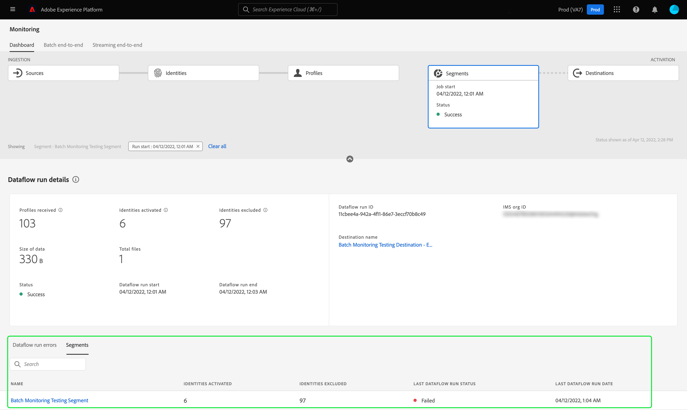
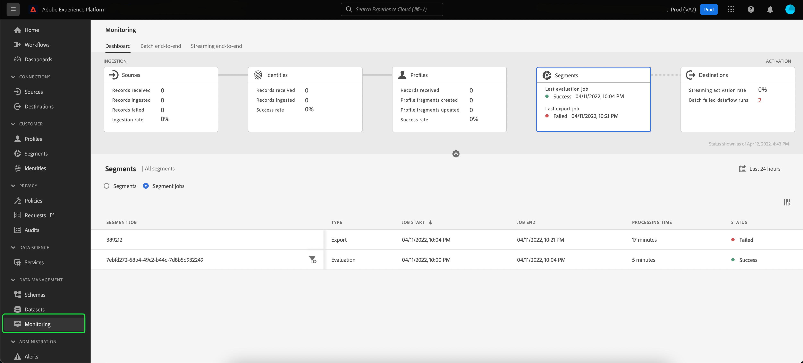

# Monitorar fluxos de dados para segmentos na interface do usuário

O Serviço de segmentação permite criar segmentos e públicos-alvo a partir dos dados do Perfil do cliente em tempo real no Adobe Experience Platform. A Platform fornece fluxos de dados para rastrear de forma transparente esse fluxo de dados de fontes para destinos.

O painel de monitoramento fornece uma representação visual da atividade dos dados em um segmento, incluindo o status da segmentação dos dados. Este tutorial fornece instruções sobre como você pode usar o painel de monitoramento para monitorar a segmentação de dados usando a interface do usuário do Experience Platform, permitindo rastrear o status de ativação, avaliação e exportação de tarefas do segmento.

## Introdução {#getting-started}

Este guia requer uma compreensão funcional dos seguintes componentes do Adobe Experience Platform:

- [Fluxos de dados](../home.md): Os fluxos de dados são uma representação de trabalhos de dados que movem dados pela Plataforma. Os fluxos de dados são configurados em diferentes serviços, ajudando a mover dados de conectores de origem para conjuntos de dados de destino, para [!DNL Identity] e [!DNL Profile]e para [!DNL Destinations].
   - [Execuções do fluxo de dados](../../sources/notifications.md): As execuções de fluxo de dados são trabalhos agendados recorrentes com base na configuração de frequência de fluxos de dados selecionados.
- [Segmentação](../../segmentation/home.md): A segmentação permite criar segmentos e públicos-alvo a partir dos dados do Perfil do cliente em tempo real.
   - [Trabalhos de ativação](../../destinations/ui/activation-overview.md): Um trabalho de ativação é usado para ativar seu segmento em um destino especificado.
   - [Trabalhos de avaliação](../../segmentation/tutorials/evaluate-a-segment.md#evaluate-a-segment): Um trabalho de avaliação é um processo assíncrono que é executado e cria um segmento de público-alvo com base no segmento especificado.
   - [Exportar trabalhos](../../segmentation/api/export-jobs.md): Um trabalho de exportação é um processo assíncrono usado para manter os membros do segmento do público-alvo em conjuntos de dados.
- [Sandboxes](../../sandboxes/home.md): [!DNL Experience Platform] fornece sandboxes virtuais que particionam uma única [!DNL Platform] em ambientes virtuais separados para ajudar a desenvolver aplicativos de experiência digital.

## Monitoramento do painel de segmentos {#monitoring-segments-dashboard}

>[!CONTEXTUALHELP]
>id="platform_monitoring_segments"
>title="Segmentos"
>abstract="A visualização de segmentos contém informações sobre todos os segmentos da Organização IMS, com mais informações sobre os trabalhos de ativação e avaliação."

Para acessar o **[!UICONTROL Segmentos]** painel, selecione **[!UICONTROL Monitoramento]** no painel de navegação esquerdo. Uma vez no **[!UICONTROL Monitoramento]** selecione o **[!UICONTROL Segmentos]** cartão.

No principal **[!UICONTROL Segmentos]** painel, o **[!UICONTROL Segmentos]** cartão mostra o status e a data do último trabalho de avaliação e o último trabalho de exportação.

O próprio painel contém métricas para segmentos e tarefas de segmentos. Por padrão, o painel mostrará as métricas de segmento das últimas 24 horas. Para saber mais sobre a exibição de tarefas do segmento, leia a [monitoramento de trabalhos de segmento](#monitoring-segment-jobs-dashboard) seção.

>[!IMPORTANT]
>
>Atualmente, somente os segmentos que estão ativados para [destinos em lote (com base em arquivo)](../../destinations/destination-types.md#file-based) são compatíveis com o painel de segmentos de monitoramento.

As métricas a seguir estão disponíveis para esta exibição de painel:

| Métrica | Descrição |
| ------ | ----------- |
| **[!UICONTROL Nome do segmento]** | O nome do segmento. |
| **[!UICONTROL Carimbo de data e hora da última avaliação]** | A data e a hora em que o último trabalho de avaliação do segmento foi executado. |
| **[!UICONTROL Status da última avaliação]** | O status do último trabalho de avaliação do segmento. Os valores possíveis incluem **[!UICONTROL Sucesso]**, **[!UICONTROL Nenhuma execução]** e **[!UICONTROL Falha]**. |
| **[!UICONTROL Últimos perfis de avaliação]** | O número de perfis que foram avaliados no último trabalho de avaliação do segmento. |
| **[!UICONTROL Carimbo de data e hora da última ativação]** | A data e a hora em que o último trabalho de ativação do segmento foi executado. |
| **[!UICONTROL Status da última ativação]** | O status do último trabalho de ativação do segmento. Os valores possíveis incluem **[!UICONTROL Sucesso]**, **[!UICONTROL Nenhuma execução]** e **[!UICONTROL Falha]**. |
| **[!UICONTROL Últimas identidades de ativação]** | O número de identidades que foram ativadas no último trabalho de ativação do segmento. |
| **[!UICONTROL Destino da última ativação]** | O nome do destino ao qual o último trabalho de ativação do segmento foi ativado. |

Você pode filtrar os resultados para um segmento específico e visualizar suas tarefas de segmento selecionando o ícone de filtro (). Os trabalhos do segmento são classificados em ordem cronológica, com os trabalhos do segmento mais recentes aparecendo primeiro.

O painel de segmentos filtrado é exibido. O **[!UICONTROL Segmentos]** cartão mostra o status e a data do último trabalho de avaliação e o último trabalho de ativação.

O próprio painel exibe a hora e o status dos últimos trabalhos de avaliação e ativação, um gráfico que mostra a contagem de perfis da avaliação de segmentos e métricas para os trabalhos de segmento que foram executados. Por padrão, o painel mostra as métricas de trabalho do segmento das últimas 24 horas.

As métricas a seguir estão disponíveis para esta exibição de painel:

| Métrica | Descrição |
| ------ | ----------- |
| **[!UICONTROL Início da tarefa]** | A data e a hora em que o trabalho do segmento começou. |
| **[!UICONTROL Tipo]** | Indica o tipo da tarefa do segmento. Os dois tipos de trabalho aceitos são **ativação** e **avaliação** trabalhos. |
| **[!UICONTROL Tarefa concluída]** | A data e a hora em que o trabalho do segmento foi concluído. |
| **[!UICONTROL Tempo de processamento]** | O tempo que o trabalho do segmento levou para ser concluído. |
| **[!UICONTROL Status da tarefa]** | O status do trabalho do segmento. Os valores suportados incluem **[!UICONTROL Sucesso]**, **[!UICONTROL Em Andamento]** e **[!UICONTROL Falha]**. |
| **[!UICONTROL Contagem de perfis]** | O número de perfis que o trabalho do segmento está avaliando. Cada usuário deve ter um perfil exclusivo. |
| **[!UICONTROL Contagem de identidade]** | O número de identidades que o trabalho do segmento está ativando. Cada perfil pode ter várias identidades. Por exemplo, um perfil pode ter um email, número de telefone e um número de fidelidade como identidades. |
| **[!UICONTROL Nome do destino]** | O nome do destino para o qual o trabalho de segmento está sendo ativado. |

Você pode filtrar ainda mais um trabalho de segmento específico e ver seus detalhes selecionando o ícone de filtro (). Há dois tipos diferentes de tarefas de segmento que podem ser filtradas: trabalhos de ativação e trabalhos de avaliação.

### Detalhes do trabalho de ativação {#activation-job-details}

A página de detalhes de execução do fluxo de dados do trabalho de ativação mostra informações sobre métricas de execução, erros de execução de fluxo de dados e segmentos relacionados ao trabalho do segmento. Um trabalho de ativação é usado para ativar seu segmento para um destino especificado. Por padrão, a página de detalhes mostra os erros de execução do fluxo de dados.

As métricas a seguir estão disponíveis para esta exibição de painel:

| Métrica | Descrição |
| ------ | ----------- |
| **[!UICONTROL Perfis recebidos]** | O número total de perfis recebidos no fluxo de ativação. |
| **[!UICONTROL Identidades ativadas]** | O número total de identidades que foram ativadas com êxito no destino, com base nos perfis recebidos. |
| **[!UICONTROL Identidades excluídas]** | O número total de identidades que foram excluídas da ativação para o destino, com base nos perfis recebidos. Essas identidades podem ser excluídas devido à falta de atributos ou violações de consentimento. |
| **[!UICONTROL Tamanho dos dados]** | O tamanho do fluxo de dados que está sendo ativado. |
| **[!UICONTROL Total de arquivos]** | O número total de arquivos que estão sendo ativados no fluxo de dados. |
| **[!UICONTROL Status]** | O status atual do trabalho de ativação. |
| **[!UICONTROL Início da execução do fluxo de dados]** | A data e a hora em que o trabalho de ativação começou. |
| **[!UICONTROL Fim da execução do fluxo de dados]** | A data e a hora em que o trabalho de ativação terminou. |
| **[!UICONTROL ID de execução do fluxo de dados]** | A ID do trabalho de ativação atual. |
| **[!UICONTROL ID da organização IMS]** | A ID da organização IMS à qual o trabalho de ativação pertence. |
| **[!UICONTROL Nome do destino]** | O nome do destino para o qual os dados estão sendo ativados. |

Sob as métricas, um botão para selecionar entre os erros de execução do fluxo de dados e os segmentos é exibido.

Na seção dataflow run errors , selecione o botão para exibir as identidades que falharam ou os campos excluídos das identidades. A seção de erros inclui detalhes sobre o código de erro e o número de identidades que falharam ou foram excluídas.

Na seção segmentos , é possível ver uma lista de segmentos que foram ativados como parte do trabalho de ativação. Use a barra de pesquisa para filtrar a lista de segmentos por nome.

Para a seção segmentos , as seguintes métricas estão disponíveis:

| Métrica | Descrição |
| ------ | ----------- |
| **[!UICONTROL Nome]** | O nome do segmento que foi ativado. |
| **[!UICONTROL Identidades ativadas]** | O número total de identidades que foram ativadas com êxito no destino, com base nos perfis recebidos. |
| **[!UICONTROL Identidades excluídas]** | O número total de identidades que foram excluídas da ativação para o destino, com base nos perfis recebidos. Essas identidades podem ser excluídas devido à falta de atributos ou violação de consentimento. |
| **[!UICONTROL Status de execução do último fluxo de dados]** | O status do último trabalho de ativação executado para esse segmento. |
| **[!UICONTROL Data da última execução do fluxo de dados]** | A data e a hora do último trabalho de ativação executado para esse segmento. |

### Detalhes do trabalho de avaliação {#evaluation-job-details}

A página de detalhes de execução do fluxo de dados do trabalho de avaliação mostra informações sobre as métricas e segmentos da execução relacionados ao trabalho do segmento. Um trabalho de avaliação é um processo assíncrono que cria um segmento de público-alvo com base no segmento especificado. Para saber mais sobre tarefas de avaliação, leia o tutorial em [avaliação de um segmento](../../segmentation/tutorials/evaluate-a-segment.md#evaluate-a-segment).

As métricas a seguir estão disponíveis para esta exibição de painel:

| Métrica | Descrição |
| ------ | ----------- |
| **[!UICONTROL Total de perfis]** | O número total de perfis que estão sendo avaliados. |
| **[!UICONTROL Status]** | O status do trabalho de avaliação. Os status possíveis para o trabalho de avaliação incluem **[!UICONTROL Sucesso]** e **[!UICONTROL Falha]**. |
| **[!UICONTROL Início da tarefa]** | A data e a hora em que o trabalho de avaliação começou. |
| **[!UICONTROL Fim da tarefa]** | A data e a hora em que o trabalho de avaliação terminou. |
| **[!UICONTROL Tipo de tarefa]** | O tipo de trabalho do segmento. Nesse caso, sempre será um trabalho de avaliação de segmento. |
| **[!UICONTROL Tipo de avaliação]** | O tipo de avaliação que está sendo feita. Pode ser **[!UICONTROL Em lote]** ou **[!UICONTROL Streaming]**. |
| **[!UICONTROL ID da tarefa]** | A ID do trabalho de avaliação. |
| **[!UICONTROL ID da organização IMS]** | A ID da organização IMS à qual o trabalho de avaliação pertence. |
| **[!UICONTROL Nome do segmento]** | O nome do segmento que está sendo avaliado. |
| **[!UICONTROL ID do segmento]** | A ID do segmento que está sendo avaliado. |

Na seção segmentos , é possível ver uma lista de segmentos que estão sendo avaliados como parte do trabalho de avaliação. Você pode filtrar a lista de segmentos por nome usando a barra de pesquisa.

>[!IMPORTANT]
>
>Atualmente, essa visualização de painel suporta até 800 métricas de segmento.

Para a seção segmentos , as seguintes métricas estão disponíveis:

| Métrica | Descrição |
| ------ | ----------- |
| **[!UICONTROL Nome]** | O nome do segmento que está sendo avaliado. |
| **[!UICONTROL Contagem de perfis]** | O número de perfis que estão sendo avaliados. |

## Monitoramento do painel de trabalhos de segmento {#monitoring-segment-jobs-dashboard}

>[!CONTEXTUALHELP]
>id="platform_monitoring_segment_jobs"
>title="Trabalhos de segmento"
>abstract="A exibição de trabalhos de segmento contém informações sobre os trabalhos de avaliação e exportação para todos os seus segmentos."

Para acessar o **[!UICONTROL Trabalhos de segmento]** painel, selecione **[!UICONTROL Monitoramento]** () no painel de navegação esquerdo. Uma vez no [!UICONTROL Monitoramento] página, selecione **[!UICONTROL Trabalhos de segmento]**. O [!UICONTROL Monitoramento] o painel contém métricas e informações sobre a avaliação de segmentos e as tarefas de exportação.

>[!NOTE]
>
>Somente **tarefas de avaliação de segmento** são compatíveis com o monitoramento por segmento. Os trabalhos de exportação de segmentos oferecem suporte apenas ao monitoramento no nível da organização.

Use o [!UICONTROL Trabalhos de segmento] painel para entender se a avaliação e exportação de perfis ocorre a tempo e sem exceções, de modo que os serviços downstream para ativação de destino possam ter os dados de perfil avaliados mais recentes.

As seguintes métricas estão disponíveis para tarefas de segmento:

| Métrica | Descrição |
---------|----------|
| **[!UICONTROL Tarefa de segmento]** | Indica o nome do trabalho do segmento. |
| **[!UICONTROL Tipo]** | Indica o tipo de trabalho do segmento - exportação ou avaliação. Observe que, em ambos os casos, o trabalho do segmento avalia ou exporta **all** segmentos pertencentes a uma organização. Para saber mais sobre tarefas de exportação, leia o guia sobre o [ponto de extremidade de tarefas de exportação](../../segmentation/api/export-jobs.md). Para saber mais sobre tarefas de avaliação, leia o tutorial em [avaliação de um segmento](../../segmentation/tutorials/evaluate-a-segment.md#evaluate-a-segment). |
| **[!UICONTROL Início da tarefa]** | A data e a hora em que o trabalho do segmento começou. |
| **[!UICONTROL Fim da tarefa]** | A data e a hora em que o trabalho do segmento foi concluído. |
| **[!UICONTROL Status]** | O status do trabalho concluído. Os status possíveis para o trabalho do segmento incluem sucesso ou falha. |