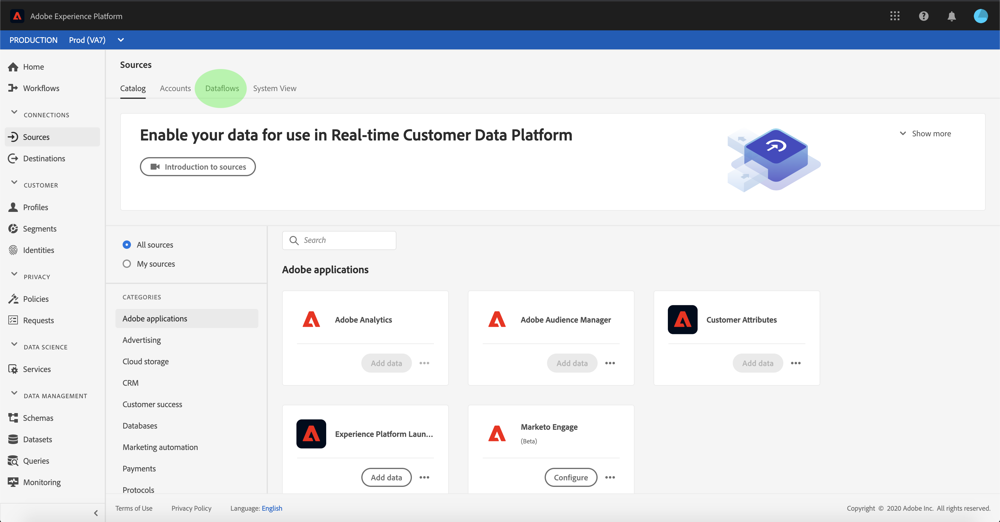

# Monitorar fluxos de dados para fontes na interface do usuário

Os conectores de origem na Adobe Experience Platform fornecem a capacidade de assimilar dados de origem externa de forma programada. Este tutorial fornece etapas para a exibição de fluxos de dados existentes na área de trabalho [!UICONTROL Fontes].

## Introdução

Este tutorial requer uma compreensão funcional dos seguintes componentes do Adobe Experience Platform:

- [Fontes](../../sources/home.md):  [!DNL Experience Platform] permite que os dados sejam ingeridos de várias fontes e, ao mesmo tempo, fornece a você a capacidade de estruturar, rotular e aprimorar os dados recebidos usando  [!DNL Platform] serviços.
- [Caixas de proteção](../../sandboxes/home.md):  [!DNL Experience Platform] fornece caixas de proteção virtuais que particionam uma única  [!DNL Platform] instância em ambientes virtuais separados para ajudar a desenvolver e desenvolver aplicativos de experiência digital.

## Monitorar fluxos de dados

Faça logon na [interface do usuário do Experience Platform](https://platform.adobe.com) e selecione **[!UICONTROL Fontes]** na navegação esquerda para acessar a área de trabalho [!UICONTROL Fontes]. Selecione **[!UICONTROL Fluxos de dados]** do cabeçalho superior para visualização de fluxos de dados existentes.

Uma lista de fluxos de dados existentes é exibida. Nesta página há uma lista de fluxos de dados visualizáveis, incluindo informações sobre sua fonte, nome de usuário, número de fluxos de dados e status.

Consulte a tabela a seguir para obter mais informações sobre status:

| Status | Descrição |
| ------ | ----------- |
| Ativado | O status `Enabled` indica que um fluxo de dados está ativo e está ingerindo dados de acordo com o agendamento fornecido. |
| Desativado | O status `Disabled` indica que um fluxo de dados está inativo e não está ingerindo dados. |
| Processamento | O status `Processing` indica que um fluxo de dados ainda não está ativo. Esse status geralmente é encontrado imediatamente após a criação de um novo fluxo de dados. |
| Erro | O status `Error` indica que o processo de ativação de um fluxo de dados foi interrompido. |

Selecione o ícone de funil na parte superior esquerda para classificar.

O painel de classificação é exibido. Selecione a fonte que deseja acessar no menu de rolagem e selecione o fluxo de dados na lista à direita. Você também pode selecionar o botão de elipses (`...`) para exibir mais opções disponíveis para o seu fluxo de dados selecionado.

A página **[!UICONTROL atividade de fluxo de dados]** contém detalhes sobre o número de registros ingeridos e os registros falharam, bem como informações sobre o status e o tempo de processamento do fluxo de dados. Selecione o ícone de calendário acima do fluxo de dados para ajustar o intervalo de tempo dos registros de ingestão.

O calendário permite que você visualização os diferentes intervalos de tempo para registros ingeridos. Você pode selecionar uma das duas opções predefinidas &quot;[!UICONTROL Últimos 7 dias]&quot; ou &quot;[!UICONTROL Últimos 30 dias]&quot;. Como alternativa, você pode definir um período de tempo personalizado usando o calendário. Selecione seu período de tempo de escolha e selecione **[!UICONTROL Aplicar]** para continuar.

Por padrão, a atividade **[!UICONTROL Dataflow]** exibe o painel **[!UICONTROL Propriedades]** associado ao dataflow. Selecione a execução de fluxo da lista para ver seus metadados associados, incluindo informações sobre sua ID de execução exclusiva.

Selecione **[!UICONTROL start de execução do Dataflow]** para acessar a **[!UICONTROL visão geral de execução do Dataflow]**.

A **[!UICONTROL visão geral da execução do Fluxo de Dados]** exibe informações sobre o fluxo de dados, incluindo seus metadados, status de ingestão parcial e limite de erro atribuído. O cabeçalho superior também inclui um resumo de erro. O **[!UICONTROL Resumo do erro]** contém o erro de nível superior específico que mostra em que etapa o processo de ingestão encontrou um erro.

Consulte a tabela a seguir para obter os erros que podem ser vistos no **[!UICONTROL Resumo do erro]**.

| Erro | Descrição |
| ---------- | ----------- |
| `CONNECTOR-1001-500` | Erro ao copiar dados de uma fonte. |
| `CONNECTOR-2001-500` | Ocorreu um erro enquanto os dados copiados estão sendo processados para [!DNL Platform]. Esse erro pode ser relacionado à análise, validação ou transformação. |

A metade inferior da tela contém informações sobre **[!UICONTROL erros de execução de fluxo de dados]**. Daqui, você também pode visualização os arquivos assimilados, pré-visualização e fazer download do diagnóstico de erros ou fazer download do manifesto do arquivo.

A seção **[!UICONTROL Erros de execução de Fluxo de Dados]** exibe o código de erro, o número de registros que falharam e as informações que descrevem o erro.

Selecione **[!UICONTROL Diagnóstico de erro de Pré-visualização]** para ver mais informações sobre o erro de ingestão.

O painel **[!UICONTROL pré-visualização de diagnóstico de erro]** é exibido. Essa tela exibe informações específicas sobre a falha de ingestão, incluindo o nome do arquivo, o código de erro, o nome da coluna na qual o erro ocorreu e uma descrição do erro.

Esta seção também inclui uma pré-visualização da coluna que contém o erro.

>[!IMPORTANT]
>
>Para habilitar **[!UICONTROL pré-visualização de diagnóstico de erro]** você deve ativar **[!UICONTROL ingestão parcial]** e **[!UICONTROL Diagnóstico de erro]** ao configurar um fluxo de dados. Isso permitirá que o sistema verifique todos os registros ingeridos durante a execução do fluxo.

Depois de visualizar os erros, você pode selecionar **[!UICONTROL Download]** no painel **[!UICONTROL dataflow executa a visão geral]** para acessar o diagnóstico completo de erros e baixar o manifesto do arquivo. Consulte os documentos em [diagnósticos de erro](../../ingestion/batch-ingestion/partial.md#retrieve-errors) e [baixando metadados](../../ingestion/batch-ingestion/partial.md#download-metadata) para obter mais informações.

Para obter mais informações sobre monitoramento de fluxos de dados e ingestão, consulte o tutorial em [monitoramento de fluxos de dados de transmissão](../../ingestion/quality/monitor-data-ingestion.md).

## Próximas etapas

Ao seguir este tutorial, você acessou com êxito contas e fluxos de dados existentes na área de trabalho **[!UICONTROL Fontes]**. Os dados recebidos agora podem ser usados por serviços downstream [!DNL Platform], como [!DNL Real-time Customer Profile] e [!DNL Data Science Workspace]. Consulte os seguintes documentos para obter mais detalhes:

- [Visão geral do Perfil do cliente em tempo real](../../profile/home.md)
- [Visão geral da Análise do espaço de trabalho da Data Science](../../data-science-workspace/home.md)
