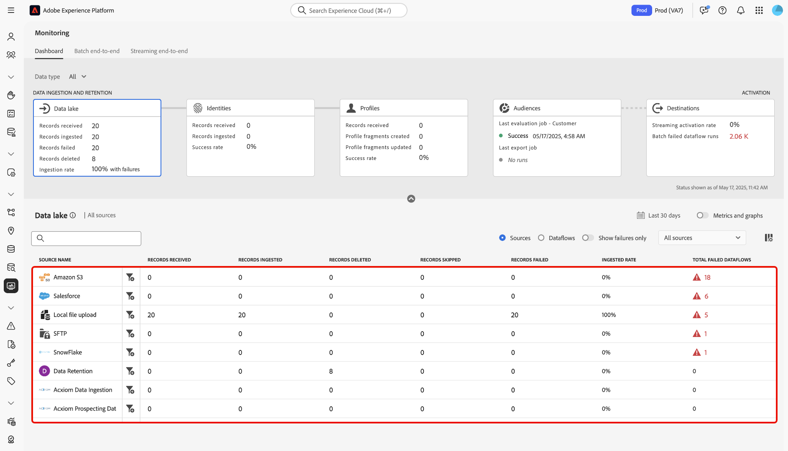

# Monitorar fluxos de dados de fontes na interface

>[!IMPORTANT]
>
>As fontes de transmissão, como a [fonte de API HTTP](../../sources/connectors/streaming/http.md), não têm suporte atualmente no painel de monitoramento. Nesse momento, você só pode usar o painel para monitorar origens de lote.

Leia este documento para saber como usar o painel de monitoramento para monitorar seus fluxos de dados de fontes na interface do usuário do Experience Platform.

## Introdução {#get-started}

Este tutorial requer uma compreensão funcional dos seguintes componentes do Adobe Experience Platform:

* [Fluxos de dados](../home.md): os fluxos de dados são uma representação de trabalhos de dados que movem dados pela Plataforma. Os fluxos de dados são configurados em diferentes serviços, ajudando a mover dados dos conectores de origem para conjuntos de dados de destino, para [!DNL Identity] e [!DNL Profile] e para [!DNL Destinations].
   * [Execuções de fluxo de dados](../../sources/notifications.md): as execuções de fluxo de dados são os trabalhos agendados recorrentes com base na configuração de frequência dos fluxos de dados selecionados.
* [Fontes](../../sources/home.md): o Experience Platform permite que os dados sejam assimilados de várias fontes e, ao mesmo tempo, fornece a capacidade de estruturar, rotular e aprimorar os dados recebidos usando os serviços da plataforma.
* [Serviço de identidade](../../identity-service/home.md): obtenha uma melhor visão dos clientes individuais e de seu comportamento unindo as identidades de vários dispositivos e sistemas.
* [Perfil de cliente em tempo real](../../profile/home.md): fornece um perfil de cliente unificado em tempo real com base em dados agregados de várias fontes.
* [Sandboxes](../../sandboxes/home.md): o Experience Platform fornece sandboxes virtuais que particionam uma única instância da Platform em ambientes virtuais separados para ajudar a desenvolver aplicativos de experiência digital.

## Monitore os dados das suas fontes usando o painel de monitoramento

>[!CONTEXTUALHELP]
>id="platform_monitoring_source_ingestion"
>title="Ingestão de origem"
>abstract="A visualização da ingestão de origem contém informações sobre o status da atividade de dados e métricas no serviço do data lake, incluindo registros assimilados e registros que falharam. Consulte o guia de definição de métricas para saber mais sobre métricas e gráficos."
>text="Learn more in documentation"

>[!CONTEXTUALHELP]
>id="platform_monitoring_dataflow_run_details_ingestion"
>title="Detalhes de execução do fluxo de dados"
>abstract="O processamento de fontes contém informações sobre o status da atividade de dados e métricas no serviço do data lake, incluindo registros assimilados e registros que falharam. Consulte o guia de definição de métricas para saber mais sobre métricas e gráficos."
>text="Learn more in documentation"

<!-- In the [Platform UI](https://platform.adobe.com), select **[!UICONTROL Monitoring]** from the left navigation to access the [!UICONTROL Monitoring] dashboard. The [!UICONTROL Monitoring] dashboard contains metrics and information on all sources dataflows, including insights into the health of data traffic from a source to [!DNL Identity Service], and to [!DNL Profile].

At the center of the dashboard is the [!UICONTROL Source ingestion] panel, which contains metrics and graphs that display data on records ingested and records failed. -->

No painel de monitoramento, selecione [!UICONTROL Fontes] no cabeçalho principal para atualizar seu painel com uma exibição da taxa de assimilação do fluxo de dados de suas fontes.

O gráfico [!UICONTROL Taxa de assimilação] exibe a taxa de assimilação de dados com base no intervalo de tempo configurado. Por padrão, o painel de monitoramento exibe a taxa de assimilação das últimas 24 horas. Para obter etapas sobre como configurar seu intervalo de tempo, leia o guia em [configurando o intervalo de tempo de monitoramento](monitor.md#configure-monitoring-time-frame).

O gráfico é ativado para exibir por padrão. Para ocultar o gráfico, selecione **[!UICONTROL Métricas e gráficos]** para desabilitar a alternância e ocultar o gráfico.

A parte inferior do painel exibe uma tabela que descreve o relatório de métricas atuais para todos os fluxos de dados de fontes existentes.

| Métricas | Descrição |
| --- | --- |
| Registros recebidos | O número total de registros recebidos da origem. |
| Registros assimilados | O número total de registros assimilados no data lake. |
| Registros ignorados | O número total de registros ignorados. |
| Registros com falha | O número total de registros que não puderam ser assimilados devido a erros. |
| Taxa de assimilação | A porcentagem de registros assimilados com base no número total de registros recebidos. |
| Total de fluxos de dados com falha | O número total de fluxos de dados que falharam. |

{style="table-layout:auto"}

Você pode filtrar ainda mais seus dados usando as opções fornecidas acima da tabela de métricas:

| Opções de filtro | Descrição |
| --- | --- |
| Pesquisa | Use a barra de pesquisa para filtrar sua exibição para um único tipo de origem. |
| Origens | Selecione **[!UICONTROL Fontes]** para filtrar sua exibição e exibir dados de métrica por tipo de fonte. Essa é a exibição padrão que o painel de monitoramento usa. |
| Fluxos de dados | Selecione **[!UICONTROL Fluxos de dados]** para filtrar sua exibição e exibir dados de métrica por fluxo de dados. |
| Mostrar somente falhas | Selecione **[!UICONTROL Mostrar somente falhas]** para filtrar sua visualização e exibir somente fluxos de dados que relataram falhas de assimilação. |
| Minhas fontes | Você pode filtrar ainda mais sua exibição usando o menu suspenso [!UICONTROL Minhas fontes]. Use o menu suspenso para filtrar sua visualização por categoria. Como alternativa, você pode selecionar **[!UICONTROL Todas as fontes]** para exibir métricas em todas as fontes ou fontes, ou selecionar **[!UICONTROL Minhas fontes]** para exibir somente as fontes com as quais você tem uma conta correspondente. |

{style="table-layout:auto"}

Para monitorar os dados que estão sendo assimilados em um fluxo de dados específico, selecione o ícone de filtro  ao lado de uma origem.

A tabela de métricas é atualizada para uma tabela de fluxos de dados ativos que correspondem à origem selecionada. Durante essa etapa, você pode visualizar informações adicionais sobre os fluxos de dados, incluindo o conjunto de dados e o tipo de dados correspondentes, bem como um carimbo de data e hora para indicar quando eles estavam ativos pela última vez.

Para inspecionar ainda mais um fluxo de dados, selecione o ícone de filtro  ao lado de um fluxo de dados.

Em seguida, você é direcionado a uma interface que lista todas as iterações de execução do fluxo de dados selecionado.

As execuções de fluxo de dados representam uma instância da execução do fluxo de dados. Por exemplo, se um fluxo de dados estiver programado para ser executado por hora às 9h, 10h e 11h, você terá três instâncias de um fluxo em execução. As execuções de fluxo são específicas para sua organização específica.

Para inspecionar métricas de uma iteração de execução de fluxo de dados específica, selecione o ícone de filtro  ao lado do fluxo de dados.

Use a página de detalhes da execução do fluxo de dados para exibir métricas e informações da iteração de execução selecionada.

| Detalhes de execução do fluxo de dados | Descrição |
| --- | --- |
| Registros assimilados | O número total de registros assimilados da execução do fluxo de dados. |
| Registros com falha | O número total de registros que não foram assimilados devido a erros na execução do fluxo de dados. |
| Total de arquivos | O número total de arquivos na execução do fluxo de dados. |
| Tamanho dos dados | O tamanho total dos dados contidos na execução do fluxo de dados. |
|  execução do fluxo de dados | A ID da iteração de execução do fluxo de dados. |
| ID da organização | A ID da organização na qual a execução do fluxo de dados foi criada. |
| Status | O status da execução do fluxo de dados. |
| Início da execução do fluxo de dados | Um carimbo de data e hora que indica quando a execução do fluxo de dados foi iniciada. |
| Término da execução do fluxo de dados | Um carimbo de data e hora que indica quando a execução do fluxo de dados terminou. |
| Conjunto de dados | O conjunto de dados usado para criar o fluxo de dados. |
| Tipo de dados | O tipo de dados que estava no fluxo de dados. |
| Assimilação parcial | A assimilação parcial de lotes é a capacidade de assimilar dados que contêm erros até um determinado limite configurável. Esse recurso permite assimilar com sucesso todos os seus dados precisos no Experience Platform, enquanto todos os seus dados incorretos são armazenados em lote separadamente com informações sobre por que são inválidos. Você pode ativar a assimilação parcial durante o processo de criação do fluxo de dados. |
| Diagnóstico de erro | O diagnóstico de erro instrui a origem a produzir diagnósticos de erro que você poderá consultar posteriormente ao monitorar a atividade do conjunto de dados e o status do fluxo de dados. Você pode habilitar diagnósticos de erro durante o processo de criação do fluxo de dados. |
| Resumo do erro | Dada uma execução de fluxo de dados com falha, o resumo do erro exibe um código e uma descrição do erro para resumir por que a iteração de execução falhou. |

{style="table-layout:auto"}

Se o fluxo de dados executar erros, você pode rolar para baixo até a parte inferior da página usar a interface [!UICONTROL Erros de execução do fluxo de dados].

Use a seção [!UICONTROL Registros com falha] para exibir métricas em registros que não foram assimilados devido a erros. Para exibir um relatório de erros abrangente, selecione **[!UICONTROL Visualizar diagnóstico de erro]**. Para baixar uma cópia do diagnóstico de erros e do manifesto de arquivo, selecione **[!UICONTROL Baixar]** e copie a chamada de API de exemplo a ser usada com a API [!DNL Data Access].

>[!NOTE]
>
>Você só poderá usar diagnósticos de erro se o recurso tiver sido habilitado durante o processo de criação da conexão de origem.

## Próximas etapas {#next-steps}

Ao seguir este tutorial, você monitorou com êxito o fluxo de dados de assimilação no nível da origem usando o painel **[!UICONTROL Monitoramento]**. Você também identificou com sucesso erros que contribuíram para a falha dos fluxos de dados durante o processo de assimilação. Consulte os seguintes documentos para obter mais detalhes:

* [Monitorando dados de identidade](./monitor-identities.md).
* [Monitorando dados do perfil](./monitor-profiles.md).
