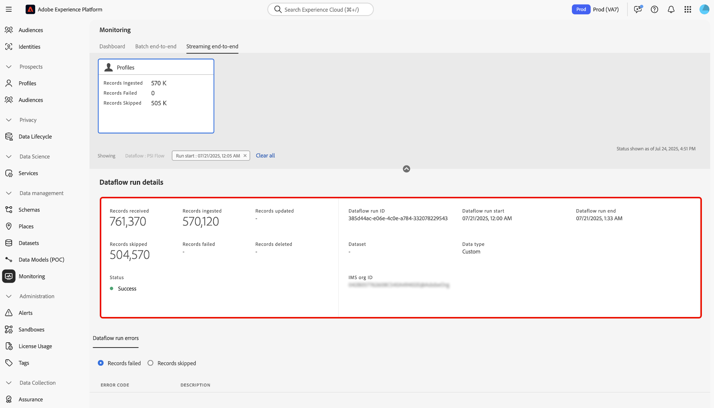

# Monitorar assimilação de perfil de transmissão

Você pode usar o painel de monitoramento na interface do usuário do Adobe Experience Platform para realizar o monitoramento em tempo real da assimilação do perfil de transmissão na organização. Use esse recurso para acessar com mais transparência as métricas de taxa de transferência e qualidade de dados relacionadas aos dados de transmissão. Além disso, use esse recurso para alertas proativos e recuperação de insights acionáveis para ajudar a identificar possíveis violações de capacidade e problemas de assimilação de dados.

Leia o guia a seguir para saber como usar o painel de monitoramento para rastrear taxas e métricas para trabalhos de assimilação de perfil de transmissão na sua organização.

## Introdução

Este guia requer uma compreensão funcional dos seguintes componentes do Experience Platform:

* [Fluxos de dados](../home.md): os fluxos de dados representam trabalhos de dados que transferem informações pela Experience Platform. Eles são configurados em vários serviços para facilitar a movimentação de dados dos conectores de origem para os conjuntos de dados de destino, bem como para o Serviço de identidade, o Perfil do cliente em tempo real e os Destinos.
* [Perfil do cliente em tempo real](../../profile/home.md): o Perfil do cliente em tempo real combina dados de várias fontes (online, offline, CRM e de terceiros) em uma única exibição acionável de cada cliente, permitindo experiências consistentes e personalizadas em todos os pontos de contato.
* [Assimilação por streaming](../../ingestion/streaming-ingestion/overview.md): a Assimilação por streaming para o Experience Platform fornece aos usuários um método para enviar dados de dispositivos no lado do cliente e do servidor para o Experience Platform em tempo real.O Experience Platform permite gerar experiências coordenadas, consistentes e relevantes, gerando um Perfil de cliente em tempo real para cada um de seus clientes individuais. .
* [Capacidades](../../landing/license-usage-and-guardrails/capacity.md): no Experience Platform, as capacidades informam se sua organização excedeu alguma das medidas de proteção e fornecem informações sobre como corrigir esses problemas.

>[!NOTE]
>
>A capacidade de taxa de transferência de transmissão suporta até 1500 eventos de entrada por segundo. Você pode comprar Segmentação de streaming adicional para oferecer suporte a até um máximo adicional de 13.500 eventos de entrada por segundo&#x200B;. Para obter mais informações, consulte as [descrições de produto do Real-Time CDP B2C Edition - Prime e Ultimate Packages](https://helpx.adobe.com/legal/product-descriptions/real-time-customer-data-platform-b2c-edition-prime-and-ultimate-packages.html).

## Métricas de monitoramento para a assimilação de perfil de transmissão {#streaming-profile-metrics}

>[!CONTEXTUALHELP]
>id="platform_monitoring_streaming_profile"
>title="Monitorar assimilação de perfil de transmissão"
>abstract="O painel de monitoramento para perfis de transmissão exibe informações sobre taxas de transferência e assimilação. Use esse painel para visualizar, entender e analisar as métricas de processamento de dados. dos perfis de transmissão na Experience Platform."
>text="Learn more in documentation"

>[!CONTEXTUALHELP]
>id="platform_monitoring_streaming_profile_request_throughput"
>title="Taxa de transferência de solicitação"
>abstract="Essa métrica representa o número de eventos que entram no sistema de assimilação por segundo."
>text="Learn more in documentation"

>[!CONTEXTUALHELP]
>id="platform_monitoring_streaming_profile_processing_throughput"
>title="Taxa de transferência de processamento"
>abstract="Essa métrica representa o número de eventos assimilados com êxito pelo sistema a cada segundo."
>text="Learn more in documentation"

>[!CONTEXTUALHELP]
>id="platform_monitoring_streaming_profile_p95_ingestion_latency"
>title="Latência de assimilação P95"
>abstract="Essa métrica mede a latência do percentil 95 do momento em que um evento chega à Experience Platform até ele ser assimilado com sucesso no armazenamento de perfis."
>text="Learn more in documentation"

>[!CONTEXTUALHELP]
>id="platform_monitoring_streaming_profile_max_throughput"
>title="Taxa de transferência máxima"
>abstract="Essa métrica representa o número máximo de solicitações de entrada por segundo recebidas pela assimilação do perfil de transmissão."
>text="Learn more in documentation"

>[!CONTEXTUALHELP]
>id="platform_monitoring_streaming_profile_records_ingested"
>title="Registros assimilados"
>abstract="Essa métrica representa o número total de registros assimilados no armazenamento de perfis em uma janela de tempo configurada."
>text="Learn more in documentation"

>[!CONTEXTUALHELP]
>id="platform_monitoring_streaming_profile_records_failed"
>title="Registros com falha"
>abstract="Essa métrica representa o número total de registros que falharam ao serem assimilados no armazenamento de perfis em uma janela de tempo configurada, devido a erros."
>text="Learn more in documentation"

>[!CONTEXTUALHELP]
>id="platform_monitoring_streaming_profile_records_skipped"
>title="Registros ignorados"
>abstract="Essa métrica representa o número total de registros que foram descartados em uma janela de tempo configurada devido a falhas de configuração ou de capacidade."
>text="Learn more in documentation"

>[!CONTEXTUALHELP]
>id="platform_monitoring_streaming_profile_error_details"
>title="Detalhes do erro"
>abstract="Essa métrica representa o número de eventos com falha devido a erros."
>text="Learn more in documentation"

Use a tabela de métricas para obter informações específicas para seus fluxos de dados. Consulte a tabela a seguir para obter detalhes sobre cada coluna.

| Métrica | Descrição | Dimensões | Frequência de medição |
| --- | --- | --- | --- |
| Taxa de transferência de solicitação | Essa métrica representa o número de eventos que entram no sistema de assimilação por segundo. | Sandbox/Fluxo de dados | Monitoramento em tempo real com uma atualização de dados a cada 60 segundos. |
| Taxa de transferência de processamento | Essa métrica representa o número de eventos assimilados com êxito pelo sistema a cada segundo. | Sandbox/Fluxo de dados | Monitoramento em tempo real com uma atualização de dados a cada 60 segundos. |
| Taxa de transferência máxima | Essa métrica representa o número máximo de solicitações de entrada por segundo ao entrar na assimilação do perfil de streaming | <ul><li>Sandbox/Fluxo de dados</li><li>Execução do fluxo de dados</li></ul> |  |
| Registros assimilados | Essa métrica representa o número total de registros assimilados no armazenamento de perfis em uma janela de tempo configurada. | <ul><li>Sandbox/Fluxo de dados</li><li>Execução do fluxo de dados</li></ul> | <ul><li>Sandbox/Fluxo de dados: monitoramento em tempo real com uma atualização de dados a cada 60 segundos.</li><li>Execução do fluxo de dados: agrupado em 15 minutos.</li></ul> |
| Registros com falha | Essa métrica representa o número total de registros que falharam ao serem assimilados no armazenamento de perfis em uma janela de tempo configurada, devido a erros. | <ul><li>Sandbox/Fluxo de dados</li><li>Execução do fluxo de dados</li></ul> | <ul><li>Sandbox/Fluxo de dados: monitoramento em tempo real com uma atualização de dados a cada 60 segundos.</li><li>Execução do fluxo de dados: agrupado em 15 minutos.</li></ul> |
| Registros ignorados | Essa métrica representa o número total de registros que foram descartados em uma janela de tempo configurada devido a falhas de configuração ou de capacidade. | <ul><li>Sandbox/Fluxo de dados</li><li>Execução do fluxo de dados</li></ul> | <ul><li>Sandbox/Fluxo de dados: monitoramento em tempo real com uma atualização de dados a cada 60 segundos.</li><li>Execução do fluxo de dados: agrupado em 15 minutos.</li></ul> |
| Detalhes do erro | Essa métrica representa o número de eventos com falha devido a erros. | Execução do fluxo de dados | Agrupado em uma janela por hora. |

{style="table-layout:auto"}

## Usar o painel de monitoramento para assimilação do perfil de streaming

Para acessar o painel de monitoramento para assimilação do perfil de streaming, vá para a interface do usuário do Experience Platform, selecione **[!UICONTROL Monitoring]** na navegação à esquerda e selecione **[!UICONTROL Streaming end-to-end]**.

Consulte o cabeçalho superior do painel para o cartão de métricas *[!UICONTROL Profile]*. Use esta exibição para exibir informações sobre os registros assimilados, com falha e ignorados, bem como informações sobre o status atual da taxa de transferência da solicitação.

Em seguida, use a interface para exibir informações detalhadas sobre as métricas de assimilação do perfil de streaming. Use o recurso de calendário para alternar entre períodos diferentes. Você pode selecionar entre as seguintes janelas de tempo pré-configuradas:

* [!UICONTROL Last 6 hours]
* [!UICONTROL Last 12 hours]
* [!UICONTROL Last 24 hours]
* [!UICONTROL Last 7 days]
* [!UICONTROL Last 30 days]

Como alternativa, você pode configurar manualmente seu próprio período de tempo usando o calendário.

Você pode usar duas categorias de métrica diferentes no painel de monitoramento para assimilação do perfil de streaming: [!UICONTROL Throughput] e [!UICONTROL Ingestion].

>[!BEGINTABS]

>[!TAB Taxa de transferência]

Selecione **[!UICONTROL Throughput]** para exibir informações sobre a quantidade de dados que o Experience Platform está processando, dado um período configurado. Consulte esta métrica para avaliar a eficiência e a capacidade do seu sistema.

* **[Capacidade](../../landing/license-usage-and-guardrails/capacity.md)**: a quantidade máxima de dados que sua sandbox pode processar sob condições definidas.
* **Taxa de transferência de solicitação**: a taxa na qual os eventos são recebidos pelo sistema de assimilação, medida em eventos por segundo.
* **Taxa de transferência de processamento**: a taxa na qual o sistema assimila e processa com êxito as cargas de evento de entrada, medida em eventos por segundo.

>[!TAB Assimilação]

**Assimilação**: selecione **[!UICONTROL Ingestion]** para exibir informações sobre os trabalhos de assimilação na sua sandbox. Esses trabalhos de assimilação são medidos em três métricas diferentes.

* **Registros assimilados**: a quantidade total de registros criados em um determinado período. Essa métrica representa processos de assimilação de dados bem-sucedidos em sua sandbox.
* **Registros ignorados**: o número total de registros não assimilados devido a erros.
* **Registros ignorados**: o número total de registros que foram ignorados devido à violação dos limites de capacidade.

>[!ENDTABS]

### Usar a tabela de métricas de fluxo de dados

A tabela de fluxo de dados lista todas as atividades de assimilação de streaming com seu conjunto correspondente de métricas para o Perfil do cliente em tempo real. Cada fluxo de dados é listado com seu conjunto de dados correspondente.

Se estiver se aproximando dos limites da sua capacidade no nível da sandbox, você pode consultar a coluna [!UICONTROL Max throughput] para identificar quaisquer fluxos de dados existentes que estejam contribuindo para suas taxas de consumo. Leia a [seção de práticas recomendadas](#best-practices) para obter mais informações sobre as práticas recomendadas de gerenciamento de fluxo de dados.

Para monitorar os dados que estão sendo assimilados em um fluxo de dados específico, selecione o ícone de filtro  ao lado do nome do fluxo de dados.

Em seguida, use a interface de métricas de fluxo de dados para selecionar a execução de fluxo específica que deseja inspecionar. Selecione o ícone de filtro  ao lado de uma iteração de execução de fluxo para exibir métricas específicas da execução de fluxo selecionada.

As execuções de fluxo de dados representam uma instância da execução do fluxo de dados. Por exemplo, se um fluxo de dados estiver agendado para ser executado por hora às 9h00, 10h10 e 11h20, você terá três instâncias de um fluxo em execução. :00:00:00 As execuções de fluxo são específicas para sua organização específica.

Use a página de detalhes da execução do fluxo de dados para exibir métricas e informações da iteração de execução selecionada.

## Práticas recomendadas de gerenciamento de fluxo de dados {#best-practices}

Leia a seção a seguir para obter informações sobre como gerenciar melhor seus fluxos de dados e otimizar seu consumo de dados no Experience Platform.

### Avaliar e otimizar os fluxos de dados de assimilação por transmissão

Para garantir uma assimilação de transmissão eficiente, revise e ajuste seus fluxos de dados e estratégia de processamento:

* **Avaliar uso atual**: identifique quais fluxos de dados e conjuntos de dados estão contribuindo mais para a taxa de transferência.
* **Priorizar dados valiosos**: nem todos os dados podem ser necessários. Exclua dados que não sejam compatíveis com seus casos de uso para reduzir o armazenamento e melhorar a eficiência.
* **Otimizar modo de processamento**: determine se alguns dados podem ser transferidos de streaming para assimilação em lote. Reserve streaming para casos de uso que exigem baixa latência, como segmentação em tempo real.

### Plano de capacidade e tráfego sazonal

Se o seu limite atual de **1.500 eventos por segundo** for insuficiente, considere otimizar sua estratégia de dados ou aumentar sua capacidade de licença:

* **Analisar o uso do conjunto de dados e da sandbox**: analise os dados atuais e históricos para entender como o tráfego e o engajamento afetam a taxa de transferência da segmentação por transmissão.
* **Conta para sazonalidade**: identifique períodos de pico de tráfego provocados por campanhas de marketing recorrentes ou ciclos específicos do setor.
* **Previsão de demanda futura**: estime os volumes futuros de tráfego e envolvimento com base em tendências sazonais passadas, campanhas planejadas ou eventos importantes.

| Fator de contribuição | O que é | Impacto nos casos de uso | Práticas recomendadas |
| --- | --- | --- | --- |
| Conversão em lote para fluxo contínuo | As cargas de trabalho em lote convertidas em fluxo podem aumentar significativamente a taxa de transferência, afetando o desempenho e a alocação de recursos. Por exemplo, executar uma atualização de perfil em massa após um evento sem limites de taxa. | As estratégias de transmissão são desnecessárias para casos de uso em lote quando o processamento de baixa latência não é necessário. | Avaliar os requisitos de caso de uso. Para marketing de saída em lote, considere usar a [assimilação em lote](../../ingestion/batch-ingestion/overview.md) em vez da transmissão para gerenciar a assimilação de dados com mais eficiência. |
| Assimilação desnecessária de dados | A ingestão de dados não é necessária para personalização e aumenta a taxa de transferência sem adicionar valor, desperdiçando recursos. Por exemplo, assimilar todo o tráfego de análises em perfis, independentemente da relevância. | O excesso de dados não relevantes cria ruído, dificultando a identificação de pontos de dados impactantes. Também pode causar atrito ao definir e gerenciar públicos e perfis. | Assimile somente dados necessários para seus casos de uso. Filtre os dados desnecessários.<ul><li>**Adobe Analytics**: use a [filtragem em nível de linha](../../sources/tutorials/ui/create/adobe-applications/analytics.md#filtering-for-real-time-customer-profile) para otimizar a entrada de dados.</li><li>**Fontes**: Use a [[!DNL Flow Service] API para filtrar dados de nível de linha](../../sources/tutorials/api/filter.md) de fontes com suporte, como [!DNL Snowflake] e [!DNL Google BigQuery].</li></li>**Sequência de dados do Edge**: configure [sequências de dados dinâmicas](../../datastreams/configure-dynamic-datastream.md) para executar a filtragem em nível de linha do tráfego proveniente do SDK da Web.</li></ul> |

{style="table-layout:auto"}

### Perguntas frequentes {#faq}

Leia esta seção para obter respostas a perguntas frequentes sobre o monitoramento da assimilação do perfil de transmissão.

#### Por que minhas métricas são diferentes nos painéis Capacidade e Monitoramento para a taxa de transferência de solicitação?

+++Resposta

O painel [!UICONTROL Monitoring] mostra métricas em tempo real para assimilação e processamento. Esses números são métricas exatas registradas no momento da atividade. Por outro lado, o painel [!UICONTROL Capacity] usa um mecanismo de suavização para o cálculo da capacidade de taxa de transferência. Esse mecanismo ajuda a reduzir picos de vida curta de qualificação instantânea como violações e garante que os alertas de capacidade se concentrem em tendências sustentadas, em vez de picos momentâneos.

Devido ao mecanismo de suavização, você pode notar:

* Pequenos picos em [!UICONTROL Monitoring] que não aparecem em [!UICONTROL Capacity].
* Valores um pouco mais baixos em [!UICONTROL Capacity] em comparação a [!UICONTROL Monitoring] no mesmo carimbo de data/hora.

Os dois painéis são precisos, mas foram projetados para finalidades diferentes.

* [!UICONTROL Monitoring]: visibilidade operacional detalhada, momento a momento.
* [!UICONTROL Capacity]: exibição estratégica para identificar padrões de uso e violação.

+++

## Próximas etapas {#next-steps}

Seguindo este tutorial, você aprendeu a monitorar os trabalhos de assimilação de perfil de transmissão na sua organização. Leia os seguintes documentos para obter informações adicionais sobre como monitorar dados para o Perfil do cliente em tempo real.

* [Usar o painel de monitoramento](./monitor.md).
* [Monitorar dados de perfil](./monitor-profiles.md).
