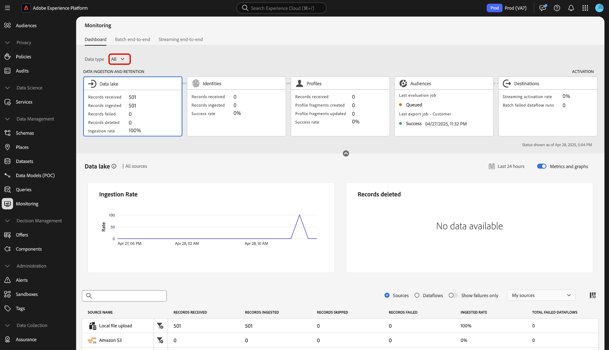

# Visão geral do painel de monitoramento

Use o painel de monitoramento na interface do usuário do Adobe Experience Platform para exibir a jornada dos dados, da assimilação à ativação. Com o painel de monitoramento, é possível:

* Monitore a jornada de seus dados de Fontes, Serviço de identidade, Perfil do cliente em tempo real, Públicos-alvo e, finalmente, em Destinos.
* Visualize métricas e status diferentes dependendo do estágio em que seus dados estão.
* Filtre sua visualização de monitoramento de dados por tipo de dados.

O painel de monitoramento é compatível com a exibição de vários tipos de dados diferentes:

* **Cliente e conta**: os dados do cliente se referem aos dados usados no [Real-time Customer Data Platform](../../rtcdp/home.md), enquanto os dados da conta se referem a [dados de perfis de conta](../../rtcdp/accounts/account-profile-overview.md) que pode ser acessada na assinatura [Real-Time CDP, edição B2B](../../rtcdp/b2b-overview.md). Se sua licença do Real-Time CDP não incluir o Real-Time CDP, B2B Edition, você só poderá usar o painel de monitoramento para monitorar os dados do cliente.
* **Cliente Potencial**: [Perfis de cliente potencial](../../profile/ui/prospect-profile.md) são usados para representar pessoas que ainda não se envolveram com a sua empresa, mas você deseja entrar em contato com. Com perfis de prospecto, você pode complementar seus perfis de clientes com atributos de parceiros de terceiros confiáveis. Você deve estar licenciado com o Real-Time CDP (App Service), Adobe Experience Platform Ativation, Real-Time CDP, Real-Time CDP Prime, Real-Time CDP Ultimate para ver o tipo de dados do cliente potencial.
* **Enriquecimento do perfil da conta**: Perfis de conta permitem unificar informações de conta de várias fontes. Você deve ter uma licença do Real-Time CDP, B2B Edition para monitorar os dados de enriquecimento do perfil da conta.

Leia este documento para saber como usar o painel de monitoramento para monitorar a jornada de seus dados em diferentes serviços de Experience Platform.

## Introdução

Este documento requer uma compreensão funcional dos seguintes componentes do Experience Platform:

* [Fluxos de dados](../home.md): Fluxos de dados são representações de trabalhos de dados que movem os dados pelo Experience Platform. Você pode usar o espaço de trabalho de origens para criar fluxos de dados que assimilam dados de uma determinada origem para o Experience Platform.
* [Origens](../../sources/home.md): use fontes no Experience Platform para assimilar dados de um aplicativo Adobe ou de uma fonte de dados de terceiros.
* [Serviço de identidade](../../identity-service/home.md): obtenha uma melhor visualização dos clientes individuais e do comportamento deles ao unir as identidades de vários dispositivos e sistemas.
* [Perfil do cliente em tempo real](../../profile/home.md): fornece um perfil de consumidor unificado em tempo real com base em dados agregados de várias fontes.
* [Segmentação](../../segmentation/home.md): use o Serviço de segmentação para criar segmentos e públicos-alvo a partir dos dados do Perfil do cliente em tempo real.
* [Destinos](../../destinations/home.md): os destinos são integrações pré-criadas com aplicativos de uso comum que permitem a ativação contínua de dados da Platform para campanhas de marketing entre canais, campanhas de email, publicidade direcionada e muitos outros casos de uso.

## Guia do painel de monitoramento

Na interface do Experience Platform, selecione **[!UICONTROL Monitoramento]** em [!UICONTROL Gerenciamento de dados] no painel de navegação esquerdo.

Selecionar **[!UICONTROL Tipo de dados]** e, em seguida, use o menu suspenso para selecionar o tipo de dados que deseja visualizar. Os tipos de dados são definidos pelas classes de esquema do Experience Data Model (XDM) para garantir que seus dados sigam um formato padrão quando assimilados no Experience Platform. Para obter mais informações, consulte a seguinte documentação:

* [Tipo de dados da conta B2B](../../rtcdp/b2b-tutorial.md)
* [Tipo de dados de cliente potencial](../../rtcdp/partner-data/prospecting.md)

Você pode filtrar sua visualização com base nos seguintes tipos de dados:

>[!BEGINTABS]

>[!TAB Todos]

Selecionar **[!UICONTROL Todos]** para atualizar seu painel e exibir métricas em todos os dados que foram assimilados no Experience Platform durante um determinado período.

>[!TAB Cliente e conta]

Selecionar **[!UICONTROL Cliente e conta]** para atualizar seu painel e exibir métricas nos dados do cliente e da conta que foram assimilados no Experience Platform durante um determinado período.

>[!TAB Cliente Potencial]

Selecionar **[!UICONTROL Cliente Potencial]** para atualizar seu painel e exibir métricas em dados de prospecção que foram assimilados no Experience Platform durante um determinado período. **Nota**: você só poderá exibir atividades de tipo de dados de cliente potencial se estiver [qualificado para dados de prospecto](../../rtcdp/partner-data/prospecting.md).

>[!TAB Enriquecimento do perfil da conta]

Selecionar **[!UICONTROL Enriquecimento do perfil da conta]** para atualizar seu painel e exibir métricas nos dados de enriquecimento do perfil. **Nota**: você só poderá exibir as métricas de enriquecimento do perfil de conta se estiver habilitado a [Dados B2B](../../rtcdp/b2b-tutorial.md).

>[!ENDTABS]

Use o cabeçalho superior do painel para obter uma experiência de monitoramento entre serviços. É possível filtrar a visualização de métricas e gráficos ao selecionar o cartão de recurso de sua escolha no cabeçalho da categoria de dados.

>[!BEGINTABS]

>[!TAB Fontes]

Selecionar **[!UICONTROL Origens]** para visualizar as métricas sobre a taxa de assimilação das fontes. Leia o guia em [monitoramento de dados de fontes](monitor-sources.md) para obter mais informações.

>[!TAB Identidades]

Selecionar **[!UICONTROL Identidades]** para exibir a taxa de sucesso do processamento de seus dados de identidade. Leia o guia em [monitoramento de dados de identidade](monitor-identities.md) para obter mais informações.

>[!TAB Perfis]

Selecionar **[!UICONTROL Perfis]** para exibir a taxa de sucesso do processamento dos dados do seu perfil. Leia o guia em [monitoramento de dados do perfil](monitor-profiles.md) para obter mais informações.

>[!TAB Públicos-alvo]

Selecionar **[!UICONTROL Públicos-alvo]** para visualizar métricas sobre seus públicos-alvo e trabalhos de segmentação. Leia o guia em [monitoramento de dados de público](monitor-audiences.md) para obter mais informações.

>[!TAB Destinos]

Selecionar **[!UICONTROL Destinos]** para exibir métricas em seu [!UICONTROL Taxa de ativação de transmissão] e [!UICONTROL Execuções de fluxo de dados com falha em lote]. Leia o guia em [monitoramento de dados de destinos](monitor-destinations.md) para obter mais informações.

>[!ENDTABS]

### Configurar intervalo de tempo de monitoramento {#configure-monitoring-time-frame}

Por padrão, o painel de monitoramento exibe métricas sobre dados assimilados nas últimas 24 horas. Para atualizar o período, selecione **[!UICONTROL Últimas 24 horas]**.

Você pode configurar um novo intervalo de tempo para a visualização de monitoramento de dados na caixa de diálogo exibida. Você tem a opção de criar um intervalo de tempo personalizado ou selecionar na lista de opções pré-configuradas:

* [!UICONTROL Últimas 24 horas]
* [!UICONTROL Últimos 7 dias]
* [!UICONTROL Últimos 30 dias]

Quando terminar, selecione **[!UICONTROL Aplicar]**.

## Próximas etapas

Agora, ao ler este documento, você pode navegar pelo painel de monitoramento na interface do usuário do. Para obter informações sobre como monitorar dados para um serviço Experience Platform específico, leia a documentação abaixo:

* [Monitorar dados de fontes](monitor-sources.md).
* [Monitorar dados de identidade](monitor-identities.md).
* [Monitorar dados do perfil](monitor-profiles.md).
* [Monitorar dados do público](monitor-audiences.md).
* [Monitorar dados de destinos](monitor-destinations.md).
