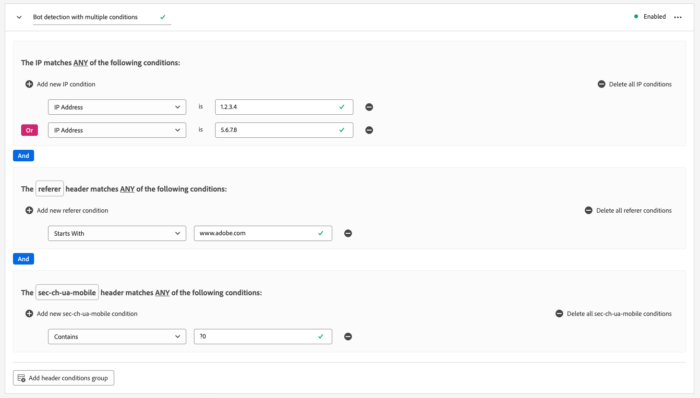

# Configurar a detecção de bot para sequências de dados

O tráfego proveniente de entidades não humanas, como programas automatizados, web scrapers, spiders e scanners com script, pode dificultar a identificação de eventos que ocorrem de visitantes humanos. Esse tipo de tráfego pode afetar negativamente métricas comerciais importantes, resultando em relatórios de tráfego incorretos.

A detecção de bot permite identificar eventos gerados pelo[SDK da Web](../web-sdk/home.md), [SDK móvel](https://developer.adobe.com/client-sdks/home/) e [[!DNL Server API]](../server-api/overview.md) como sendo gerado por aranhas e bots conhecidos.

Ao configurar a detecção de bot para seus fluxos de dados, você pode identificar endereços IP, intervalos de IP e cabeçalhos de solicitação específicos que gostaria de classificar como eventos de bot.

A identificação do tráfego de bot pode fornecer uma medida mais precisa da atividade do usuário no seu site ou aplicativo móvel.

Quando uma solicitação para a Rede de borda corresponde a qualquer uma das regras de detecção de bot, o esquema XDM é atualizado com uma pontuação de bot (sempre definida como 1), conforme mostrado abaixo.

```json
{
  "botDetection": {
    "score": 1
  }
}
```

Essa pontuação de bot ajuda as soluções que recebem a solicitação a identificar corretamente o tráfego do bot.

>[!IMPORTANT]
>
>A detecção de bot não elimina nenhuma solicitação de bot. Ele atualiza somente o esquema XDM com a pontuação de bot e encaminha o evento para o [serviço de sequência de dados](configure.md) que você configurou.
>
>As soluções de Adobe podem lidar com a pontuação de bot de maneiras diferentes. Por exemplo, o Adobe Analytics usa seu próprio [serviço de filtragem de bot](https://experienceleague.adobe.com/docs/analytics/admin/admin-tools/manage-report-suites/edit-report-suite/report-suite-general/bot-removal/bot-rules.html) e não usa a pontuação definida pela Rede de borda. Os dois serviços usam o mesmo [Lista de bot IAB](https://www.iab.com/guidelines/iab-abc-international-spiders-bots-list/), portanto, a pontuação de bot é idêntica.

As regras de detecção de bot podem levar até 15 minutos para se propagarem pela Rede de borda após serem criadas.

## Pré-requisitos {#prerequisites}

Para que a detecção de bot funcione no seu fluxo de dados, é necessário adicionar o **[!UICONTROL Informações de detecção de bot]** grupo de campos ao seu esquema. Consulte a [Esquema XDM](../xdm/ui/resources/schemas.md#add-field-groups) documentação para saber como adicionar grupos de campos a um esquema.

## Configurar a detecção de bot para sequências de dados {#configure}

Você pode configurar a detecção de bot após criar uma configuração de sequência de dados. Consulte a documentação sobre como [criar e configurar um fluxo de dados](configure.md), siga as instruções abaixo para adicionar recursos de detecção de bot ao seu fluxo de dados.

Vá para a lista de sequências de dados e selecione a sequência de dados à qual deseja adicionar a detecção de bot.


Na página de detalhes do fluxo de dados, selecione a variável **[!UICONTROL Detecção de bot]** no painel direito.


A variável **[!UICONTROL Regras de detecção de bot]** é exibida.


Na página Regras de detecção de bot, você pode configurar a detecção de bot usando as seguintes funcionalidades:

* Usar o [!DNL [IAB/ABC International Spiders and Bots List]](https://www.iab.com/guidelines/iab-abc-international-spiders-bots-list/).
* Criar suas próprias regras de detecção de bot.

### Usar a Lista Internacional de spiders e bots da IAB/ABC {#iab-list}

A variável [Lista internacional de spiders e bots da IAB/ABC](https://www.iab.com/guidelines/iab-abc-international-spiders-bots-list/) é uma lista de terceiros padrão do setor de spiders e bots da internet, que ajuda a identificar tráfego automatizado, como rastreadores de mecanismo de pesquisa, ferramentas de monitoramento e outro tráfego não humano que talvez você não queira mostrar em suas contagens de análise.

Para configurar seu fluxo de dados para usar o [!DNL IAB/ABC International Spiders and Bots List], alterne a **[!UICONTROL Use a Lista internacional de spiders e bots da IAB/ABC para detecção de bot nesta sequência de dados]** e selecione Salvar para aplicar as configurações de detecção de bot ao fluxo de dados.


### Criar regras de detecção de bot {#rules}

Além de usar a variável [Lista internacional de spiders e bots da IAB/ABC](https://www.iab.com/guidelines/iab-abc-international-spiders-bots-list/), você pode definir suas próprias regras de detecção de bot para cada fluxo de dados.

Você pode criar regras de detecção de bot com base em **Endereços IP** e **Intervalos de endereços IP**.

Se você precisar de regras de detecção de bot mais granulares, poderá combinar as condições de IP com as condições do cabeçalho da solicitação. As regras de detecção de bot podem usar os seguintes cabeçalhos:

| Cabeçalho HTTP | Descrição |
| --- | --- |
| `user-agent` | Um cabeçalho que permite que servidores e colegas de rede identifiquem o aplicativo, o sistema operacional, o fornecedor e/ou a versão do agente do usuário solicitante. |
| `content-type` | Indica o tipo de mídia original do recurso (antes de qualquer codificação de conteúdo aplicada para envio). |
| `referer` | Identifica o endereço da página da Web da qual o recurso foi solicitado. |
| `sec-ch-ua` | Fornece a marca e a versão significativa de cada marca associada ao navegador em uma lista separada por vírgulas. |
| `sec-ch-ua-mobile` | Indica se o navegador está em um dispositivo móvel. Ele também pode ser usado por um navegador de desktop para indicar uma preferência por uma experiência do usuário móvel. |
| `sec-ch-ua-platform` | Fornece a plataforma ou o sistema operacional em que o agente do usuário está sendo executado. Por exemplo: &quot;Windows&quot; ou &quot;Android&quot;. |
| `sec-ch-ua-platform-version` | Fornece a versão do sistema operacional no qual o agente do usuário está sendo executado. |
| `sec-ch-ua-arch` | Fornece a arquitetura subjacente da CPU do agente do usuário, como ARM ou x86. |
| `sec-ch-ua-model` | Indica o modelo do dispositivo no qual o navegador está sendo executado. |
| `sec-ch-ua-bitness` | Fornece o &quot;bit&quot; da arquitetura subjacente da CPU do agente do usuário. Esse é o tamanho em bits de um número inteiro ou endereço de memória — normalmente 64 ou 32 bits. |
| `sec-ch-ua-wow64` | Indica se um binário do agente do usuário está sendo executado no modo de 32 bits no Windows de 64 bits. |

Para criar uma regra de detecção de bot, siga as etapas abaixo:

1. Selecionar **[!UICONTROL Adicionar nova regra]**.

   

2. Digite um nome para a regra no campo **[!UICONTROL Nome da regra]** campo.

   

3. Selecionar **[!UICONTROL Adicionar nova condição de IP]** para adicionar uma nova regra baseada em IP. Você pode definir a regra por endereço IP ou por intervalo de endereços IP.

   

   

   >[!TIP]
   >
   >As condições de IP baseiam-se em um `OR` operação. Uma solicitação é marcada como originária de um bot se corresponder a qualquer uma das condições de IP definidas.

4. Se quiser adicionar condições de cabeçalho à regra, selecione **[!UICONTROL Adicionar grupo de condições do cabeçalho]** e, em seguida, selecione os cabeçalhos que deseja que a regra use.

   

   Em seguida, adicione as condições a serem usadas para o cabeçalho selecionado.

   

5. Após configurar as regras de detecção de bot desejadas, selecione **[!UICONTROL Salvar]** para que as regras sejam aplicadas ao seu fluxo de dados.

   


## Exemplos de regras de detecção de bot {#examples}

Para ajudar você a começar a usar a detecção de bot, use os exemplos detalhados abaixo para criar regras de detecção de bot.

### Detecção de bot com base em um endereço IP {#one-ip}

Para marcar todas as solicitações originadas de um endereço IP específico como tráfego de bot, crie uma nova regra de detecção de bot que avalia um único endereço IP, conforme mostrado na imagem abaixo.


### Detecção de bot com base em dois endereços IP {#two-ip}

Para marcar todas as solicitações originadas de um dos dois endereços IP específicos como tráfego de bot, crie uma nova regra de detecção de bot que avalia dois endereços IP, conforme mostrado na imagem abaixo.


### Detecção de bot com base em um intervalo de endereços IP {#range}

Para marcar todas as solicitações originadas de qualquer endereço IP em um intervalo específico como tráfego de bot, crie uma nova regra de detecção de bot que avalia um intervalo de endereços IP inteiro, como mostrado na imagem abaixo.


### Detecção de bot com base em um endereço IP e um cabeçalho de solicitação {#ip-header}

Para marcar todas as solicitações originadas de um endereço IP específico e que contenham um cabeçalho de solicitação específico como tráfego de bot, crie uma nova regra de detecção de bot, conforme mostrado na imagem abaixo.

Essa regra verifica se a solicitação é originada de um endereço IP específico e se o `referer` o cabeçalho da solicitação começa com `www.adobe.com`.


### Detecção de bot com base em várias condições {#multiple-conditions}

Você pode criar regras de detecção de bot com base em:

* **Várias condições diferentes**: condições diferentes são avaliadas como uma variável `AND` operação, o que significa que as condições precisam ser atendidas simultaneamente para que o pedido seja identificado como originário de um bot.
* **Várias condições do mesmo tipo**: condições do mesmo tipo são avaliadas como uma variável `OR` operação, o que significa que, se qualquer uma das condições for atendida, a solicitação será identificada como originária de um bot.

A regra mostrada na imagem abaixo identifica uma solicitação de origem de bot se as seguintes condições forem atendidas:

A solicitação é originada de um dos dois endereços IP, o `referer` o cabeçalho começa com `www.adobe.com`, e o `sec-ch-ua-mobile` o cabeçalho identifica a solicitação como proveniente de um navegador de desktop.


