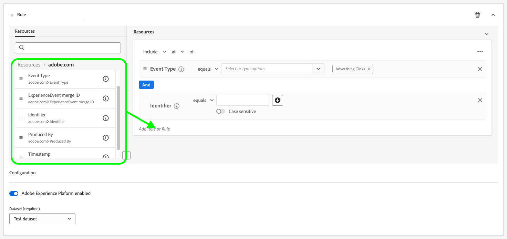
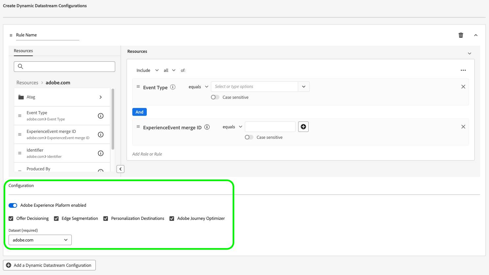

# Criar configurações dinâmicas de sequência de dados

>[!AVAILABILITY]
>
>* A opção para definir configurações de sequência de dados dinâmicas está atualmente no Beta e disponível para um número limitado de clientes. Para receber acesso a essa funcionalidade, entre em contato com o representante da Adobe. A documentação e a funcionalidade estão sujeitas a alterações.

Por padrão, o Edge Network Experience Platform envia todos os eventos que atingem uma sequência de dados para todos os [serviços](configure.md#add-services) de Experience Cloud que você habilitou para suas sequências de dados. Esse nem sempre pode ser o fluxo de trabalho ideal para você, dependendo dos seus casos de uso.

As configurações dinâmicas de sequência de dados resolvem essa preocupação por meio de conjuntos de regras configuráveis pelo usuário, definidos para cada serviço habilitado para sua sequência de dados, que ditam qual solução de Experience Cloud deve receber cada tipo de dados.

## Pré-requisitos {#prerequisites}

Para criar uma configuração dinâmica para seu fluxo de dados, há duas condições que você deve atender:

* Você deve ter criado *pelo menos* uma sequência de dados para trabalhar. Consulte a documentação sobre como [criar uma sequência de dados](configure.md) para obter informações detalhadas.
* Você deve ter *pelo menos* um serviço de Experience Cloud adicionado à sua sequência de dados. Consulte a documentação sobre como [adicionar um serviço](configure.md#add-services) a uma sequência de dados para obter informações detalhadas.

Depois de criar uma sequência de dados e adicionar um serviço Experience Cloud a ela, você pode [criar uma configuração dinâmica](#create-dynamic-configuration).

## Criar uma configuração de sequência de dados dinâmica {#create-dynamic-configuration}

Depois de [criar uma sequência de dados](configure.md) e [adicionar um serviço](configure.md#add-services) a ela, siga as etapas abaixo para adicionar uma configuração dinâmica ao serviço.

1. Vá para a página **[!UICONTROL Coleção de Dados]** > **[!UICONTROL Sequências de Dados]** e selecione a sequência de dados criada.

   

1. Selecione a opção **[!UICONTROL Editar]** no serviço para o qual deseja definir uma configuração dinâmica.

   

1. Na página **[!UICONTROL Configurar]**, selecione **[!UICONTROL Salvar e Editar Configuração Dinâmica]**.

   

1. Selecione **[!UICONTROL Adicionar Configuração Dinâmica]**.

   

1. No painel **[!UICONTROL Recursos]**, arraste e solte os itens com os quais deseja criar sua regra para o lado direito da janela. É possível combinar vários recursos para criar regras complexas.

   Use as opções de cada recurso, como **[!UICONTROL é igual a]**, **[!UICONTROL não é igual a]**, **[!UICONTROL existe]** e muito mais, para ajustar as regras.

   

1. Na seção **[!UICONTROL Configuração]**, alterne os serviços que deseja habilitar ou desabilitar para cada regra, dependendo se deseja que os dados sejam enviados para cada serviço. Se você desativar a alternância, a regra será desabilitada e *todos os dados* serão enviados para o serviço upstream.

   

1. Quando terminar de configurar suas regras, selecione **[!UICONTROL Salvar]**.

## Considerações de prioridade da regra {#considerations}

Você pode definir várias regras para cada configuração dinâmica de sequência de dados. No entanto, se os dados corresponderem às condições de várias regras, somente a primeira regra correspondente na lista será considerada, e todas as outras regras correspondentes serão ignoradas.

Para alcançar o comportamento de roteamento de dados desejado, preste atenção à ordem em que as regras são organizadas.

Para configurar a ordem da regra, arraste e solte as janelas da regra na ordem desejada.

