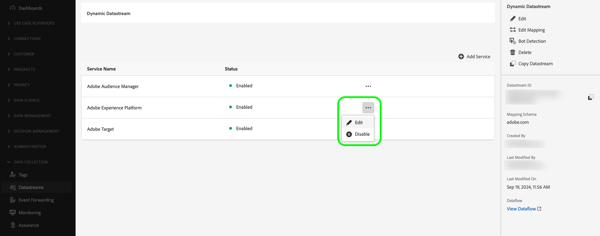
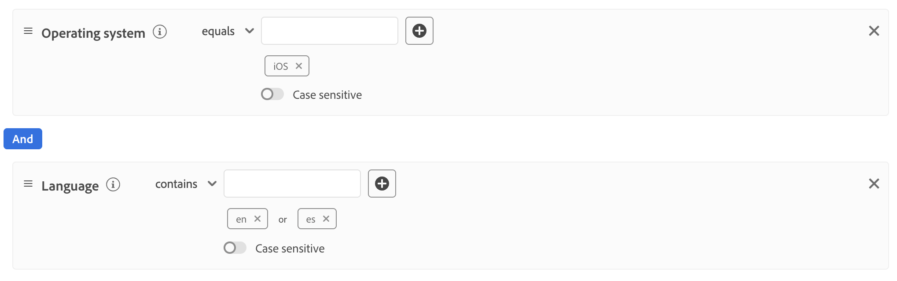

# Criar configurações dinâmicas de sequência de dados

>[!AVAILABILITY]
>
>* A opção para definir configurações de sequência de dados dinâmicas está atualmente no Beta e disponível para um número limitado de clientes. Para receber acesso a essa funcionalidade, entre em contato com o representante da Adobe. A documentação e a funcionalidade estão sujeitas a alterações.

Por padrão, o Experience Platform Edge Network envia todos os eventos que atingem uma sequência de dados para todos os [serviços](configure.md#add-services) do Experience Cloud que você habilitou para suas sequências de dados. Esse nem sempre pode ser o fluxo de trabalho ideal para você, dependendo dos seus casos de uso.

As configurações dinâmicas de sequência de dados resolvem essa preocupação por meio de conjuntos de regras configuráveis pelo usuário, definidos para cada serviço habilitado para sua sequência de dados, que ditam qual solução da Experience Cloud deve receber cada tipo de dados.

## Pré-requisitos {#prerequisites}

Para criar uma configuração dinâmica para seu fluxo de dados, há duas condições que você deve atender:

* Você deve ter criado *pelo menos* uma sequência de dados para trabalhar. Consulte a documentação sobre como [criar uma sequência de dados](configure.md) para obter informações detalhadas.
* Você deve ter *pelo menos* um serviço Experience Cloud adicionado à sua sequência de dados. Consulte a documentação sobre como [adicionar um serviço](configure.md#add-services) a uma sequência de dados para obter informações detalhadas.

Depois de criar uma sequência de dados e adicionar um serviço Experience Cloud a ela, você pode [criar uma configuração dinâmica](#create-dynamic-configuration).

## Medidas de proteção {#guardrails}

As configurações dinâmicas de sequência de dados têm limites específicos e restrições de desempenho para garantir o desempenho ideal do sistema e a eficiência do processamento de dados. As seguintes medidas de proteção se aplicam ao configurar regras de fluxo de dados dinâmicos:

| Grade de Proteção | Limite | Tipo de limite |
|---------|------------|------|
| Número máximo de configurações de sequência de dados dinâmicas por sequência de dados para serviços Experience Platform | 5 | Proteção de desempenho |
| Número máximo de configurações de sequência de dados dinâmicas por sequência de dados para Adobe Analytics | 5 | Proteção de desempenho |
| Número máximo de configurações de sequência de dados dinâmicas por sequência de dados para Adobe Target | 5 | Proteção de desempenho |
| Número máximo de configurações de sequência de dados dinâmicas por sequência de dados para Adobe Audience Manager | 5 | Proteção de desempenho |
| Número máximo de condições (predicados) que podem ser combinadas em uma única regra | 100 | Proteção de desempenho |
| Tempo máximo permitido para avaliar todas as configurações de sequência de dados dinâmicos por sequência de dados antes do tempo limite | 25 ms | Proteção imposta pelo sistema |

## Configurações dinâmicas de sequência de dados versus substituições de configuração de sequência de dados {#dynamic-versus-overrides}

As configurações dinâmicas de sequência de dados e as [substituições de configuração de sequência de dados](overrides.md) são funcionalidades mutuamente exclusivas.

Isso significa que não é possível usar configurações dinâmicas de sequência de dados juntamente com substituições de configuração de sequência de dados. Você deve escolher um ou outro.

Se você habilitar as configurações dinâmicas de sequência de dados e as substituições de configuração de sequência de dados, as substituições de configuração terão prioridade e as regras de configuração dinâmicas de sequência de dados serão ignoradas.

## Criar uma configuração de sequência de dados dinâmica {#create-dynamic-configuration}

Depois de [criar uma sequência de dados](configure.md) e [adicionar um serviço](configure.md#add-services) a ela, siga as etapas abaixo para adicionar uma configuração dinâmica ao serviço.

1. Vá para a página **[!UICONTROL Coleção de Dados]** > **[!UICONTROL Sequências de Dados]** e selecione a sequência de dados criada.

   

1. Selecione a opção **[!UICONTROL Editar]** no serviço para o qual deseja definir uma configuração dinâmica.

   

1. Na página **[!UICONTROL Configurar]**, selecione **[!UICONTROL Salvar e Editar Configuração Dinâmica]**.

   

1. Selecione **[!UICONTROL Adicionar Configuração Dinâmica]**.

   

1. No painel **[!UICONTROL Recursos]**, arraste e solte os itens com os quais deseja criar sua regra para o lado direito da janela. É possível combinar vários recursos para criar regras complexas.

   Use as opções de cada recurso, como **[!UICONTROL é igual a]**, **[!UICONTROL não é igual a]**, **[!UICONTROL existe]** e muito mais, para ajustar as regras.

   

1. Na seção **[!UICONTROL Configuração]**, alterne os serviços que deseja habilitar ou desabilitar para cada regra, dependendo se deseja que os dados sejam enviados para cada serviço. Se você desativar a alternância, o roteamento do serviço será desabilitado e *nenhum dado* será enviado ao serviço upstream.

   

1. Quando terminar de configurar suas regras, selecione **[!UICONTROL Salvar]**.

## Considerações de prioridade da regra {#considerations}

Você pode definir várias regras para cada configuração dinâmica de sequência de dados. No entanto, se os dados corresponderem às condições de várias regras, somente a primeira regra correspondente na lista será considerada, e todas as outras regras correspondentes serão ignoradas.

Para alcançar o comportamento de roteamento de dados desejado, preste atenção à ordem em que as regras são organizadas.

Para configurar a ordem da regra, arraste e solte as janelas da regra na ordem desejada.

## Critérios de elegibilidade da regra {#eligibility-criteria}

As configurações dinâmicas de sequência de dados devem atender a critérios específicos de qualificação para garantir alto desempenho, facilidade de manutenção e clareza. Abaixo estão os principais requisitos e práticas recomendadas para definir regras.

### Tipos de dados compatíveis {#supported-data-types}

As regras de configuração de sequência de dados dinâmicas funcionam com tipos de dados específicos para garantir desempenho ideal e roteamento de dados confiável. Entender quais tipos de dados são compatíveis ajuda a criar regras eficazes que processam seus dados com eficiência.

| Tipo de dados | Status | Notas |
|-----------|--------|-------|
| String | Permitido | - |
| Número (Inteiro, Longo, Curto, Byte) | Permitido | - |
| Enumeração | Permitido | - |
| Booleano | Permitido | - |
| Data | Permitido | - |
| Matriz | Não permitido | As regras baseadas em arrays não são compatíveis, pois podem prejudicar o desempenho. |
| Mapa | Não permitido | Regras baseadas em mapas não são compatíveis, pois podem prejudicar o desempenho. |

### Operadores compatíveis {#supported-operators}

As regras podem usar os seguintes operadores, dependendo do tipo de dados:

| Tipo de dados | Operadores compatíveis |
|-----------|-------------------|
| **String** | `equals`, `starts with`, `ends with`, `contains`, `exists`, `does not equal`, `does not start with`, `does not end with`, `does not contain`, `does not exist` |
| **Número (Longo, Inteiro, Curto, Byte)** | `equals`, `does not equal`, `greater than`, `less than`, `greater than or equal to`, `less than or equal to`, `exists`, `does not exist` |
| **Booleano** | `equals true/false`, `does not equal true/false` |
| **Enumeração** | `equals`, `does not equal`, `exists`, `does not exist` |
| **Data** | `today`, `yesterday`, `this month`, `this year`, `custom date`, `in last`, `from`, `during`, `within`, `before`, `after`, `rolling range`, `in next`, `exists`, `does not exist` |
| **Lógico** | `INCLUDE`, `ANY/ALL` (equivalente a E/OU) |

>[!NOTE]
>
>O operador **[!UICONTROL EXCLUDE]** não é diretamente suportado, mas você pode obter uma lógica equivalente usando **[!UICONTROL INCLUDE]** com operadores de comparação negados (por exemplo, &quot;não é igual&quot;).

### Estrutura da regra {#rule-structure}

Ao criar regras para configurações dinâmicas de sequência de dados, é importante entender os requisitos estruturais que garantem desempenho ideal e compatibilidade do sistema. A estrutura de regras afeta diretamente a eficiência do processamento e do roteamento dos dados pelo sistema.

**Usar somente expressões simples**. Você deve definir regras como expressões lógicas simples. Não há suporte para expressões lógicas aninhadas (usando contêineres ou vários níveis de AND/OR). Se você precisar de uma lógica complexa, divida-a em várias regras simples.

Por exemplo, considere a regra complexa mostrada na imagem abaixo.

Você pode dividir essa regra nas seguintes regras mais simples:

**Evite regras complexas**. Regras mais simples garantem avaliação mais rápida e melhor manutenção.

### Práticas recomendadas {#best-practices}

Seguir as práticas recomendadas ao criar regras de configuração de fluxo de dados dinâmico garante desempenho ideal, confiabilidade do sistema e configurações sustentáveis. Essas diretrizes ajudam você a evitar armadilhas comuns e criar regras eficientes que funcionam perfeitamente com a arquitetura da plataforma.

* **Mantenha as regras simples e simples.** Se você precisa expressar lógica complexa, use várias regras em vez de aninhar.
* **Usar somente [tipos de dados com suporte](#supported-data-types) e [operadores](#supported-operators).**
* **Teste suas regras de desempenho.** Regras muito complexas ou sem suporte podem fazer com que o sistema as rejeite ou afetar o desempenho do sistema.

