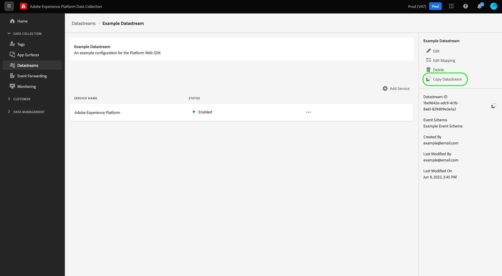

# Criar e configurar sequências de dados

Este documento aborda as etapas para configurar uma [sequência de dados](./overview.md) na interface.

## Acesse o espaço de trabalho [!UICONTROL Sequências de dados] 

Você pode criar e gerenciar sequências de dados na interface da coleção de dados ou da Experience Platform selecionando **[!UICONTROL Sequências de dados]** na navegação à esquerda.

A guia **[!UICONTROL Sequências de dados]** exibe uma lista de sequências de dados existentes, incluindo o nome amigável, a ID e a data da última modificação. Para [exibir seus detalhes e configurar serviços](#view-details), selecione o nome de uma sequência de dados.

Para revelar mais opções para uma sequência de dados específica, selecione o ícone &quot;mais&quot; (**...**). Para atualizar a [configuração básica](#configure) da sequência de dados, selecione **[!UICONTROL Editar]**. Para remover a sequência de dados, selecione **[!UICONTROL Excluir]**.

## Criar um fluxo de dados {#create}

Para criar uma sequência de dados, selecione **[!UICONTROL Nova sequência de dados]**.

O fluxo de trabalho de criação de sequência de dados é exibido, iniciando na etapa de configuração. Aqui, você deve fornecer um nome e uma descrição opcional para a sequência de dados.

Se você configurar uma sequência de dados para uso no Experience Platform e também usar a Web SDK, também deverá selecionar um [esquema do Experience Data Model (XDM) baseado em eventos](../xdm/classes/experienceevent.md) para representar os dados que você planeja assimilar.

### Configurar localização geográfica e pesquisa de rede {#geolocation-network-lookup}

As configurações de geolocalização e pesquisa de rede ajudam a definir o nível de granularidade dos dados geográficos e de nível de rede que você deseja coletar.

Expanda a seção **[!UICONTROL Geolocalização e pesquisa de rede]** para definir as configurações descritas abaixo.

| Configuração | Descrição |
| --- | --- |
| [!UICONTROL Pesquisa geográfica] | Habilita pesquisas de geolocalização para as opções selecionadas com base no endereço IP do visitante. As opções disponíveis incluem: <ul><li>**País**: Popula `xdm.placeContext.geo.countryCode`</li><li>**Código Postal**: Preenche `xdm.placeContext.geo.postalCode`</li><li>**Estado/Província**: Popula `xdm.placeContext.geo.stateProvince`</li><li>**DMA**: preenche `xdm.placeContext.geo.dmaID`</li><li>**Cidade**: Popula `xdm.placeContext.geo.city`</li><li>**Latitude**: preenche `xdm.placeContext.geo._schema.latitude`</li><li>**Longitude**: Preenche `xdm.placeContext.geo._schema.longitude`</li></ul>As opções **[!UICONTROL Cidade]**, **[!UICONTROL Latitude]** e **[!UICONTROL Longitude]** fornecem coordenadas com até duas casas decimais, independentemente de quais outras opções estão selecionadas. Esta é considerada granularidade no nível da cidade.   Se nenhuma opção for selecionada, as pesquisas de geolocalização serão desabilitadas. A geolocalização ocorre antes de [!UICONTROL Ofuscação de IP], o que significa que não é afetada pela configuração [!UICONTROL Ofuscação de IP]. |
| [!UICONTROL Pesquisa de rede] | Ativa pesquisas de rede para as opções selecionadas com base no endereço IP do visitante. As opções disponíveis incluem: <ul><li>**Operadora De Celular**: Preenche `xdm.environment.carrier`</li><li>**Domínio**: Popula `xdm.environment.domain`</li><li>**ISP**: preenche `xdm.environment.ISP`</li><li>**Tipo de Conexão**: Popula `xdm.environment.connectionType`</li></ul> |

Se você habilitar qualquer um dos campos acima para coleta de dados, certifique-se de definir corretamente a propriedade de matriz [`context`](/help/web-sdk/commands/configure/context.md) ao configurar o Web SDK.

Os campos de pesquisa de localização geográfica usam a cadeia de caracteres de matriz `context` `"placeContext"`, enquanto os campos de pesquisa de rede usam a cadeia de caracteres de matriz `context` `"environment"`.

Além disso, verifique se cada campo XDM desejado existe no esquema. Caso contrário, você pode adicionar o grupo de campos `Environment Details` fornecido pela Adobe ao esquema.

### Configurar pesquisa de dispositivo {#geolocation-device-lookup}

As configurações de **[!UICONTROL Pesquisa de Dispositivo]** permitem que você selecione as informações específicas do dispositivo que deseja coletar.

Expanda a seção **[!UICONTROL Pesquisa de Dispositivo]** para definir as configurações descritas abaixo.

>[!IMPORTANT]
>
>As configurações mostradas na tabela abaixo são mutuamente exclusivas. Você não pode selecionar as informações do agente do usuário *e* dados de pesquisa do dispositivo ao mesmo tempo.

| Configuração | Descrição |
| --- | --- |
| **[!UICONTROL Manter cabeçalhos de agente do usuário e dicas do cliente]** | Selecione esta opção para coletar apenas as informações armazenadas na sequência de agente do usuário. Essa configuração é selecionada por padrão. Popula `xdm.environment.browserDetails.userAgent` |
| **[!UICONTROL Use a pesquisa de dispositivo para coletar as seguintes informações]** | Selecione esta opção se quiser coletar uma ou mais das seguintes informações específicas do dispositivo: <ul><li>Informações sobre **[!UICONTROL Dispositivo]**:<ul><li>**Fabricante do dispositivo**: preenche `xdm.device.manufacturer`</li><li>**Modelo do dispositivo**: preenche `xdm.device.modelNumber`</li><li>**Nome do marketing**: preenche `xdm.device.model`</li></ul></li><li>Informações de **[!UICONTROL Hardware]**: <ul><li>**Tipo de hardware**: preenche `xdm.device.type`</li><li>**Altura de exibição**: preenche `xdm.device.screenHeight`</li><li>**Largura de exibição**: preenche `xdm.device.screenWidth`</li><li>**Intensidade de cor de exibição**: preenche `xdm.device.colorDepth`</li></ul></li><li>Informações de **[!UICONTROL Navegador]**: <ul><li>**Fornecedor do navegador**: preenche `xdm.environment.browserDetails.vendor`</li><li>**Nome do navegador**: preenche `xdm.environment.browserDetails.name`</li><li>**Versão do navegador**: preenche `xdm.environment.browserDetails.version`</li></ul></li><li>Informações sobre **[!UICONTROL Sistema operacional]**: <ul><li>**Fornecedor do sistema operacional**: preenche `xdm.environment.operatingSystemVendor`</li><li>**Nome do sistema operacional**: preenche `xdm.environment.operatingSystem`</li><li>**Versão do sistema operacional**: preenche `xdm.environment.operatingSystemVersion`</li></ul></li></ul>As informações de pesquisa de dispositivo não podem ser coletadas junto com o agente do usuário e as dicas do cliente. Optar por coletar informações do dispositivo desativa a coleta de agentes do usuário e dicas do cliente, e vice-versa. |
| **[!UICONTROL Não coletar informações sobre o dispositivo]** | Selecione esta opção se não quiser coletar informações de pesquisa de dispositivo. Nenhum dado de dispositivo, hardware, navegador, sistema operacional, agente do usuário ou dica do cliente é coletado. |

Se você habilitar qualquer um dos campos acima para coleta de dados, certifique-se de definir corretamente a propriedade de matriz [`context`](/help/web-sdk/commands/configure/context.md) ao configurar o Web SDK.

As informações de dispositivo e hardware usam a cadeia de caracteres de matriz `context`, enquanto as informações do navegador e do sistema operacional usam a cadeia de caracteres de matriz `"device"` `context`.`"environment"`

Além disso, verifique se cada campo XDM desejado existe no esquema. Caso contrário, você pode adicionar o grupo de campos `Environment Details` fornecido pela Adobe ao esquema.

### Configurar opções avançadas {#advanced-options}

Para revelar as opções avançadas de configuração, selecione **[!UICONTROL Opções Avançadas]**. Aqui, você pode definir configurações adicionais de sequência de dados, como ofuscação de IP, cookies de ID primária e muito mais.

>[!IMPORTANT]
>
> Você é responsável por garantir que obteve todas as permissões, consentimentos, autorizações e autorizações necessários, exigidos pelas leis e regulamentos aplicáveis, para coletar, processar e transmitir dados pessoais, incluindo informações precisas de geolocalização.
> 
> A seleção de ofuscação de endereço IP não afeta o nível de informações de geolocalização derivadas do endereço IP e enviadas para as soluções configuradas da Adobe. As pesquisas de geolocalização devem ser limitadas ou desabilitadas separadamente.

| Configuração | Descrição |
| --- | --- |
| [!UICONTROL Ofuscação de IP] | Indica o tipo de ofuscação de IP a ser aplicada à sequência de dados. Qualquer processamento baseado no IP do cliente é afetado pela configuração de ofuscação de IP. Isso inclui todos os serviços da Experience Cloud que recebem dados do seu fluxo de dados. A ofuscação de IP ocorre antes que os eventos sejam enviados para qualquer serviço downstream, como o Preparo de dados. 
Opções disponíveis:
 <ul><li>**[!UICONTROL Nenhuma]**: desabilita a ofuscação de IP. O endereço IP completo do usuário é enviado por meio do fluxo de dados.</li><li>**[!UICONTROL Parcial]**: para endereços IPv4, ofusca o último octeto do endereço IP do usuário. Para endereços IPv6, ofusca os últimos 80 bits do endereço. 
Exemplos:
 <ul><li>ipv4: `1.2.3.4` -> `1.2.3.0`</li><li>ipv6: `2001:0db8:1345:fd27:0000:ff00:0042:8329` -> `2001:0db8:1345:0000:0000:0000:0000:0000`</li></ul></li><li>**[!UICONTROL Completa]**: ofusca todo o endereço IP. 
Exemplos:
 <ul><li>ipv4: `1.2.3.4` -> `0.0.0.0`</li><li>ipv6: `2001:0db8:1345:fd27:0000:ff00:0042:8329` -> `0:0:0:0:0:0:0:0`</li></ul></li></ul> Impacto da ofuscação de IP em outros produtos da Adobe: <ul><li>**Adobe Target**: a [!UICONTROL ofuscação de IP] no nível de sequência de dados é aplicada antes da [!UICONTROL ofuscação de IP] executada no Adobe Target, a todos os endereços IP presentes na solicitação. Por exemplo, se a opção de ofuscação de IP no nível de sequência de dados [!UICONTROL estiver definida como &#x200B;]Completa **[!UICONTROL e a opção de ofuscação de IP do Adobe Target estiver definida como]**&#x200B;Última ofuscação de octeto **[!UICONTROL , o Adobe Target receberá um IP totalmente ofuscado.]** Se a opção de ofuscação de IP [!UICONTROL nível de sequência de dados] estiver definida como **[!UICONTROL Partial]** e a opção de ofuscação de IP do Adobe Target estiver definida como **[!UICONTROL Full]**, o Adobe Target receberá um IP parcialmente ofuscado e aplicará a ofuscação completa a ele. A ofuscação de IP do Adobe Target é gerenciada independentemente da sequência de dados. Consulte a documentação do Adobe Target sobre [ofuscação de IP](https://experienceleague.adobe.com/docs/target-dev/developer/implementation/privacy/privacy.html) e [geolocalização](https://experienceleague.adobe.com/docs/target/using/audiences/create-audiences/categories-audiences/geo.html) para obter mais detalhes.</li><li>**Audience Manager**: a configuração [!UICONTROL ofuscação de IP] no nível de sequência de dados é aplicada antes da [!UICONTROL ofuscação de IP] executada no Audience Manager, a todos os endereços IP presentes na solicitação. Qualquer pesquisa de geolocalização feita pelo Audience Manager é afetada pela opção de [!UICONTROL ofuscação de IP] no nível da sequência de dados. Uma pesquisa de geolocalização no Audience Manager, com base em um IP totalmente ofuscado, resulta em uma região desconhecida e quaisquer segmentos baseados nos dados de geolocalização resultantes não são realizados. Consulte a documentação do Audience Manager sobre [ofuscação de IP](https://experienceleague.adobe.com/docs/audience-manager/user-guide/features/administration/ip-obfuscation.html) para obter mais detalhes.</li><li>**Adobe Analytics**: se a configuração de ofuscação de IP no nível de sequência de dados estiver definida como **[!UICONTROL Full]**, a Adobe Analytics tratará o endereço IP como em branco. Isso afeta qualquer processamento do Analytics que dependa do endereço IP, como pesquisas de geolocalização e filtragem de IP. Para que o Analytics receba endereços IP não ofuscados ou parcialmente ofuscados, defina a configuração de ofuscação de IP como **[!UICONTROL Parcial]** ou **[!UICONTROL Nenhum]**. Endereços IP parcialmente ofuscados e não ofuscados podem ser ofuscados no Analytics. Consulte a [documentação](https://experienceleague.adobe.com/docs/analytics/admin/admin-tools/manage-report-suites/edit-report-suite/report-suite-general/general-acct-settings-admin.html?lang=pt-BR) do Adobe Analytics para obter detalhes sobre como habilitar a ofuscação de IP no Analytics. Se o endereço IP estiver totalmente ofuscado e a ocorrência da página não tiver [!DNL ECID] nem [!DNL VisitorID], o Analytics descartará a ocorrência, em vez de gerar uma [ID de Fallback](https://experienceleague.adobe.com/docs/id-service/using/reference/analytics-reference/analytics-ids.html?lang=en), que é parcialmente baseada no endereço IP.</li></ul> |
| [!UICONTROL Cookie de ID próprio] | Quando habilitada, essa configuração orienta a rede de borda a buscar um cookie específico ao procurar uma [ID de dispositivo primária](../web-sdk/identity/first-party-device-ids.md), em vez de pesquisar esse valor no mapa de identidade.  Ao habilitar esta configuração, você deve fornecer o nome do cookie que deve armazenar a ID. |
| [!UICONTROL Sincronização de ID de terceiros] | As sincronizações de ID podem ser agrupadas em containers para permitir que diferentes sincronizações de ID sejam executadas em momentos diferentes. Quando habilitada, essa configuração permite especificar qual container de sincronizações de ID é executado para essa sequência de dados. |
| [!UICONTROL ID de container de sincronização de ID de terceiros] | A ID numérica do container a ser usada para a sincronização de ID de terceiros. |
| [!UICONTROL Substituições de ID de container] | Nesta seção, é possível definir IDs adicionais de contêiner de sincronização de ID de terceiros que você pode usar para substituir o padrão. |
| [!UICONTROL Tipo de acesso] | Define o tipo de autenticação que a rede de borda aceita para a sequência de dados. <ul><li>**[!UICONTROL Autenticação mista]**: quando essa opção é selecionada, a rede de borda aceita solicitações autenticadas e não autenticadas. Selecione esta opção quando você planeja usar o Web SDK ou o [SDK móvel](https://developer.adobe.com/client-sdks/home/), juntamente com a [API do Edge Network](https://developer.adobe.com/data-collection-apis/docs/api/). </li><li>**[!UICONTROL Somente autenticado]**: quando essa opção é selecionada, a rede de borda aceita somente solicitações autenticadas. Selecione essa opção quando planejar usar somente a API do Edge Network e quiser impedir que solicitações não autenticadas sejam processadas pela Edge Network.</li></ul> |
| [!UICONTROL Media Analytics] | Habilita o processamento de dados de rastreamento de streaming para a integração do Edge Network via SDKs do Experience Platform ou [API do Media Edge](https://developer.adobe.com/cja-apis/docs/endpoints/media-edge/getting-started/). Saiba mais sobre o Media Analytics na [documentação](https://experienceleague.adobe.com/docs/media-analytics/using/media-overview.html?lang=pt-BR). |

Daqui, se você estiver configurando sua sequência de dados para o Experience Platform, siga o tutorial em [Preparação de dados para coleção de dados](./data-prep.md) para mapear seus dados para um esquema de evento do Experience Platform antes de retornar a este guia. Caso contrário, selecione **[!UICONTROL Salvar]** e continue para a próxima seção.

## Exibir detalhes da sequência de dados {#view-details}

Depois de configurar uma nova sequência de dados ou selecionar uma existente para exibir, a página de detalhes dessa sequência de dados é exibida. Aqui você pode encontrar mais informações sobre a sequência de dados, incluindo a ID.

Na tela de detalhes da sequência de dados, é possível [adicionar serviços](#add-services) para habilitar recursos dos produtos da Adobe Experience Cloud aos quais você tem acesso. Também é possível editar a [configuração básica](#create) da sequência de dados, atualizar as [regras de mapeamento](./data-prep.md), [copiar a sequência de dados](#copy) ou excluí-la completamente.

## Adicionar serviços a uma sequência de dados {#add-services}

Na página de detalhes de uma sequência de dados, selecione **[!UICONTROL Adicionar serviço]** para começar a adicionar os serviços disponíveis para essa sequência de dados.

Na próxima tela, use o menu suspenso para selecionar um serviço a ser configurado para essa sequência de dados. Somente os serviços aos quais você tem acesso são mostrados nesta lista.

Selecione o serviço desejado, preencha as opções de configuração exibidas e selecione **[!UICONTROL Salvar]** para adicionar o serviço à sequência de dados. Todos os serviços adicionados aparecem nos detalhes da sequência de dados.

As subseções abaixo descrevem as opções de configuração para cada serviço.

>[!NOTE]
>
>Cada configuração de serviço contém um botão de alternância **[!UICONTROL Habilitado]** que é ativado automaticamente quando o serviço é selecionado. Para desabilitar o serviço selecionado para essa sequência de dados, clique no botão de alternância **[!UICONTROL Habilitado]** novamente.

### Configurações do Adobe Analytics {#analytics}

Esse serviço controla se e como os dados são enviados para o Adobe Analytics. Consulte [Enviando dados para o Adobe Analytics](/help/web-sdk/use-cases/adobe-analytics.md).

| Configuração | Descrição |
| --- | --- |
| [!UICONTROL ID de conjunto de relatórios] | **(Obrigatório)** A ID do conjunto de relatórios do Analytics para o qual você deseja enviar dados. Essa ID pode ser encontrada na interface do Adobe Analytics em [!UICONTROL Admin] > [!UICONTROL Conjuntos de relatórios]. Se vários conjuntos de relatórios forem especificados, os dados serão copiados para cada um deles. |
| [!UICONTROL Namespace de ID do visitante] | (Opcional) O namespace que você deseja usar para a Adobe Analytics [visitorID](https://experienceleague.adobe.com/docs/analytics/implementation/vars/config-vars/visitorid.html?lang=pt-BR). Ao enviar um evento com um valor especificado para esse namespace, ele será usado automaticamente como o `visitorID` no Analytics. |
| [!UICONTROL Substituições do conjunto de relatórios] | Nesta seção, você pode adicionar outras IDs de conjunto de relatórios que podem ser usadas para substituir a padrão. |

### Configurações do Adobe Audience Manager {#audience-manager}

Esse serviço controla se e como os dados são enviados para o Adobe Audience Manager. Tudo o que é necessário para enviar dados ao Audience Manager é habilitar esta seção. As outras configurações são opcionais, mas são incentivadas.

| Configuração | Descrição |
| --- | --- |
| [!UICONTROL Destinos de cookies habilitados] | Permite que o SDK compartilhe informações de segmento por meio dos [destinos de cookies](https://experienceleague.adobe.com/docs/audience-manager/user-guide/features/destinations/custom-destinations/create-cookie-destination.html?lang=pt-BR) do [!DNL Audience Manager]. |
| [!UICONTROL Destinos de URL habilitados] | Permite que o SDK compartilhe informações de segmento por meio dos [destinos de URL](https://experienceleague.adobe.com/docs/audience-manager/user-guide/features/destinations/custom-destinations/create-url-destination.html?lang=pt-BR) do [!DNL Audience Manager]. |

### Configurações da Adobe Experience Platform {#aep}

>[!IMPORTANT]
>
>Ao ativar um fluxo de dados para o Experience Platform, anote a sandbox da Experience Platform que você está usando no momento, como exibida na faixa superior da interface do usuário.
>
>
>
>As sandboxes são partições virtuais na Adobe Experience Platform que permitem isolar os dados e as implementações de outras pessoas em sua organização. Depois que uma sequência de dados é criada, sua sandbox não pode ser alterada. Para obter mais detalhes sobre a função das sandboxes na Experience Platform, consulte a [documentação das sandboxes](../sandboxes/home.md).

Esse serviço controla se e como os dados são enviados para a Adobe Experience Platform.

| Configuração | Descrição |
|---| --- |
| [!UICONTROL Conjunto de dados do evento] | **(Obrigatório)** Selecione o conjunto de dados do Experience Platform para o qual os dados do evento do cliente serão transmitidos. Este esquema deve usar a [classe XDM ExperienceEvent](../xdm/classes/experienceevent.md). Para adicionar outros conjuntos de dados, selecione **[!UICONTROL Adicionar conjunto de dados do evento]**. |
| [!UICONTROL Conjunto de dados do perfil] | Selecione o conjunto de dados do Experience Platform que será usado para enviar **atributos do cliente de consentimento**, **tokens de push** e **região de atividade do usuário**. Este esquema deve usar a [classe de perfil individual XDM](../xdm/classes/individual-profile.md). |
| [!UICONTROL Offer Decisioning] | Habilita implementações do Offer Decisioning para Web SDK. Consulte o guia sobre [uso do Offer Decisioning com Web SDK](../web-sdk/personalization/offer-decisioning/offer-decisioning-overview.md) para obter mais detalhes sobre a implementação.  Para obter mais informações sobre os recursos do Offer Decisioning, consulte a [documentação do Adobe Journey Optimizer](https://experienceleague.adobe.com/docs/journey-optimizer/using/offer-decisioning/get-started-decision/starting-offer-decisioning.html?lang=pt-BR). |
| [!UICONTROL Segmentação de borda] | Habilita a [segmentação de borda](../segmentation/methods/edge-segmentation.md) para esta sequência de dados. Quando a [Web SDK](../web-sdk/home.md) ou a [API Edge Network](https://developer.adobe.com/data-collection-apis/docs/api/) envia dados por meio de uma sequência de dados com segmentação de borda habilitada, todas as associações de público-alvo atualizadas para o perfil em questão são enviadas de volta na resposta.  Você pode usar esta opção em combinação com **Destinos do Personalization** para casos de uso de personalização de mesma página e próxima página por meio de [destinos de borda](../destinations/ui/activate-edge-personalization-destinations.md), [Offer Decisioning](https://experienceleague.adobe.com/pt-br/docs/journey-optimizer/using/decisioning/offer-decisioning/get-started-decision/starting-offer-decisioning), [Adobe Target](https://experienceleague.adobe.com/en/docs/target) ou [Adobe Journey Optimizer](https://experienceleague.adobe.com/pt-br/docs/journey-optimizer/using/ajo-home) |
| [!UICONTROL Destinos de personalização] | Habilita o [Personalization personalizado](../destinations/catalog/personalization/custom-personalization.md) para esta sequência de dados. Quando a [Web SDK](../web-sdk/home.md) ou a [API do Edge Network](https://developer.adobe.com/data-collection-apis/docs/api/) envia dados por meio de uma sequência de dados com destinos de personalização habilitados, as associações de público-alvo e os atributos de perfil mapeados (somente para solicitações autenticadas da [API do Edge Network](https://developer.adobe.com/data-collection-apis/docs/api/)) para o perfil em questão são enviados de volta na resposta. |
| [!UICONTROL Adobe Journey Optimizer] | Habilita [Adobe Journey Optimizer](https://experienceleague.adobe.com/pt-br/docs/journey-optimizer/using/ajo-home) para esta sequência de dados.  Habilitar essa opção permite que a sequência de dados retorne conteúdo personalizado de campanhas de entrada baseadas na Web e em aplicativo no Adobe Journey Optimizer.  Esta opção requer que o conjunto de dados selecionado use um esquema que inclua o **[!UICONTROL Evento de Experiência - Interações de Apresentação]** [grupo de campos](../xdm/ui/resources/schemas.md#add-field-groups). Este grupo de campos é usado para registrar todas as interações do usuário com campanhas e experiências do Adobe Journey Optimizer. |

### Configurações do Adobe Target {#target}

Esse serviço controla se e como os dados são enviados para o Adobe Target.

| Configuração | Descrição |
| --- | --- |
| [!UICONTROL Token de propriedade] | [!DNL Target] permite que os clientes controlem permissões usando propriedades. Para obter mais informações sobre propriedades, consulte o guia de [configuração de permissões empresariais](https://experienceleague.adobe.com/docs/target/using/administer/manage-users/enterprise/properties-overview.html?lang=pt-BR) na documentação do [!DNL Target].  O token de propriedade pode ser encontrado na interface do Adobe Target em [!UICONTROL Configuração] > [!UICONTROL Propriedades]. |
| [!UICONTROL ID de ambiente do Target] | Os [ambientes do Adobe Target](https://experienceleague.adobe.com/docs/target/using/administer/hosts.html?lang=pt-BR) ajudam você a gerenciar a implementação em todos os estágios de desenvolvimento. Essa configuração especifica qual ambiente você usará com essa sequência de dados.  A prática recomendada é definir isso de forma diferente para cada um dos ambientes de `dev`, `stage` e `prod` da sequência de dados, a fim de simplificar as coisas. No entanto, se você já tiver ambientes do Adobe Target definidos, poderá usá-los. |
| [!UICONTROL Namespace da ID de terceiros do Target] | O namespace de identidade do `mbox3rdPartyId` que você deseja usar para esta sequência de dados. Se você usar uma integração do [!DNL Customer Attributes] com o Adobe Target ou usar o `thirdPartyId` para atualizar ou criar perfis por meio da [API de Perfis do Adobe Target](https://experienceleague.adobe.com/en/docs/target-dev/developer/api/profile-apis/profiles-api), deverá fornecer um valor de namespace de sua escolha. Você deve usar esse namespace na seção `IdentityMap` do esquema XDM para enviar o `customerID` ou `thirdPartyId` usado em seus carregamentos de arquivo de Atributos do cliente ou em suas chamadas de API de Atualização de perfil.  Consulte o guia de [implementação do `mbox3rdPartyId` com o SDK da Web](../web-sdk/personalization/adobe-target/using-mbox-3rdpartyid.md) para obter mais informações. |
| [!UICONTROL Substituições do token de propriedade] | Nesta seção, você pode definir tokens de propriedade adicionais que podem ser usados para substituir o padrão. |

### Configurações de [!UICONTROL encaminhamento de eventos]

Este serviço controla se e como os dados são enviados para o [encaminhamento de eventos](../tags/ui/event-forwarding/overview.md).

| Configuração | Descrição |
| --- | --- |
| [!UICONTROL Propriedade de inicialização] | **(Obrigatório)** A propriedade de encaminhamento de eventos para a qual você deseja enviar dados. |
| [!UICONTROL Ambiente de inicialização] | **(Obrigatório)** O ambiente na propriedade selecionada para o qual você deseja enviar dados. |

>[!NOTE]
>
>É possível selecionar a opção **[!UICONTROL Inserir IDs manualmente]** para digitar os nomes da propriedade e do ambiente em vez de usar os menus suspensos.

## Copiar uma sequência de dados {#copy}

É possível criar uma cópia de uma sequência de dados existente e alterar seus detalhes conforme necessário.

>[!NOTE]
>
>As sequências de dados só podem ser copiadas na mesma [sandbox](../sandboxes/home.md). Em outras palavras, não é possível copiar uma sequência de dados de uma sandbox para outra.

Na página principal do espaço de trabalho [!UICONTROL Sequências de dados], clique no ícone de reticências (**...**) da sequência de dados em questão e selecione **[!UICONTROL Copiar]**.

Como alternativa, você pode selecionar **[!UICONTROL Copiar sequência de dados]** na exibição de detalhes de uma determinada sequência de dados.

Uma caixa de diálogo de confirmação é exibida, solicitando que você forneça um nome exclusivo para a nova sequência de dados a ser criada, juntamente com detalhes sobre as opções de configuração que serão copiadas. Quando tudo estiver pronto, selecione **[!UICONTROL Copiar]**.

A página principal do espaço de trabalho [!UICONTROL Sequências de dados] será exibida novamente com a nova sequência de dados listada.

## Próximas etapas

Este manual abordou como gerenciar sequências de dados na interface da coleção de dados. Para obter mais informações sobre como instalar e configurar o SDK da Web após configurar uma sequência de dados, consulte o [Manual da coleção de dados E2E](../collection/e2e.md#install).
