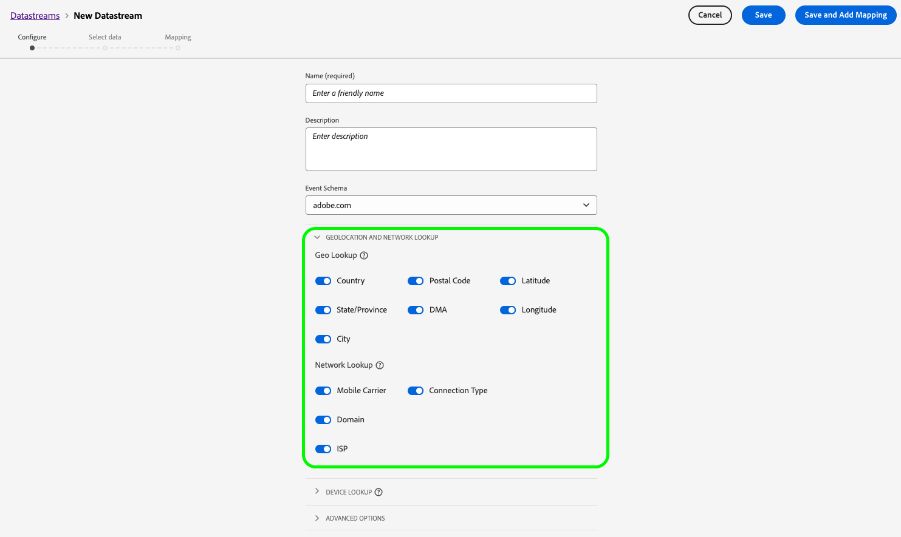

# Criar e configurar sequências de dados

Este documento aborda as etapas para configurar uma [sequência de dados](./overview.md) na interface.

## Acesse o espaço de trabalho [!UICONTROL Sequências de dados] 

Você pode criar e gerenciar sequências de dados na interface da coleção de dados ou da Experience Platform selecionando **[!UICONTROL Sequências de dados]** na navegação à esquerda.

A guia **[!UICONTROL Sequências de dados]** exibe uma lista de sequências de dados existentes, incluindo o nome amigável, a ID e a data da última modificação. Selecione o nome de uma sequência de dados para [ver os detalhes e configurar serviços](#view-details).

Selecione o ícone “mais” (**...**) para exibir outras opções de uma sequência de dados específica. Selecione **[!UICONTROL Editar]** para atualizar a [configuração básica](#configure) da sequência de dados ou **[!UICONTROL Excluir]** para remover a sequência de dados.

## Criar uma nova sequência de dados {#create}

Para criar uma sequência de dados, selecione **[!UICONTROL Nova sequência de dados]**.

O fluxo de trabalho de criação de sequência de dados é exibido, iniciando na etapa de configuração. Aqui, você deve fornecer um nome e uma descrição opcional para a sequência de dados.

Se estiver configurando essa sequência de dados para usar na Experience Platform e estiver utilizando o SDK web da Platform, você também deve selecionar um [esquema do Experience Data Model (XDM) baseado em eventos](../xdm/classes/experienceevent.md) para representar os dados que planeja assimilar.

### Configurar localização geográfica e pesquisa de rede {#geolocation-network-lookup}

As configurações de geolocalização e pesquisa de rede ajudam a definir o nível de granularidade dos dados geográficos e de nível de rede que você deseja coletar.

Expanda a **[!UICONTROL Localização geográfica e pesquisa de rede]** para definir as configurações descritas abaixo.

| Configuração | Descrição |
| --- | --- |
| [!UICONTROL Pesquisa geográfica] | Habilita pesquisas de geolocalização para as opções selecionadas com base no endereço IP do visitante. As opções disponíveis incluem: <ul><li>**País**: Popula `xdm.placeContext.geo.countryCode`</li><li>**Código postal**: Popula `xdm.placeContext.geo.postalCode`</li><li>**Estado/Província**: Popula `xdm.placeContext.geo.stateProvince`</li><li>**DMA**: Popula `xdm.placeContext.geo.dmaID`</li><li>**Cidade**: Popula `xdm.placeContext.geo.city`</li><li>**Latitude**: Popula `xdm.placeContext.geo._schema.latitude`</li><li>**Longitude**: Popula `xdm.placeContext.geo._schema.longitude`</li></ul>As opções **[!UICONTROL Cidade]**, **[!UICONTROL Latitude]** e **[!UICONTROL Longitude]** fornecem coordenadas com até duas casas decimais, independentemente de quais outras opções estão selecionadas. Essa é considerada uma granularidade no nível da cidade.   Não selecionar nenhuma opção desativa pesquisas de geolocalização. A geolocalização ocorre antes de [!UICONTROL Ofuscação de IP], o que significa que não será afetado pelo [!UICONTROL Ofuscação de IP] configuração. |
| [!UICONTROL Pesquisa de rede] | Ativa pesquisas de rede para as opções selecionadas com base no endereço IP do visitante. As opções disponíveis incluem: <ul><li>**Operadora**: Popula `xdm.environment.carrier`</li><li>**Domínio**: Popula `xdm.environment.domain`</li><li>**ISP**: Popula `xdm.environment.ISP`</li></ul> |

Se você ativar qualquer um dos campos acima para a coleta de dados, defina corretamente a variável [`context`](../edge/data-collection/automatic-information.md) propriedade de matriz quando [configuração do SDK da Web](../edge/fundamentals/configuring-the-sdk.md).

Os campos de pesquisa de geolocalização usam o `context` sequência de caracteres de matriz `"placeContext"`, enquanto os campos de pesquisa de rede usam a variável `context` sequência de caracteres de matriz `"environment"`.

Além disso, verifique se cada campo XDM desejado existe no esquema. Caso contrário, você pode adicionar o plug-in fornecido pela Adobe `Environment Details` grupo de campos ao seu esquema.

### Configurar pesquisa de dispositivo {#geolocation-device-lookup}

A variável **[!UICONTROL Pesquisa de dispositivo]** As configurações do permitem selecionar informações específicas do dispositivo que você deseja coletar.

Expanda a **[!UICONTROL Pesquisa de dispositivo]** para definir as configurações descritas abaixo.

>[!IMPORTANT]
>
>As configurações descritas na tabela abaixo são mutuamente exclusivas. Não é possível selecionar as informações do agente do usuário e os dados de pesquisa do dispositivo ao mesmo tempo.

| Configuração | Descrição |
| --- | --- |
| **[!UICONTROL Manter cabeçalhos do agente do usuário e das dicas do cliente]** | Selecione esta opção para coletar apenas as informações armazenadas na sequência de agente do usuário. Essa configuração é selecionada por padrão. Preenche `xdm.environment.browserDetails.userAgent` |
| **[!UICONTROL Use a pesquisa de dispositivo para coletar as seguintes informações]** | Selecione esta opção se quiser coletar uma ou mais das seguintes informações específicas do dispositivo: <ul><li>**[!UICONTROL Dispositivo]** informações:<ul><li>**Fabricante do dispositivo**: Popula `xdm.device.manufacturer`</li><li>**Modelo do dispositivo**: Popula `xdm.device.modelNumber`</li><li>**Nome de marketing**: Popula `xdm.device.model`</li></ul></li><li>**[!UICONTROL Hardware]** informações: <ul><li>**Tipo de hardware**: Popula `xdm.device.type`</li><li>**Altura da exibição**: Popula `xdm.device.screenHeight`</li><li>**Largura da exibição**: Popula `xdm.device.screenWidth`</li><li>**Exibir intensidade de cor**: Popula `xdm.device.colorDepth`</li></ul></li><li>**[!UICONTROL Navegador]** informações: <ul><li>**Fornecedor do navegador**: Popula `xdm.environment.browserDetails.vendor`</li><li>**Nome do navegador**: Popula `xdm.environment.browserDetails.name`</li><li>**Versão do navegador**: Popula `xdm.environment.browserDetails.version`</li></ul></li><li>**[!UICONTROL Sistema operacional]** informações: <ul><li>**Fornecedor do sistema operacional**: Popula `xdm.environment.operatingSystemVendor`</li><li>**Nome do sistema operacional**: Popula `xdm.environment.operatingSystem`</li><li>**Versão do sistema operacional**: Popula `xdm.environment.operatingSystemVersion`</li></ul></li></ul>As informações de pesquisa de dispositivo não podem ser coletadas junto com o agente do usuário e as dicas do cliente. Optar por coletar informações do dispositivo desativa a coleta de agentes do usuário e dicas do cliente, e vice-versa. |
| **[!UICONTROL Não coletar informações do dispositivo]** | Selecione esta opção se não quiser coletar informações de pesquisa de dispositivo. Nenhum dado de dispositivo, hardware, navegador, sistema operacional, agente do usuário ou dica do cliente é coletado. |

Se você ativar qualquer um dos campos acima para a coleta de dados, defina corretamente a variável [`context`](../edge/data-collection/automatic-information.md) propriedade de matriz quando [configuração do SDK da Web](../edge/fundamentals/configuring-the-sdk.md).

As informações do dispositivo e do hardware usam o `context` sequência de caracteres de matriz `"device"`, enquanto as informações do navegador e do sistema operacional usam o `context` sequência de caracteres de matriz `"environment"`.

Além disso, verifique se cada campo XDM desejado existe no esquema. Caso contrário, você pode adicionar o plug-in fornecido pela Adobe `Environment Details` grupo de campos ao seu esquema.

### Configurar opções avançadas {#@advanced-options}

Selecionar **[!UICONTROL Opções avançadas]** para revelar controles adicionais para configurar o fluxo de dados, como ofuscação de IP, cookies de ID primária e muito mais.

>[!IMPORTANT]
>
> Você é responsável por garantir que foram obtidas todas as permissões, consentimentos, liberações e autorizações necessários, exigidos pelas leis e regulamentos aplicáveis, para coletar, processar e transmitir dados pessoais, incluindo informações precisas de geolocalização.
> 
> A seleção de ofuscação do endereço IP não afeta o nível das informações de geolocalização que serão derivadas do endereço IP e enviadas para as soluções da Adobe configuradas. As pesquisas de geolocalização devem ser limitadas ou desabilitadas separadamente.

| Configuração | Descrição |
| --- | --- |
| [!UICONTROL Ofuscação de IP] | Indica o tipo de ofuscação de IP a ser aplicada à sequência de dados. Qualquer processamento baseado no IP do cliente será afetado pela configuração de ofuscação de IP. Isso inclui todos os serviços da Experience Cloud que recebem dados de sua sequência de dados. 
Opções disponíveis:
 <ul><li>**[!UICONTROL Nenhuma]**: desabilita a ofuscação de IP. O endereço IP completo do usuário será enviado por meio da sequência de dados.</li><li>**[!UICONTROL Parcial]**: para endereços IPv4, ofusca o último octeto do endereço IP do usuário. Para endereços IPv6, ofusca os últimos 80 bits do endereço. 
Exemplos:
 <ul><li>ipv4: `1.2.3.4` -> `1.2.3.0`</li><li>ipv6: `2001:0db8:1345:fd27:0000:ff00:0042:8329` -> `2001:0db8:1345:0000:0000:0000:0000:0000`</li></ul></li><li>**[!UICONTROL Completa]**: ofusca todo o endereço IP. 
Exemplos:
 <ul><li>ipv4: `1.2.3.4` -> `0.0.0.0`</li><li>ipv6: `2001:0db8:1345:fd27:0000:ff00:0042:8329` -> `0:0:0:0:0:0:0:0`</li></ul></li></ul> Impacto da ofuscação de IP em outros produtos da Adobe: <ul><li>**Adobe Target**: o nível do fluxo de dados [!UICONTROL Ofuscação de IP] é aplicado antes de [!UICONTROL Ofuscação de IP] executado no Adobe Target, a todos os endereços IP presentes na solicitação. Por exemplo, se o nível de fluxo de dados [!UICONTROL Ofuscação de IP] está definida como **[!UICONTROL Completo]** e a opção de ofuscação de IP do Adobe Target estiver definida como **[!UICONTROL Ofuscação do último octeto]**, o Adobe Target recebe um IP totalmente ofuscado. Se o nível do fluxo de dados [!UICONTROL Ofuscação de IP] está definida como **[!UICONTROL Parcial]** e a opção de ofuscação de IP do Adobe Target estiver definida como **[!UICONTROL Completo]**, o Adobe Target recebe um IP parcialmente ofuscado e aplica a ofuscação completa a ele. A ofuscação de IP do Adobe Target é gerenciada independentemente da sequência de dados. Consulte a documentação do Adobe Target sobre [ofuscação de IP](https://developer.adobe.com/target/before-implement/privacy/privacy/) e [geolocalização](https://experienceleague.adobe.com/docs/target/using/audiences/create-audiences/categories-audiences/geo.html?lang=pt-BR) para obter mais detalhes.</li><li>**Audience Manager**: o nível do fluxo de dados [!UICONTROL Ofuscação de IP] é aplicada antes da variável [!UICONTROL Ofuscação de IP] executado no Audience Manager, para todos os endereços IP presentes na solicitação. Qualquer pesquisa de geolocalização feita pelo Audience Manager é afetada pela opção de [!UICONTROL ofuscação de IP] no nível da sequência de dados. No Audience Manager, uma pesquisa de geolocalização que é baseada em um IP totalmente ofuscado resultará em uma região desconhecida, e todos os segmentos baseados nos dados de geolocalização resultantes não serão realizados. Consulte a documentação do Audience Manager sobre [ofuscação de IP](https://experienceleague.adobe.com/docs/audience-manager/user-guide/features/administration/ip-obfuscation.html?lang=pt-BR) para obter mais detalhes.</li><li>**Adobe Analytics**: no momento, o Adobe Analytics recebe os endereços IP parcialmente ofuscados se qualquer opção de ofuscação de IP estiver selecionada, com a exceção da opção NENHUMA. Para que o Analytics receba endereços IP ofuscados, você deve configurar a ofuscação de IP separadamente no Adobe Analytics. Esse comportamento será atualizado em versões futuras. Consulte a [documentação](https://experienceleague.adobe.com/docs/analytics/admin/admin-tools/manage-report-suites/edit-report-suite/report-suite-general/general-acct-settings-admin.html?lang=pt-BR) do Adobe Analytics para obter detalhes sobre como habilitar a ofuscação de IP no Analytics.</li></ul> |
| [!UICONTROL Cookie de ID próprio] | Quando habilitada, essa configuração orienta a rede de borda a buscar um cookie específico ao procurar uma [ID de dispositivo primária](../edge/identity/first-party-device-ids.md), em vez de pesquisar esse valor no mapa de identidade.  Ao habilitar essa configuração, é necessário fornecer o nome do cookie no qual a ID deve ser armazenada. |
| [!UICONTROL Sincronização de ID de terceiros] | As sincronizações de ID podem ser agrupadas em containers para permitir que diferentes sincronizações de ID sejam executadas em momentos diferentes. Quando habilitada, essa configuração permite especificar qual container de sincronizações de ID é executado para essa sequência de dados. |
| [!UICONTROL ID de container de sincronização de ID de terceiros] | A ID numérica do container a ser usada para a sincronização de ID de terceiros. |
| [!UICONTROL Substituições de ID de container] | Nesta seção, você pode definir IDs de container de sincronização de ID de terceiros adicionais que você pode usar para substituir o padrão. |
| [!UICONTROL Tipo de acesso] | Define o tipo de autenticação que a rede de borda aceita para a sequência de dados. <ul><li>**[!UICONTROL Autenticação mista]**: quando essa opção é selecionada, a rede de borda aceita solicitações autenticadas e não autenticadas. Selecione esta opção quando desejar usar o SDK da Web ou [SDK móvel](https://developer.adobe.com/client-sdks/documentation/) juntamente com a [API do servidor](../server-api/overview.md). </li><li>**[!UICONTROL Somente autenticado]**: quando essa opção é selecionada, a rede de borda aceita somente solicitações autenticadas. Selecione essa opção quando desejar usar somente a API do servidor e quiser impedir que qualquer solicitação não autenticada seja processada pela rede de borda.</li></ul> |
| [!UICONTROL Media Analytics] | Selecione essa opção para habilitar o processamento de dados de rastreamento de transmissão para integração da Rede de borda por meio de SDKs do Experience Platform ou API do Media Edge. Saiba mais sobre o Media Analytics no [documentação](https://experienceleague.adobe.com/docs/media-analytics/using/media-overview.html?lang=pt-BR). |

Agora, se você estiver configurando a sequência de dados para a Experience Platform, siga o tutorial em [Preparo de dados para a coleção de dados](./data-prep.md) para mapear seus dados em um esquema de evento da Platform antes de retornar a este guia. Caso contrário, selecione **[!UICONTROL Salvar]** e continue para a próxima seção.

## Exibir detalhes da sequência de dados {#view-details}

Depois de configurar uma nova sequência de dados ou selecionar uma existente para exibir, a página de detalhes dessa sequência de dados é exibida. Aqui você pode encontrar mais informações sobre a sequência de dados, incluindo a ID.

Na tela de detalhes da sequência de dados, é possível [adicionar serviços](#add-services) para habilitar recursos dos produtos da Adobe Experience Cloud aos quais você tem acesso. Também é possível editar a [configuração básica](#create) da sequência de dados, atualizar as [regras de mapeamento](./data-prep.md), [copiar a sequência de dados](#copy) ou excluí-la completamente.

## Adicionar serviços a uma sequência de dados {#add-services}

Na página de detalhes de uma sequência de dados, selecione **[!UICONTROL Adicionar serviço]** para começar a adicionar os serviços disponíveis para essa sequência de dados.

Na próxima tela, use o menu suspenso para selecionar um serviço a ser configurado para essa sequência de dados. Somente os serviços aos quais você tem acesso aparecerão nesta lista.

Selecione o serviço desejado, preencha as opções de configuração exibidas e selecione **[!UICONTROL Salvar]** para adicionar o serviço à sequência de dados. Todos os serviços adicionados aparecem nos detalhes da sequência de dados.

As subseções abaixo descrevem as opções de configuração para cada serviço.

>[!NOTE]
>
>Cada configuração de serviço contém um botão **[!UICONTROL Habilitado]** que é ativado automaticamente quando o serviço é selecionado. Para desabilitar o serviço selecionado para essa sequência de dados, clique no botão **[!UICONTROL Habilitado]** novamente.

### Configurações do Adobe Analytics {#analytics}

Esse serviço controla se e como os dados são enviados para o Adobe Analytics. Detalhes adicionais podem ser encontrados no guia de [envio de dados para o Analytics](../edge/data-collection/adobe-analytics/analytics-overview.md).

| Configuração | Descrição |
| --- | --- |
| [!UICONTROL ID de conjunto de relatórios] | **(Obrigatório)** A ID do conjunto de relatórios do Analytics para o qual você deseja enviar dados. Essa ID pode ser encontrada na interface do Adobe Analytics em [!UICONTROL Admin] > [!UICONTROL Conjuntos de relatórios]. Se vários conjuntos de relatórios forem especificados, os dados serão copiados para cada um deles. |
| [!UICONTROL Substituições do conjunto de relatórios] | Nesta seção, você pode adicionar outras IDs de conjunto de relatórios que podem ser usadas para substituir a padrão. |

### Configurações do Adobe Audience Manager {#audience-manager}

Esse serviço controla se e como os dados são enviados para o Adobe Audience Manager. Tudo o que é necessário para enviar dados ao Audience Manager é habilitar esta seção. As outras configurações são opcionais, mas são incentivadas.

| Configuração | Descrição |
| --- | --- |
| [!UICONTROL Destinos de cookies habilitados] | Permite que o SDK compartilhe informações de segmento por meio dos [destinos de cookies](https://experienceleague.adobe.com/docs/audience-manager/user-guide/features/destinations/custom-destinations/create-cookie-destination.html?lang=pt-BR) do [!DNL Audience Manager]. |
| [!UICONTROL Destinos de URL habilitados] | Permite que o SDK compartilhe informações de segmento por meio dos [destinos de URL](https://experienceleague.adobe.com/docs/audience-manager/user-guide/features/destinations/custom-destinations/create-url-destination.html?lang=pt-BR) do [!DNL Audience Manager]. |

### Configurações da Adobe Experience Platform {#aep}

>[!IMPORTANT]
>
>Ao habilitar uma sequência de dados para a Platform, observe a sandbox da Platform que você está usando no momento, conforme exibida na faixa superior da interface.
>
>
>
>As sandboxes são partições virtuais na Adobe Experience Platform que permitem isolar os dados e as implementações de outras pessoas em sua organização. Depois que uma sequência de dados é criada, sua sandbox não pode ser alterada. Para obter mais detalhes sobre a função das sandboxes na Experience Platform, consulte a [documentação das sandboxes](../sandboxes/home.md).

Esse serviço controla se e como os dados são enviados para a Adobe Experience Platform.

| Configuração | Descrição |
|---| --- |
| [!UICONTROL Conjunto de dados do evento] | **(Obrigatório)** Selecione o conjunto de dados da Platform para o qual os dados do evento de cliente serão transmitidos. Este esquema deve usar a [classe XDM ExperienceEvent](../xdm/classes/experienceevent.md). Para adicionar outros conjuntos de dados, selecione **[!UICONTROL Adicionar conjunto de dados do evento]**. |
| [!UICONTROL Conjunto de dados do perfil] | Selecione o conjunto de dados da Platform para o qual os dados do atributo de cliente serão enviados. Este esquema deve usar a [classe de perfil individual XDM](../xdm/classes/individual-profile.md). |
| [!UICONTROL Offer Decisioning] | Marque esta caixa de seleção para habilitar o Offer Decisioning para uma implementação do SDK da Web da Platform. Consulte o guia de [utilização do Offer Decisioning com o SDK da Web da Platform](../edge/personalization/offer-decisioning/offer-decisioning-overview.md) para obter mais detalhes sobre a implementação.  Para obter mais informações sobre os recursos do Offer Decisioning, consulte a [documentação do Adobe Journey Optimizer](https://experienceleague.adobe.com/docs/journey-optimizer/using/offer-decisioniong/get-started/starting-offer-decisioning.html?lang=pt-BR). |
| [!UICONTROL Segmentação de borda] | Marque esta caixa de seleção para habilitar a [segmentação de borda](../segmentation/ui/edge-segmentation.md) para essa sequência de dados. Quando o SDK envia dados por meio de uma sequência de dados habilitada para segmentação de borda, todas as associações de segmento atualizadas do perfil em questão são enviadas de volta na resposta.  Essa opção pode ser usada em combinação com os [!UICONTROL destinos de personalização] para [casos de uso de personalização da próxima página](../destinations/ui/activate-edge-personalization-destinations.md). |
| [!UICONTROL Destinos de personalização] | Ao habilitar essa opção após marcar a caixa de seleção [!UICONTROL Segmentação de borda], ela permite que a sequência de dados se conecte a destinos de personalização, como a [personalização individual](../destinations/catalog/personalization/custom-personalization.md).  Consulte a documentação de destinos para obter etapas específicas sobre [configuração de destinos de personalização](../destinations/ui/activate-edge-personalization-destinations.md). |
| [!UICONTROL Adobe Journey Optimizer] | Marque esta caixa de seleção para habilitar o [Adobe Journey Optimizer](https://experienceleague.adobe.com/docs/journey-optimizer/using/ajo-home.html?lang=pt-BR) para essa sequência de dados.    Habilitar essa opção permite que a sequência de dados retorne conteúdo personalizado de campanhas de entrada baseadas na Web e em aplicativos no [!DNL Adobe Journey Optimizer]. Esta opção exige que a [!UICONTROL Segmentação de borda] esteja ativa. Se a [!UICONTROL Segmentação de borda] estiver desmarcada, essa opção ficará esmaecida. |

### Configurações do Adobe Target {#target}

Esse serviço controla se e como os dados são enviados para o Adobe Target.

| Configuração | Descrição |
| --- | --- |
| [!UICONTROL Token de propriedade] | O [!DNL Target] permite que os clientes controlem permissões por meio do uso de propriedades. Para obter mais informações sobre propriedades, consulte o guia de [configuração de permissões empresariais](https://experienceleague.adobe.com/docs/target/using/administer/manage-users/enterprise/properties-overview.html?lang=pt-BR) na documentação do [!DNL Target].  O token de propriedade pode ser encontrado na interface do Adobe Target em [!UICONTROL Configuração] > [!UICONTROL Propriedades]. |
| [!UICONTROL ID de ambiente do Target] | Os [ambientes do Adobe Target](https://experienceleague.adobe.com/docs/target/using/administer/hosts.html?lang=pt-BR) ajudam você a gerenciar a implementação em todos os estágios de desenvolvimento. Essa configuração especifica qual ambiente você usará com essa sequência de dados.  A prática recomendada é definir isso de forma diferente para cada um dos ambientes de `dev`, `stage` e `prod` da sequência de dados, a fim de simplificar as coisas. No entanto, se você já tiver ambientes do Adobe Target definidos, poderá usá-los. |
| [!UICONTROL Namespace da ID de terceiros do Target] | O namespace de identidade do `mbox3rdPartyId` que você deseja usar para esta sequência de dados. Consulte o guia de [implementação do `mbox3rdPartyId` com o SDK da Web](../edge/personalization/adobe-target/using-mbox-3rdpartyid.md) para obter mais informações. |
| [!UICONTROL Substituições do token de propriedade] | Nesta seção, você pode definir tokens de propriedade adicionais que são usados para substituir o padrão. |

### Configurações de [!UICONTROL encaminhamento de eventos]

Este serviço controla se e como os dados são enviados para o [encaminhamento de eventos](../tags/ui/event-forwarding/overview.md).

| Configuração | Descrição |
| --- | --- |
| [!UICONTROL Propriedade de inicialização] | **(Obrigatório)** A propriedade de encaminhamento de eventos para a qual você deseja enviar dados. |
| [!UICONTROL Ambiente de inicialização] | **(Obrigatório)** O ambiente na propriedade selecionada para o qual você deseja enviar dados. |

>[!NOTE]
>
>É possível selecionar a opção **[!UICONTROL Inserir IDs manualmente]** para digitar os nomes da propriedade e do ambiente em vez de usar os menus suspensos.

## Copiar uma sequência de dados {#copy}

É possível criar uma cópia de uma sequência de dados existente e alterar seus detalhes conforme necessário.

>[!NOTE]
>
>As sequências de dados só podem ser copiadas na mesma [sandbox](../sandboxes/home.md). Em outras palavras, não é possível copiar uma sequência de dados de uma sandbox para outra.

Na página principal do espaço de trabalho [!UICONTROL Sequências de dados], clique no ícone de reticências (**...**) da sequência de dados em questão e selecione **[!UICONTROL Copiar]**.

![Imagem mostrando a opção [!UICONTROL Copiar] selecionada na exibição de lista da sequência de dados](assets/configure/copy-datastream-list.png)

Como alternativa, você pode selecionar **[!UICONTROL Copiar sequência de dados]** na exibição de detalhes de uma determinada sequência de dados.

![Imagem mostrando a opção [!UICONTROL Copiar] selecionada na exibição de detalhes da sequência de dados](assets/configure/copy-datastream-details.png)

Uma caixa de diálogo de confirmação é exibida, solicitando que você forneça um nome exclusivo para a nova sequência de dados a ser criada, juntamente com detalhes sobre as opções de configuração que serão copiadas. Quando tudo estiver pronto, selecione **[!UICONTROL Copiar]**.

A página principal do espaço de trabalho [!UICONTROL Sequências de dados] será exibida novamente com a nova sequência de dados listada.

## Próximas etapas

Este manual abordou como gerenciar sequências de dados na interface da coleção de dados. Para obter mais informações sobre como instalar e configurar o SDK da Web após configurar uma sequência de dados, consulte o [Manual da coleção de dados E2E](../collection/e2e.md#install).
