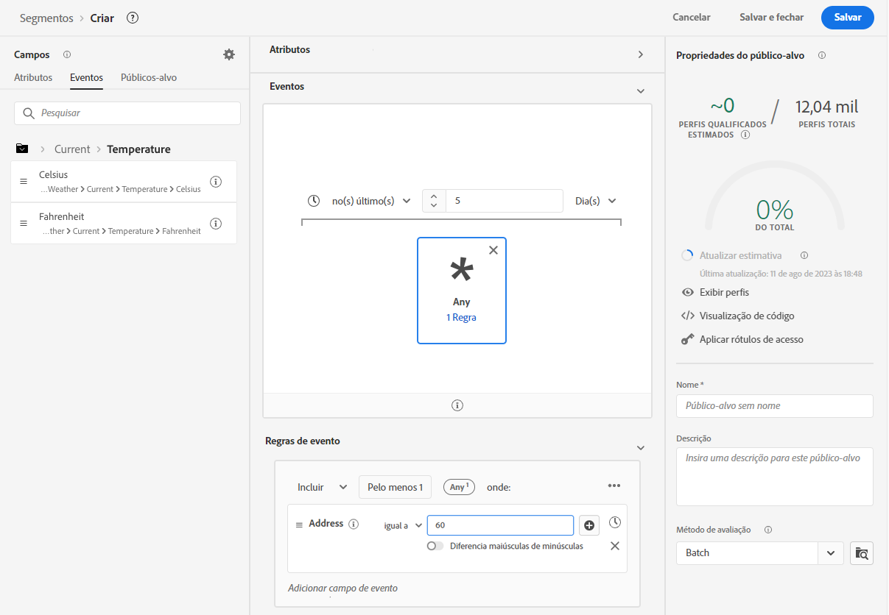
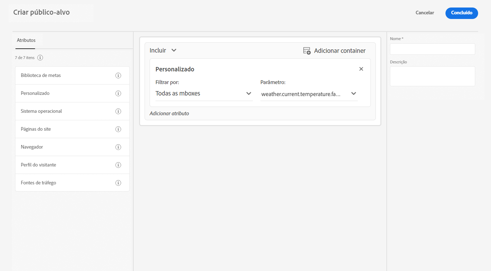

# Usar dados meteorológicos de [!DNL The Weather Channel]

O Adobe fez parceria com a [!DNL [The Weather Company]](https://www.ibm.com/weather) para trazer o contexto adicional do clima dos Estados Unidos para os dados coletados por fluxos de dados. Você pode usar esses dados para análise, direcionamento e criação de segmento no Experience Platform.

Há três tipos de dados disponíveis no [!DNL The Weather Channel]:

* **[!UICONTROL Tempo atual]**: as condições meteorológicas atuais do usuário, com base em sua localização. Isso inclui a temperatura atual, a precipitação, a cobertura de nuvens e muito mais.
* **[!UICONTROL Previsão do tempo]**: A previsão inclui a previsão de 1,2,3,5,7 e 10 dias para o local do usuário.
* **[!UICONTROL Triggers]**: Triggers são combinações específicas que mapeiam para condições meteorológicas semânticas diferentes. Há três tipos diferentes de gatilhos meteorológicos:

   * **[!UICONTROL Disparadores meteorológicos]**: Condições semânticas significativas, como clima frio ou chuvoso. Estes podem diferir em suas definições entre vários climas.
   * **[!UICONTROL Acionadores do produto]**: condições que levariam à compra de diferentes tipos de produtos. Por exemplo: as previsões de tempo frio podem significar que as compras de casacos de chuva são mais prováveis.
   * **[!UICONTROL Acionadores de Clima Intenso]**: avisos de tempo severo, como avisos de tempestade de inverno ou de furacão.

## Pré-requisitos {#prerequisites}

Antes de usar os dados meteorológicos, verifique se os seguintes pré-requisitos são atendidos:

* Você deve licenciar os dados meteorológicos que usará, de [!DNL The Weather Channel]. Eles o ativarão em sua conta.
* Os dados meteorológicos estão disponíveis somente por meio de sequências de dados. Para usar os dados meteorológicos, você deve usar [!DNL Web SDK], [!DNL Mobile Edge Extension] ou o [API do servidor](../../server-api/overview.md) para aproveitar esses dados.
* Sua sequência de dados deve ter [[!UICONTROL Localização geográfica]](../configure.md#advanced-options) ativado.
* Adicione o [grupo de campos meteorológicos](#schema-configuration) ao esquema que você está usando.

## Provisionamento {#provisioning}

Depois de licenciar os dados do [!DNL The Weather Channel], eles permitirão que sua conta acesse os dados. Em seguida, entre em contato com o Atendimento ao cliente do Adobe para ativar os dados no fluxo de dados. Uma vez habilitado, os dados serão automaticamente anexados.

Você pode validar se está sendo adicionado executando um rastreamento de borda com o depurador ou usando o Assurance para rastrear uma ocorrência pelo [!DNL Edge Network].

### Configuração de esquema {#schema-configuration}

Você deve adicionar os grupos de campos de tempo ao esquema de Experience Platform correspondente ao conjunto de dados de evento que está usando no fluxo de dados. Há cinco grupos de campos disponíveis:

* [!UICONTROL Previsão do tempo]
* [!UICONTROL Tempo atual]
* [!UICONTROL Acionadores do produto]
* [!UICONTROL Acionadores relativos]
* [!UICONTROL Acionadores de Clima Intenso]

## Acessar os dados meteorológicos {#access-weather-data}

Quando seus dados estiverem licenciados e disponíveis, você poderá acessá-los de várias maneiras nos serviços da Adobe.

### Adobe Analytics {#analytics}

Entrada [!DNL Adobe Analytics], os dados meteorológicos estão disponíveis para mapeamento por meio das regras de processamento, juntamente com o restante da [!DNL XDM] esquema.

Você pode encontrar a lista de campos que pode mapear na [referência climática](weather-reference.md) página. Como em todos [!DNL XDM] esquemas, as chaves recebem o prefixo `a.x`. Por exemplo, um campo chamado `weather.current.temperature.farenheit` apareceria em [!DNL Analytics] as `a.x.weather.current.temperature.farenheit`.

### Adobe Customer Journey Analytics {#cja}

Entrada [!DNL Adobe Customer Journey Analytics], os dados meteorológicos estão disponíveis no conjunto de dados especificado no fluxo de dados. Contanto que os atributos meteorológicos sejam [adicionado ao esquema](#prerequisites-prerequisites), eles estarão disponíveis para [adicionar a uma visualização de dados](https://experienceleague.adobe.com/docs/analytics-platform/using/cja-dataviews/create-dataview.html?lang=pt-BR) in [!DNL Customer Journey Analytics].

### Real-Time Customer Data Platform {#rtcdp}

Os dados meteorológicos estão disponíveis no [Real-time Customer Data Platform](../../rtcdp/overview.md), para uso em segmentos. Os dados meteorológicos são anexados aos eventos.

Como as condições meteorológicas mudam com frequência, o Adobe recomenda que você defina restrições de tempo nos segmentos, conforme mostrado no exemplo acima. Ter um dia frio no último dia ou dois é muito mais impactante do que ter um dia frio 6 meses atrás.

Consulte a [referência climática](weather-reference.md) para os campos disponíveis.

### Adobe Target {#target}

Entrada [!DNL Adobe Target], você pode usar os dados meteorológicos para impulsionar a personalização em tempo real. Os dados meteorológicos são enviados para [!DNL Target] as [!UICONTROL mBox] parâmetros e você poderá acessá-los por meio de um [!UICONTROL mBox] parâmetro.

O parâmetro é o [!DNL XDM] caminho para um campo específico. Consulte a [referência climática](weather-reference.md) para os campos disponíveis e seus caminhos correspondentes.

## Próximas etapas {#next-steps}

Depois de ler este documento, você compreenderá melhor como usar os dados meteorológicos em várias soluções de Adobe. Para saber mais sobre o mapeamento do campo de dados meteorológicos, consulte o [referência de mapeamento de campo](weather-reference.md).
