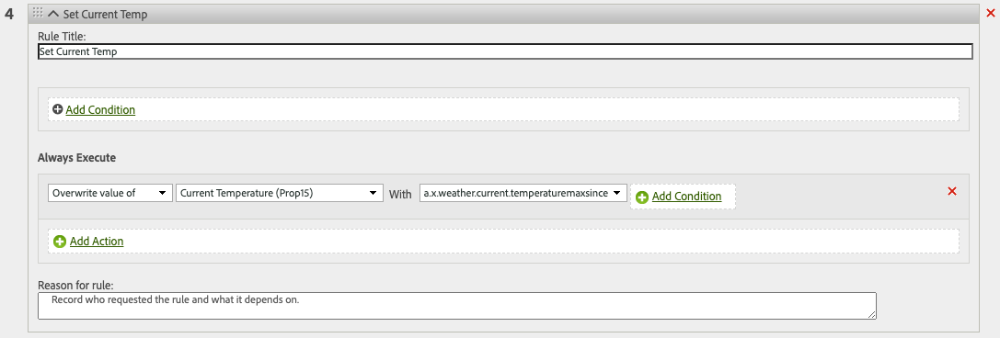

# Usar dados meteorológicos do [!DNL The Weather Channel]

A Adobe fez parceria com o [!DNL [The Weather Company]](https://www.ibm.com/weather) para trazer o contexto adicional de clima dos Estados Unidos para os dados coletados por sequências de dados. Você pode usar esses dados para análise, direcionamento e criação de segmentos na Experience Platform.

Há três tipos de dados disponíveis no [!DNL The Weather Channel]:

* **[!UICONTROL Clima atual]**: as condições meteorológicas atuais do usuário, com base em sua localização. Inclui a temperatura atual, a precipitação, a cobertura de nuvens e muito mais.
* **[!UICONTROL Previsão do tempo]**: inclui previsões de 1, 2, 3, 5, 7 e 10 dias para o local do usuário.
* **[!UICONTROL Acionadores]**: combinações específicas mapeadas para condições meteorológicas de diferentes semânticas. Existem três tipos diferentes de acionadores meteorológicos:

   * **[!UICONTROL Acionadores meteorológicos]**: condições semânticas significativas, como “clima frio” ou “chuvoso”. Essas definições podem diferir em vários climas.
   * **[!UICONTROL Acionadores do produto]**: condições que levariam à compra de diferentes tipos de produtos. Por exemplo: as previsões de tempo frio podem significar que as compras de casacos de chuva serão mais prováveis.
   * **[!UICONTROL Acionadores de mau tempo]**: avisos de mau tempo, como “tempestade de inverno” ou “furacão”.

## Pré-requisitos {#prerequisites}

Antes de usar os dados meteorológicos, verifique se os seguintes pré-requisitos estão sendo atendidos:

* Você deve licenciar os dados meteorológicos que usará do [!DNL The Weather Channel]. Eles serão então habilitados na sua conta.
* Os dados meteorológicos estão disponíveis somente por meio de sequências de dados. Para usar os dados meteorológicos, é necessário utilizar o [!DNL Web SDK], [!DNL Mobile Edge Extension] ou a [API do servidor](../../server-api/overview.md).
* Sua sequência de dados deve estar com a [[!UICONTROL Localização geográfica]](../configure.md#advanced-options) habilitada.
* Adicione o [grupo de campos meteorológicos](#schema-configuration) ao esquema que está usando.

## Provisionamento {#provisioning}

Depois de licenciar os dados do [!DNL The Weather Channel], eles permitirão que sua conta acesse os dados. Em seguida, entre em contato com o Atendimento ao cliente da Adobe para habilitar os dados na sequência de dados. Uma vez habilitados, os dados serão automaticamente anexados.

Você pode validar se eles estão sendo adicionados executando um rastreamento de borda com o depurador ou usando o Assurance para rastrear uma ocorrência pela [!DNL Edge Network].

### Configuração do esquema {#schema-configuration}

Você deve adicionar os grupos de campos meteorológicos ao esquema da Experience Platform de acordo com o conjunto de dados de evento que está usando na sequência de dados. Há cinco grupos de campos disponíveis:

* [!UICONTROL Previsão do tempo]
* [!UICONTROL Clima atual]
* [!UICONTROL Acionadores do produto]
* [!UICONTROL Acionadores relativos]
* [!UICONTROL Acionadores de mau tempo]

## Acessar os dados meteorológicos {#access-weather-data}

Quando os dados estiverem licenciados e disponíveis, você poderá acessá-los de várias maneiras nos serviços da Adobe.

### Adobe Analytics {#analytics}

No [!DNL Adobe Analytics], os dados meteorológicos estão disponíveis para mapeamento por meio das regras de processamento, juntamente com o restante do esquema [!DNL XDM].

Você pode encontrar a lista de campos que podem ser mapeados na página de [referência meteorológica](weather-reference.md). Como em todos os esquemas [!DNL XDM], as chaves recebem o prefixo `a.x`. Por exemplo, um campo chamado `weather.current.temperature.farenheit` apareceria no [!DNL Analytics] como `a.x.weather.current.temperature.farenheit`.

### Adobe Customer Journey Analytics {#cja}

No [!DNL Adobe Customer Journey Analytics], os dados meteorológicos estão disponíveis no conjunto de dados especificado na sequência de dados. Contanto que os atributos meteorológicos sejam [adicionados ao esquema](#prerequisites-prerequisites), eles estarão disponíveis para serem [adicionados a uma visualização de dados](https://experienceleague.adobe.com/docs/analytics-platform/using/cja-dataviews/create-dataview.html?lang=pt-BR) no [!DNL Customer Journey Analytics].

### Real-Time Customer Data Platform {#rtcdp}

Os dados meteorológicos estão disponíveis para uso em segmentos da [Real-time Customer Data Platform](../../rtcdp/overview.md). Os dados meteorológicos são anexados aos eventos.

Visto que as condições meteorológicas mudam com frequência, a Adobe recomenda definir restrições de tempo nos segmentos, conforme mostrado no exemplo acima. Um dia frio nos últimos dois dias tem muito mais impacto do que um dia frio 6 meses atrás.

Consulte a [referência meteorológica](weather-reference.md) para ver os campos disponíveis.

### Adobe Target {#target}

No [!DNL Adobe Target], você pode usar os dados meteorológicos para promover a personalização em tempo real. Os dados meteorológicos são enviados para o [!DNL Target] como parâmetros [!UICONTROL mBox] e podem ser acessados por meio de um parâmetro [!UICONTROL mBox] personalizado.

O parâmetro é o caminho do [!DNL XDM] para um campo específico. Consulte a [referência meteorológica](weather-reference.md) para os campos disponíveis e seus caminhos correspondentes.

## Próximas etapas {#next-steps}

Depois de ler este documento, você compreenderá melhor como usar os dados meteorológicos nas várias soluções da Adobe. Para saber mais sobre o mapeamento do campo de dados meteorológicos, consulte a [referência de mapeamento de campos](weather-reference.md).
