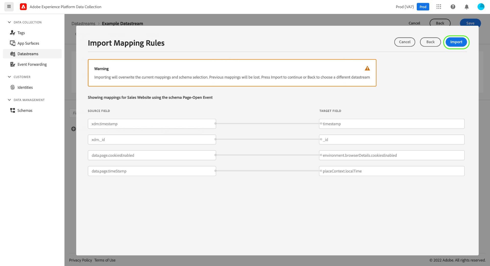

# Preparação de dados para coleção de dados

Preparo de dados é um serviço da Adobe Experience Platform que permite mapear, transformar e validar dados de e para [Experience Data Model (XDM)](../xdm/home.md). Ao configurar uma Plataforma ativada [sequência de dados](./overview.md), você pode usar os recursos de Preparo de dados para mapear os dados de origem para o XDM ao enviá-los para a Rede de borda da Platform.

>[!NOTE]
>
>Para obter orientação abrangente sobre todos os recursos de Preparo de dados, incluindo funções de transformação para campos calculados, consulte a seguinte documentação:
>
>* [Visão geral do Preparo de dados](../data-prep/home.md)
>* [Funções de mapeamento de Preparo de dados](../data-prep/functions.md)
>* [Manuseio de formatos de dados com o Preparo de dados](../data-prep/data-handling.md)

Este guia aborda como mapear seus dados na interface do usuário do. Para seguir as etapas, inicie o processo de criação de um fluxo de dados até (e incluindo) o [etapa de configuração básica](./overview.md#create).

Para obter uma demonstração rápida do processo de Preparação de dados para coleção de dados, assista ao vídeo a seguir:

>[!VIDEO](https://video.tv.adobe.com/v/342120?quality=12&enable10seconds=on&speedcontrol=on)

## [!UICONTROL Selecionar dados] {#select-data}

Selecionar **[!UICONTROL Salvar e adicionar mapeamento]** após concluir a configuração básica de um fluxo de dados, e a variável **[!UICONTROL Selecionar dados]** é exibida. Aqui, você deve fornecer um objeto JSON de amostra que represente a estrutura dos dados que planeja enviar para a Platform.

Para capturar propriedades diretamente da camada de dados, o objeto JSON deve ter uma única propriedade raiz `data`. As subpropriedades de `data` O objeto do deve ser construído de uma forma que mapeie para as propriedades da camada de dados que você deseja capturar. Selecione a seção abaixo para exibir um exemplo de objeto JSON formatado corretamente com uma `data` raiz.

+++Arquivo JSON de amostra com `data` raiz

```json
{
  "data": {
    "eventMergeId": "cce1b53c-571f-4f36-b3c1-153d85be6602",
    "eventType": "view:load",
    "timestamp": "2021-09-30T14:50:09.604Z",
    "web": {
      "webPageDetails": {
        "siteSection": "Product section",
        "server": "example.com",
        "name": "product home",
        "URL": "https://www.example.com"
      },
      "webReferrer": {
        "URL": "https://www.adobe.com/index2.html",
        "type": "external"
      }
    },
    "commerce": {
      "purchase": 1,
      "order": {
        "orderID": "1234"
      }
    },
    "product": [
      {
        "productInfo": {
          "productID": "123"
        }
      },
      {
        "productInfo": {
          "productID": "1234"
        }
      }
    ],
    "reservation": {
      "id": "anc45123xlm",
      "name": "Embassy Suits",
      "SKU": "12345-L",
      "skuVariant": "12345-LG-R",
      "priceTotal": "112.99",
      "currencyCode": "USD",
      "adults": 2,
      "children": 3,
      "productAddMethod": "PDP",
      "_namespace": {
        "test": 1,
        "priceTotal": "112.99",
        "category": "Overnight Stay"
      },
      "freeCancellation": false,
      "cancellationFee": 20,
      "refundable": true
    }
  }
}
```

+++

Para capturar propriedades de um elemento de dados de objeto XDM, as mesmas regras se aplicam ao objeto JSON, mas a propriedade raiz deve ser digitada como `xdm` em vez disso. Selecione a seção abaixo para exibir um exemplo de objeto JSON formatado corretamente com um `xdm` raiz.

+++Arquivo JSON de amostra com `xdm` raiz

```json
{
  "xdm": {
    "environment": {
      "type": "browser",
      "browserDetails": {
        "userAgent": "Mozilla/5.0 (Macintosh; Intel Mac OS X 10_7_5) AppleWebkit/537.36 (KHTML, like Gecko) Chrome/49.0.2623.112 Safari/537.36",
        "javaScriptEnabled": true,
        "javaScriptVersion": "1.8.5",
        "cookiesEnabled": true,
        "viewportHeight": 900,
        "viewportWidth": 1680,
        "javaEnabled": true
      },
      "domain": "adobe.com",
      "colorDepth": 24,
      "viewportHeight": 1050,
      "viewportWidth": 1680
    },
    "device": {
      "screenHeight": 1050,
      "screenWidth": 1680
    }
  }
}
```

+++

Você pode selecionar a opção para fazer upload do objeto como um arquivo ou colar o objeto bruto na caixa de texto fornecida. Se o JSON for válido, um esquema de visualização será exibido no painel direito. Clique em **[!UICONTROL Avançar]** para continuar.


## [!UICONTROL Mapeamento]

A variável **[!UICONTROL Mapeamento]** será exibida, permitindo mapear os campos nos dados de origem para o esquema de evento de destino na Platform. Aqui, é possível configurar o mapeamento de duas maneiras:

* [Criar novas regras de mapeamento](#create-mapping) para esse fluxo de dados por meio de um processo manual.
* [Importar regras de mapeamento](#import-mapping) de um fluxo de dados existente.

### Criar um novo mapeamento {#create-mapping}

Para começar, selecione **[!UICONTROL Adicionar novo mapeamento]** para criar uma nova linha de mapeamento.


Selecione o ícone de origem () e, na caixa de diálogo exibida, selecione o campo de origem que você deseja mapear na tela fornecida. Depois de escolher um campo, use o **[!UICONTROL Selecionar]** para continuar.


Em seguida, selecione o ícone do esquema () para abrir uma caixa de diálogo semelhante para o schema de eventos do target. Escolha o campo para o qual você deseja mapear os dados antes de confirmar com **[!UICONTROL Selecionar]**.


A página de mapeamento é exibida novamente com o mapeamento de campo concluído exibido. A variável **[!UICONTROL Progresso do mapeamento]** A seção é atualizada para refletir o número total de campos que foram mapeados com êxito.


>[!TIP]
>
>Se quiser mapear uma matriz de objetos (no campo de origem) para uma matriz de objetos diferentes (no campo de destino), adicione `[*]` após o nome da matriz nos caminhos dos campos de origem e destino, conforme mostrado abaixo.
>
>

### Importar regras de mapeamento existentes {#import-mapping}

Se você tiver criado um fluxo de dados anteriormente, poderá reutilizar suas regras de mapeamento configuradas para um novo fluxo de dados.

>[!WARNING]
>
>A importação de regras de mapeamento de outro fluxo de dados substituirá todos os mapeamentos de campo adicionados antes da importação.

Para começar, selecione **[!UICONTROL Importar mapeamento]**.

![Imagem mostrando o [!UICONTROL Importar mapeamento] botão sendo selecionado](assets/data-prep/import-mapping-button.png)

Na caixa de diálogo exibida, selecione o fluxo de dados cujas regras de mapeamento você deseja importar. Depois que o fluxo de dados for escolhido, selecione **[!UICONTROL Visualizar]**.


>[!NOTE]
>
>As sequências de dados só podem ser importadas na mesma [sandbox](../sandboxes/home.md). Em outras palavras, não é possível importar um fluxo de dados de uma sandbox para outra.

A próxima tela mostra uma visualização das regras de mapeamento salvas para o fluxo de dados selecionado. Verifique se os mapeamentos exibidos são os esperados e selecione **[!UICONTROL Importar]** para confirmar e adicionar os mapeamentos ao novo fluxo de dados.



>[!NOTE]
>
>Se algum campo de origem nas regras de mapeamento importadas não estiver incluído nos dados JSON de amostra que você [fornecido anteriormente](#select-data), esses mapeamentos de campo não serão incluídos na importação.

### Concluir o mapeamento

Continue seguindo as etapas acima para mapear o restante dos campos para o schema de destino. Embora não seja necessário mapear todos os campos de origem disponíveis, todos os campos no esquema de destino definidos como obrigatório devem ser mapeados para que esta etapa seja concluída. A variável **[!UICONTROL Campos obrigatórios]** contador indica quantos campos obrigatórios ainda não estão mapeados na configuração atual.

Quando a contagem de campos obrigatórios atingir zero e você estiver satisfeito com o mapeamento, selecione **[!UICONTROL Salvar]** para finalizar as alterações.


## Próximas etapas

Este guia abordou como mapear seus dados para o XDM ao configurar um fluxo de dados na interface do. Se você estava seguindo o tutorial geral de fluxos de dados, agora pode retornar à etapa em [exibição de detalhes do fluxo de dados](./overview.md).
