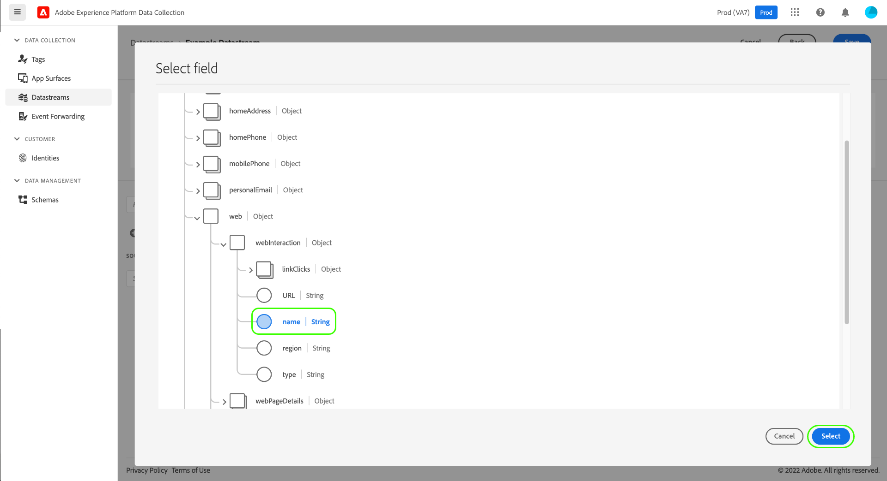
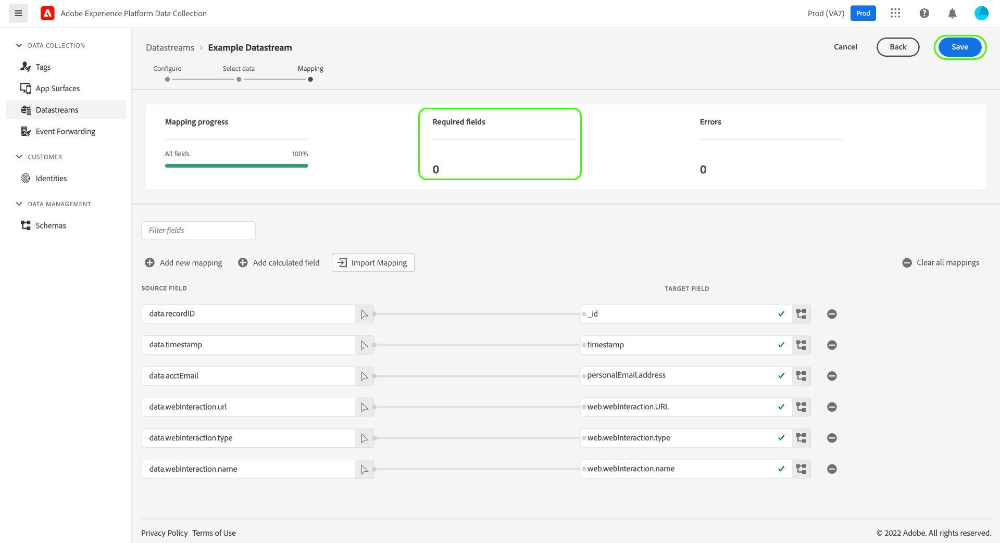

# Preparo de dados para a coleção de dados

O Preparo de dados é um serviço da Adobe Experience Platform que permite mapear, transformar e validar dados de e para o [Experience Data Model (XDM)](../xdm/home.md). Ao configurar uma [sequência de dados](./overview.md) habilitada para Experience Platform, você pode usar os recursos de Preparo de Dados para mapear os dados de origem no XDM ao enviá-los para o Experience Platform Edge Network.

Todos os dados enviados de uma página da Web devem chegar ao Experience Platform como XDM. Há três maneiras de traduzir dados de uma camada de dados na página para o XDM aceito pelo Experience Platform:

1. Reformate a camada de dados no XDM na própria página da Web.
2. Use a funcionalidade de elementos de dados nativos das tags para reformatar o formato de camada de dados existente de uma página da Web no XDM.
3. Reformate o formato da camada de dados existente de uma página da Web no XDM por meio do Edge Network, usando o Preparo de dados para coleção de dados.

Este guia foca na 3ª opção.

## Quando usar o Preparo de dados para a coleção de dados {#when-to-use-data-prep}

Há dois casos de uso em que o Preparo de dados para a coleção de dados é útil:

1. O site tem uma camada de dados bem formada, controlada e mantida, e há uma preferência por enviá-la diretamente para o Edge Network em vez de usar a manipulação do JavaScript para convertê-la em XDM na página (por meio de elementos de dados de tags ou por manipulação manual do JavaScript).
2. Um sistema de marcação diferente de Tags é implantado no site.

## Enviar uma camada de dados existente para a Edge Network por meio do SDK da Web {#send-datalayer-via-websdk}

A camada de dados existente deve ser enviada usando o objeto [`data`](/help/collection/js/commands/sendevent/data.md) dentro do comando `sendEvent`.

Se você estiver usando Marcas, deverá usar o campo **[!UICONTROL Data]** do tipo de ação [**[!UICONTROL Send Event]**](/help/tags/extensions/client/web-sdk/actions/send-event.md).

O restante deste guia enfocará como mapear a camada de dados para padrões XDM após ter sido enviada pelo WebSDK.

>[!NOTE]
>
>Para obter uma orientação abrangente sobre todos os recursos do Preparo de dados, incluindo funções de transformação para campos calculados, consulte a seguinte documentação:
>
>* [Visão geral do Preparo de dados](../data-prep/home.md)
>* [Funções de mapeamento do Preparo de dados](../data-prep/functions.md)
>* [Manuseio de formatos de dados com o Preparo de dados](../data-prep/data-handling.md)

Este guia aborda como mapear seus dados na interface. Para acompanhar as etapas, inicie o processo de criação de uma sequência de dados até (e incluindo) a [etapa de configuração básica](./overview.md#create).

Para obter uma demonstração rápida do processo de preparo de dados para a coleção de dados, assista ao vídeo a seguir:

>[!VIDEO](https://video.tv.adobe.com/v/345568?captions=por_br&quality=12&enable10seconds=on&speedcontrol=on)

## [!UICONTROL Select data] {#select-data}

Selecione **[!UICONTROL Save and Add Mapping]** depois de concluir a configuração básica para uma sequência de dados, e a etapa **[!UICONTROL Select data]** é exibida. Aqui, você deve fornecer um objeto JSON de amostra que represente a estrutura dos dados que planeja enviar para o Experience Platform.

Para capturar propriedades diretamente da camada de dados, o objeto JSON deve ter uma única propriedade raiz `data`. As subpropriedades do objeto `data` devem ser construídas de uma forma que mapeie para as propriedades da camada de dados que você deseja capturar. Selecione a seção abaixo para ver um exemplo de objeto JSON formatado corretamente com um objeto `data` raiz.

+++Arquivo JSON de exemplo com a raiz `data`

```json
{
  "data": {
    "eventMergeId": "cce1b53c-571f-4f36-b3c1-153d85be6602",
    "eventType": "view:load",
    "timestamp": "2021-09-30T14:50:09.604Z",
    "web": {
      "webPageDetails": {
        "siteSection": "Product section",
        "server": "example.com",
        "name": "product home",
        "URL": "https://www.example.com"
      },
      "webReferrer": {
        "URL": "https://www.adobe.com/index2.html",
        "type": "external"
      }
    },
    "commerce": {
      "purchase": 1,
      "order": {
        "orderID": "1234"
      }
    },
    "product": [
      {
        "productInfo": {
          "productID": "123"
        }
      },
      {
        "productInfo": {
          "productID": "1234"
        }
      }
    ],
    "reservation": {
      "id": "anc45123xlm",
      "name": "Embassy Suits",
      "SKU": "12345-L",
      "skuVariant": "12345-LG-R",
      "priceTotal": "112.99",
      "currencyCode": "USD",
      "adults": 2,
      "children": 3,
      "productAddMethod": "PDP",
      "_namespace": {
        "test": 1,
        "priceTotal": "112.99",
        "category": "Overnight Stay"
      },
      "freeCancellation": false,
      "cancellationFee": 20,
      "refundable": true
    }
  }
}
```

+++

Para capturar propriedades de um elemento de dados de objeto XDM, as mesmas regras se aplicam ao objeto JSON, mas a propriedade raiz deve ser identificada como `xdm`. Selecione a seção abaixo para ver um exemplo de objeto JSON formatado corretamente com um objeto `xdm` raiz.

+++Arquivo JSON de exemplo com a raiz `xdm`

```json
{
  "xdm": {
    "environment": {
      "type": "browser",
      "browserDetails": {
        "userAgent": "Mozilla/5.0 (Macintosh; Intel Mac OS X 10_7_5) AppleWebkit/537.36 (KHTML, like Gecko) Chrome/49.0.2623.112 Safari/537.36",
        "javaScriptEnabled": true,
        "javaScriptVersion": "1.8.5",
        "cookiesEnabled": true,
        "viewportHeight": 900,
        "viewportWidth": 1680,
        "javaEnabled": true
      },
      "domain": "adobe.com",
      "colorDepth": 24,
      "viewportHeight": 1050,
      "viewportWidth": 1680
    },
    "device": {
      "screenHeight": 1050,
      "screenWidth": 1680
    }
  }
}
```

+++

Você pode selecionar a opção para fazer upload do objeto como um arquivo ou colar o objeto bruto na caixa de texto fornecida. Se o JSON for válido, um esquema de visualização será exibido no painel direito. Selecione **[!UICONTROL Next]** para continuar.


>[!NOTE]
>
> Use um objeto JSON de amostra que represente cada elemento de camada de dados que pode ser usado em qualquer página. Por exemplo, nem todas as páginas usam elementos de camada de dados do carrinho de compras. No entanto, os elementos da camada de dados do carrinho de compras devem ser incluídos nesta amostra de objeto JSON.

## [!UICONTROL Mapping]

A etapa **[!UICONTROL Mapping]** é exibida, permitindo mapear os campos nos dados de origem para o esquema de evento de destino no Experience Platform. Aqui, é possível configurar o mapeamento de duas maneiras:

* [Crie regras de mapeamento](#create-mapping) para esta sequência de dados por meio de um processo manual.
* [Importar regras de mapeamento](#import-mapping) de uma sequência de dados existente.

>[!IMPORTANT]
>
>O mapeamento do Preparo de dados substitui `identityMap` cargas XDM, o que pode afetar ainda mais a correspondência de perfis em relação aos públicos da Real-Time CDP.

### Criar regras de mapeamento {#create-mapping}

Para criar uma regra de mapeamento, selecione **[!UICONTROL Add new mapping]**.


Selecione o ícone de origem () e, na caixa de diálogo exibida, selecione o campo de origem que deseja mapear na tela fornecida. Depois de escolher um campo, use o botão **[!UICONTROL Select]** para continuar.


Em seguida, selecione o ícone de esquema () para abrir uma caixa de diálogo semelhante para o esquema de evento de destino. Escolha o campo para o qual você deseja mapear os dados antes de confirmar com **[!UICONTROL Select]**.



A página de mapeamento é exibida novamente com o mapeamento do campo concluído. A seção **[!UICONTROL Mapping progress]** é atualizada para refletir o número total de campos que foram mapeados com êxito.


>[!TIP]
>
>Se quiser mapear uma matriz de objetos (no campo de origem) para uma matriz de objetos diferentes (no campo de destino), adicione `[*]` após o nome da matriz nos caminhos dos campos de origem e destino, conforme mostrado abaixo.
>
>

### Importar regras de mapeamento existentes {#import-mapping}

Se você tiver criado um fluxo de dados anteriormente, poderá reutilizar suas regras de mapeamento configuradas para um novo fluxo de dados.

>[!WARNING]
>
>A importação de regras de mapeamento de outro fluxo de dados substitui todos os mapeamentos de campo que você tenha adicionado antes da importação.

Para começar, selecione **[!UICONTROL Import Mapping]**.


Na caixa de diálogo exibida, selecione a sequência de dados cujas regras de mapeamento você deseja importar. Depois que a sequência de dados for escolhida, selecione **[!UICONTROL Preview]**.


>[!NOTE]
>
>As sequências de dados só podem ser importadas dentro da mesma [sandbox](../sandboxes/home.md). Em outras palavras, não é possível importar uma sequência de dados de uma sandbox para outra.

A próxima tela mostra uma visualização das regras de mapeamento salvas para a sequência de dados selecionada. Verifique se os mapeamentos exibidos são o que você espera e selecione **[!UICONTROL Import]** para confirmar e adicionar os mapeamentos ao novo fluxo de dados.


>[!NOTE]
>
>Se algum campo de origem das regras de mapeamento importadas não estiver incluído nos dados JSON de amostra que você [forneceu anteriormente](#select-data), esses mapeamentos de campo não serão incluídos na importação.

### Concluir o mapeamento

Para continuar, siga as etapas acima para mapear o restante dos campos para o esquema de destino. Embora não seja necessário mapear todos os campos de origem disponíveis, todos os campos no esquema de destino definidos como obrigatório devem ser mapeados para concluir esta etapa. O contador **[!UICONTROL Required fields]** indica quantos campos obrigatórios ainda não estão mapeados na configuração atual.

Quando a contagem de campos necessária atingir zero e você estiver satisfeito com o mapeamento, selecione **[!UICONTROL Save]** para finalizar as alterações.



## Próximas etapas

Este guia abordou como mapear seus dados para o XDM ao configurar uma sequência de dados na interface. Se você estava seguindo o tutorial geral para sequências de dados, agora pode retornar à etapa sobre [visualizar detalhes da sequência de dados](./overview.md).
