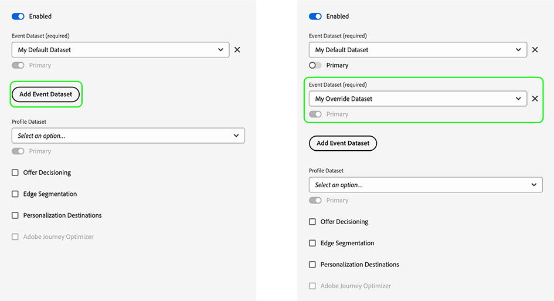

# Configurar substituições de sequência de dados

As substituições de sequência de dados permitem definir configurações adicionais para suas sequências de dados, que são transmitidas para a rede de borda por meio do SDK da Web.

Isso ajuda a acionar comportamentos de sequência de dados diferentes dos tradicionais sem criar uma nova sequência de dados ou modificar as configurações existentes.

Criar uma substituição de configuração da sequência de dados é um processo de duas etapas:

1. Primeiro, você deve definir as substituições de configuração da sequência na [página de configuração da sequência de dados](configure.md).
2. Em seguida, você deve enviar as substituições para a rede de borda por meio de um comando do SDK da Web ou usando a [extensão de tag](../tags/extensions/client/web-sdk/web-sdk-extension-configuration.md) do SDK da Web.

Este artigo explica o processo completo para criar cada tipo de substituição de configuração de sequência de dados compatível.

>[!IMPORTANT]
>
>As substituições de sequência de dados são compatíveis somente com integrações do [SDK da Web](../edge/home.md). Atualmente, as integrações do [SDK móvel](https://developer.adobe.com/client-sdks/documentation/) e da [API do servidor](../server-api/overview.md) não são compatíveis com substituições de sequência de dados.
><br><br>
>As substituições de sequência de dados devem ser usadas quando você precisa que dados diferentes sejam enviados para sequências de dados diferentes. Você não deve usar substituições de sequências de dados para casos de uso de personalização ou dados de consentimento.

## Casos de uso {#use-cases}

Para melhorar o entendimento sobre como e quando usar substituições de sequência de dados, veja alguns casos de uso que os clientes da Adobe Experience Platform podem resolver usando esse recurso.

**Coleta de dados de várias regiões**

Uma empresa tem sites ou subdomínios diferentes para países diferentes nos quais opera. Ela [configurou](configure.md) sequências de dados separadas com conjuntos de relatórios específicos do Analytics, tokens de propriedade do Adobe Target específicos de um país, esquemas específicos de um país, conjuntos de dados, configurações do Journey Optimizer e assim por diante. A empresa também tem um conjunto global de configurações onde agrega todos os dados específicos de um país.

Ao usar substituições de sequência de dados, a empresa pode alternar dinamicamente o fluxo dos dados para sequências de dados diferentes, em vez do comportamento padrão de enviar dados para uma sequência de dados.

Um caso de uso comum pode ser o envio de dados para uma sequência de dados específica de um país e também o envio de dados para uma sequência de dados global na qual clientes executam uma ação importante, como fazer um pedido ou atualizar o perfil do usuário.

**Diferenciação de perfis e identidades para diferentes unidades de negócios**

Uma empresa com várias unidades de negócios deseja usar múltiplas sandboxes da Experience Platform para armazenar dados específicos de cada unidade.

Em vez de enviar dados para uma sequência de dados padrão, a empresa pode usar substituições de sequência de dados para garantir que cada unidade de negócios tenha sua própria sequência de dados para receber dados.

## Configurar substituições na interface das sequências de dados {#configure-overrides}

As substituições de configuração de sequência de dados permitem modificar as seguintes configurações de sequência de dados:

* Conjuntos de dados de eventos da Experience Platform
* Tokens de propriedade do Adobe Target
* Containers de sincronização de ID do Audience Manager
* Conjuntos de relatórios do Adobe Analytics

### Substituições de sequência de dados para o Adobe Target {#target-overrides}

Para configurar substituições para uma sequência de dados do Adobe Target, primeiro você deve criar uma sequência de dados do Adobe Target. Siga as instruções para [configurar uma sequência de dados](configure.md) com o serviço do [Adobe Target](configure.md#target).

Depois de criar a sequência de dados, edite o serviço do [Adobe Target](configure.md#target) adicionado e use a seção **[!UICONTROL Substituições do token de propriedade]** para adicionar as substituições de sequência de dados desejadas, conforme mostrado na imagem abaixo. Adicione um token de propriedade por linha.


Depois de adicionar as substituições desejadas, salve as configurações da sequência de dados.

Agora as substituições de sequência de dados do Adobe Target devem estar configuradas. O próximo passo é [enviar as substituições para a rede de borda por meio do SDK da Web](#send-overrides).

### Substituições de sequência de dados para o Adobe Analytics {#analytics-overrides}

Para configurar substituições para uma sequência de dados do Adobe Analytics, primeiro você deve criar uma sequência de dados do [Adobe Analytics](configure.md#analytics). Siga as instruções para [configurar uma sequência de dados](configure.md) com o serviço do [Adobe Analytics](configure.md#analytics).

Depois de criar a sequência de dados, edite o serviço do [Adobe Analytics](configure.md#target) adicionado e use a seção **[!UICONTROL Substituições do conjunto de relatórios]** para adicionar as substituições de sequência de dados desejadas, conforme mostrado na imagem abaixo.

Selecione **[!UICONTROL Mostrar modo de lote]** para habilitar a edição em lote de substituições de conjunto de relatórios. É possível copiar e colar uma lista de substituições de conjunto de relatórios, inserindo um conjunto de relatórios por linha.


Depois de adicionar as substituições desejadas, salve as configurações da sequência de dados.

Agora as substituições de sequência de dados do Adobe Analytics devem estar configuradas. O próximo passo é [enviar as substituições para a rede de borda por meio do SDK da Web](#send-overrides).

### Substituições de sequência de dados para conjuntos de dados de eventos da Experience Platform {#event-dataset-overrides}

Para configurar substituições de sequência de dados para conjuntos de dados de evento da Experience Platform, primeiro você deve criar uma sequência de dados da [Adobe Experience Platform](configure.md#aep). Siga as instruções para [configurar uma sequência de dados](configure.md) com o serviço da [Adobe Experience Platform](configure.md#aep).

Depois de criar a sequência de dados, edite o serviço da [Adobe Experience Platform](configure.md#aep) adicionado e selecione a opção **[!UICONTROL Adicionar conjunto de dados de evento]** para adicionar um ou mais conjuntos de dados de evento de substituição, conforme mostrado na imagem abaixo.



Depois de adicionar as substituições desejadas, salve as configurações da sequência de dados.

Agora as substituições de sequência de dados da Adobe Experience Platform devem estar configuradas. O próximo passo é [enviar as substituições para a rede de borda por meio do SDK da Web](#send-overrides).

### Substituições de sequência de dados para containers de sincronização de ID de terceiros {#container-overrides}

Para configurar substituições de sequência de dados para containers de sincronização de ID de terceiros, primeiro você deve criar uma sequência de dados. Siga as instruções para [configurar uma sequência de dados](configure.md).

Depois de criar a sequência de dados, acesse **[!UICONTROL Opções avançadas]** e habilite a opção **[!UICONTROL Sincronização de ID de terceiros]**.

Em seguida, use a seção **[!UICONTROL Substituições de ID de container]** para adicionar as IDs de container que você deseja usar para substituir a configuração padrão, conforme mostrado na imagem abaixo.

>[!IMPORTANT]
>
>As IDs de container devem ser valores numéricos, como `1234567`, e não strings, como `"1234567"`. Um erro será exibido se você enviar uma string por meio do SDK da Web como uma substituição de ID de container.


Depois de adicionar as substituições desejadas, salve as configurações da sequência de dados.

Agora as substituições do container de sincronização de ID devem estar configuradas. O próximo passo é [enviar as substituições para a rede de borda por meio do SDK da Web](#send-overrides).

## Enviar as substituições para a rede de borda por meio do SDK da Web {#send-overrides}

>[!NOTE]
>
>Como alternativa ao envio de substituições de configuração por meio de comandos do SDK da Web, você pode adicioná-las à [extensão de tag](../tags/extensions/client/web-sdk/web-sdk-extension-configuration.md) do SDK da Web.

Depois de [configurar as substituições de sequência de dados](#configure-overrides) na interface da coleção de dados, é possível enviar as substituições para a rede de borda por meio do SDK da Web.

Enviar as substituições para a rede de borda por meio do SDK da Web é a segunda e última etapa da ativação das substituições de configuração de sequência de dados.

As substituições de configuração de sequência de dados são enviadas para a rede de borda por meio do comando `edgeConfigOverrides` do SDK da Web. Esse comando cria substituições de sequência de dados que são transmitidas para a [!DNL Edge Network] no comando seguinte ou, no caso do comando `configure`, para cada solicitação.

O comando `edgeConfigOverrides` cria substituições de sequência de dados que são transmitidas para a [!DNL Edge Network] no comando seguinte ou, no caso do `configure`, para cada solicitação.

Quando uma substituição de configuração é enviada com o comando `configure`, ela é incluída nos seguintes comandos do SDK da Web.

* [sendEvent](../edge/fundamentals/tracking-events.md)
* [setConsent](../edge/consent/iab-tcf/overview.md)
* [getIdentity](../edge/identity/overview.md)
* [appendIdentityToUrl](../edge/identity/id-sharing.md#cross-domain-sharing)
* [configure](../edge/fundamentals/configuring-the-sdk.md)

As opções definidas globalmente podem ser substituídas pela opção de configuração em comandos individuais.

### Envio de substituições de configuração por meio do comando `sendEvent` {#send-event}

O exemplo abaixo mostra como seria uma substituição de configuração em um comando `sendEvent`.

```js {line-numbers="true" highlight="5-25"}
alloy("sendEvent", {
  xdm: {
    /* ... */
  },
  edgeConfigOverrides: {
    datastreamId: "{DATASTREAM_ID}"
    com_adobe_experience_platform: {
      datasets: {
        event: {
          datasetId: "MyOverrideDataset"
        },
        profile: {
          datasetId: "www"
        }
      }
    },
    com_adobe_analytics: {
      reportSuites: [
        "MyFirstOverrideReportSuite",
        "MySecondOverrideReportSuite",
        "MyThirdOverrideReportSuite"
        ]
    },
    com_adobe_identity: {
      idSyncContainerId: "1234567"
    },
    com_adobe_target: {
      propertyToken: "63a46bbc-26cb-7cc3-def0-9ae1b51b6c62"
    }
  }
});
```

| Parâmetro | Descrição |
|---|---|
| `edgeConfigOverrides.datastreamId` | Use esse parâmetro para permitir que uma única solicitação seja enviada para uma sequência de dados diferente da definida pelo comando `configure`. |

### Envio de substituições de configuração por meio do comando `configure` {#send-configure}

O exemplo abaixo mostra como seria uma substituição de configuração em um comando `configure`.

```js {line-numbers="true" highlight="8-30"}
alloy("configure", {
  defaultConsent: "in",
  edgeDomain: "etc",
  edgeBasePath: "ee",
  datastreamId: "{DATASTREAM_ID}",
  orgId: "org",
  debugEnabled: true,
  edgeConfigOverrides: {
    "com_adobe_experience_platform": {
      "datasets": {
        "event": { 
          datasetId: "MyOverrideDataset"
        },
        "profile": { 
          datasetId: "www"
        }
      }
    },
    "com_adobe_analytics": {
      "reportSuites": [
        "MyFirstOverrideReportSuite",
        "MySecondOverrideReportSuite",
        "MyThirdOverrideReportSuite"
      ]
    },
    "com_adobe_identity": {
      "idSyncContainerId": "1234567"
    },
    "com_adobe_target": {
      "propertyToken": "63a46bbc-26cb-7cc3-def0-9ae1b51b6c62"
    }
  },
  onBeforeEventSend: function() { /* … */ });
};
```

### Exemplo de conteúdo {#payload-example}

Os exemplos acima geram um conteúdo da [!DNL Edge Network] com esta aparência:

```json
{
  "meta": {
    "configOverrides": {
      "com_adobe_experience_platform": {
        "datasets": {
          "event": {
            "datasetId": "MyOverrideDataset"
          },
          "profile": {
            "datasetId": "www"
          }
        }
      },
      "com_adobe_analytics": {
        "reportSuites": [
        "MyFirstOverrideReportSuite",
        "MySecondOverrideReportSuite",
        "MyThirdOverrideReportSuite"
        ]
      },
      "com_adobe_identity": {
        "idSyncContainerId": "1234567"
      },
      "com_adobe_target": {
        "propertyToken": "63a46bbc-26cb-7cc3-def0-9ae1b51b6c62"
      }
    },
    "state": {  }
  },
  "events": [  ],
  "query": {
    "identity": {
      "fetch": [
        "ECID"
      ]
    }
  }
}
```
