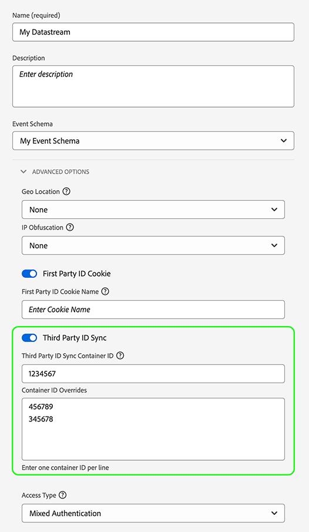

# Configurar substituições de fluxo de dados

As substituições de sequência de dados permitem definir configurações adicionais para suas sequências de dados, que são transmitidas para a Rede de borda por meio do SDK da Web.

Isso ajuda a acionar comportamentos de sequência de dados diferentes dos padrão, sem criar uma nova sequência de dados ou modificar as configurações existentes.

A substituição da configuração da sequência de dados é um processo de duas etapas:

1. Primeiro, você deve definir as substituições de configuração da sequência na [página de configuração da sequência de dados](configure.md).
2. Em seguida, você deve enviar as substituições para a rede de borda por meio de um comando do SDK da Web ou usando a [extensão de tag](../tags/extensions/client/web-sdk/web-sdk-extension-configuration.md) do SDK da Web.

Este artigo explica o processo completo de substituição de configuração de sequência de dados para cada tipo de substituição compatível.

>[!IMPORTANT]
>
>As substituições de fluxo de dados são compatíveis somente com [SDK da Web](../edge/home.md) integrações. [SDK móvel](https://developer.adobe.com/client-sdks/documentation/) e [API do servidor](../server-api/overview.md) atualmente, as integrações não aceitam substituições de fluxo de dados.
><br><br>
>As substituições de fluxo de dados devem ser usadas quando você precisa que dados diferentes sejam enviados para fluxos de dados diferentes. Você não deve usar substituições de fluxo de dados para casos de uso de personalização ou dados de consentimento.

## Casos de uso {#use-cases}

Para ajudá-lo a entender melhor como e quando usar substituições de fluxo de dados, veja alguns casos de uso que os clientes do Adobe Experience Platform podem resolver usando esse recurso.

**Coleta de dados de várias regiões**

Uma empresa tem sites ou subdomínios diferentes para países diferentes nos quais opera. Eles têm [configurado](configure.md) separe as sequências de dados com conjuntos de relatórios correspondentes específicos do analytics, tokens de propriedade do Adobe Target específicos do país, esquemas específicos do país, conjuntos de dados, configurações do Journey Optimizer e assim por diante. A empresa também tem um conjunto global de configurações em que todos os dados específicos do país são agregados.

Ao usar substituições de fluxo de dados, a empresa pode alternar dinamicamente o fluxo de dados para fluxos de dados diferentes, em vez do comportamento padrão de enviar dados para um fluxo de dados.

Um caso de uso comum pode ser o envio de dados para uma sequência específica de um país e também o envio de dados para uma sequência global de dados em que os clientes executam uma ação importante, como fazer um pedido ou atualizar o perfil do usuário.

**Diferenciação de perfis e identidades para diferentes unidades de negócios**

Uma empresa com várias unidades de negócios deseja usar várias sandboxes de Experience Platform para armazenar dados específicos de cada unidade de negócios.

Em vez de enviar dados para um fluxo de dados padrão, a empresa pode usar substituições de fluxo de dados para garantir que cada unidade de negócios tenha seu próprio fluxo de dados para receber dados por meio do.

## Configurar substituições de fluxo de dados na interface dos fluxos de dados {#configure-overrides}

As substituições de configuração de sequência de dados permitem modificar as seguintes configurações de sequência de dados:

* Conjuntos de dados do evento Experience Platform
* tokens de propriedade do Adobe Target
* Contêineres de sincronização de ID de Audience Manager
* Conjuntos de relatórios do Adobe Analytics

### Substituições de sequência de dados para o Adobe Target {#target-overrides}

Para configurar substituições de sequência de dados para uma sequência de dados do Adobe Target, primeiro você deve criar uma sequência de dados do Adobe Target. Siga as instruções para [configurar um fluxo de dados](configure.md) com o [Adobe Target](configure.md#target) serviço.

Depois de criar o fluxo de dados, edite o [Adobe Target](configure.md#target) serviço que você adicionou e usar o **[!UICONTROL Substituições do token de propriedade]** para adicionar as substituições de fluxo de dados desejadas, conforme mostrado na imagem abaixo. Adicione um token de propriedade por linha.


Depois de adicionar as substituições desejadas, salve as configurações de fluxo de dados.

Agora você deve configurar as substituições da sequência de dados do Adobe Target. Agora é possível [enviar as substituições para a Rede de borda por meio do SDK da Web](#send-overrides).

### Substituições de sequência de dados para o Adobe Analytics {#analytics-overrides}

Para configurar substituições de sequência de dados para uma sequência de dados do Adobe Analytics, primeiro você deve ter uma [Adobe Analytics](configure.md#analytics) sequência de dados criada. Siga as instruções para [configurar um fluxo de dados](configure.md) com o [Adobe Analytics](configure.md#analytics) serviço.

Depois de criar o fluxo de dados, edite o [Adobe Analytics](configure.md#target) serviço que você adicionou e usar o **[!UICONTROL Substituições do conjunto de relatórios]** para adicionar as substituições de fluxo de dados desejadas, conforme mostrado na imagem abaixo.

Selecionar **[!UICONTROL Mostrar modo de lote]** para ativar a edição em lote de substituições do conjunto de relatórios. Você pode copiar e colar uma lista de sobreposições do conjunto de relatórios, inserindo um conjunto de relatórios por linha.


Depois de adicionar as substituições desejadas, salve as configurações de fluxo de dados.

Agora você deve configurar as substituições da sequência de dados do Adobe Analytics. Agora é possível [enviar as substituições para a Rede de borda por meio do SDK da Web](#send-overrides).

### Substituições de fluxo de dados para conjuntos de dados de eventos do Experience Platform {#event-dataset-overrides}

Para configurar sobreposições de sequência de dados para conjuntos de dados de evento Experience Platform, primeiro você deve ter um [Adobe Experience Platform](configure.md#aep) sequência de dados criada. Siga as instruções para [configurar um fluxo de dados](configure.md) com o [Adobe Experience Platform](configure.md#aep) serviço.

Depois de criar o fluxo de dados, edite o [Adobe Experience Platform](configure.md#aep) serviço que você adicionou e selecione o **[!UICONTROL Adicionar conjunto de dados do evento]** opção para adicionar um ou mais conjuntos de dados do evento de substituição, conforme mostrado na imagem abaixo.


Depois de adicionar as substituições desejadas, salve as configurações de fluxo de dados.

Agora você deve configurar as substituições da sequência de dados do Adobe Experience Platform. Agora é possível [enviar as substituições para a Rede de borda por meio do SDK da Web](#send-overrides).

### Substituições de sequência de dados para contêineres de sincronização de ID de terceiros {#container-overrides}

Para configurar substituições de sequência de dados para contêineres de sincronização de ID de terceiros, primeiro você deve criar uma sequência de dados. Siga as instruções para [configurar um fluxo de dados](configure.md) para criar um.

Depois de criar o fluxo de dados, acesse **[!UICONTROL Opções avançadas]** e habilite o **[!UICONTROL Sincronização de ID de terceiros]** opção.

Em seguida, use o **[!UICONTROL Substituições de ID de contêiner]** para adicionar as IDs de contêiner nas quais você deseja substituir a configuração padrão, conforme mostrado na imagem abaixo.

>[!IMPORTANT]
>
>As IDs de contêineres devem ser valores numéricos, como `1234567`, e não strings, como `"1234567"`. Se você enviar um valor de sequência por meio do SDK da Web como uma substituição de ID de contêiner, receberá um erro.



Depois de adicionar as substituições desejadas, salve as configurações de fluxo de dados.

Agora, você deve configurar as substituições do contêiner de sincronização de ID. Agora é possível [enviar as substituições para a Rede de borda por meio do SDK da Web](#send-overrides).

## Enviar as substituições para a Rede de borda por meio do SDK da Web {#send-overrides}

>[!NOTE]
>
>Como alternativa ao envio de substituições de configuração por meio de comandos do SDK da Web, você pode adicionar as substituições de configuração ao SDK da Web [extensão de tag](../tags/extensions/client/web-sdk/web-sdk-extension-configuration.md).

Depois [configurar as substituições do fluxo de dados](#configure-overrides) na interface da Coleção de dados, agora é possível enviar as substituições para a Rede de borda, por meio do SDK da Web.

Enviar as substituições para a Rede de borda por meio do SDK da Web é a segunda e última etapa da ativação das substituições de configuração da sequência de dados.

As substituições de configuração da sequência de dados são enviadas para a Rede de borda por meio do `edgeConfigOverrides` Comando do SDK da Web. Esse comando cria substituições de sequência de dados que são passadas para o [!DNL Edge Network] no comando seguinte, ou, no caso do comando `configure` para cada solicitação.

A variável `edgeConfigOverrides` cria substituições de fluxo de dados que são passadas para o [!DNL Edge Network] no comando seguinte ou, no caso de `configure`, para cada solicitação.

Quando uma substituição de configuração é enviada com o `configure` está incluído nos seguintes comandos do SDK da Web.

* [sendEvent](../edge/fundamentals/tracking-events.md)
* [setConsent](../edge/consent/iab-tcf/overview.md)
* [getIdentity](../edge/identity/overview.md)
* [appendIdentityToUrl](../edge/identity/id-sharing.md#cross-domain-sharing)
* [configurar](../edge/fundamentals/configuring-the-sdk.md)

As opções especificadas globalmente podem ser substituídas pela opção de configuração em comandos individuais.

### Envio de substituições de configuração por meio do `sendEvent` comando {#send-event}

O exemplo abaixo mostra como seria uma substituição de configuração em uma `sendEvent` comando.

```js {line-numbers="true" highlight="5-25"}
alloy("sendEvent", {
  xdm: {
    /* ... */
  },
  edgeConfigOverrides: {
    datastreamId: "{DATASTREAM_ID}"
    com_adobe_experience_platform: {
      datasets: {
        event: {
          datasetId: "MyOverrideDataset"
        },
        profile: {
          datasetId: "www"
        }
      }
    },
    com_adobe_analytics: {
      reportSuites: [
        "MyFirstOverrideReportSuite",
        "MySecondOverrideReportSuite",
        "MyThirdOverrideReportSuite"
        ]
    },
    com_adobe_identity: {
      idSyncContainerId: "1234567"
    },
    com_adobe_target: {
      propertyToken: "63a46bbc-26cb-7cc3-def0-9ae1b51b6c62"
    }
  }
});
```

| Parâmetro | Descrição |
|---|---|
| `edgeConfigOverrides.datastreamId` | Use esse parâmetro para permitir que uma única solicitação vá para um fluxo de dados diferente daquele definido pelo `configure` comando. |

### Envio de substituições de configuração por meio do `configure` comando {#send-configure}

O exemplo abaixo mostra como seria uma substituição de configuração em uma `configure` comando.

```js {line-numbers="true" highlight="8-30"}
alloy("configure", {
  defaultConsent: "in",
  edgeDomain: "etc",
  edgeBasePath: "ee",
  datastreamId: "{DATASTREAM_ID}",
  orgId: "org",
  debugEnabled: true,
  edgeConfigOverrides: {
    "com_adobe_experience_platform": {
      "datasets": {
        "event": { 
          datasetId: "MyOverrideDataset"
        },
        "profile": { 
          datasetId: "www"
        }
      }
    },
    "com_adobe_analytics": {
      "reportSuites": [
        "MyFirstOverrideReportSuite",
        "MySecondOverrideReportSuite",
        "MyThirdOverrideReportSuite"
      ]
    },
    "com_adobe_identity": {
      "idSyncContainerId": "1234567"
    },
    "com_adobe_target": {
      "propertyToken": "63a46bbc-26cb-7cc3-def0-9ae1b51b6c62"
    }
  },
  onBeforeEventSend: function() { /* … */ });
};
```

### Exemplo de carga {#payload-example}

Os exemplos acima geram uma [!DNL Edge Network] carga com esta aparência:

```json
{
  "meta": {
    "configOverrides": {
      "com_adobe_experience_platform": {
        "datasets": {
          "event": {
            "datasetId": "MyOverrideDataset"
          },
          "profile": {
            "datasetId": "www"
          }
        }
      },
      "com_adobe_analytics": {
        "reportSuites": [
        "MyFirstOverrideReportSuite",
        "MySecondOverrideReportSuite",
        "MyThirdOverrideReportSuite"
        ]
      },
      "com_adobe_identity": {
        "idSyncContainerId": "1234567"
      },
      "com_adobe_target": {
        "propertyToken": "63a46bbc-26cb-7cc3-def0-9ae1b51b6c62"
      }
    },
    "state": {  }
  },
  "events": [  ],
  "query": {
    "identity": {
      "fetch": [
        "ECID"
      ]
    }
  }
}
```
