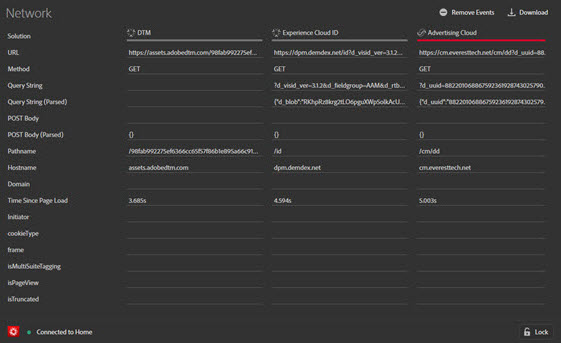

# Guia Rede

O **Rede** A guia agrega todas as chamadas da solução da Adobe Experience Cloud feitas na página e as exibe em ordem da esquerda para a direita. Os parâmetros padrão são identificados automaticamente com nomes familiares e organizados para agrupar parâmetros comuns na mesma função.

Essa tela é útil para comparar pares de valores importantes entre ocorrências. É possível confirmar se os parâmetros usados para integrações, como a ID de visitante da Experience Cloud ou a ID de dados complementares, são consistentes em todas as integrações.

>[!NOTE]
>
>No momento, nem todos os parâmetros transmitidos nas chamadas da solução (por exemplo, variáveis de contexto do Analytics, parâmetros personalizados do Target ou IDs do cliente do serviço da Experience Cloud ID) estão visíveis na tela Rede.

Para alterar as informações por solução, selecione a solução que deseja exibir na lista da navegação à esquerda. O exemplo a seguir for filtrado para mostrar somente o Analytics:

Para voltar a exibir todas as soluções, selecione **[!UICONTROL Rede]**

Selecione um item na exibição Rede para ver uma exibição expandida. Na janela de exibição expandida, é possível copiar as informações mostradas para a Área de transferência.

<!--Use the icon at the top of each column to copy the server call URL to your clipboard, where you can paste it into another document for reference or debugging purposes.

-->

Para limpar a lista, selecione **[!UICONTROL Remover eventos]**.

Para baixar um arquivo do Excel que contém as informações nesta tela, selecione **[!UICONTROL Baixar]**.
