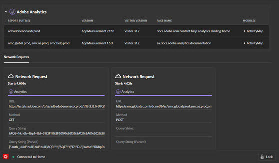

# Soluções

O Adobe Experience Platform Debugger fornece uma lista de **Soluções** no painel de navegação esquerdo. Selecione uma solução para ver os resultados de tecnologias Adobe Experience Cloud específicas.

## SDK da Web da Adobe Experience Platform {#aep}

A tela do SDK da Web da Adobe Experience Platform mostra informações sobre o SDK da Web da Adobe Experience Platform. Selecionar **[!UICONTROL Configurar]** para ativar ou desativar o registro de log do console.

## Analytics {#section-f71dfcc22bb44c86bec328491606a482}

A tela Analytics fornece informações sobre a implementação do [Analytics](https://experienceleague.adobe.com/docs/analytics.html?lang=pt-BR).

## Target {#section-988873ba5ede4317953193bd7ac5474c}

Usar a tela Target para exibir [Target](https://docs.adobe.com/content/help/pt-BR/experience-cloud/user-guides/home.translate.html) solicitações ou [mboxTrace](https://experienceleague.adobe.com/docs/target/using/activities/troubleshoot-activities/content-trouble.html#section_256FCF7C14BB435BA2C68049EF0BA99E) detalhes da resposta.

## Audience Manager {#section-1d4484f8b46f457f859ba88039a9a585}

Use a guia [Audience Manager](https://docs.adobe.com/content/help/pt-BR/experience-cloud/user-guides/home.translate.html) para exibir detalhes de [eventos](https://experienceleague.adobe.com/docs/audience-manager/user-guide/api-and-sdk-code/dcs/dcs-event-calls/dcs-event-calls.html). Selecione a organização para expandi-la e mostrar as informações.

## Tags do Adobe Experience Platform {#section-ee80a9c509f2462c89c1e5bd8d05d7c8}

Use a seção Tags do Adobe Experience Platform para exibir solicitações de tags. Você também pode selecionar **[!UICONTROL Configuração]** para configurar [códigos incorporados](../tags/ui/publishing/environments.md#embed-code). Você pode editar, substituir ou adicionar mais códigos incorporados no Experience Platform Debugger. Se você fizer logon, será possível selecionar uma propriedade alternativa usando os menus suspensos.

## Serviço da Experience Cloud ID {#section-a96c32f8e63a4991abb296f6e8ea01cf}

Use a guia Serviço da Experience Cloud ID para exibir as solicitações do [Serviço da Experience Cloud ID](https://experienceleague.adobe.com/docs/id-service/using/home.html?lang=pt-BR).
