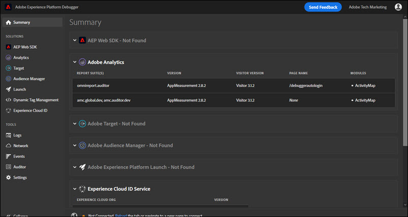

# Guia Resumo

Para executar o Adobe Experience Platform Debugger, abra a página que deseja examinar no navegador e selecione o ícone () na barra do navegador. A extensão do é aberta no **Resumo** guia .

Essa tela também mostra informações sobre cada solução da Adobe Experience Cloud. As informações mostradas variam de acordo com a solução, mas geralmente incluem informações como biblioteca e versão da solução (por exemplo, &quot;AppMeasurement v2.9&quot;) e identificadores de conta (como a ID do conjunto de relatórios do Analytics, o código de cliente do Target, a ID de parceiro do Audience Manager, etc).

## Informações mostradas no Experience Platform Debugger

O Experience Platform Debugger mostra as seguintes informações para cada solução:

**Adobe Analytics**

<table id="table_BEB9CC58E59D4D86BC895A8A51D84A2C"> 
 <tbody> 
  <tr> 
   <td colname="col1"> 
Conjuntos de relatórios 
 </td> 
   <td colname="col2"> 
Um <a href="https://experiencecloud.adobe.com/resources/help/pt_BR/reference/report_suites_admin.html" format="html" scope="external">conjunto de relatórios</a> define o relatório completo e independente de um site escolhido, o conjunto de sites ou o subconjunto de páginas da Web. 
 </td> 
  </tr> 
  <tr> 
   <td colname="col1"> 
Versão 
 </td> 
   <td colname="col2"> 
A versão do <a href="https://experienceleague.adobe.com/docs/analytics/implementation/js/overview.html?lang=pt-BR" format="html" scope="external"> AppMeasurement</a> definida para a página. 
 </td> 
  </tr> 
  <tr> 
   <td colname="col1"> 
Versão do visitante 
 </td> 
   <td colname="col2"> 
A versão da biblioteca de <a href="https://experienceleague.adobe.com/docs/analytics/import/data-sources/data-types-and-categories/datasrc-visitorid.html?lang=pt-BR" format="html" scope="external">ID de visitante</a>. 
 </td> 
  </tr> 
  <tr> 
   <td colname="col1"> 
Nome da página 
 </td> 
   <td colname="col2"> 
A variável <a href="https://experiencecloud.adobe.com/resources/help/pt_BR/sc/implement/pageName.html" format="html" scope="external">pageName</a> enviada ao Analytics que contém um nome familiar do site. 
 </td> 
  </tr> 
  <tr> 
   <td colname="col1"> 
Módulos 
 </td> 
   <td colname="col2"> 
Os módulos carregados pelo Adobe Analytics. 
 </td> 
  </tr> 
 </tbody> 
</table>

**Audience Manager**

<table id="table_784AEABADBDA4D14BB9A7A9CB9EF07C3"> 
 <tbody> 
  <tr> 
   <td colname="col1"> 
Parceiro 
 </td> 
   <td colname="col2"> 
O <a href="https://experiencecloud.adobe.com/resources/help/pt_BR/aam/r_dil_get_partner.html" format="html" scope="external">nome do parceiro</a> para a instância DIL. 
 </td> 
  </tr> 
  <tr> 
   <td colname="col1"> 
Versão 
 </td> 
   <td colname="col2"> 
O <a href="https://experiencecloud.adobe.com/resources/help/pt_BR/aam/r_api_return_versions_dil.html" format="html" scope="external">número da versão</a> da instância DIL. 
 </td> 
  </tr> 
  <tr> 
   <td colname="col1"> 
UUID 
 </td> 
   <td colname="col2"> 
O <a href="https://experiencecloud.adobe.com/resources/help/pt_BR/aam/ids-in-aam.html" format="html" scope="external">identificador de usuário único</a> associado à instância DIL. 
 </td> 
  </tr> 
 </tbody> 
</table>

**Tags do Adobe Experience Platform**

<table id="table_E9574975444A407887E26514D1BB1601"> 
 <tbody> 
  <tr> 
   <td colname="col1"> 
Nome 
 </td> 
   <td colname="col2"> 
O nome da tag <a href="https://experienceleague.adobe.com/docs/experience-platform/tags/admin/companies-and-properties.html" format="https" scope="external"> propriedade</a> 
 </td> 
  </tr> 
  <tr> 
   <td colname="col1"> 
Versão 
 </td> 
   <td colname="col2"> 
A versão da Turbina.</a> 
 </td> 
  </tr> 
  <tr> 
   <td colname="col1"> 
Data de build 
 </td> 
   <td colname="col2"> 
A tag <a href="https://experienceleague.adobe.com/docs/experience-platform/tags/publish/libraries.html" format="https" scope="external"> biblioteca</a> data de compilação 
 </td> 
  </tr> 
  <tr> 
   <td colname="col1"> 
Ambiente 
 </td> 
   <td colname="col2"> 
O <a href="https://experienceleague.adobe.com/docs/experience-platform/tags/publish/environments/environments.html" format="https" scope="external"> ambiente</a> usada pela biblioteca de tags 
 </td> 
  </tr> 
  <tr> 
   <td colname="col1"> 
Extensões 
 </td> 
   <td colname="col2"> 
As extensões usadas na página. 
 </td> 
  </tr> 
 </tbody> 
</table>

**SDK da Web da Adobe Experience Platform**

<table id="table_DC76D63FA6EF4891906B9E1D3E4A8A6C"> 
 <tbody> 
  <tr> 
   <td colname="col1"> 
Versão da biblioteca 
 </td> 
   <td colname="col2"> 
O número da <a href="https://experienceleague.adobe.com/docs/experience-platform/edge/extension/web-sdk-ext-release-notes.html" format="html" scope="external">versão da biblioteca</a> do SDK da Web da Adobe Experience Platform. 
 </td> 
  </tr> 
  <tr> 
   <td colname="col1"> 
Namespace
 </td> 
   <td colname="col2"> 
O nome identificado na extensão.
 </td> 
  </tr> 
  <tr> 
   <td colname="col1"> 
ID da propriedade 
 </td> 
   <td colname="col2"> 
O nome da propriedade de tag especificada na extensão 
 </td> 
  </tr> 
  <tr> 
   <td colname="col1"> 
Domínio de borda 
 </td> 
   <td colname="col2"> 
O domínio do qual a extensão da Adobe Experience Platform envia e recebe dados. 
 </td> 
  </tr> 
  <tr> 
   <td colname="col1"> 
ID da organização IMS 
 </td> 
   <td colname="col2"> 
A organização para a qual você deseja enviar os dados na Adobe, conforme especificado na extensão. 
 </td> 
  </tr> 
  <tr> 
   <td colname="col1"> 
Registro ativado 
 </td> 
   <td colname="col2"> 
Especifica se o registro foi ativado para esta propriedade.
 </td> 
  </tr> 
 </tbody> 
</table>

**Serviço da Adobe Experience Cloud ID**

<table id="table_274CFCEFA8F34D16BB546B4669EC0209"> 
 <tbody> 
  <tr> 
   <td colname="col1"> 
ID da organização da Experience Cloud 
 </td> 
   <td colname="col2"> 
A <a href="https://experiencecloud.adobe.com/resources/help/pt_BR/mcvid/" format="https" scope="external"> ID da organização</a>. 
 </td> 
  </tr> 
  <tr> 
   <td colname="col1"> 
Versão 
 </td> 
   <td colname="col2"> 
A versão da biblioteca de <a href="https://experienceleague.adobe.com/docs/analytics/import/data-sources/data-types-and-categories/datasrc-visitorid.html" format="html" scope="external">ID de visitante</a>. 
 </td> 
  </tr> 
 </tbody> 
</table>

**Adobe Target**

<table id="table_D30E0CD20FB04E41862B22655136E043"> 
 <tbody> 
  <tr> 
   <td colname="col1"> 
Código do cliente 
 </td> 
   <td colname="col2"> 
O <a href="https://experienceleague.adobe.com/docs/target/using/implement-target/client-side/at-js-implementation/deploy-at-js/implementing-target-without-a-tag-manager.html" format="html" scope="external"> Código de cliente</a> do Target. 
 </td> 
  </tr> 
  <tr> 
   <td colname="col1"> 
Versão 
 </td> 
   <td colname="col2"> 
Sua versão atual do <a href="https://experienceleague.adobe.com/docs/target/using/implement-target/client-side/at-js-implementation/target-atjs-versions.html" format="html" scope="external"> at.js</a> ou mbox.js. 
 </td> 
  </tr> 
  <tr> 
   <td colname="col1"> 
Nome da solicitação global 
 </td> 
   <td colname="col2"> 
A <a href="https://experienceleague.adobe.com/docs/target/using/implement-target/client-side/global-mbox/understanding-global-mbox.html" format="html" scope="external">mbox global</a> se refere à única chamada de servidor feita na parte superior de cada página da Web na implementação do Target. 
 </td> 
  </tr> 
  <tr> 
   <td colname="col1"> 
Evento de carregamento de página 
 </td> 
   <td colname="col2"> 
O tipo de <a href="https://experienceleague.adobe.com/docs/experience-platform/tags/extensions/adobe/target/overview.html?lang=pt-BR" format="html" scope="external">evento</a> acionado quando a página é carregada. 
 </td> 
  </tr> 
  <tr> 
   <td colname="col1"> 
Nome da solicitação 
 </td> 
   <td colname="col2"> 
O nome de uma solicitação ao redor de um <a href="https://experienceleague.adobe.com/docs/target/using/implement-target/client-side/global-mbox/understanding-global-mbox.html" format="html" scope="external"> local</a> na página. Disponível sem autenticação somente se você implementar o ouvinte de eventos de Depuração no código ou gerenciador de tags e ativar os <a href="https://experienceleague.adobe.com/docs/target/using/administer/response-tokens.html" format="html" scope="external"> tokens de resposta</a> necessários na interface do usuário do Target. 
 </td> 
  </tr> 
  <tr> 
   <td colname="col1"> 
Nome da atividade 
 </td> 
   <td colname="col2"> 
O nome da <a href="https://experienceleague.adobe.com/docs/target/using/activities/activities.html" format="html" scope="external"> campanha ou atividade</a> do Target. Disponível sem autenticação somente se você implementar o ouvinte de eventos de Depuração no código ou gerenciador de tags e ativar os <a href="https://experienceleague.adobe.com/docs/target/using/administer/response-tokens.html" format="html" scope="external"> tokens de resposta</a> necessários na interface do usuário do Target. 
 </td> 
  </tr> 
  <tr> 
   <td colname="col1"> 
ID da atividade 
 </td> 
   <td colname="col2"> 
A ID da atividade do Target. Disponível sem autenticação somente se você implementar o ouvinte de eventos de Depuração no código ou gerenciador de tags e ativar os <a href="https://experienceleague.adobe.com/docs/target/using/administer/response-tokens.html" format="html" scope="external"> tokens de resposta</a> necessários na interface do usuário do Target. 
 </td> 
  </tr> 
  <tr> 
   <td colname="col1"> 
Nome da experiência 
 </td> 
   <td colname="col2"> 
O nome da <a href="https://experienceleague.adobe.com/docs/target/using/experiences/experiences.html" format="html" scope="external"> experiência</a> do Target. Disponível sem autenticação somente se você implementar o ouvinte de eventos de Depuração no código ou gerenciador de tags e ativar os <a href="https://experienceleague.adobe.com/docs/target/using/administer/response-tokens.html" format="html" scope="external"> tokens de resposta</a> necessários na interface do usuário do Target. 
 </td> 
  </tr> 
  <tr> 
   <td colname="col1"> 
ID da experiência 
 </td> 
   <td colname="col2"> 
A ID da experiência do Target. Disponível sem autenticação somente se você implementar o ouvinte de eventos de Depuração no código ou gerenciador de tags e ativar os <a href="https://experienceleague.adobe.com/docs/target/using/administer/response-tokens.html" format="html" scope="external"> tokens de resposta</a> necessários na interface do usuário do Target. 
 </td> 
  </tr> 
  <tr> 
   <td colname="col1"> 
Oferta Nome
 </td> 
   <td colname="col2"> 
O nome da <a href="https://experienceleague.adobe.com/docs/target/using/experiences/offers/manage-content.html" format="html" scope="external"> oferta</a> do Target. Disponível sem autenticação somente se você implementar o ouvinte de eventos de Depuração no código ou gerenciador de tags e ativar os <a href="https://experienceleague.adobe.com/docs/target/using/administer/response-tokens.html" format="html" scope="external"> tokens de resposta</a> necessários na interface do usuário do Target. 
 </td> 
  </tr> 
  <tr> 
   <td colname="col1"> 
ID da oferta 
 </td> 
   <td colname="col2"> 
A ID da oferta do Target. Disponível sem autenticação somente se você implementar o ouvinte de eventos de Depuração no código ou gerenciador de tags e ativar os <a href="https://experienceleague.adobe.com/docs/target/using/administer/response-tokens.html" format="html" scope="external"> tokens de resposta</a> necessários na interface do usuário do Target. 
 </td> 
  </tr> 
 </tbody> 
</table>
