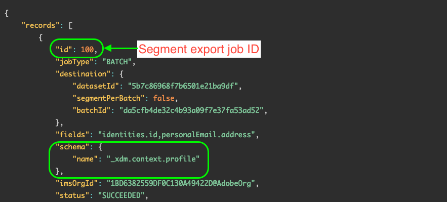

# (Beta) Ativar segmentos de público-alvo para destinos em lote por meio da API de ativação ad-hoc

>[!IMPORTANT]
>
>O [!DNL ad-hoc activation API] no Platform está atualmente em beta. A documentação e a funcionalidade estão sujeitas a alterações.

## Visão geral {#overview}

A API de ativação ad-hoc permite que os profissionais de marketing ativem programaticamente segmentos de público-alvo para destinos, de maneira rápida e eficiente, para situações em que a ativação imediata é necessária.

O diagrama abaixo ilustra o fluxo de trabalho completo para ativar segmentos por meio da API de ativação ad-hoc, incluindo os trabalhos de segmentação que ocorrem na plataforma a cada 24 horas.


>[!NOTE]
>
>A ativação ad-hoc de público-alvo é compatível somente com [destinos com base em arquivo em lote](../destination-types.md#file-based).

## Casos de uso {#use-cases}

### Vendas ou promoções de Flashes

Uma varejista online está preparando uma venda flash limitada e deseja notificar os clientes em um curto prazo. Por meio da API de ativação ad-hoc do Experience Platform, a equipe de marketing pode exportar segmentos sob demanda e enviar rapidamente emails promocionais para a base do cliente.


### Acontecimentos atuais ou notícias de última hora

Um hotel espera tempo de inclinação nos dias seguintes e a equipe quer informar os convidados que chegam rapidamente, para que possam se planejar adequadamente. A equipe de marketing pode usar a API de ativação ad-hoc do Experience Platform para exportar segmentos sob demanda e notificar os convidados.

### Teste de integração

Os gerentes de TI podem usar a API de ativação ad-hoc do Experience Platform para exportar segmentos sob demanda, para que possam testar sua integração personalizada com o Adobe Experience Platform e garantir que tudo esteja funcionando corretamente.


## Medidas de proteção {#guardrails}

Lembre-se das seguintes medidas de proteção ao usar a API de ativação ad hoc.

* Atualmente, cada trabalho de ativação ad-hoc pode ativar até 20 segmentos. Tentar ativar mais de 20 segmentos por trabalho causará falha na tarefa. Esse comportamento está sujeito a alterações em versões futuras.
* Os trabalhos de ativação ad-hoc não podem ser executados em paralelo com o agendado [tarefas de exportação de segmento](../../segmentation/api/export-jobs.md). Antes de executar um trabalho de ativação ad-hoc, verifique se o trabalho de exportação do segmento agendado foi concluído. Consulte [monitoramento de fluxo de dados de destino](../../dataflows/ui/monitor-destinations.md) para obter informações sobre como monitorar o status dos fluxos de ativação. Por exemplo, se o seu fluxo de dados de ativação mostrar uma **[!UICONTROL Processamento]** , aguarde até que ele seja concluído antes de executar o trabalho de ativação ad-hoc.
* Não execute mais de um trabalho de ativação ad hoc simultâneo por segmento.

## Considerações de segmentação {#segmentation-considerations}

O Adobe Experience Platform executa tarefas de segmentação agendadas uma vez a cada 24 horas. A API de ativação ad-hoc é executada com base nos resultados de segmentação mais recentes.

## Etapa 1: Pré-requisitos {#prerequisites}

Antes de poder fazer chamadas para as APIs do Adobe Experience Platform, verifique se você atende aos seguintes pré-requisitos:

* Você tem uma conta da Organização IMS com acesso à Adobe Experience Platform.
* Sua conta do Experience Platform tem a variável `developer` e `user` funções ativadas para o perfil de produto da API do Adobe Experience Platform. Entre em contato com seu [Admin Console](../../access-control/home.md) para ativar essas funções em sua conta.
* Você tem uma Adobe ID. Caso não tenha uma Adobe ID, acesse [Console do Adobe Developer](https://developer.adobe.com/console) e criar uma nova conta.

## Etapa 2: Obter credenciais {#credentials}

Para fazer chamadas para APIs da plataforma, primeiro conclua o [tutorial de autenticação](https://www.adobe.com/go/platform-api-authentication-en). A conclusão do tutorial de autenticação fornece os valores para cada um dos cabeçalhos necessários em todas as chamadas de API do Experience Platform, conforme mostrado abaixo:

* Autorização: Portador `{ACCESS_TOKEN}`
* x-api-key: `{API_KEY}`
* x-gw-ims-org-id: `{ORG_ID}`

Os recursos no Experience Platform podem ser isolados para sandboxes virtuais específicas. Em solicitações para APIs da plataforma, é possível especificar o nome e a ID da sandbox em que a operação ocorrerá. Esses são parâmetros opcionais.

* x-sandbox-name: `{SANDBOX_NAME}`

>[!NOTE]
>
>Para obter mais informações sobre sandboxes no Experience Platform, consulte o [documentação de visão geral da sandbox](../../sandboxes/home.md).

Todas as solicitações que contêm uma carga útil (POST, PUT, PATCH) exigem um cabeçalho de tipo de mídia adicional:

* Tipo de conteúdo: `application/json`

## Etapa 3: Criar fluxo de ativação na interface do usuário da plataforma {#activation-flow}

Antes de ativar segmentos por meio da API de ativação ad-hoc, você deve primeiro ter um fluxo de ativação configurado na interface do usuário da plataforma, para o destino escolhido.

Isso inclui acessar o fluxo de trabalho de ativação, selecionar seus segmentos, configurar um agendamento e ativá-los. Você pode usar a interface do usuário ou a API para criar um fluxo de ativação:

* [Use a interface do usuário da plataforma para criar um fluxo de ativação para destinos de exportação de perfil em lote](../ui/activate-batch-profile-destinations.md)
* [Use a API do Serviço de Fluxo para se conectar aos destinos de exportação de perfis em lote e ativar dados](../api/connect-activate-batch-destinations.md)

## Etapa 4: Obter a ID de trabalho de exportação de segmento mais recente {#segment-export-id}

Após configurar um fluxo de ativação para o destino em lote, os trabalhos de segmentação agendados começam a ser executados automaticamente a cada 24 horas.

Antes de executar o trabalho de ativação ad-hoc, você deve obter a ID do trabalho de exportação do segmento mais recente. Você deve passar essa ID na solicitação do trabalho de ativação ad-hoc.

Siga as instruções descritas [here](../../segmentation/api/export-jobs.md#retrieve-list) para recuperar uma lista de todos os trabalhos de exportação de segmentos.

Na resposta, procure pelo primeiro registro que inclui a propriedade schema abaixo.

```
"schema":{
   "name":"_xdm.context.profile"
}
```

A ID do trabalho de exportação do segmento está no `id` conforme mostrado abaixo.




## Etapa 5: Executar o trabalho de ativação ad-hoc {#activation-job}

O Adobe Experience Platform executa tarefas de segmentação agendadas uma vez a cada 24 horas. A API de ativação ad-hoc é executada com base nos resultados de segmentação mais recentes.

Antes de executar um trabalho de ativação ad-hoc, verifique se o trabalho de exportação de segmentos agendados para seus segmentos foi concluído. Consulte [monitoramento de fluxo de dados de destino](../../dataflows/ui/monitor-destinations.md) para obter informações sobre como monitorar o status dos fluxos de ativação. Por exemplo, se o seu fluxo de dados de ativação mostrar uma **[!UICONTROL Processamento]** , aguarde até que ele seja concluído antes de executar o trabalho de ativação ad-hoc.

Depois que o trabalho de exportação de segmento for concluído, é possível acionar a ativação.

>[!NOTE]
>
>Atualmente, cada trabalho de ativação ad-hoc pode ativar até 20 segmentos. Tentar ativar mais de 20 segmentos por trabalho causará falha na tarefa. Esse comportamento está sujeito a alterações em versões futuras.

### Solicitação

```shell
curl -X POST https://platform.adobe.io/data/core/activation/disflowprovider/adhocrun \
 -H 'Authorization: Bearer {ACCESS_TOKEN}' \
 -H 'Content-Type: application/json' \
 -H 'x-gw-ims-org-id: {ORG_ID}' \
 -H 'x-api-key: {API_KEY}' \
 -d '
{
   "activationInfo":{
      "destinationId1":[
         "segmentId1",
         "segmentId2"
      ],
      "destinationId2":[
         "segmentId2",
         "segmentId3"
      ]
   },
   "exportIds":[
      "exportId1"
   ]
}
```

| Propriedade | Descrição |
| -------- | ----------- |
| <ul><li>`destinationId1`</li><li>`destinationId2`</li></ul> | As IDs das instâncias de destino nas quais você deseja ativar segmentos. Você pode obter essas IDs na interface do usuário da plataforma, navegando até **[!UICONTROL Destinos]** > **[!UICONTROL Procurar]** e clicando na linha de destino desejada para exibir a ID de destino no painel direito. Para obter mais informações, leia a [documentação do espaço de trabalho de destinos](/help/destinations/ui/destinations-workspace.md#browse). |
| <ul><li>`segmentId1`</li><li>`segmentId2`</li><li>`segmentId3`</li></ul> | As IDs dos segmentos que você deseja ativar para o destino selecionado. |
| <ul><li>`exportId1`</li></ul> | A ID retornada na resposta da variável [exportação de segmento](../../segmentation/api/export-jobs.md#retrieve-list) trabalho. Consulte [Etapa 4: Obter a ID de trabalho de exportação de segmento mais recente](#segment-export-id) para obter instruções sobre como encontrar essa ID. |

### Resposta

Uma resposta bem-sucedida retorna o status HTTP 200.

```shell
{
   "order":[
      {
         "segment":"db8961e9-d52f-45bc-b3fb-76d0382a6851",
         "order":"ef2dcbd6-36fc-49a3-afed-d7b8e8f724eb",
         "statusURL":"https://platform.adobe.io/data/foundation/flowservice/runs/88d6da63-dc97-460e-b781-fc795a7386d9"
      }
   ]
}
```

| Propriedade | Descrição |
| -------- | ----------- |
| `segment` | A ID do segmento ativado. |
| `order` | A ID do destino para o qual o segmento foi ativado. |
| `statusURL` | O URL de status do fluxo de ativação. Você pode acompanhar o progresso do fluxo usando o [API de Serviço de Fluxo](../../sources/tutorials/api/monitor.md). |


## Tratamento de erros da API

Os pontos de extremidade da API do Destination SDK seguem os princípios gerais da mensagem de erro da API do Experience Platform. Consulte [Códigos de status da API](../../landing/troubleshooting.md#api-status-codes) e [erros do cabeçalho da solicitação](../../landing/troubleshooting.md#request-header-errors) no guia de solução de problemas da plataforma.
