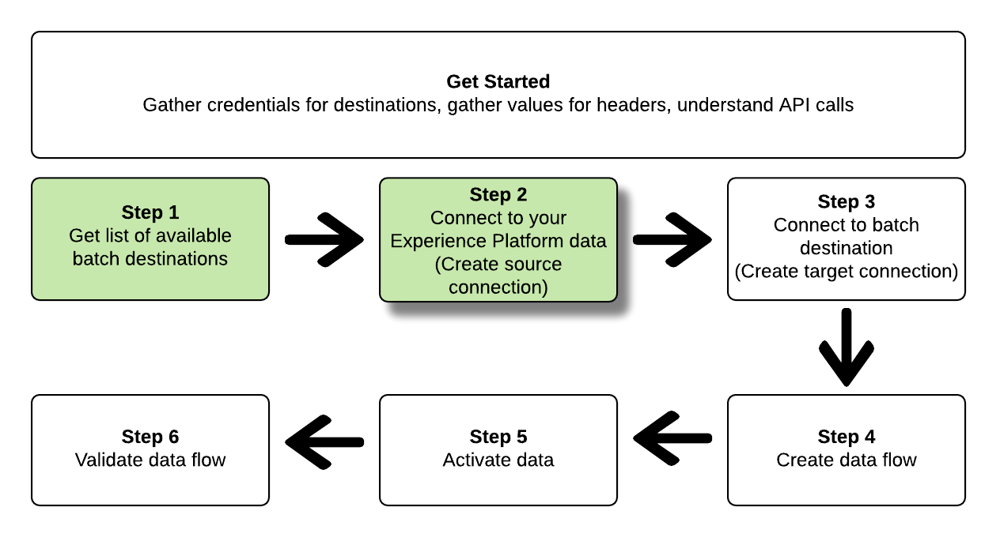

# Conecte-se a destinos em lote e ative dados usando a API do Serviço de Fluxo

>[!IMPORTANT]
> 
>Para se conectar a um destino, é necessário **[!UICONTROL Gerenciar destinos]** [permissão de controle de acesso](/help/access-control/home.md#permissions).
>
>Para ativar os dados, é necessário **[!UICONTROL Gerenciar destinos]**, **[!UICONTROL Ativar destinos]**, **[!UICONTROL Exibir perfis]** e **[!UICONTROL Exibir segmentos]** [permissões de controle de acesso](/help/access-control/home.md#permissions).
>
>Leia o [visão geral do controle de acesso](/help/access-control/ui/overview.md) ou entre em contato com o administrador do produto para obter as permissões necessárias.

Este tutorial demonstra como usar a API do Serviço de Fluxo para criar um lote [armazenamento na nuvem](../catalog/cloud-storage/overview.md) ou [destino de marketing por email](../catalog/email-marketing/overview.md), crie um fluxo de dados para o destino recém-criado e exporte os dados para o destino recém-criado por meio de arquivos CSV.

Este tutorial usa o [!DNL Adobe Campaign] destino em todos os exemplos, mas as etapas são idênticas para todos os destinos de armazenamento em nuvem em lote e marketing por email.


Se preferir usar a interface do usuário da Platform para se conectar a um destino e ativar dados, consulte o [Conectar um destino](../ui/connect-destination.md) e [Ativar dados do público-alvo para destinos de exportação de perfil em lote](../ui/activate-batch-profile-destinations.md) tutoriais.

## Introdução {#get-started}

Este guia requer uma compreensão funcional dos seguintes componentes do Adobe Experience Platform:

* [[!DNL Experience Data Model (XDM) System]](../../xdm/home.md): O quadro normalizado pelo qual [!DNL Experience Platform] organiza os dados de experiência do cliente.
* [[!DNL Segmentation Service]](../../segmentation/api/overview.md): [!DNL Adobe Experience Platform Segmentation Service] permite criar segmentos e gerar públicos-alvo no [!DNL Adobe Experience Platform] do [!DNL Real-time Customer Profile] dados.
* [[!DNL Sandboxes]](../../sandboxes/home.md): [!DNL Experience Platform] fornece sandboxes virtuais que particionam uma única [!DNL Platform] em ambientes virtuais separados para ajudar a desenvolver aplicativos de experiência digital.

As seções a seguir fornecem informações adicionais que você precisa saber para ativar dados para destinos em lote na Platform.

### Obter credenciais necessárias {#gather-required-credentials}

Para concluir as etapas neste tutorial, você deve ter as seguintes credenciais prontas, dependendo do tipo de destino ao qual você está conectando e ativando os segmentos.

* Para [!DNL Amazon S3] conexões: `accessId`, `secretKey`
* Para [!DNL Amazon S3] conexões com [!DNL Adobe Campaign]: `accessId`, `secretKey`
* Para conexões SFTP: `domain`, `port`, `username`, `password` ou `sshKey` (dependendo do método de conexão com o local FTP)
* Para [!DNL Azure Blob] conexões: `connectionString`

>[!NOTE]
>
>As credenciais `accessId`, `secretKey` para [!DNL Amazon S3] conexões e `accessId`, `secretKey` para [!DNL Amazon S3] conexões com [!DNL Adobe Campaign] são idênticas.

### Lendo exemplos de chamadas de API {#reading-sample-api-calls}

Este tutorial fornece exemplos de chamadas de API para demonstrar como formatar suas solicitações do . Isso inclui caminhos, cabeçalhos necessários e cargas de solicitação formatadas corretamente. O JSON de exemplo retornado nas respostas da API também é fornecido. Para obter informações sobre as convenções usadas na documentação para chamadas de API de exemplo, consulte a seção sobre [como ler exemplos de chamadas de API](../../landing/troubleshooting.md#how-do-i-format-an-api-request) no [!DNL Experience Platform] guia de solução de problemas.

### Colete valores para cabeçalhos obrigatórios e opcionais {#gather-values-headers}

Para fazer chamadas para [!DNL Platform] As APIs devem ser concluídas primeiro [tutorial de autenticação](https://www.adobe.com/go/platform-api-authentication-en). A conclusão do tutorial de autenticação fornece os valores para cada um dos cabeçalhos necessários em todos [!DNL Experience Platform] Chamadas de API, conforme mostrado abaixo:

* Autorização: Portador `{ACCESS_TOKEN}`
* x-api-key: `{API_KEY}`
* x-gw-ims-org-id: `{ORG_ID}`

Recursos em [!DNL Experience Platform] podem ser isoladas em sandboxes virtuais específicas. Em solicitações para [!DNL Platform] APIs, é possível especificar o nome e a ID da sandbox em que a operação ocorrerá. Esses são parâmetros opcionais.

* x-sandbox-name: `{SANDBOX_NAME}`

>[!NOTE]
>
>Para obter mais informações sobre sandboxes em [!DNL Experience Platform], consulte o [documentação de visão geral da sandbox](../../sandboxes/home.md).

Todas as solicitações que contêm uma carga útil (POST, PUT, PATCH) exigem um cabeçalho de tipo de mídia adicional:

* Tipo de conteúdo: `application/json`

### Documentação de referência da API {#api-reference-documentation}

Você pode encontrar a documentação de referência complementar para todas as operações da API neste tutorial. Consulte a [Documentação da API do Serviço de fluxo no Adobe I/O](https://www.adobe.io/experience-platform-apis/references/flow-service/). Recomendamos que você use este tutorial e a documentação de referência da API em paralelo.

## Obtenha a lista de destinos disponíveis {#get-the-list-of-available-destinations}


Como primeira etapa, você deve decidir para qual destino ativar os dados. Para começar, execute uma chamada para solicitar uma lista de destinos disponíveis para os quais você pode conectar e ativar segmentos. Execute a seguinte solicitação de GET para o `connectionSpecs` endpoint para retornar uma lista de destinos disponíveis:

**Formato da API**

```http
GET /connectionSpecs
```

**Solicitação**

```shell
curl --location --request GET 'https://platform.adobe.io/data/foundation/flowservice/connectionSpecs' \
--header 'accept: application/json' \
--header 'x-gw-ims-org-id: {ORG_ID}' \
--header 'x-api-key: {API_KEY}' \
--header 'x-sandbox-name: {SANDBOX_NAME}' \
--header 'Authorization: Bearer {ACCESS_TOKEN}'
```


**Resposta**

Uma resposta bem-sucedida contém uma lista de destinos disponíveis e seus identificadores exclusivos (`id`). Armazene o valor do destino que você planeja usar, como ele será necessário em outras etapas. Por exemplo, se você deseja se conectar e entregar segmentos para [!DNL Adobe Campaign], procure o seguinte trecho na resposta:

```json
{
    "id": "0b23e41a-cb4a-4321-a78f-3b654f5d7d97",
  "name": "Adobe Campaign",
  ...
  ...
}
```

Para sua referência, a tabela abaixo contém as IDs de especificação de conexão para destinos de lote comumente usados:

| Destino | ID de especificação de conexão |
---------|----------|
| [!DNL Adobe Campaign] | `0b23e41a-cb4a-4321-a78f-3b654f5d7d97` |
| [!DNL Amazon S3] | `4890fc95-5a1f-4983-94bb-e060c08e3f81` |
| [!DNL Azure Blob] | `e258278b-a4cf-43ac-b158-4fa0ca0d948b` |
| [!DNL Oracle Eloqua] | `c1e44b6b-e7c8-404b-9031-58f0ef760604` |
| [!DNL Oracle Responsys] | `a5e28ddf-e265-426e-83a1-9d03a3a6822b` |
| [!DNL Salesforce Marketing Cloud] | `f599a5b3-60a7-4951-950a-cc4115c7ea27` |
| SFTP | `64ef4b8b-a6e0-41b5-9677-3805d1ee5dd0` |

{style=&quot;table-layout:auto&quot;}

## Conecte-se ao seu [!DNL Experience Platform] dados {#connect-to-your-experience-platform-data}



Em seguida, você deve se conectar ao [!DNL Experience Platform] para que você possa exportar os dados do perfil e ativá-los no destino preferido. É composto por duas subetapas descritas abaixo.

1. Primeiro, você deve executar uma chamada para autorizar o acesso aos dados no [!DNL Experience Platform], configurando uma conexão básica.
2. Em seguida, usando a ID de conexão básica, execute outra chamada na qual crie uma *conexão de origem*, que estabelece a conexão com o [!DNL Experience Platform] dados.

### Autorizar o acesso aos seus dados no [!DNL Experience Platform]

**Formato da API**

```http
POST /connections
```

**Solicitação**

```shell
curl --location --request POST 'https://platform.adobe.io/data/foundation/flowservice/connections' \
--header 'Authorization: Bearer {ACCESS_TOKEN}' \
--header 'x-api-key: {API_KEY}' \
--header 'x-gw-ims-org-id: {ORG_ID}' \
--header 'x-sandbox-name: {SANDBOX_NAME}' \
--header 'Content-Type: application/json' \
--data-raw '{
            "name": "Base connection to Experience Platform",
            "description": "This call establishes the connection to Experience Platform data",
            "connectionSpec": {
                "id": "{CONNECTION_SPEC_ID}",
                "version": "1.0"
            }
}'
```

| Propriedade | Descrição |
| --------- | ----------- |
| `name` | Forneça um nome para a conexão básica com o Experience Platform [!DNL Profile Store]. |
| `description` | Como opção, você pode fornecer uma descrição para a conexão base. |
| `connectionSpec.id` | Use a ID de especificação de conexão para a variável [Loja de perfis do Experience Platform](/help/profile/home.md#profile-data-store) - `8a9c3494-9708-43d7-ae3f-cda01e5030e1`. |

{style=&quot;table-layout:auto&quot;}

**Resposta**

Uma resposta bem-sucedida contém o identificador exclusivo da conexão base (`id`). Armazene esse valor conforme for necessário na próxima etapa para criar a conexão de origem.

```json
{
    "id": "1ed86558-59b5-42f7-9865-5859b552f7f4"
}
```

### Conecte-se ao seu [!DNL Experience Platform] dados {#connect-to-platform-data}

**Formato da API**

```http
POST /sourceConnections
```

**Solicitação**

```shell
curl --location --request POST 'https://platform.adobe.io/data/foundation/flowservice/sourceConnections' \
--header 'Authorization: Bearer {ACCESS_TOKEN}' \
--header 'x-api-key: {API_KEY}' \
--header 'x-gw-ims-org-id: {ORG_ID}' \
--header 'x-sandbox-name: {SANDBOX_NAME}' \
--header 'Content-Type: application/json' \
--data-raw '{
            "name": "Connecting to Profile Store",
            "description": "Optional",
            "connectionSpec": {
                "id": "{CONNECTION_SPEC_ID}",
                "version": "1.0"
            },
            "baseConnectionId": "{BASE_CONNECTION_ID}",
            "data": {
                "format": "CSV",
                "schema": null
            },
            "params" : {}
}'
```

| Propriedade | Descrição |
| --------- | ----------- |
| `name` | Forneça um nome para a conexão de origem com o Experience Platform [!DNL Profile Store]. |
| `description` | Como opção, você pode fornecer uma descrição para a conexão de origem. |
| `connectionSpec.id` | Use a ID de especificação de conexão para a variável [Loja de perfis do Experience Platform](/help/profile/home.md#profile-data-store) - `8a9c3494-9708-43d7-ae3f-cda01e5030e1`. |
| `baseConnectionId` | Use a ID de conexão básica obtida na etapa anterior. |
| `data.format` | `CSV` no momento, é o único formato de exportação de arquivo compatível. |

{style=&quot;table-layout:auto&quot;}

**Resposta**

Uma resposta bem-sucedida retorna o identificador exclusivo (`id`) para a conexão de origem recém-criada para [!DNL Profile Store]. Isso confirma que você se conectou com êxito à [!DNL Experience Platform] dados. Armazene esse valor conforme for necessário em uma etapa posterior.

```json
{
    "id": "ed48ae9b-c774-4b6e-88ae-9bc7748b6e97"
}
```

## Conectar ao destino do lote {#connect-to-batch-destination}


Nesta etapa, você está configurando uma conexão com o armazenamento em nuvem em lote ou com o destino de marketing por email desejado. É composto por duas subetapas descritas abaixo.

1. Primeiro, você deve executar uma chamada para autorizar o acesso à plataforma de destino, configurando uma conexão base.
2. Em seguida, usando a ID de conexão básica, você fará outra chamada na qual criará um *conexão do target*, que especifica o local na conta de armazenamento onde os arquivos de dados exportados serão entregues, bem como o formato dos dados que serão exportados.

### Autorizar acesso ao destino do lote {#authorize-access-to-batch-destination}

**Formato da API**

```http
POST /connections
```

**Solicitação**

A solicitação abaixo estabelece uma conexão básica para [!DNL Adobe Campaign] destinos. Dependendo do local de armazenamento para o qual você deseja exportar arquivos ([!DNL Amazon S3], SFTP, [!DNL Azure Blob]), manter `auth` especificar e excluir as outras.

```shell
curl --location --request POST 'https://platform.adobe.io/data/foundation/flowservice/connections' \
--header 'Authorization: Bearer {ACCESS_TOKEN}' \
--header 'x-api-key: {API_KEY}' \
--header 'x-gw-ims-org-id: {ORG_ID}' \
--header 'x-sandbox-name: {SANDBOX_NAME}' \
--header 'Content-Type: application/json' \
--data-raw '{
    "name": "S3 Connection for Adobe Campaign",
    "description": "summer advertising campaign",
    "connectionSpec": {
        "id": "0b23e41a-cb4a-4321-a78f-3b654f5d7d97",
        "version": "1.0"
    },
    "auth": {
        "specName": "S3",
        "params": {
            "accessId": "{ACCESS_ID}",
            "secretKey": "{SECRET_KEY}"
        }
    }
    "auth": {
        "specName": "SFTP with Password",
        "params": {
            "domain": "{DOMAIN}",
            "host": "{HOST}",
            "username": "{USERNAME}",
            "password": "{PASSWORD}"
        }
    }
    "auth": {
        "specName": "SFTP with SSH Key",
        "params": {
            "domain": "{DOMAIN}",
            "host": "{HOST}",
            "username": "{USERNAME}",
            "sshKey": "{SSH_KEY}"
        }
    }        
    "auth": {
        "specName": "Azure Blob",
        "params": {
            "connectionString": "{AZURE_BLOB_CONNECTION_STRING}"
        }
    }    
}'
```

Consulte o exemplo de solicitações abaixo para se conectar a outros destinos de marketing por email e armazenamento em nuvem em lote com suporte.

+++ Exemplo de solicitação para conexão com o [!DNL Amazon S3] destinos

A solicitação abaixo estabelece uma conexão básica para [!DNL Amazon S3] destinos.

```shell
curl --location --request POST 'https://platform.adobe.io/data/foundation/flowservice/connections' \
--header 'Authorization: Bearer {ACCESS_TOKEN}' \
--header 'x-api-key: {API_KEY}' \
--header 'x-gw-ims-org-id: {ORG_ID}' \
--header 'x-sandbox-name: {SANDBOX_NAME}' \
--header 'Content-Type: application/json' \
--data-raw '{
    "name": "Connect to Amazon S3",
    "description": "summer advertising campaign",
    "connectionSpec": {
        "id": "4890fc95-5a1f-4983-94bb-e060c08e3f81",
        "version": "1.0"
    },
    "auth": {
        "specName": "Access Key",
        "params": {
            "s3AccessKey": "{AMAZON_S3_ACCESS_KEY}",
            "s3SecretKey": "{AMAZON_S3_SECRET_KEY}"
        }
    }
}'
```

+++

+++ Exemplo de solicitação para conexão com o [!DNL Azure Blob] destinos

A solicitação abaixo estabelece uma conexão básica para [!DNL Azure Blob] destinos.

```shell
curl --location --request POST 'https://platform.adobe.io/data/foundation/flowservice/connections' \
--header 'Authorization: Bearer {ACCESS_TOKEN}' \
--header 'x-api-key: {API_KEY}' \
--header 'x-gw-ims-org-id: {ORG_ID}' \
--header 'x-sandbox-name: {SANDBOX_NAME}' \
--header 'Content-Type: application/json' \
--data-raw '{
    "name": "Connect to Azure Blob",
    "description": "Summer advertising campaign",
    "connectionSpec": {
        "id": "e258278b-a4cf-43ac-b158-4fa0ca0d948b",
        "version": "1.0"
    },
    "auth": {
        "specName": "ConnectionString",
        "params": {
            "connectionString": "{AZURE_BLOB_CONNECTION_STRING}"
        }
    }
}'
```

+++

+++ Exemplo de solicitação para conexão com o [!DNL Oracle Eloqua] destinos

A solicitação abaixo estabelece uma conexão básica para [!DNL Oracle Eloqua] destinos. Dependendo do local de armazenamento para o qual você deseja exportar arquivos, mantenha as `auth` especificar e excluir as outras.

```shell
curl --location --request POST 'https://platform.adobe.io/data/foundation/flowservice/connections' \
--header 'Authorization: Bearer {ACCESS_TOKEN}' \
--header 'x-api-key: {API_KEY}' \
--header 'x-gw-ims-org-id: {ORG_ID}' \
--header 'x-sandbox-name: {SANDBOX_NAME}' \
--header 'Content-Type: application/json' \
--data-raw '{
    "name": "Connect to Eloqua destination",
    "description": "summer advertising campaign",
    "connectionSpec": {
        "id": "c1e44b6b-e7c8-404b-9031-58f0ef760604",
        "version": "1.0"
    },
    "auth": {
        "specName": "SFTP with Password",
        "params": {
            "domain": "{DOMAIN}",
            "host": "{HOST}",
            "username": "{USERNAME}",
            "password": "{PASSWORD}"
        }
    }
    "auth": {
        "specName": "SFTP with SSH Key",
        "params": {
            "domain": "{DOMAIN}",
            "host": "{HOST}",
            "username": "{USERNAME}",
            "sshKey": "{SSH_KEY}"
        }
    }    
}'
```

+++

+++ Exemplo de solicitação para conexão com o [!DNL Oracle Responsys] destinos

A solicitação abaixo estabelece uma conexão básica para [!DNL Oracle Responsys] destinos. Dependendo do local de armazenamento para o qual você deseja exportar arquivos, mantenha as `auth` especificar e excluir as outras.

```shell
curl --location --request POST 'https://platform.adobe.io/data/foundation/flowservice/connections' \
--header 'Authorization: Bearer {ACCESS_TOKEN}' \
--header 'x-api-key: {API_KEY}' \
--header 'x-gw-ims-org-id: {ORG_ID}' \
--header 'x-sandbox-name: {SANDBOX_NAME}' \
--header 'Content-Type: application/json' \
--data-raw '{
    "name": "Connect to Responsys destination",
    "description": "summer advertising campaign",
    "connectionSpec": {
        "id": "a5e28ddf-e265-426e-83a1-9d03a3a6822b",
        "version": "1.0"
    },
    "auth": {
        "specName": "SFTP with Password",
        "params": {
            "domain": "{DOMAIN}",
            "host": "{HOST}",
            "username": "{USERNAME}",
            "password": "{PASSWORD}"
        }
    }
    "auth": {
        "specName": "SFTP with SSH Key",
        "params": {
            "domain": "{DOMAIN}",
            "host": "{HOST}",
            "username": "{USERNAME}",
            "sshKey": "{SSH_KEY}"
        }
    }    
}'
```

+++

+++ Exemplo de solicitação para conexão com o [!DNL Salesforce Marketing Cloud] destinos

A solicitação abaixo estabelece uma conexão básica para [!DNL Salesforce Marketing Cloud] destinos. Dependendo do local de armazenamento para o qual você deseja exportar arquivos, mantenha as `auth` especificar e excluir as outras.

```shell
curl --location --request POST 'https://platform.adobe.io/data/foundation/flowservice/connections' \
--header 'Authorization: Bearer {ACCESS_TOKEN}' \
--header 'x-api-key: {API_KEY}' \
--header 'x-gw-ims-org-id: {ORG_ID}' \
--header 'x-sandbox-name: {SANDBOX_NAME}' \
--header 'Content-Type: application/json' \
--data-raw '{
    "name": "Connect to Salesforce Marketing Cloud",
    "description": "summer advertising campaign",
    "connectionSpec": {
        "id": "f599a5b3-60a7-4951-950a-cc4115c7ea27",
        "version": "1.0"
    },
    "auth": {
        "specName": "SFTP with Password",
        "params": {
            "domain": "{DOMAIN}",
            "host": "{HOST}",
            "username": "{USERNAME}",
            "password": "{PASSWORD}"
        }
    }
    "auth": {
        "specName": "SFTP with SSH Key",
        "params": {
            "domain": "{DOMAIN}",
            "host": "{HOST}",
            "username": "{USERNAME}",
            "sshKey": "{SSH_KEY}"
        }
    }    
}'
```

+++

+++ Exemplo de solicitação para se conectar ao SFTP com destinos de senha

A solicitação abaixo estabelece uma conexão básica com destinos SFTP.

```shell
curl --location --request POST 'https://platform.adobe.io/data/foundation/flowservice/connections' \
--header 'Authorization: Bearer {ACCESS_TOKEN}' \
--header 'x-api-key: {API_KEY}' \
--header 'x-gw-ims-org-id: {ORG_ID}' \
--header 'x-sandbox-name: {SANDBOX_NAME}' \
--header 'Content-Type: application/json' \
--data-raw '{
    "name": "Connect to SFTP with password",
    "description": "summer advertising campaign",
    "connectionSpec": {
        "id": "64ef4b8b-a6e0-41b5-9677-3805d1ee5dd0",
        "version": "1.0"
    },
    "auth": {
        "specName": "Basic Authentication for sftp",
        "params": {
            "host": "{HOST}",
            "username": "{USERNAME}",
            "password": "{PASSWORD}"
        }
    }
}'
```

+++

| Propriedade | Descrição |
| --------- | ----------- |
| `name` | Forneça um nome para a conexão base para o destino do lote. |
| `description` | Como opção, você pode fornecer uma descrição para a conexão base. |
| `connectionSpec.id` | Use a ID de especificação de conexão para o destino em lote desejado. Você obteve essa ID na etapa [Obtenha a lista de destinos disponíveis](#get-the-list-of-available-destinations). |
| `auth.specname` | Indica o formato de autenticação para o destino. Para descobrir as especificaçõesName do seu destino, execute um [Chamada de GET para o ponto de extremidade das especificações de conexão](https://developer.adobe.com/experience-platform-apis/references/flow-service/#operation/retrieveConnectionSpec), fornecendo a especificação de conexão do destino desejado. Procure o parâmetro `authSpec.name` na resposta. <br> Por exemplo, para destinos da Adobe Campaign, você pode usar qualquer um dos `S3`, `SFTP with Password`ou `SFTP with SSH Key`. |
| `params` | Dependendo do destino ao qual você está se conectando, você deve fornecer diferentes parâmetros de autenticação obrigatórios. Para conexões Amazon S3, você deve fornecer a ID de acesso e a chave secreta para o local de armazenamento Amazon S3. <br> Para descobrir os parâmetros necessários para o seu destino, execute uma [Chamada de GET para o ponto de extremidade das especificações de conexão](https://developer.adobe.com/experience-platform-apis/references/flow-service/#operation/retrieveConnectionSpec), fornecendo a especificação de conexão do destino desejado. Procure o parâmetro `authSpec.spec.required` na resposta. |

{style=&quot;table-layout:auto&quot;}

**Resposta**

Uma resposta bem-sucedida contém o identificador exclusivo da conexão base (`id`). Armazene esse valor conforme for necessário na próxima etapa para criar uma conexão de destino.

```json
{
    "id": "1ed86558-59b5-42f7-9865-5859b552f7f4"
}
```

### Especificar o local de armazenamento e o formato de dados {#specify-storage-location-data-format}

[!DNL Adobe Experience Platform] exporta dados para marketing por email em lote e destinos de armazenamento em nuvem na forma de [!DNL CSV] arquivos. Nesta etapa, você pode determinar o caminho no local de armazenamento onde os arquivos serão exportados.

>[!IMPORTANT]
> 
>[!DNL Adobe Experience Platform] divide automaticamente os arquivos de exportação em 5 milhões de registros (linhas) por arquivo. Cada linha representa um perfil.
>
>Nomes de arquivos divididos são anexados com um número que indica que o arquivo faz parte de uma exportação maior, desta forma: `filename.csv`, `filename_2.csv`, `filename_3.csv`.

**Formato da API**

```http
POST /targetConnections
```

**Solicitação**

A solicitação abaixo estabelece uma conexão de destino para [!DNL Adobe Campaign] para determinar onde os arquivos exportados serão depositados no local de armazenamento. Dependendo do local de armazenamento para o qual você deseja exportar arquivos, mantenha as `params` especificar e excluir as outras.

```shell
curl --location --request POST 'https://platform.adobe.io/data/foundation/flowservice/targetConnections' \
--header 'Authorization: Bearer {ACCESS_TOKEN}' \
--header 'x-api-key: {API_KEY}' \
--header 'x-gw-ims-org-id: {ORG_ID}' \
--header 'Content-Type: application/json' \
--data-raw '{
    "name": "TargetConnection for Adobe Campaign",
    "description": "Connection to Adobe Campaign",
    "baseConnectionId": "{BASE_CONNECTION_ID}",
    "connectionSpec": {
        "id": "0b23e41a-cb4a-4321-a78f-3b654f5d7d97",
        "version": "1.0"
    },
    "data": {
        "format": "json",
        "schema": {
            "id": "1.0",
            "version": "1.0"
        }
    },
    "params": {
        "mode": "S3",
        "bucketName": "{BUCKET_NAME}",
        "path": "{FILEPATH}",
        "format": "CSV"
    }
    "params": {
        "mode": "AZURE_BLOB",
        "container": "{CONTAINER}",
        "path": "{FILEPATH}",
        "format": "CSV"
    }
    "params": {
        "mode": "FTP",
        "remotePath": "{REMOTE_PATH}",
        "format": "CSV"
    }        
}'
```

Consulte o exemplo de solicitações abaixo para configurar um local de armazenamento para outros destinos de marketing por email e armazenamento em nuvem em lote com suporte.

+++ Exemplo de solicitação para configurar um local de armazenamento para [!DNL Amazon S3] destinos

A solicitação abaixo estabelece uma conexão de destino para [!DNL Amazon S3] para determinar onde os arquivos exportados serão depositados no local de armazenamento.

```shell
curl --location --request POST 'https://platform.adobe.io/data/foundation/flowservice/targetConnections' \
--header 'Authorization: Bearer {ACCESS_TOKEN}' \
--header 'x-api-key: {API_KEY}' \
--header 'x-gw-ims-org-id: {ORG_ID}' \
--header 'Content-Type: application/json' \
--data-raw '{
    "name": "TargetConnection for Amazon S3",
    "description": "Connection to Amazon S3",
    "baseConnectionId": "{BASE_CONNECTION_ID}",
    "connectionSpec": {
        "id": "4890fc95-5a1f-4983-94bb-e060c08e3f81",
        "version": "1.0"
    },
    "data": {
        "format": "json",
        "schema": {
            "id": "1.0",
            "version": "1.0"
        }
    },
    "params": {
        "mode": "Cloud Storage",
        "bucketName": "{BUCKET_NAME}",
        "path": "{FILEPATH}",
        "format": "CSV"
    }
}'
```

+++

+++ Exemplo de solicitação para configurar um local de armazenamento para [!DNL Azure Blob] destinos

A solicitação abaixo estabelece uma conexão de destino para [!DNL Azure Blob] para determinar onde os arquivos exportados serão depositados no local de armazenamento.

```shell
curl --location --request POST 'https://platform.adobe.io/data/foundation/flowservice/targetConnections' \
--header 'Authorization: Bearer {ACCESS_TOKEN}' \
--header 'x-api-key: {API_KEY}' \
--header 'x-gw-ims-org-id: {ORG_ID}' \
--header 'Content-Type: application/json' \
--data-raw '{
    "name": "TargetConnection for Azure Blob",
    "description": "Connection to Azure Blob",
    "baseConnectionId": "{BASE_CONNECTION_ID}",
    "connectionSpec": {
        "id": "e258278b-a4cf-43ac-b158-4fa0ca0d948b",
        "version": "1.0"
    },
    "data": {
        "format": "json",
        "schema": {
            "id": "1.0",
            "version": "1.0"
        }
    },
    "params": {
        "mode": "Cloud Storage",
        "container": "{CONTAINER}",
        "path": "{FILEPATH}",
        "format": "CSV"
    }
}'
```

+++

+++ Exemplo de solicitação para configurar um local de armazenamento para [!DNL Oracle Eloqua] destinos

A solicitação abaixo estabelece uma conexão de destino para [!DNL Oracle Eloqua] para determinar onde os arquivos exportados serão depositados no local de armazenamento. Dependendo do local de armazenamento para o qual você deseja exportar arquivos, mantenha as `params` especificar e excluir as outras.

```shell
curl --location --request POST 'https://platform.adobe.io/data/foundation/flowservice/targetConnections' \
--header 'Authorization: Bearer {ACCESS_TOKEN}' \
--header 'x-api-key: {API_KEY}' \
--header 'x-gw-ims-org-id: {ORG_ID}' \
--header 'Content-Type: application/json' \
--data-raw '{
    "name": "TargetConnection for Oracle Eloqua",
    "description": "Connection to Oracle Eloqua",
    "baseConnectionId": "{BASE_CONNECTION_ID}",
    "connectionSpec": {
        "id": "c1e44b6b-e7c8-404b-9031-58f0ef760604",
        "version": "1.0"
    },
    "data": {
        "format": "json",
        "schema": {
            "id": "1.0",
            "version": "1.0"
        }
    },
    "params": {
        "mode": "S3",
        "bucketName": "{BUCKET_NAME}",
        "path": "{FILEPATH}",
        "format": "CSV"
    }
    "params": {
        "mode": "FTP",
        "remotePath": "{REMOTE_PATH}",
        "format": "CSV"
    }        
}'
```

+++

+++ Exemplo de solicitação para configurar um local de armazenamento para [!DNL Oracle Responsys] destinos

A solicitação abaixo estabelece uma conexão de destino para [!DNL Oracle Responsys] para determinar onde os arquivos exportados serão depositados no local de armazenamento. Dependendo do local de armazenamento para o qual você deseja exportar arquivos, mantenha as `params` especificar e excluir as outras.

```shell
curl --location --request POST 'https://platform.adobe.io/data/foundation/flowservice/targetConnections' \
--header 'Authorization: Bearer {ACCESS_TOKEN}' \
--header 'x-api-key: {API_KEY}' \
--header 'x-gw-ims-org-id: {ORG_ID}' \
--header 'Content-Type: application/json' \
--data-raw '{
    "name": "TargetConnection for Oracle Responsys",
    "description": "Connection to Oracle Responsys",
    "baseConnectionId": "{BASE_CONNECTION_ID}",
    "connectionSpec": {
        "id": "a5e28ddf-e265-426e-83a1-9d03a3a6822b",
        "version": "1.0"
    },
    "data": {
        "format": "json",
        "schema": {
            "id": "1.0",
            "version": "1.0"
        }
    },
    "params": {
        "mode": "S3",
        "bucketName": "{BUCKET_NAME}",
        "path": "{FILEPATH}",
        "format": "CSV"
    }
    "params": {
        "mode": "FTP",
        "remotePath": "{REMOTE_PATH}",
        "format": "CSV"
    }        
}'
```

+++

+++ Exemplo de solicitação para configurar um local de armazenamento para [!DNL Salesforce Marketing Cloud] destinos

A solicitação abaixo estabelece uma conexão de destino para [!DNL Salesforce Marketing Cloud] para determinar onde os arquivos exportados serão depositados no local de armazenamento. Dependendo do local de armazenamento para o qual você deseja exportar arquivos, mantenha as `params` especificar e excluir as outras.

```shell
curl --location --request POST 'https://platform.adobe.io/data/foundation/flowservice/targetConnections' \
--header 'Authorization: Bearer {ACCESS_TOKEN}' \
--header 'x-api-key: {API_KEY}' \
--header 'x-gw-ims-org-id: {ORG_ID}' \
--header 'Content-Type: application/json' \
--data-raw '{
    "name": "TargetConnection for Salesforce Marketing Cloud",
    "description": "Connection to Salesforce Marketing Cloud",
    "baseConnectionId": "{BASE_CONNECTION_ID}",
    "connectionSpec": {
        "id": "f599a5b3-60a7-4951-950a-cc4115c7ea27",
        "version": "1.0"
    },
    "data": {
        "format": "json",
        "schema": {
            "id": "1.0",
            "version": "1.0"
        }
    },
    "params": {
        "mode": "S3",
        "bucketName": "{BUCKET_NAME}",
        "path": "{FILEPATH}",
        "format": "CSV"
    }
    "params": {
        "mode": "FTP",
        "remotePath": "{REMOTE_PATH}",
        "format": "CSV"
    }        
}'
```

+++

+++ Exemplo de solicitação para configurar um local de armazenamento para destinos SFTP

A solicitação abaixo estabelece uma conexão de destino com destinos SFTP, para determinar onde os arquivos exportados chegarão em seu local de armazenamento.

```shell
curl --location --request POST 'https://platform.adobe.io/data/foundation/flowservice/targetConnections' \
--header 'Authorization: Bearer {ACCESS_TOKEN}' \
--header 'x-api-key: {API_KEY}' \
--header 'x-gw-ims-org-id: {ORG_ID}' \
--header 'Content-Type: application/json' \
--data-raw '{
    "name": "TargetConnection for SFTP",
    "description": "Connection to SFTP",
    "baseConnectionId": "{BASE_CONNECTION_ID}",
    "connectionSpec": {
        "id": "64ef4b8b-a6e0-41b5-9677-3805d1ee5dd0",
        "version": "1.0"
    },
    "data": {
        "format": "json",
        "schema": {
            "id": "1.0",
            "version": "1.0"
        }
    },
    "params": {
        "mode": "Cloud Storage",
        "remotePath": "{REMOTE_PATH}",
    }
}'
```

+++


| Propriedade | Descrição |
| --------- | ----------- |
| `name` | Forneça um nome para a conexão de destino para o destino do lote. |
| `description` | Como opção, você pode fornecer uma descrição para a conexão de destino. |
| `baseConnectionId` | Use a ID da conexão básica criada na etapa acima. |
| `connectionSpec.id` | Use a ID de especificação de conexão para o destino em lote desejado. Você obteve essa ID na etapa [Obtenha a lista de destinos disponíveis](#get-the-list-of-available-destinations). |
| `params` | Dependendo do destino ao qual você está se conectando, você deve fornecer diferentes parâmetros necessários para o local de armazenamento. Para conexões Amazon S3, você deve fornecer a ID de acesso e a chave secreta para o local de armazenamento Amazon S3. <br> Para descobrir os parâmetros necessários para o seu destino, execute uma [Chamada de GET para o ponto de extremidade das especificações de conexão](https://developer.adobe.com/experience-platform-apis/references/flow-service/#operation/retrieveConnectionSpec), fornecendo a especificação de conexão do destino desejado. Procure o parâmetro `targetSpec.spec.required` na resposta. |
| `params.mode` | Dependendo do modo suportado para o seu destino, você deve fornecer um valor diferente aqui. Para descobrir os parâmetros necessários para o seu destino, execute uma [Chamada de GET para o ponto de extremidade das especificações de conexão](https://developer.adobe.com/experience-platform-apis/references/flow-service/#operation/retrieveConnectionSpec), fornecendo a especificação de conexão do destino desejado. Procure o parâmetro `targetSpec.spec.properties.mode.enum` em resposta e selecione o modo desejado. |
| `params.bucketName` | Para conexões S3, forneça o nome do compartimento onde os arquivos serão exportados. |
| `params.path` | Para conexões S3, forneça o caminho do arquivo no local de armazenamento onde os arquivos serão exportados. |
| `params.format` | `CSV` no momento, é o único tipo de exportação de arquivo compatível. |

{style=&quot;table-layout:auto&quot;}

**Resposta**

Uma resposta bem-sucedida retorna o identificador exclusivo (`id`) para a conexão de destino recém-criada com o destino do lote. Armazene esse valor conforme for necessário em etapas posteriores.

```json
{
    "id": "12ab90c7-519c-4291-bd20-d64186b62da8"
}
```

## Criar um fluxo de dados {#create-dataflow}


Usando a especificação de fluxo, a conexão de origem e as IDs de conexão de destino obtidas nas etapas anteriores, agora é possível criar um fluxo de dados entre as [!DNL Experience Platform] dados e o destino para onde você exportará os arquivos de dados. Considere esta etapa como a construção do pipeline pelo qual os dados fluirão posteriormente entre [!DNL Experience Platform] e o destino desejado.

Para criar um fluxo de dados, execute uma solicitação de POST como mostrado abaixo, fornecendo os valores mencionados abaixo dentro da carga útil.

**Formato da API**

```http
POST /flows
```

**Solicitação**

```shell
curl -X POST \
'https://platform.adobe.io/data/foundation/flowservice/flows' \
-H 'Authorization: Bearer {ACCESS_TOKEN}' \
-H 'x-api-key: {API_KEY}' \
-H 'x-gw-ims-org-id: {ORG_ID}' \
-H 'x-sandbox-name: {SANDBOX_NAME}' \
-H 'Content-Type: application/json' \
-d  '{
   
        "name": "Activate segments to Adobe Campaign",
        "description": "This operation creates a dataflow which we will later use to activate segments to Adobe Campaign",
        "flowSpec": {
            "id": "{FLOW_SPEC_ID}",
            "version": "1.0"
        },
        "sourceConnectionIds": [
            "{SOURCE_CONNECTION_ID}"
        ],
        "targetConnectionIds": [
            "{TARGET_CONNECTION_ID}"
        ],
        "transformations": [
            {
                "name": "GeneralTransform",
                "params": {
                    "segmentSelectors": {
                        "selectors": []
                    },
                    "profileSelectors": {
                        "selectors": []
                    }
                }
            }
        ]
    }
```

| Propriedade | Descrição |
| --------- | ----------- |
| `name` | Forneça um nome para o fluxo de dados que você está criando. |
| `description` | Como opção, você pode fornecer uma descrição para o fluxo de dados. |
| `flowSpec.Id` | Use a ID de especificação de fluxo para o destino de lote ao qual você deseja se conectar. Para recuperar a ID de especificação de fluxo, execute uma operação de GET no `flowspecs` , como mostrado na [documentação de referência da API das especificações de fluxo](https://www.adobe.io/experience-platform-apis/references/flow-service/#operation/retrieveFlowSpec). Na resposta, procure por `upsTo` e copie a ID correspondente do destino do lote ao qual você deseja se conectar. Por exemplo, para o Adobe Campaign, procure por `upsToCampaign` e copie o `id` parâmetro. |
| `sourceConnectionIds` | Use a ID de conexão de origem obtida na etapa [Conecte-se aos seus dados de Experience Platform](#connect-to-your-experience-platform-data). |
| `targetConnectionIds` | Use a ID de conexão de destino obtida na etapa [Conectar ao destino do lote](#connect-to-batch-destination). |
| `transformations` | Na próxima etapa, você preencherá esta seção com os segmentos e atributos de perfil a serem ativados. |

Para sua referência, a tabela abaixo contém as IDs de especificação de fluxo para destinos de lote comumente usados:

| Destino | ID de especificação de fluxo |
---------|----------|
| Todos os destinos de armazenamento em nuvem ([!DNL Amazon S3], SFTP, [!DNL Azure Blob]) e [!DNL Oracle Eloqua] | `71471eba-b620-49e4-90fd-23f1fa0174d8` |
| [!DNL Oracle Responsys] | `51d675ce-e270-408d-91fc-22717bdf2148` |
| [!DNL Salesforce Marketing Cloud] | `493b2bd6-26e4-4167-ab3b-5e910bba44f0` |

**Resposta**

Uma resposta bem-sucedida retorna a ID (`id`) do fluxo de dados recém-criado e um `etag`. Observe ambos os valores, conforme você precisar na próxima etapa, para ativar segmentos e exportar arquivos de dados.

```json
{
    "id": "8256cfb4-17e6-432c-a469-6aedafb16cd5",
    "etag": "8256cfb4-17e6-432c-a469-6aedafb16cd5"
}
```


## Ativar dados para o novo destino {#activate-data}


Depois de criar todas as conexões e o fluxo de dados, agora é possível ativar os dados do perfil na plataforma de destino. Nesta etapa, selecione quais segmentos e quais atributos de perfil serão exportados para o destino.

Você também pode determinar o formato de nomenclatura de arquivo dos arquivos exportados e quais atributos devem ser usados como [chaves de desduplicação](../ui/activate-batch-profile-destinations.md#mandatory-keys) ou [atributos obrigatórios](../ui/activate-batch-profile-destinations.md#mandatory-attributes). Nesta etapa, você também pode determinar o agendamento para enviar dados para o destino.

Para ativar segmentos no novo destino, você deve executar uma operação JSON PATCH, semelhante ao exemplo abaixo. Você pode ativar vários segmentos e atributos de perfil em uma chamada. Para saber mais sobre o JSON PATCH, consulte o [Especificação RFC](https://tools.ietf.org/html/rfc6902).

**Formato da API**

```http
PATCH /flows
```

**Solicitação**

```shell
curl --location --request PATCH 'https://platform.adobe.io/data/foundation/flowservice/flows/{DATAFLOW_ID}' \
--header 'Authorization: Bearer {ACCESS_TOKEN}' \
--header 'x-api-key: {API_KEY}' \
--header 'x-gw-ims-org-id: {ORG_ID}' \
--header 'Content-Type: application/json' \
--header 'x-sandbox-name: {SANDBOX_NAME}' \
--header 'If-Match: "{ETAG}"' \
--data-raw '[
    {
        "op": "add",
        "path": "/transformations/0/params/segmentSelectors/selectors/-",
        "value": {
            "type": "PLATFORM_SEGMENT",
            "value": {
                "name": "Name of the segment that you are activating",
                "description": "Description of the segment that you are activating",
                "id": "{SEGMENT_ID}",
                "filenameTemplate": "%DESTINATION_NAME%_%SEGMENT_ID%_%DATETIME(YYYYMMdd_HHmmss)%",
                "exportMode": "DAILY_FULL_EXPORT",
                "schedule": {
                    "frequency": "ONCE",
                    "startDate": "2021-12-20",
                    "startTime": "17:00"
                } 
            }
        }
    },
{
        "op": "add",
        "path": "/transformations/0/params/segmentSelectors/selectors/-",
        "value": {
            "type": "PLATFORM_SEGMENT",
            "value": {
                "name": "Name of the segment that you are activating",
                "description": "Description of the segment that you are activating",
                "id": "{SEGMENT_ID}",
                "filenameTemplate": "%DESTINATION_NAME%_%SEGMENT_ID%_%DATETIME(YYYYMMdd_HHmmss)%",
                "exportMode": "DAILY_FULL_EXPORT",
                "schedule": {
                    "frequency": "ONCE",
                    "triggerType": "SCHEDULED",
                    "startDate": "2021-12-20",
                    "startTime": "17:00"
                },   
            }
        }
    },
{
        "op": "add",
        "path": "/transformations/0/params/profileSelectors/selectors/-",
        "value": {
            "type": "JSON_PATH",
            "value": {
                "path": "{PROFILE_ATTRIBUTE}"
            }
        }
    }
]
```

| Propriedade | Descrição |
| --------- | ----------- |
| `{DATAFLOW_ID}` | No URL, use a ID do fluxo de dados criado na etapa anterior. |
| `{ETAG}` | Use a tag obtida na etapa anterior. |
| `{SEGMENT_ID}` | Forneça a ID do segmento que deseja exportar para esse destino. Para recuperar IDs de segmento para os segmentos que você deseja ativar, consulte [recuperar uma definição de segmento](https://www.adobe.io/experience-platform-apis/references/segmentation/#operation/retrieveSegmentDefinitionById) na referência da API do Experience Platform. |
| `{PROFILE_ATTRIBUTE}` | Por exemplo, `"person.lastName"` |
| `op` | A chamada de operação usada para definir a ação necessária para atualizar o fluxo de dados. As operações incluem: `add`, `replace`e `remove`. Para adicionar um segmento a um fluxo de dados, use o `add` operação. |
| `path` | Define a parte do fluxo que deve ser atualizada. Ao adicionar um segmento a um fluxo de dados, use o caminho especificado no exemplo. |
| `value` | O novo valor com o qual você deseja atualizar seu parâmetro. |
| `id` | Especifique a ID do segmento que você está adicionando ao fluxo de dados de destino. |
| `name` | *Opcional*. Especifique o nome do segmento que você está adicionando ao fluxo de dados de destino. Observe que este campo não é obrigatório e você pode adicionar um segmento com êxito ao fluxo de dados de destino sem fornecer seu nome. |
| `filenameTemplate` | Esse campo determina o formato do nome do arquivo dos arquivos exportados para o seu destino. <br> As opções disponíveis são as seguintes: <br> <ul><li>`%DESTINATION_NAME%`: Obrigatório. Os arquivos exportados contêm o nome do destino.</li><li>`%SEGMENT_ID%`: Obrigatório. Os arquivos exportados contêm a ID do segmento exportado.</li><li>`%SEGMENT_NAME%`: Opcional. Os arquivos exportados contêm o nome do segmento exportado.</li><li>`DATETIME(YYYYMMdd_HHmmss)` ou `%TIMESTAMP%`: Opcional. Selecione uma dessas duas opções para que seus arquivos incluam o tempo em que são gerados pelo Experience Platform.</li><li>`custom-text`: Opcional. Substitua esse espaço reservado por qualquer texto personalizado que você gostaria de anexar ao final dos nomes de arquivo.</li></ul> <br> Para obter mais informações sobre como configurar nomes de arquivos, consulte o [configurar nomes de arquivo](/help/destinations/ui/activate-batch-profile-destinations.md#file-names) no tutorial de ativação de destinos em lote. |
| `exportMode` | Obrigatório. Selecione `"DAILY_FULL_EXPORT"` ou `"FIRST_FULL_THEN_INCREMENTAL"`. Para obter mais informações sobre as duas opções, consulte [exportar arquivos completos](/help/destinations/ui/activate-batch-profile-destinations.md#export-full-files) e [exportar arquivos incrementais](/help/destinations/ui/activate-batch-profile-destinations.md#export-incremental-files) no tutorial de ativação de destinos em lote. |
| `startDate` | Selecione a data em que o segmento deve começar a exportar perfis para seu destino. |
| `frequency` | Obrigatório. <br> <ul><li>Para o `"DAILY_FULL_EXPORT"` modo de exportação, é possível selecionar `ONCE` ou `DAILY`.</li><li>Para o `"FIRST_FULL_THEN_INCREMENTAL"` modo de exportação, é possível selecionar `"DAILY"`, `"EVERY_3_HOURS"`, `"EVERY_6_HOURS"`, `"EVERY_8_HOURS"`, `"EVERY_12_HOURS"`.</li></ul> |
| `triggerType` | Para *destinos em lote* somente. Este campo é necessário somente ao selecionar a variável `"DAILY_FULL_EXPORT"` no modo `frequency` seletor. <br> Obrigatório. <br> <ul><li>Selecionar `"AFTER_SEGMENT_EVAL"` para que o trabalho de ativação seja executado imediatamente após a conclusão do trabalho diário de segmentação de lote da Platform. Isso garante que, quando o trabalho de ativação for executado, os perfis mais atualizados sejam exportados para o seu destino.</li><li>Selecionar `"SCHEDULED"` para que o trabalho de ativação seja executado em um horário fixo. Isso garante que os dados do perfil do Experience Platform sejam exportados ao mesmo tempo a cada dia, mas os perfis que você exporta podem não ser os mais atualizados, dependendo se o trabalho de segmentação em lote foi concluído antes do início do trabalho de ativação. Ao selecionar essa opção, você também deve adicionar uma `startTime` para indicar em que momento em UTC as exportações diárias devem ocorrer.</li></ul> |
| `endDate` | Para *destinos em lote* somente. Esse campo é necessário somente ao adicionar um segmento a um fluxo de dados em destinos de exportação de arquivos em lote, como Amazon S3, SFTP ou Azure Blob. <br> Não aplicável ao selecionar `"exportMode":"DAILY_FULL_EXPORT"` e `"frequency":"ONCE"`. <br> Define a data em que os membros do segmento param de ser exportados para o destino. |
| `startTime` | Para *destinos em lote* somente. Esse campo é necessário somente ao adicionar um segmento a um fluxo de dados em destinos de exportação de arquivos em lote, como Amazon S3, SFTP ou Azure Blob. <br> Obrigatório. Selecione a hora em que os arquivos contendo membros do segmento devem ser gerados e exportados para o seu destino. |

{style=&quot;table-layout:auto&quot;}

>[!TIP]
>
> Consulte [Atualizar componentes de um segmento em um fluxo de dados](/help/destinations/api/update-destination-dataflows.md#update-segment) para saber como atualizar vários componentes (modelo de nome de arquivo, tempo de exportação e assim por diante) dos segmentos exportados.

**Resposta**

Procure uma resposta 202 Accepted . Nenhum corpo de resposta é retornado. Para validar se a solicitação estava correta, consulte a próxima etapa, [Validar o fluxo de dados](#validate-dataflow).

## Validar o fluxo de dados {#validate-dataflow}


Como etapa final do tutorial, você deve validar se os segmentos e os atributos do perfil foram corretamente mapeados para o fluxo de dados.

Para validar isso, execute a seguinte solicitação de GET:

**Formato da API**

```http
GET /flows
```

**Solicitação**

```shell
curl --location --request PATCH 'https://platform.adobe.io/data/foundation/flowservice/flows/{DATAFLOW_ID}' \
--header 'Authorization: Bearer {ACCESS_TOKEN}' \
--header 'x-api-key: {API_KEY}' \
--header 'x-gw-ims-org-id: {ORG_ID}' \
--header 'Content-Type: application/json' \
--header 'x-sandbox-name: prod' \
--header 'If-Match: "{ETAG}"' 
```

* `{DATAFLOW_ID}`: Use o fluxo de dados da etapa anterior.
* `{ETAG}`: Use a tag da etapa anterior.

**Resposta**

A resposta retornada deve incluir no `transformations` os segmentos e os atributos do perfil que você enviou na etapa anterior. Uma amostra `transformations` na resposta, pode ser a seguinte:

```json
"transformations":[
   {
      "name":"GeneralTransform",
      "params":{
         "profileSelectors":{
            "selectors":[
               {
                  "type":"JSON_PATH",
                  "value":{
                     "path":"homeAddress.countryCode",
                     "operator":"EXISTS",
                     "mapping":{
                        "sourceType":"text/x.schema-path",
                        "source":"homeAddress.countryCode",
                        "destination":"homeAddress.countryCode",
                        "identity":false,
                        "primaryIdentity":false,
                        "functionVersion":0,
                        "copyModeMapping":false,
                        "sourceAttribute":"homeAddress.countryCode",
                        "destinationXdmPath":"homeAddress.countryCode"
                     }
                  }
               },
               {
                  "type":"JSON_PATH",
                  "value":{
                     "path":"person.name.firstName",
                     "operator":"EXISTS",
                     "mapping":{
                        "sourceType":"text/x.schema-path",
                        "source":"person.name.firstName",
                        "destination":"person.name.firstName",
                        "identity":false,
                        "primaryIdentity":false,
                        "functionVersion":0,
                        "copyModeMapping":false,
                        "sourceAttribute":"person.name.firstName",
                        "destinationXdmPath":"person.name.firstName"
                     }
                  }
               },
               {
                  "type":"JSON_PATH",
                  "value":{
                     "path":"person.name.lastName",
                     "operator":"EXISTS",
                     "mapping":{
                        "sourceType":"text/x.schema-path",
                        "source":"person.name.lastName",
                        "destination":"person.name.lastName",
                        "identity":false,
                        "primaryIdentity":false,
                        "functionVersion":0,
                        "copyModeMapping":false,
                        "sourceAttribute":"person.name.lastName",
                        "destinationXdmPath":"person.name.lastName"
                     }
                  }
               },
               {
                  "type":"JSON_PATH",
                  "value":{
                     "path":"personalEmail.address",
                     "operator":"EXISTS",
                     "mapping":{
                        "sourceType":"text/x.schema-path",
                        "source":"personalEmail.address",
                        "destination":"personalEmail.address",
                        "identity":false,
                        "primaryIdentity":false,
                        "functionVersion":0,
                        "copyModeMapping":false,
                        "sourceAttribute":"personalEmail.address",
                        "destinationXdmPath":"personalEmail.address"
                     }
                  }
               },
               {
                  "type":"JSON_PATH",
                  "value":{
                     "path":"segmentMembership.status",
                     "operator":"EXISTS",
                     "mapping":{
                        "sourceType":"text/x.schema-path",
                        "source":"segmentMembership.status",
                        "destination":"segmentMembership.status",
                        "identity":false,
                        "primaryIdentity":false,
                        "functionVersion":0,
                        "copyModeMapping":false,
                        "sourceAttribute":"segmentMembership.status",
                        "destinationXdmPath":"segmentMembership.status"
                     }
                  }
               }
            ],
            "mandatoryFields":[
               "person.name.firstName",
               "person.name.lastName"
            ],
            "primaryFields":[
               {
                  "fieldType":"ATTRIBUTE",
                  "attributePath":"personalEmail.address"
               }
            ]
         },
         "segmentSelectors":{
            "selectors":[
               {
                  "type":"PLATFORM_SEGMENT",
                  "value":{
                     "id":"9f7d37fd-7039-4454-94ef-2b0cd6c3206a",
                     "name":"Interested in Mountain Biking",
                     "filenameTemplate":"%DESTINATION_NAME%_%SEGMENT_ID%_%DATETIME(YYYYMMdd_HHmmss)%",
                     "exportMode":"DAILY_FULL_EXPORT",
                     "schedule":{
                        "frequency":"ONCE",
                        "startDate":"2021-12-20",
                        "startTime":"17:00"
                     },
                     "createTime":"1640016962",
                     "updateTime":"1642534355"
                  }
               },
               {
                  "type":"PLATFORM_SEGMENT",
                  "value":{
                     "id":"25768be6-ebd5-45cc-8913-12fb3f348613",
                     "name":"Loyalty Segment",
                     "filenameTemplate":"%DESTINATION_NAME%_%SEGMENT_ID%_%DATETIME(YYYYMMdd_HHmmss)%",
                     "exportMode":"FIRST_FULL_THEN_INCREMENTAL",
                     "schedule":{
                        "frequency":"EVERY_6_HOURS",
                        "startDate":"2021-12-22",
                        "endDate":"2021-12-31",
                        "startTime":"17:00"
                     },
                     "createTime":"1640016962",
                     "updateTime":"1642534355"
                  }
               }
            ]
         }
      }
   }
]
```

## Próximas etapas

Ao seguir este tutorial, você conectou com êxito a Platform a um de seus destinos preferidos de armazenamento em nuvem em lote ou marketing por email e configurou um fluxo de dados para o respectivo destino para exportar arquivos de dados. Os dados de saída agora podem ser usados no destino de campanhas de email, publicidade direcionada e muitos outros casos de uso. Consulte as páginas a seguir para obter mais detalhes, como editar fluxos de dados existentes usando a API de Serviço de Fluxo:

* [Visão geral dos destinos](../home.md)
* [Visão geral do catálogo de destinos](../catalog/overview.md)
* [Atualizar fluxos de dados de destino usando a API de Serviço de Fluxo](../api/update-destination-dataflows.md)
