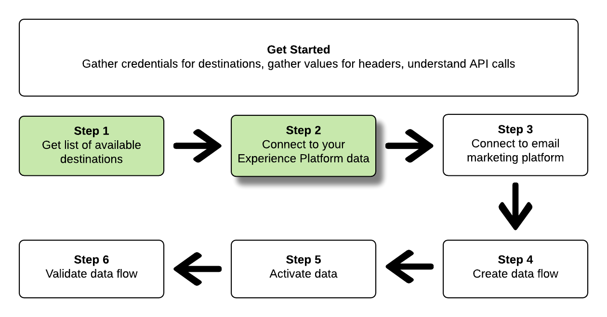

# Conecte-se a destinos de marketing por email e ative dados usando chamadas de API

Este tutorial demonstra como usar chamadas de API para se conectar aos dados da Adobe Experience Platform, criar um [destino de marketing de email](../catalog/email-marketing/overview.md), criar um fluxo de dados para o novo destino criado e ativar dados para o novo destino criado.

Este tutorial usa o destino do Adobe Campaign em todos os exemplos, mas as etapas são idênticas para todos os destinos de marketing por email.


Se preferir usar a interface do usuário no Platform para conectar um destino e ativar dados, consulte os tutoriais [Conectar um destino](../ui/connect-destination.md) e [Ativar perfis e segmentos a um destino](../ui/activate-destinations.md).

## Comece já

Este guia requer uma compreensão funcional dos seguintes componentes da Adobe Experience Platform:

* [[!DNL Experience Data Model (XDM) System]](../../xdm/home.md): A estrutura padronizada pela qual  [!DNL Experience Platform] organiza os dados de experiência do cliente.
* [[!DNL Catalog Service]](../../catalog/home.md):  [!DNL Catalog] é o sistema de registro para localização e linhagem de dados no  [!DNL Experience Platform].
* [[!DNL Sandboxes]](../../sandboxes/home.md):  [!DNL Experience Platform] O fornece sandboxes virtuais que particionam uma única  [!DNL Platform] instância em ambientes virtuais separados para ajudar a desenvolver aplicativos de experiência digital.

As seções a seguir fornecem informações adicionais que você precisará saber para ativar dados para destinos de marketing por email no Platform.

### Obter credenciais necessárias

Para concluir as etapas neste tutorial, você deve ter as seguintes credenciais prontas, dependendo do tipo de destinos aos quais você está conectando e ativando segmentos.

* Para conexões [!DNL Amazon] S3 para plataformas de marketing por email: `accessId`, `secretKey`
* Para conexões SFTP com plataformas de marketing por email: `domain`, `port`, `username`, `password` ou `ssh key` (dependendo do método de conexão com o local FTP)

### Lendo exemplos de chamadas de API

Este tutorial fornece exemplos de chamadas de API para demonstrar como formatar suas solicitações do . Isso inclui caminhos, cabeçalhos necessários e cargas de solicitação formatadas corretamente. O JSON de exemplo retornado nas respostas da API também é fornecido. Para obter informações sobre as convenções usadas na documentação para chamadas de API de exemplo, consulte a seção sobre [como ler chamadas de API de exemplo](../../landing/troubleshooting.md#how-do-i-format-an-api-request) no [!DNL Experience Platform] guia de solução de problemas.

### Colete valores para cabeçalhos obrigatórios e opcionais

Para fazer chamadas para [!DNL Platform] APIs, primeiro complete o [tutorial de autenticação](https://www.adobe.com/go/platform-api-authentication-en). A conclusão do tutorial de autenticação fornece os valores para cada um dos cabeçalhos necessários em todas as chamadas de API [!DNL Experience Platform], conforme mostrado abaixo:

* Autorização: Portador `{ACCESS_TOKEN}`
* x-api-key: `{API_KEY}`
* x-gw-ims-org-id: `{IMS_ORG}`

Os recursos em [!DNL Experience Platform] podem ser isolados para sandboxes virtuais específicas. Em solicitações para [!DNL Platform] APIs, é possível especificar o nome e a ID da sandbox em que a operação ocorrerá. Esses são parâmetros opcionais.

* x-sandbox-name: `{SANDBOX_NAME}`

>[!NOTE]
>
>Para obter mais informações sobre sandboxes em [!DNL Experience Platform], consulte a [documentação de visão geral da sandbox](../../sandboxes/home.md).

Todas as solicitações que contêm uma carga (POST, PUT, PATCH) exigem um cabeçalho de tipo de mídia adicional:

* Tipo de conteúdo: `application/json`

### Documentação do Swagger

Você pode encontrar a documentação de referência complementar para todas as chamadas de API neste tutorial no Swagger. Consulte a documentação da [API do Serviço de Fluxo no Adobe.io](https://www.adobe.io/apis/experienceplatform/home/api-reference.html#!acpdr/swagger-specs/flow-service.yaml). Recomendamos que você use este tutorial e a página de documentação do Swagger em paralelo.

## Obtenha a lista de destinos disponíveis {#get-the-list-of-available-destinations}


Como primeira etapa, você deve decidir para qual destino de marketing por email ativar os dados. Para começar, execute uma chamada para solicitar uma lista de destinos disponíveis para os quais você pode conectar e ativar segmentos. Execute a seguinte solicitação GET no endpoint `connectionSpecs` para retornar uma lista de destinos disponíveis:

**Formato da API**

```http
GET /connectionSpecs
```

**Solicitação**

<!--

```shell
curl -X GET \
    'http://platform.adobe.io/data/foundation/flowservice/connectionSpecs' \
    -H 'Authorization: Bearer {ACCESS_TOKEN}' \
    -H 'x-api-key: {API_KEY}' \
    -H 'x-gw-ims-org-id: {IMS_ORG}' \
    -H 'x-sandbox-name: {SANDBOX_NAME}' \
    -H 'x-sandbox-id: {SANDBOX_ID}' \    
    -H 'Content-Type: application/json' \
```

-->

```shell
curl --location --request GET 'https://platform.adobe.io/data/foundation/flowservice/connectionSpecs' \
--header 'accept: application/json' \
--header 'x-gw-ims-org-id: {IMS_ORG}' \
--header 'x-api-key: {API_KEY}' \
--header 'x-sandbox-name: {SANDBOX_NAME}' \
--header 'Authorization: Bearer {ACCESS_TOKEN}'
```


**Resposta**

Uma resposta bem-sucedida contém uma lista de destinos disponíveis e seus identificadores exclusivos (`id`). Armazene o valor do destino que você planeja usar, como ele será necessário em outras etapas. Por exemplo, se você deseja se conectar e fornecer segmentos ao Adobe Campaign, procure o seguinte trecho na resposta:

```json
{
    "id": "0b23e41a-cb4a-4321-a78f-3b654f5d7d97",
  "name": "Adobe Campaign",
  ...
  ...
}
```

## Conecte-se aos seus [!DNL Experience Platform] dados {#connect-to-your-experience-platform-data}



Em seguida, você deve se conectar aos dados [!DNL Experience Platform] , para que possa exportar os dados do perfil e ativá-los no destino preferido. É composto por duas subetapas descritas abaixo.

1. Primeiro, você deve executar uma chamada para autorizar o acesso aos seus dados em [!DNL Experience Platform], configurando uma conexão base.
2. Em seguida, usando a ID de conexão básica, você fará outra chamada na qual criará uma conexão de origem, que estabelece a conexão com seus dados [!DNL Experience Platform].


### Autorizar acesso aos seus dados em [!DNL Experience Platform]

**Formato da API**

```http
POST /connections
```

**Solicitação**

<!--

```shell
curl -X POST \
    'http://platform.adobe.io/data/foundation/flowservice/connections' \
    -H 'Authorization: Bearer {ACCESS_TOKEN}' \
    -H 'x-api-key: {API_KEY}' \
    -H 'x-gw-ims-org-id: {IMS_ORG}' \
    -H 'x-sandbox-name: {SANDBOX_NAME}' \
    -H 'x-sandbox-id: {SANDBOX_ID}' \ 
    -H 'Content-Type: application/json' \
    -d  '{
            
            "name": "Base connection to Experience Platform",
            "description": "This call establishes the connection to Experience Platform data",
            "connectionSpec": {
                "id": "{CONNECTION_SPEC}",
                "version": "1.0"
            }
           }'
```

-->

```shell
curl --location --request POST 'https://platform.adobe.io/data/foundation/flowservice/connections' \
--header 'Authorization: Bearer {ACCESS_TOKEN}' \
--header 'x-api-key: {API_KEY}' \
--header 'x-gw-ims-org-id: {IMS_ORG}' \
--header 'x-sandbox-name: {SANDBOX_NAME}' \
--header 'Content-Type: application/json' \
--data-raw '{
            "name": "Base connection to Experience Platform",
            "description": "This call establishes the connection to Experience Platform data",
            "connectionSpec": {
                "id": "{CONNECTION_SPEC_ID}",
                "version": "1.0"
            }
}'
```


* `{CONNECTION_SPEC_ID}`: Use a ID de especificação de conexão para o Serviço de perfil unificado -  `8a9c3494-9708-43d7-ae3f-cda01e5030e1`.

**Resposta**

Uma resposta bem-sucedida contém o identificador exclusivo da conexão base (`id`). Armazene esse valor conforme for necessário na próxima etapa para criar a conexão de origem.

```json
{
    "id": "1ed86558-59b5-42f7-9865-5859b552f7f4"
}
```

### Conecte-se aos seus [!DNL Experience Platform] dados {#connect-to-platform-data}

**Formato da API**

```http
POST /sourceConnections
```

**Solicitação**

<!--

```shell
curl -X POST \
    'http://platform.adobe.io/data/foundation/flowservice/sourceConnections' \
    -H 'Authorization: Bearer {ACCESS_TOKEN}' \
    -H 'x-api-key: {API_KEY}' \
    -H 'x-gw-ims-org-id: {IMS_ORG}' \
    -H 'x-sandbox-id: {SANDBOX_ID}' \ 
    -H 'x-sandbox-name: {SANDBOX_NAME}' \
    -H 'Content-Type: application/json' \
    -d  '{
  "name": "Connecting to Unified Profile Service",
  "description": "Optional",
  "baseConnectionId": "{BASE_CONNECTION_ID}",
  "connectionSpec": {
    "id": "{CONNECTION_SPEC}",
    "version": "1.0"
  },
  "data": {
    "format": "CSV",
    "schema": null
  }
  }
```

-->

```shell
curl --location --request POST 'https://platform.adobe.io/data/foundation/flowservice/sourceConnections' \
--header 'Authorization: Bearer {ACCESS_TOKEN}' \
--header 'x-api-key: {API_KEY}' \
--header 'x-gw-ims-org-id: {IMS_ORG}' \
--header 'x-sandbox-name: {SANDBOX_NAME}' \
--header 'Content-Type: application/json' \
--data-raw '{
            "name": "Connecting to Unified Profile Service",
            "description": "Optional",
            "connectionSpec": {
                "id": "{CONNECTION_SPEC_ID}",
                "version": "1.0"
            },
            "baseConnectionId": "{BASE_CONNECTION_ID}",
            "data": {
                "format": "CSV",
                "schema": null
            },
            "params" : {}
}'
```

* `{BASE_CONNECTION_ID}`: Use a ID obtida na etapa anterior.
* `{CONNECTION_SPEC_ID}`: Use a ID de especificação de conexão para  [!DNL Unified Profile Service] -  `8a9c3494-9708-43d7-ae3f-cda01e5030e1`.

**Resposta**

Uma resposta bem-sucedida retorna o identificador exclusivo (`id`) para a conexão de origem recém-criada para [!DNL Unified Profile Service]. Isso confirma que você se conectou com êxito aos dados [!DNL Experience Platform]. Armazene esse valor conforme for necessário em uma etapa posterior.

```json
{
    "id": "ed48ae9b-c774-4b6e-88ae-9bc7748b6e97"
}
```


## Conectar-se ao destino de marketing por email {#connect-to-email-marketing-destination}


Nesta etapa, você está configurando uma conexão com o destino de marketing por email desejado. É composto por duas subetapas descritas abaixo.

1. Primeiro, você deve executar uma chamada para autorizar o acesso ao provedor de serviço de email, configurando uma conexão básica.
2. Em seguida, usando a ID de conexão básica, você fará outra chamada na qual criará uma conexão de destino, que especifica o local em sua conta de armazenamento onde os dados exportados serão entregues, bem como o formato dos dados que serão exportados.

### Autorizar acesso ao destino de marketing por email

**Formato da API**

```http
POST /connections
```

**Solicitação**

<!--

```shell
curl -X POST \
    'http://platform.adobe.io/data/foundation/flowservice/connections' \
    -H 'Authorization: Bearer {ACCESS_TOKEN}' \
    -H 'x-api-key: {API_KEY}' \
    -H 'x-gw-ims-org-id: {IMS_ORG}' \
    -H 'x-sandbox-name: {SANDBOX_NAME}' \
    -H 'x-sandbox-id: {SANDBOX_ID}' \ 
    -H 'Content-Type: application/json' \
    -d  '{
            
            "name": "S3 Connection for Adobe Campaign",
            "description": "ACME company holiday campaign",
            "connectionSpec": {
                "id": "{CONNECTION_SPEC}",
                "version": "1.0"
            },
            "auth": {
                "specName": "{S3 or SFTP}",
                "params": {
                    "accessId": "{ACCESS_ID}",
                    "secretKey": "{SECRET_KEY}"
                }
            }
           }'
```

-->

```shell
curl --location --request POST 'https://platform.adobe.io/data/foundation/flowservice/connections' \
--header 'Authorization: Bearer {ACCESS_TOKEN}' \
--header 'x-api-key: {API_KEY}' \
--header 'x-gw-ims-org-id: {IMS_ORG}' \
--header 'x-sandbox-name: {SANDBOX_NAME}' \
--header 'Content-Type: application/json' \
--data-raw '{
    "name": "S3 Connection for Adobe Campaign",
    "description": "summer advertising campaign",
    "connectionSpec": {
        "id": "{_CONNECTION_SPEC_ID}",
        "version": "1.0"
    },
    "auth": {
        "specName": "{S3 or SFTP}",
        "params": {
            "accessId": "{ACCESS_ID}",
            "secretKey": "{SECRET_KEY}"
        }
    }
}'
```

* `{CONNECTION_SPEC_ID}`: Use a ID de especificação de conexão obtida na etapa  [Obtenha a lista de destinos](#get-the-list-of-available-destinations) disponíveis.
* `{S3 or SFTP}`: preencha o tipo de conexão desejado para esse destino. No [catálogo de destino](../catalog/overview.md), navegue até o destino preferido para ver se os tipos de conexão S3 e/ou SFTP são suportados.
* `{ACCESS_ID}`: Sua ID de acesso para o local de armazenamento  [!DNL Amazon] S3.
* `{SECRET_KEY}`: Sua chave secreta para o local de armazenamento  [!DNL Amazon] S3.

**Resposta**

Uma resposta bem-sucedida contém o identificador exclusivo da conexão base (`id`). Armazene esse valor conforme for necessário na próxima etapa para criar uma conexão de destino.

```json
{
    "id": "1ed86558-59b5-42f7-9865-5859b552f7f4"
}
```

### Especificar o local de armazenamento e o formato de dados

[!DNL Adobe Experience Platform] exporta dados para marketing por email e destinos de armazenamento na nuvem na forma de  [!DNL CSV] arquivos.

>[!IMPORTANT]
> 
>[!DNL Adobe Experience Platform] divide automaticamente os arquivos de exportação em 5 milhões de registros (linhas) por arquivo. Cada linha representa um perfil.
>
>Nomes de arquivos divididos são anexados com um número que indica que o arquivo faz parte de uma exportação maior, desta forma: `filename.csv`, `filename_2.csv`, `filename_3.csv`.

**Formato da API**

```http
POST /targetConnections
```

**Solicitação**

<!--

```shell
curl -X POST \
    'http://platform.adobe.io/data/foundation/flowservice/targetConnections' \
    -H 'Authorization: Bearer {ACCESS_TOKEN}' \
    -H 'x-api-key: {API_KEY}' \
    -H 'x-gw-ims-org-id: {IMS_ORG}' \
    -H 'x-sandbox-name: {SANDBOX_NAME}' \    
    -H 'x-sandbox-id: {SANDBOX_ID}' \ 
    -H 'Content-Type: application/json' \
    -d  '{
   "baseConnectionId": "{BASE_CONNECTION_ID}",
   "name": "TargetConnection for Adobe Campaign",
   "data": {
       "format": "CSV",
       "schema": {
           "id": "1.0",
           "version": "1.0"
       },
    "connectionSpec": {
    "id": "{CONNECTION_SPEC_ID}",
    "version": "1.0"
   },
   "params": {
       "mode": "S3",
       "bucketName": "{BUCKETNAME}",
       "path": "{FILEPATH}"
    }
    }
```

-->

```shell
curl --location --request POST 'https://platform.adobe.io/data/foundation/flowservice/targetConnections' \
--header 'Authorization: Bearer {ACCESS_TOKEN}' \
--header 'x-api-key: {API_KEY}' \
--header 'x-gw-ims-org-id: {IMS_ORG}' \
--header 'Content-Type: application/json' \
--data-raw '{
    "name": "TargetConnection for Adobe Campaign",
    "description": "Connection to Adobe Campaign",
    "baseConnectionId": "{BASE_CONNECTION_ID}",
    "connectionSpec": {
        "id": "{CONNECTION_SPEC_ID}",
        "version": "1.0"
    },
    "data": {
        "format": "json",
        "schema": {
            "id": "1.0",
            "version": "1.0"
        }
    },
    "params": {
        "mode": "S3",
        "bucketName": "{BUCKETNAME}",
        "path": "{FILEPATH}",
        "format": "CSV"
    }
}'
```

* `{BASE_CONNECTION_ID}`: Use a ID de conexão básica obtida na etapa acima.
* `{CONNECTION_SPEC_ID}`: Use a especificação de conexão obtida na etapa  [Obtenha a lista de destinos](#get-the-list-of-available-destinations) disponíveis.
* `{BUCKETNAME}`: Seu bucket  [!DNL Amazon] S3, onde a Platform depositará a exportação de dados.
* `{FILEPATH}`: O caminho no diretório do bucket do  [!DNL Amazon] S3, onde a Platform depositará a exportação de dados.

**Resposta**

Uma resposta bem-sucedida retorna o identificador exclusivo (`id`) para a conexão de destino recém-criada para seu destino de marketing por email. Armazene esse valor conforme for necessário em etapas posteriores.

```json
{
    "id": "12ab90c7-519c-4291-bd20-d64186b62da8"
}
```

## Criar um fluxo de dados


Usando as IDs obtidas nas etapas anteriores, agora é possível criar um fluxo de dados entre seus dados [!DNL Experience Platform] e o destino para o qual você ativará os dados. Pense nesta etapa como construindo o pipeline, por meio do qual os dados fluirão posteriormente, entre [!DNL Experience Platform] e seu destino desejado.

Para criar um fluxo de dados, execute uma solicitação de POST, conforme mostrado abaixo, fornecendo os valores mencionados abaixo dentro da carga útil.

Execute a seguinte solicitação POST para criar um fluxo de dados.

**Formato da API**

```http
POST /flows
```

**Solicitação**

```shell
curl -X POST \
'https://platform.adobe.io/data/foundation/flowservice/flows' \
-H 'Authorization: Bearer {ACCESS_TOKEN}' \
-H 'x-api-key: {API_KEY}' \
-H 'x-gw-ims-org-id: {IMS_ORG}' \
-H 'x-sandbox-name: {SANDBOX_NAME}' \
-H 'Content-Type: application/json' \
-d  '{
   
        "name": "Activate segments to Adobe Campaign",
        "description": "This operation creates a dataflow which we will later use to activate segments to Adobe Campaign",
        "flowSpec": {
            "id": "{FLOW_SPEC_ID}",
            "version": "1.0"
        },
        "sourceConnectionIds": [
            "{SOURCE_CONNECTION_ID}"
        ],
        "targetConnectionIds": [
            "{TARGET_CONNECTION_ID}"
        ],
        "transformations": [
            {
                "name": "GeneralTransform",
                "params": {
                    "segmentSelectors": {
                        "selectors": []
                    },
                    "profileSelectors": {
                        "selectors": []
                    }
                }
            }
        ]
    }
```

* `{FLOW_SPEC_ID}`: Use o fluxo para o destino de marketing por email ao qual você deseja se conectar. Para obter a especificação do fluxo, execute uma operação GET no ponto de extremidade `flowspecs`. Consulte a documentação do Swagger aqui: https://platform.adobe.io/data/foundation/flowservice/swagger#/Flow%20Specs%20API/getFlowSpecs. Na resposta, procure por `upsTo` e copie a ID correspondente do destino de marketing de email ao qual você deseja se conectar. Por exemplo, para o Adobe Campaign, procure por `upsToCampaign` e copie o parâmetro `id`.
* `{SOURCE_CONNECTION_ID}`: Use a ID de conexão de origem obtida na etapa  [Conectar à sua Experience Platform](#connect-to-your-experience-platform-data).
* `{TARGET_CONNECTION_ID}`: Use a ID de conexão de destino obtida na etapa  [Conectar ao destino](#connect-to-email-marketing-destination) de marketing por email.

**Resposta**

Uma resposta bem-sucedida retorna a ID (`id`) do fluxo de dados recém-criado e um `etag`. Observe os dois valores. como você fará na próxima etapa, para ativar segmentos.

```json
{
    "id": "8256cfb4-17e6-432c-a469-6aedafb16cd5",
    "etag": "8256cfb4-17e6-432c-a469-6aedafb16cd5"
}
```


## Ativar dados para o novo destino


Depois de criar todas as conexões e o fluxo de dados, agora você pode ativar os dados do seu perfil na plataforma de marketing por email. Nesta etapa, você seleciona quais segmentos e quais atributos de perfil está enviando para o destino e pode agendar e enviar dados para o destino.

Para ativar segmentos no novo destino, você deve executar uma operação PATCH JSON, semelhante ao exemplo abaixo. Você pode ativar vários segmentos e atributos de perfil em uma chamada. Para saber mais sobre o PATCH JSON, consulte a [especificação RFC](https://tools.ietf.org/html/rfc6902).

**Formato da API**

```http
PATCH /flows
```

**Solicitação**

```shell
curl --location --request PATCH 'https://platform.adobe.io/data/foundation/flowservice/flows/{DATAFLOW_ID}' \
--header 'Authorization: Bearer {ACCESS_TOKEN}' \
--header 'x-api-key: {API_KEY}' \
--header 'x-gw-ims-org-id: {IMS_ORG}' \
--header 'Content-Type: application/json' \
--header 'x-sandbox-name: {SANDBOX_NAME}' \
--header 'If-Match: "{ETAG}"' \
--data-raw '[
    {
        "op": "add",
        "path": "/transformations/0/params/segmentSelectors/selectors/-",
        "value": {
            "type": "PLATFORM_SEGMENT",
            "value": {
                "name": "Name of the segment that you are activating",
                "description": "Description of the segment that you are activating",
                "id": "{SEGMENT_ID}"
            }
        }
    },
        {
        "op": "add",
        "path": "/transformations/0/params/segmentSelectors/selectors/-",
        "value": {
            "type": "PLATFORM_SEGMENT",
            "value": {
                "name": "Name of the segment that you are activating",
                "description": "Description of the segment that you are activating",
                "id": "{SEGMENT_ID}"
            }
        }
    },
        {
        "op": "add",
        "path": "/transformations/0/params/profileSelectors/selectors/-",
        "value": {
            "type": "JSON_PATH",
            "value": {
                "operator": "EXISTS",
                "path": "{PROFILE_ATTRIBUTE}"
            }
        }
    }
]
```

* `{DATAFLOW_ID}`: Use o fluxo de dados obtido na etapa anterior.
* `{ETAG}`: Use a tag obtida na etapa anterior.
* `{SEGMENT_ID}`: Forneça a ID do segmento que deseja exportar para esse destino. Para recuperar IDs de segmento para os segmentos que deseja ativar, vá para **https://www.adobe.io/apis/experienceplatform/home/api-reference.html#/**, selecione **[!UICONTROL API do serviço de segmentação]** no menu de navegação esquerdo e procure a operação `GET /segment/definitions` em **[!UICONTROL Definições de segmento]**.
* `{PROFILE_ATTRIBUTE}`: Por exemplo, `"person.lastName"`

**Resposta**

Procure uma resposta 202 OK. Nenhum corpo de resposta é retornado. Para validar se a solicitação estava correta, consulte a próxima etapa, Validar o fluxo de dados.

## Validar o fluxo de dados


Como etapa final do tutorial, você deve validar se os segmentos e os atributos do perfil foram corretamente mapeados para o fluxo de dados.

Para validar isso, execute a seguinte solicitação GET:

**Formato da API**

```http
GET /flows
```

**Solicitação**

```shell
curl --location --request PATCH 'https://platform.adobe.io/data/foundation/flowservice/flows/{DATAFLOW_ID}' \
--header 'Authorization: Bearer {ACCESS_TOKEN}' \
--header 'x-api-key: {API_KEY}' \
--header 'x-gw-ims-org-id: {IMS_ORG}' \
--header 'Content-Type: application/json' \
--header 'x-sandbox-name: prod' \
--header 'If-Match: "{ETAG}"' 
```

* `{DATAFLOW_ID}`: Use o fluxo de dados da etapa anterior.
* `{ETAG}`: Use a tag da etapa anterior.

**Resposta**

A resposta retornada deve incluir no parâmetro `transformations` os segmentos e atributos de perfil enviados na etapa anterior. Um parâmetro `transformations` de amostra na resposta pode ser semelhante ao abaixo:

```json
"transformations": [
    {
        "name": "GeneralTransform",
        "params": {
            "profileSelectors": {
                "selectors": []
            },
            "segmentSelectors": {
                "selectors": [
                    {
                        "type": "PLATFORM_SEGMENT",
                        "value": {
                            "name": "Men over 50",
                            "description": "",
                            "id": "72ddd79b-6b0a-4e97-a8d2-112ccd81bd02"
                        }
                    }
                ]
            }
        }
    }
],
```

## Próximas etapas

Ao seguir este tutorial, você conectou com sucesso a Plataforma a um de seus destinos de marketing por email preferidos e configurou um fluxo de dados para o respectivo destino. Os dados de saída agora podem ser usados no destino de campanhas de email, publicidade direcionada e muitos outros casos de uso. Consulte as seguintes páginas para obter mais detalhes:

* [Visão geral dos destinos](../home.md)
* [Visão geral do catálogo de destinos](../catalog/overview.md)