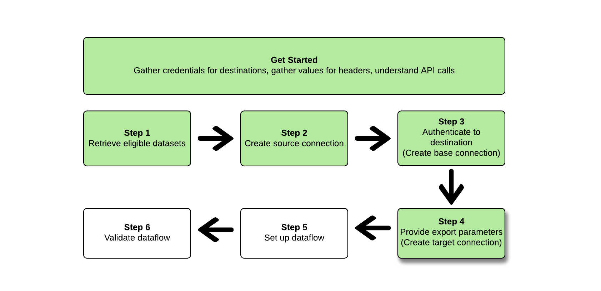

# (Beta) Exportar conjuntos de dados usando o [!DNL Flow Service API]

>[!IMPORTANT]
>
>* A funcionalidade para exportar conjuntos de dados está atualmente na versão beta e não está disponível para todos os usuários. A documentação e a funcionalidade estão sujeitas a alterações.
>* Essa funcionalidade beta suporta a exportação de dados da primeira geração, conforme definido na Real-time Customer Data Platform [descrição do produto](https://helpx.adobe.com/legal/product-descriptions/real-time-customer-data-platform-b2c-edition-prime-and-ultimate-packages.html).
>* Essa funcionalidade está disponível para clientes que compraram o pacote Real-Time CDP Prime ou Ultimate. Entre em contato com o representante da Adobe para obter mais informações.


Este artigo explica o fluxo de trabalho necessário para usar o [!DNL Flow Service API] para exportar [conjuntos de dados](/help/catalog/datasets/overview.md) do Adobe Experience Platform para o local de armazenamento em nuvem de sua preferência, como [!DNL Amazon S3], locais SFTP ou [!DNL Google Cloud Storage].

>[!TIP]
>
>Você também pode usar a interface de usuário do Experience Platform para exportar conjuntos de dados. Leia o [tutorial de exportação da interface do usuário de conjuntos de dados](/help/destinations/ui/export-datasets.md) para obter mais informações.

## Destinos compatíveis {#supported-destinations}

Atualmente, você pode exportar conjuntos de dados para os destinos de armazenamento na nuvem destacados na captura de tela e listados abaixo.


* [[!DNL (Beta) Azure Data Lake Storage Gen2]](../../destinations/catalog/cloud-storage/adls-gen2.md)
* [[!DNL (Beta) Data Landing Zone]](../../destinations/catalog/cloud-storage/data-landing-zone.md)
* [[!DNL (Beta) Google Cloud Storage]](../../destinations/catalog/cloud-storage/google-cloud-storage.md)
* [[!DNL (Beta) Amazon S3]](../../destinations/catalog/cloud-storage/amazon-s3.md#changelog)
* [[!DNL (Beta) Azure Blob]](../../destinations/catalog/cloud-storage/azure-blob.md#changelog)
* [[!DNL (Beta) SFTP]](../../destinations/catalog/cloud-storage/sftp.md#changelog)

## Introdução {#get-started}


Este guia requer uma compreensão funcional dos seguintes componentes do Adobe Experience Platform:

* [[!DNL Experience Platform datasets]](/help/catalog/datasets/overview.md): todos os dados assimilados com sucesso no Adobe Experience Platform são mantidos na [!DNL Data Lake] como conjuntos de dados. Um conjunto de dados é uma construção de armazenamento e gerenciamento para uma coleção de dados, normalmente uma tabela, que contém um esquema (colunas) e campos (linhas). Os conjuntos de dados também contêm metadados que descrevem vários aspectos dos dados armazenados.
* [[!DNL Sandboxes]](../../sandboxes/home.md): [!DNL Experience Platform] O fornece sandboxes virtuais que particionam uma única [!DNL Platform] em ambientes virtuais separados para ajudar a desenvolver aplicativos de experiência digital.

As seções a seguir fornecem as informações adicionais que você precisa saber para exportar conjuntos de dados para destinos de armazenamento na nuvem na Platform.

### Permissões necessárias {#permissions}

Para exportar conjuntos de dados, é necessário **[!UICONTROL Gerenciar destinos]**, **[!UICONTROL Exibir destinos]**, **[!UICONTROL Ativar destinos]**, e **[!UICONTROL Gerenciar e ativar destinos do conjunto de dados]** [permissões de controle de acesso](/help/access-control/home.md#permissions). Leia o [visão geral do controle de acesso](/help/access-control/ui/overview.md) ou entre em contato com o administrador do produto para obter as permissões necessárias.

Para garantir que você tenha as permissões necessárias para exportar conjuntos de dados e que o destino seja compatível com a exportação de conjuntos de dados, navegue pelo catálogo de destinos. Se um destino tiver um **[!UICONTROL Ativar]** ou um **[!UICONTROL Exportar conjuntos de dados]** , você terá as permissões apropriadas.

### Leitura de chamadas de API de amostra {#reading-sample-api-calls}

Este tutorial fornece exemplos de chamadas de API para demonstrar como formatar suas solicitações. Isso inclui caminhos, cabeçalhos necessários e cargas de solicitação formatadas corretamente. O exemplo de JSON retornado nas respostas da API também é fornecido. Para obter informações sobre as convenções usadas na documentação para chamadas de API de exemplo, consulte a seção sobre [como ler chamadas de API de exemplo](../../landing/troubleshooting.md#how-do-i-format-an-api-request) no [!DNL Experience Platform] guia de solução de problemas.

### Colete valores para cabeçalhos obrigatórios e opcionais {#gather-values-headers}

Para fazer chamadas para [!DNL Platform] APIs, primeiro conclua o [Tutorial de autenticação Experience Platform](https://www.adobe.com/go/platform-api-authentication-en). Concluir o tutorial de autenticação fornece os valores para cada um dos cabeçalhos necessários em todos os [!DNL Experience Platform] Chamadas de API, conforme mostrado abaixo:

* Autorização: Portador `{ACCESS_TOKEN}`
* x-api-key: `{API_KEY}`
* x-gw-ims-org-id: `{ORG_ID}`

Recursos no [!DNL Experience Platform] podem ser isolados em sandboxes virtuais específicas. Em solicitações para [!DNL Platform] , você pode especificar o nome e a ID da sandbox em que a operação ocorrerá. Esses parâmetros são opcionais.

* x-sandbox-name: `{SANDBOX_NAME}`

>[!NOTE]
>
>Para obter mais informações sobre sandboxes no [!DNL Experience Platform], consulte o [documentação de visão geral da sandbox](../../sandboxes/home.md).

Todas as solicitações que contêm uma carga (POST, PUT, PATCH) exigem um cabeçalho de tipo de mídia adicional:

* Tipo de conteúdo: `application/json`

### Documentação de referência da API {#api-reference-documentation}

Você pode encontrar a documentação de referência de acompanhamento para todas as operações de API neste tutorial. Consulte a [[!DNL Flow Service] - Documentação da API de destinos no site da Adobe Developer](https://developer.adobe.com/experience-platform-apis/references/destinations/). Recomendamos que você use este tutorial e a documentação de referência da API em paralelo.

### Glossário {#glossary}

Para obter descrições dos termos que você encontrará neste tutorial sobre APIs, leia as [seção de glossário](https://developer.adobe.com/experience-platform-apis/references/destinations/#tag/Glossary) da documentação de referência da API.

### Colete especificações de conexão e especificações de fluxo para o destino desejado {#gather-connection-spec-flow-spec}

Antes de iniciar o fluxo de trabalho para exportar um conjunto de dados, identifique a especificação da conexão e as IDs de especificação do fluxo do destino para o qual você pretende exportar conjuntos de dados. Use a tabela abaixo como referência.


| Destino | Especificação da conexão | Especificação de fluxo |
---------|----------|---------|
| [!DNL Amazon S3] | `4fce964d-3f37-408f-9778-e597338a21ee` | `269ba276-16fc-47db-92b0-c1049a3c131f` |
| [!DNL Azure Blob Storage] | `6d6b59bf-fb58-4107-9064-4d246c0e5bb2` | `95bd8965-fc8a-4119-b9c3-944c2c2df6d2` |
| [!DNL Azure Data Lake Gen 2(ADLS Gen2)] | `be2c3209-53bc-47e7-ab25-145db8b873e1` | `17be2013-2549-41ce-96e7-a70363bec293` |
| [!DNL Data Landing Zone(DLZ)] | `10440537-2a7b-4583-ac39-ed38d4b848e8` | `cd2fc47e-e838-4f38-a581-8fff2f99b63a` |
| [!DNL Google Cloud Storage] | `c5d93acb-ea8b-4b14-8f53-02138444ae99` | `585c15c4-6cbf-4126-8f87-e26bff78b657` |
| SFTP | `36965a81-b1c6-401b-99f8-22508f1e6a26` | `354d6aad-4754-46e4-a576-1b384561c440` |

{style="table-layout:auto"}

Você precisa dessas IDs para criar vários [!DNL Flow Service] entidades. Também é necessário consultar partes do [!DNL Connection Spec] próprio para configurar determinadas entidades para que você possa recuperar a [!DNL Connection Spec] de [!DNL Flow Service APIs]. Veja os exemplos abaixo de recuperação das especificações de conexão para todos os destinos na tabela:

>[!BEGINTABS]

>[!TAB Amazon S3]

**Solicitação**

+++Recuperar [!DNL connection spec] para [!DNL Amazon S3]

```shell
curl --location --request GET 'https://platform.adobe.io/data/foundation/flowservice/connectionSpecs/4fce964d-3f37-408f-9778-e597338a21ee' \
--header 'accept: application/json' \
--header 'x-api-key: {API_KEY}' \
--header 'x-gw-ims-org-id: {ORG_ID}' \
--header 'x-sandbox-name: {SANDBOX_NAME}' \
--header 'Authorization: Bearer {ACCESS_TOKEN}'
```

+++

**Resposta**

+++[!DNL Amazon S3] - Especificação da conexão

```json
{
    "items": [
        {
            "id": "4fce964d-3f37-408f-9778-e597338a21ee",
            "name": "Amazon S3",
            "providerId": "14e34fac-d307-11e9-bb65-2a2ae2dbcce4",
            "version": "1.0",
//...
```

+++

>[!TAB Armazenamento Azure Blob]

**Solicitação**

+++Recuperar [!DNL connection spec] para [!DNL Azure Blob Storage]

```shell
curl --location --request GET 'https://platform.adobe.io/data/foundation/flowservice/connectionSpecs/6d6b59bf-fb58-4107-9064-4d246c0e5bb2' \
--header 'accept: application/json' \
--header 'x-api-key: {API_KEY}' \
--header 'x-gw-ims-org-id: {ORG_ID}' \
--header 'x-sandbox-name: {SANDBOX_NAME}' \
--header 'Authorization: Bearer {ACCESS_TOKEN}'
```

+++

**Resposta**

+++[!DNL Azure Blob Storage] - [!DNL Connection spec]

```json
{
    "items": [
        {
            "id": "6d6b59bf-fb58-4107-9064-4d246c0e5bb2",
            "name": "Azure Blob Storage",
            "providerId": "14e34fac-d307-11e9-bb65-2a2ae2dbcce4",
            "version": "1.0",
//...
```

+++

>[!TAB Azure Data Lake Gen 2(ADLS Gen2)]

**Solicitação**

+++Recuperar [!DNL connection spec] para [!DNL Azure Data Lake Gen 2(ADLS Gen2])

```shell
curl --location --request GET 'https://platform.adobe.io/data/foundation/flowservice/connectionSpecs/be2c3209-53bc-47e7-ab25-145db8b873e1' \
--header 'accept: application/json' \
--header 'x-api-key: {API_KEY}' \
--header 'x-gw-ims-org-id: {ORG_ID}' \
--header 'x-sandbox-name: {SANDBOX_NAME}' \
--header 'Authorization: Bearer {ACCESS_TOKEN}'
```

+++

**Resposta**

+++[!DNL Azure Data Lake Gen 2(ADLS Gen2)] - [!DNL Connection spec]

```json
{
    "items": [
        {
            "id": "be2c3209-53bc-47e7-ab25-145db8b873e1",
            "name": "Azure Data Lake Gen2",
            "providerId": "14e34fac-d307-11e9-bb65-2a2ae2dbcce4",
            "version": "1.0",
//...
```

+++

>[!TAB Zona de aterrissagem de dados (DLZ)]

**Solicitação**

+++Recuperar [!DNL connection spec] para [!DNL Data Landing Zone(DLZ)]

```shell
curl --location --request GET 'https://platform.adobe.io/data/foundation/flowservice/connectionSpecs/10440537-2a7b-4583-ac39-ed38d4b848e8' \
--header 'accept: application/json' \
--header 'x-api-key: {API_KEY}' \
--header 'x-gw-ims-org-id: {ORG_ID}' \
--header 'x-sandbox-name: {SANDBOX_NAME}' \
--header 'Authorization: Bearer {ACCESS_TOKEN}'
```

+++

**Resposta**

+++[!DNL Data Landing Zone(DLZ)] - [!DNL Connection spec]

```json
{
    "items": [
        {
            "id": "10440537-2a7b-4583-ac39-ed38d4b848e8",
            "name": "Data Landing Zone",
            "providerId": "14e34fac-d307-11e9-bb65-2a2ae2dbcce4",
            "version": "1.0",
//...
```

+++

>[!TAB Armazenamento em nuvem Google]

**Solicitação**

+++Recuperar [!DNL connection spec] para [!DNL Google Cloud Storage]

```shell
curl --location --request GET 'https://platform.adobe.io/data/foundation/flowservice/connectionSpecs/c5d93acb-ea8b-4b14-8f53-02138444ae99' \
--header 'accept: application/json' \
--header 'x-api-key: {API_KEY}' \
--header 'x-gw-ims-org-id: {ORG_ID}' \
--header 'x-sandbox-name: {SANDBOX_NAME}' \
--header 'Authorization: Bearer {ACCESS_TOKEN}'
```

+++

**Resposta**

+++[!DNL Google Cloud Storage] - [!DNL Connection spec]

```json
{
    "items": [
        {
            "id": "c5d93acb-ea8b-4b14-8f53-02138444ae99",
            "name": "Google Cloud Storage",
            "providerId": "14e34fac-d307-11e9-bb65-2a2ae2dbcce4",
            "version": "1.0",
//...
```

+++

>[!TAB SFTP]

**Solicitação**

+++Recuperar [!DNL connection spec] para SFTP

```shell
curl --location --request GET 'https://platform.adobe.io/data/foundation/flowservice/connectionSpecs/36965a81-b1c6-401b-99f8-22508f1e6a26' \
--header 'accept: application/json' \
--header 'x-api-key: {API_KEY}' \
--header 'x-gw-ims-org-id: {ORG_ID}' \
--header 'x-sandbox-name: {SANDBOX_NAME}' \
--header 'Authorization: Bearer {ACCESS_TOKEN}'
```

+++

**Resposta**

+++SFTP - [!DNL Connection spec]

```json
{
    "items": [
        {
            "id": "36965a81-b1c6-401b-99f8-22508f1e6a26",
            "name": "SFTP",
            "providerId": "14e34fac-d307-11e9-bb65-2a2ae2dbcce4",
            "version": "1.0",
//...
```

+++

>[!ENDTABS]

Siga as etapas abaixo para configurar um fluxo de dados do conjunto de dados para um destino de armazenamento na nuvem. Para algumas etapas, as solicitações e respostas diferem entre os vários destinos de armazenamento na nuvem. Nesses casos, use as guias da página para recuperar as solicitações e respostas específicas ao destino ao qual deseja se conectar e exportar conjuntos de dados. Certifique-se de usar o método correto [!DNL connection spec] e [!DNL flow spec] para o destino que você está configurando.

## Recuperar uma lista de conjuntos de dados {#retrieve-list-of-available-datasets}


Para recuperar uma lista de conjuntos de dados qualificados para ativação, comece fazendo uma chamada de API para o endpoint abaixo.

>[!BEGINSHADEBOX]

**Solicitação**

+++Recuperar conjuntos de dados qualificados - Solicitação

```shell
curl --location --request GET 'https://platform.adobe.io/data/foundation/flowservice/connectionSpecs/23598e46-f560-407b-88d5-ea6207e49db0/configs?outputType=activationDatasets&outputField=datasets&start=0&limit=20&properties=name,state' \
--header 'accept: application/json' \
--header 'x-gw-ims-org-id: {ORG_ID}' \
--header 'x-api-key: {API_KEY}' \
--header 'x-sandbox-name: {SANDBOX_NAME}' \
--header 'Authorization: Bearer {ACCESS_TOKEN}'
```

Observe que para recuperar conjuntos de dados qualificados, a variável [!DNL connection spec] A ID usada no URL da solicitação deve ser a ID da especificação da conexão de origem do data lake, `23598e46-f560-407b-88d5-ea6207e49db0`, e os dois parâmetros de consulta `outputField=datasets` e `outputType=activationDatasets` deve ser especificado. Todos os outros parâmetros de consulta são os parâmetros padrão compatíveis com o [API do serviço de catálogo](https://developer.adobe.com/experience-platform-apis/references/catalog/).

+++

**Resposta**

+++Recuperar conjuntos de dados - Resposta

```json
{
    "items": [
        {
            "id": "5ef3e324052581191aa6a466",
            "name": "AAM Authenticated Profiles Meta Data",
            "description": "Activation profile export dataset",
            "fileDescription": {
                "persisted": true,
                "containerFormat": "parquet",
                "format": "parquet"
            },
            "aspect": "production",
            "state": "DRAFT"
        },
        {
            "id": "5ef3e3259ad2a1191ab7dd7d",
            "name": "AAM Devices Data",
            "description": "Activation profile export dataset",
            "fileDescription": {
                "persisted": true,
                "containerFormat": "parquet",
                "format": "parquet"
            },
            "aspect": "production",
            "state": "DRAFT"
        },
        {
            "id": "5ef3e325582424191b1beb42",
            "name": "AAM Devices Profile Meta Data",
            "description": "Activation profile export dataset",
            "fileDescription": {
                "persisted": true,
                "containerFormat": "parquet",
                "format": "parquet"
            },
            "aspect": "production",
            "state": "DRAFT"
        },
        {
            "id": "5ef3e328582424191b1beb44",
            "name": "AAM Realtime",
            "description": "Activation profile export dataset",
            "fileDescription": {
                "persisted": true,
                "containerFormat": "parquet",
                "format": "parquet"
            },
            "aspect": "production",
            "state": "DRAFT"
        },
        {
            "id": "5ef3e328fe742a191b2b3ea5",
            "name": "AAM Realtime Profile Updates",
            "description": "Activation profile export dataset",
            "fileDescription": {
                "persisted": true,
                "containerFormat": "parquet",
                "format": "parquet"
            },
            "aspect": "production",
            "state": "DRAFT"
        }
    ],
    "pageInfo": {
        "start": 0,
        "end": 4,
        "total": 149,
        "hasNext": true
    }
}
```

+++

>[!ENDSHADEBOX]

Uma resposta bem-sucedida contém uma lista de conjuntos de dados qualificados para ativação. Esses conjuntos de dados podem ser usados ao criar a conexão de origem na próxima etapa.

Para obter informações sobre os vários parâmetros de resposta para cada conjunto de dados retornado, consulte o [Documentação do desenvolvedor da API de conjuntos de dados](https://developer.adobe.com/experience-platform-apis/references/catalog/#tag/Datasets/operation/listDatasets).

## Criar uma conexão de origem {#create-source-connection}


Após recuperar a lista de conjuntos de dados que deseja exportar, você pode criar uma conexão de origem usando essas IDs de conjunto de dados.

>[!BEGINSHADEBOX]

**Solicitação**

+++Criar conexão de origem - Solicitação

Observe as linhas destacadas com comentários em linha no exemplo de solicitação, que fornecem informações adicionais. Remova os comentários em linha na solicitação ao copiar e colar a solicitação no terminal de sua escolha.

```shell {line-numbers="true" start-line="1" highlight="12,16"}
curl --location --request POST 'https://platform.adobe.io/data/foundation/flowservice/sourceConnections' \
--header 'accept: application/json' \
--header 'x-api-key: {API_KEY}' \
--header 'x-gw-ims-org-id: {ORG_ID}' \
--header 'x-sandbox-name: {SANDBOX_NAME}' \
--header 'Content-Type: application/json' \
--header 'Authorization: Bearer {ACCESS_TOKEN}' \
--data-raw '{
  "name": "Connecting to Data Lake",
  "description": "Data Lake source connection to export datasets",
  "connectionSpec": {
    "id": "23598e46-f560-407b-88d5-ea6207e49db0", // this connection spec ID is always the same for Source Connections
    "version": "1.0"
  },
  "params": {
    "datasets": [ // datasets to activate
      {
        "dataSetId": "5ef3e3259ad2a1191ab7dd7d",
        "name": "AAM Devices Data"
      }
    ]
  }
}'
```

+++


**Resposta**

+++Criar conexão de origem - Resposta

```json
{
    "id": "900df191-b983-45cd-90d5-4c7a0326d650",
    "etag": "\"0500ebe1-0000-0200-0000-63e28d060000\""
}
```

+++

>[!ENDSHADEBOX]

Uma resposta bem-sucedida retorna a ID (`id`) da conexão de origem recém-criada e um `etag`. Anote a ID da conexão de origem, pois ela será necessária posteriormente ao criar o fluxo de dados.

Lembre-se também que:

* A conexão de origem criada nesta etapa precisa ser vinculada a um fluxo de dados para que seus conjuntos de dados sejam ativados para um destino. Consulte a [criar um fluxo de dados](#create-dataflow) para obter informações sobre como vincular uma conexão de origem a um fluxo de dados.
* As IDs do conjunto de dados de uma conexão de origem não podem ser modificadas após a criação. Se você precisar adicionar ou remover conjuntos de dados de uma conexão de origem, crie uma nova conexão de origem e vincule a ID da nova conexão de origem ao fluxo de dados.

## Criar uma conexão de base (destino) {#create-base-connection}


Uma conexão base armazena com segurança as credenciais no destino. Dependendo do tipo de destino, as credenciais necessárias para a autenticação nesse destino podem variar. Para localizar esses parâmetros de autenticação, primeiro recupere o [!DNL connection spec] para o destino desejado, conforme descrito na seção [Colete especificações de conexão e especificações de fluxo](#gather-connection-spec-flow-spec) e, em seguida, olhe para o `authSpec` da resposta. Consulte as guias abaixo para a `authSpec` propriedades de todos os destinos compatíveis.

>[!BEGINTABS]

>[!TAB Amazon S3]

+++[!DNL Amazon S3] - [!DNL Connection spec] mostrando [!DNL auth spec]

Observe a linha realçada com comentários em linha no [!DNL connection spec] exemplo abaixo, que fornecem informações adicionais sobre onde encontrar os parâmetros de autenticação no [!DNL connection spec].

```json {line-numbers="true" start-line="1" highlight="8"}
{
    "items": [
        {
            "id": "4fce964d-3f37-408f-9778-e597338a21ee",
            "name": "Amazon S3",
            "providerId": "14e34fac-d307-11e9-bb65-2a2ae2dbcce4",
            "version": "1.0",
            "authSpec": [ // describes the authentication parameters
                {
                    "name": "Access Key",
                    "type": "KeyBased",
                    "spec": {
                        "$schema": "http://json-schema.org/draft-07/schema#",
                        "description": "Defines auth params required for connecting to amazon-s3",
                        "type": "object",
                        "properties": {
                            "s3AccessKey": {
                                "description": "Access key id",
                                "type": "string",
                                "pattern": "^[A-Z2-7]{20}$"
                            },
                            "s3SecretKey": {
                                "description": "Secret access key for the user account",
                                "type": "string",
                                "format": "password",
                                "pattern": "^[A-Za-z0-9\/\\+]{40}$"
                            }
                        },
                        "required": [
                            "s3SecretKey",
                            "s3AccessKey"
                        ]
                    }
                }
            ],
//...
```

+++

>[!TAB Armazenamento Azure Blob]

+++[!DNL Azure Blob Storage] - [!DNL Connection spec] mostrando [!DNL auth spec]

Observe a linha realçada com comentários em linha no [!DNL connection spec] exemplo abaixo, que fornecem informações adicionais sobre onde encontrar os parâmetros de autenticação no [!DNL connection spec].

```json {line-numbers="true" start-line="1" highlight="8"}
{
    "items": [
        {
            "id": "6d6b59bf-fb58-4107-9064-4d246c0e5bb2",
            "name": "Azure Blob Storage",
            "providerId": "14e34fac-d307-11e9-bb65-2a2ae2dbcce4",
            "version": "1.0",
            "authSpec": [ // describes the authentication parameters
                {
                    "name": "ConnectionString",
                    "type": "ConnectionString",
                    "spec": {
                        "$schema": "http://json-schema.org/draft-07/schema#",
                        "description": "Connection String for Azure Blob based destinations",
                        "type": "object",
                        "properties": {
                            "connectionString": {
                                "description": "connection string for login",
                                "type": "string",
                                "format": "password"
                            }
                        },
                        "required": [
                            "connectionString"
                        ]
                    }
                }
            ],
//...
```

+++


>[!TAB Azure Data Lake Gen 2(ADLS Gen2)]

+++[!DNL Azure Data Lake Gen 2(ADLS Gen2)] - [!DNL Connection spec] mostrando [!DNL auth spec]

Observe a linha realçada com comentários em linha no [!DNL connection spec] exemplo abaixo, que fornecem informações adicionais sobre onde encontrar os parâmetros de autenticação no [!DNL connection spec].

```json {line-numbers="true" start-line="1" highlight="8"}
{
    "items": [
        {
            "id": "be2c3209-53bc-47e7-ab25-145db8b873e1",
            "name": "Azure Data Lake Gen2",
            "providerId": "14e34fac-d307-11e9-bb65-2a2ae2dbcce4",
            "version": "1.0",
            "authSpec": [ // describes the authentication parameters
                {
                    "name": "Azure Service Principal Auth",
                    "type": "AzureServicePrincipal",
                    "spec": {
                        "$schema": "http://json-schema.org/draft-07/schema#",
                        "description": "defines auth params required for connecting to adlsgen2 using service principal",
                        "type": "object",
                        "properties": {
                            "url": {
                                "description": "Endpoint for Azure Data Lake Storage Gen2.",
                                "type": "string"
                            },
                            "servicePrincipalId": {
                                "description": "Service Principal Id to connect to ADLSGen2.",
                                "type": "string"
                            },
                            "servicePrincipalKey": {
                                "description": "Service Principal Key to connect to ADLSGen2.",
                                "type": "string",
                                "format": "password"
                            },
                            "tenant": {
                                "description": "Tenant information(domain name or tenant ID).",
                                "type": "string"
                            }
                        },
                        "required": [
                            "servicePrincipalKey",
                            "url",
                            "tenant",
                            "servicePrincipalId"
                        ]
                    }
                }
            ],
//...
```

+++


>[!TAB Zona de aterrissagem de dados (DLZ)]

+++[!DNL Data Landing Zone(DLZ)] - [!DNL Connection spec] mostrando [!DNL auth spec]

>[!NOTE]
>
>O destino da Data Landing Zone não exige uma [!DNL auth spec].

```json
{
    "items": [
        {
            "id": "10440537-2a7b-4583-ac39-ed38d4b848e8",
            "name": "Data Landing Zone",
            "providerId": "14e34fac-d307-11e9-bb65-2a2ae2dbcce4",
            "version": "1.0",
            "authSpec": [],
//...
```

+++

>[!TAB Armazenamento em nuvem Google]

+++[!DNL Google Cloud Storage] - [!DNL Connection spec] mostrando [!DNL auth spec]

Observe a linha realçada com comentários em linha no [!DNL connection spec] exemplo abaixo, que fornecem informações adicionais sobre onde encontrar os parâmetros de autenticação no [!DNL connection spec].

```json {line-numbers="true" start-line="1" highlight="8"}
{
    "items": [
        {
            "id": "c5d93acb-ea8b-4b14-8f53-02138444ae99",
            "name": "Google Cloud Storage",
            "providerId": "14e34fac-d307-11e9-bb65-2a2ae2dbcce4",
            "version": "1.0",
            "authSpec": [ // describes the authentication parameters
                {
                    "name": "Google Cloud Storage authentication credentials",
                    "type": "GoogleCloudStorageAuth",
                    "spec": {
                        "$schema": "http://json-schema.org/draft-07/schema#",
                        "description": "defines auth params required for connecting to google cloud storage connector.",
                        "type": "object",
                        "properties": {
                            "accessKeyId": {
                                "description": "Access Key Id for the user account",
                                "type": "string"
                            },
                            "secretAccessKey": {
                                "description": "Secret Access Key for the user account",
                                "type": "string",
                                "format": "password"
                            }
                        },
                        "required": [
                            "accessKeyId",
                            "secretAccessKey"
                        ]
                    }
                }
            ],
//...
```

+++

>[!TAB SFTP]

+++SFTP - [!DNL Connection spec] mostrando [!DNL auth spec]

>[!NOTE]
>
>O destino SFTP contém dois itens separados na [!DNL auth spec], pois oferece suporte à autenticação de senha e chave SSH.

Observe a linha realçada com comentários em linha no [!DNL connection spec] exemplo abaixo, que fornecem informações adicionais sobre onde encontrar os parâmetros de autenticação no [!DNL connection spec].

```json {line-numbers="true" start-line="1" highlight="8"}
{
    "items": [
        {
            "id": "36965a81-b1c6-401b-99f8-22508f1e6a26",
            "name": "SFTP",
            "providerId": "14e34fac-d307-11e9-bb65-2a2ae2dbcce4",
            "version": "1.0",
            "authSpec": [ // describes the authentication parameters
                {
                    "name": "SFTP with Password",
                    "type": "SFTP",
                    "spec": {
                        "$schema": "http://json-schema.org/draft-07/schema#",
                        "description": "defines auth params required for connecting to sftp locations with a password",
                        "type": "object",
                        "properties": {
                            "domain": {
                                "description": "Domain of server",
                                "type": "string"
                            },
                            "username": {
                                "description": "Username",
                                "type": "string"
                            },
                            "password": {
                                "description": "Password",
                                "type": "string",
                                "format": "password"
                            }
                        },
                        "required": [
                            "password",
                            "domain",
                            "username"
                        ]
                    }
                },
                {
                    "name": "SFTP with SSH Key",
                    "type": "SFTP",
                    "spec": {
                        "$schema": "http://json-schema.org/draft-07/schema#",
                        "description": "defines auth params required for connecting to sftp locations using SSH Key",
                        "type": "object",
                        "properties": {
                            "domain": {
                                "description": "Domain of server",
                                "type": "string"
                            },
                            "username": {
                                "description": "Username",
                                "type": "string"
                            },
                            "sshKey": {
                                "description": "Base64 string of the private SSH key",
                                "type": "string",
                                "format": "password",
                                "contentEncoding": "base64",
                                "uiAttributes": {
                                    "tooltip": {
                                        "id": "platform_destinations_connect_sftp_ssh",
                                        "fallbackUrl": "http://www.adobe.com/go/destinations-sftp-connection-parameters-en "
                                    }
                                }
                            }
                        },
                        "required": [
                            "sshKey",
                            "domain",
                            "username"
                        ]
                    }
                }
            ],
//...
```

+++

>[!ENDTABS]

Usar as propriedades especificadas na especificação de autenticação (ou seja, `authSpec` na resposta ), é possível criar uma conexão básica com as credenciais necessárias, específicas para cada tipo de destino, conforme mostrado nos exemplos abaixo:

>[!BEGINTABS]

>[!TAB Amazon S3]

**Solicitação**

+++[!DNL Amazon S3] - Basear solicitação de conexão

>[!TIP]
>
>Para obter informações sobre como obter as credenciais de autenticação necessárias, consulte a [autenticar no destino](/help/destinations/catalog/cloud-storage/amazon-s3.md#authenticate) seção da página da documentação de destino do Amazon S3.

Observe as linhas destacadas com comentários em linha no exemplo de solicitação, que fornecem informações adicionais. Remova os comentários em linha na solicitação ao copiar e colar a solicitação no terminal de sua escolha.

```shell {line-numbers="true" start-line="1" highlight="18"}
curl --location --request POST 'https://platform.adobe.io/data/foundation/flowservice/connections' \
--header 'accept: application/json' \
--header 'Authorization: Bearer {ACCESS_TOKEN}' \
--header 'x-api-key: <API-KEY>' \
--header 'x-gw-ims-org-id: <IMS-ORG-ID>' \
--header 'x-sandbox-name: <SANDBOX-NAME>' \
--header 'Content-Type: application/json' \
--data-raw '{
  "name": "Amazon S3 Base Connection",
  "auth": {
    "specName": "Access Key",
    "params": {
      "s3SecretKey": "<Add secret key>",
      "s3AccessKey": "<Add access key>"
    }
  },
  "connectionSpec": {
    "id": "4fce964d-3f37-408f-9778-e597338a21ee", // Amazon S3 connection spec
    "version": "1.0"
  }
}'
```

+++

**Resposta**

+++[!DNL Amazon S3] Resposta de conexão base

```json
{
    "id": "12401496-2573-4ca7-8137-fef1aeb9dd4c",
    "etag": "\"0000d781-0000-0200-0000-63e29f420000\""
}
```

+++

>[!TAB Armazenamento Azure Blob]

**Solicitação**

+++[!DNL Azure Blob Storage] - Basear solicitação de conexão

>[!TIP]
>
>Para obter informações sobre como obter as credenciais de autenticação necessárias, consulte a [autenticar no destino](/help/destinations/catalog/cloud-storage/azure-blob.md#authenticate) seção da página de documentação de destino do Armazenamento Azure Blob.

Observe as linhas destacadas com comentários em linha no exemplo de solicitação, que fornecem informações adicionais. Remova os comentários em linha na solicitação ao copiar e colar a solicitação no terminal de sua escolha.

```shell {line-numbers="true" start-line="1" highlight="16"}
curl --location --request POST 'https://platform.adobe.io/data/foundation/flowservice/connections' \
--header 'accept: application/json' \
--header 'Authorization: Bearer {ACCESS_TOKEN}' \
--header 'x-api-key: <API-KEY>' \
--header 'x-gw-ims-org-id: <IMS-ORG-ID>' \
--header 'x-sandbox-name: <SANDBOX-NAME>' \
--header 'Content-Type: application/json' \
--data-raw '{
  "name": "Azure Blob Storage Base Connection",
  "auth": {
    "specName": "ConnectionString",
    "params": {
      "connectionString": "<Add Azure Blob connection string>"
    }
  },
  "connectionSpec": {
    "id": "6d6b59bf-fb58-4107-9064-4d246c0e5bb2", // Azure Blob Storage connection spec
    "version": "1.0"
  }
}'
```

+++

**Resposta**

+++[!DNL Azure Blob Storage] - Resposta de conexão básica

```json
{
    "id": "12401496-2573-4ca7-8137-fef1aeb9dd4c",
    "etag": "\"0000d781-0000-0200-0000-63e29f420000\""
}
```

+++

>[!TAB Azure Data Lake Gen 2(ADLS Gen2)]

**Solicitação**

+++[!DNL Azure Data Lake Gen 2(ADLS Gen2)] - Basear solicitação de conexão

>[!TIP]
>
>Para obter informações sobre como obter as credenciais de autenticação necessárias, consulte a [autenticar no destino](/help/destinations/catalog/cloud-storage/adls-gen2.md#authenticate) seção da página de documentação de destino do Azure Data Lake Gen 2(ADLS Gen2).

Observe as linhas destacadas com comentários em linha no exemplo de solicitação, que fornecem informações adicionais. Remova os comentários em linha na solicitação ao copiar e colar a solicitação no terminal de sua escolha.

```shell {line-numbers="true" start-line="1" highlight="20"}
curl --location --request POST 'https://platform.adobe.io/data/foundation/flowservice/connections' \
--header 'accept: application/json' \
--header 'Authorization: Bearer {ACCESS_TOKEN}' \
--header 'x-api-key: <API-KEY>' \
--header 'x-gw-ims-org-id: <IMS-ORG-ID>' \
--header 'x-sandbox-name: <SANDBOX-NAME>' \
--header 'Content-Type: application/json' \
--data-raw '{
  "name": "Azure Data Lake Gen 2(ADLS Gen2) Base Connection",
  "auth": {
    "specName": "Azure Service Principal Auth",
    "params": {
      "servicePrincipalKey": "<Add servicePrincipalKey>",
      "url": "<Add url>",
      "tenant": "<Add tenant>",
      "servicePrincipalId": "<Add servicePrincipalId>"
    }
  },
  "connectionSpec": {
    "id": "be2c3209-53bc-47e7-ab25-145db8b873e1", // Azure Data Lake Gen 2(ADLS Gen2) connection spec
    "version": "1.0"
  }
}'
```

+++

**Resposta**

+++[!DNL Azure Data Lake Gen 2(ADLS Gen2)] - Resposta de conexão básica

```json
{
    "id": "12401496-2573-4ca7-8137-fef1aeb9dd4c",
    "etag": "\"0000d781-0000-0200-0000-63e29f420000\""
}
```

+++

>[!TAB Zona de aterrissagem de dados (DLZ)]

**Solicitação**

+++[!DNL Data Landing Zone(DLZ)] - Basear solicitação de conexão

>[!TIP]
>
>Nenhuma credencial de autenticação é necessária para o destino da Data Landing Zone. Para obter mais informações, consulte [autenticar no destino](/help/destinations/catalog/cloud-storage/data-landing-zone.md#authenticate) seção da página de documentação de destino da Data Landing Zone.

```shell
curl --location --request POST 'https://platform.adobe.io/data/foundation/flowservice/connections' \
--header 'accept: application/json' \
--header 'Authorization: Bearer {ACCESS_TOKEN}' \
--header 'x-api-key: <API-KEY>' \
--header 'x-gw-ims-org-id: <IMS-ORG-ID>' \
--header 'x-sandbox-name: <SANDBOX-NAME>' \
--header 'Content-Type: application/json' \
--data-raw '{
  "name": "Data Landing Zone(DLZ) Base Connection"
}'
```

+++

**Resposta**

+++[!DNL Data Landing Zone] - Resposta de conexão básica

```json
{
    "id": "12401496-2573-4ca7-8137-fef1aeb9dd4c",
    "etag": "\"0000d781-0000-0200-0000-63e29f420000\""
}
```

+++

>[!TAB Armazenamento em nuvem Google]

**Solicitação**

+++[!DNL Google Cloud Storage] - Basear solicitação de conexão

>[!TIP]
>
>Para obter informações sobre como obter as credenciais de autenticação necessárias, consulte a [autenticar no destino](/help/destinations/catalog/cloud-storage/google-cloud-storage.md#authenticate) seção da página de documentação de destino do Google Cloud Storage.

Observe as linhas destacadas com comentários em linha no exemplo de solicitação, que fornecem informações adicionais. Remova os comentários em linha na solicitação ao copiar e colar a solicitação no terminal de sua escolha.

```shell {line-numbers="true" start-line="1" highlight="18"}
curl --location --request POST 'https://platform.adobe.io/data/foundation/flowservice/connections' \
--header 'accept: application/json' \
--header 'Authorization: Bearer {ACCESS_TOKEN}' \
--header 'x-api-key: <API-KEY>' \
--header 'x-gw-ims-org-id: <IMS-ORG-ID>' \
--header 'x-sandbox-name: <SANDBOX-NAME>' \
--header 'Content-Type: application/json' \
--data-raw '{
  "name": "Google Cloud Storage Base Connection",
  "auth": {
    "specName": "Google Cloud Storage authentication credentials",
    "params": {
      "accessKeyId": "<Add accessKeyId>",
      "secretAccessKey": "<Add secret Access Key>"
    }
  },
  "connectionSpec": {
    "id": "c5d93acb-ea8b-4b14-8f53-02138444ae99", // Google Cloud Storage connection spec
    "version": "1.0"
  }
}'
```

+++

**Resposta**

+++[!DNL Google Cloud Storage] - Resposta de conexão básica

```json
{
    "id": "12401496-2573-4ca7-8137-fef1aeb9dd4c",
    "etag": "\"0000d781-0000-0200-0000-63e29f420000\""
}
```

+++

>[!TAB SFTP]

**Solicitação**

+++SFTP com senha - Solicitação de conexão básica

>[!TIP]
>
>Para obter informações sobre como obter as credenciais de autenticação necessárias, consulte a [autenticar no destino](/help/destinations/catalog/cloud-storage/sftp.md#authentication-information) seção da página da documentação de destino SFTP.

Observe as linhas destacadas com comentários em linha no exemplo de solicitação, que fornecem informações adicionais. Remova os comentários em linha na solicitação ao copiar e colar a solicitação no terminal de sua escolha.

```shell {line-numbers="true" start-line="1" highlight="19"}
curl --location --request POST 'https://platform.adobe.io/data/foundation/flowservice/connections' \
--header 'accept: application/json' \
--header 'Authorization: Bearer {ACCESS_TOKEN}' \
--header 'x-api-key: <API-KEY>' \
--header 'x-gw-ims-org-id: <IMS-ORG-ID>' \
--header 'x-sandbox-name: <SANDBOX-NAME>' \
--header 'Content-Type: application/json' \
--data-raw '{
  "name": "SFTP with password Base Connection",
  "auth": {
    "specName": "SFTP with Password",
    "params": {
      "domain": "<Add domain>",
      "username": "<Add username>",
      "password": "<Add password>"
    }
  },
  "connectionSpec": {
    "id": "36965a81-b1c6-401b-99f8-22508f1e6a26", // SFTP connection spec
    "version": "1.0"
  }
}'
```

+++

+++SFTP com chave SSH - Solicitação de conexão básica

>[!TIP]
>
>Para obter informações sobre como obter as credenciais de autenticação necessárias, consulte a [autenticar no destino](/help/destinations/catalog/cloud-storage/sftp.md#authentication-information) seção da página da documentação de destino SFTP.

Observe as linhas destacadas com comentários em linha no exemplo de solicitação, que fornecem informações adicionais. Remova os comentários em linha na solicitação ao copiar e colar a solicitação no terminal de sua escolha.

```shell {line-numbers="true" start-line="1" highlight="19"}
curl --location --request POST 'https://platform.adobe.io/data/foundation/flowservice/connections' \
--header 'accept: application/json' \
--header 'Authorization: Bearer {ACCESS_TOKEN}' \
--header 'x-api-key: <API-KEY>' \
--header 'x-gw-ims-org-id: <IMS-ORG-ID>' \
--header 'x-sandbox-name: <SANDBOX-NAME>' \
--header 'Content-Type: application/json' \
--data-raw '{
  "name": "SFTP with SSH key Base Connection",
  "auth": {
    "specName": "SFTP with SSH Key",
    "params": {
      "domain": "<Add domain>",
      "username": "<Add username>",
      "sshKey": "<Add SSH key>"
    }
  },
  "connectionSpec": {
    "id": "36965a81-b1c6-401b-99f8-22508f1e6a26", // SFTP connection spec
    "version": "1.0"
  }
}'
```

+++

**Resposta**

+++SFTP - Resposta à conexão básica

```json
{
    "id": "12401496-2573-4ca7-8137-fef1aeb9dd4c",
    "etag": "\"0000d781-0000-0200-0000-63e29f420000\""
}
```

+++

>[!ENDTABS]

Observe a ID de conexão da resposta. Essa ID será necessária na próxima etapa ao criar a conexão de destino.

## Criar uma conexão de destino {#create-target-connection}



Em seguida, é necessário criar uma conexão de destino que armazene os parâmetros de exportação para seus conjuntos de dados. Os parâmetros de exportação incluem local, formato de arquivo, compactação e outros detalhes. Consulte a `targetSpec` As propriedades fornecidas na especificação de conexão do destino para entender as propriedades compatíveis com cada tipo de destino. Consulte as guias abaixo para a `targetSpec` propriedades de todos os destinos compatíveis.

>[!BEGINTABS]

>[!TAB Amazon S3]

+++[!DNL Amazon S3] - [!DNL Connection spec] exibição de parâmetros de conexão de destino

Observe as linhas realçadas com comentários em linha no [!DNL connection spec] exemplo abaixo, que fornecem informações adicionais sobre onde encontrar o [!DNL target spec] parâmetros na especificação de conexão. Você também pode ver no exemplo abaixo quais parâmetros de destino são *não* aplicável aos destinos de exportação do conjunto de dados.

```json {line-numbers="true" start-line="1" highlight="10,41,56"}
{
    "items": [
        {
            "id": "4fce964d-3f37-408f-9778-e597338a21ee",
            "name": "Amazon S3",
            "providerId": "14e34fac-d307-11e9-bb65-2a2ae2dbcce4",
            "version": "1.0",
            "authSpec": [...],
            "encryptionSpecs": [...],
            "targetSpec": { // describes the target connection parameters
                "name": "User based target",
                "type": "UserNamespace",
                "spec": {
                    "$schema": "http://json-schema.org/draft-07/schema#",
                    "type": "object",
                    "properties": {
                        "bucketName": {
                            "title": "Bucket name",
                            "description": "Bucket name",
                            "type": "string",
                            "pattern": "(?=^.{3,63}$)(?!^(\\d+\\.)+\\d+$)(^(([a-z0-9]|[a-z0-9][a-z0-9\\-]*[a-z0-9])\\.)*([a-z0-9]|[a-z0-9][a-z0-9\\-]*[a-z0-9])$)",
                            "uiAttributes": {
                                "tooltip": {
                                    "id": "platform_destinations_connect_s3_bucket",
                                    "fallbackUrl": "http://www.adobe.com/go/destinations-amazon-s3-connection-parameters-en"
                                }
                            }
                        },
                        "path": {
                            "title": "Folder path",
                            "description": "Output path for copying files",
                            "type": "string",
                            "pattern": "^[0-9a-zA-Z\/\\!\\-_\\.\\*\\''\\(\\)]*((\\%SEGMENT_(NAME|ID)\\%)?\/?)+$",
                            "uiAttributes": {
                                "tooltip": {
                                    "id": "platform_destinations_connect_s3_folderpath",
                                    "fallbackUrl": "http://www.adobe.com/go/destinations-amazon-s3-connection-parameters-en"
                                }
                            }
                        },
                        "fileType": {...}, // not applicable to dataset destinations
                        "datasetFileType": {
                            "conditional": {
                                "field": "flowSpec.attributes._workflow",
                                "operator": "CONTAINS",
                                "value": "DATASETS"
                            },
                            "title": "File Type",
                            "description": "Select file format",
                            "type": "string",
                            "enum": [
                                "JSON",
                                "PARQUET"
                            ]
                        },
                        "csvOptions": {...}, // not applicable to dataset destinations
                        "compression": {
                            "title": "Compression format",
                            "description": "Select the desired file compression format.",
                            "type": "string",
                            "enum": [
                                "NONE",
                                "GZIP"
                            ]
                        }
                    },
                    "required": [
                        "bucketName",
                        "path",
                        "datasetFileType",
                        "compression",
                        "fileType"
                    ]
                }
//...
```

+++

>[!TAB Armazenamento Azure Blob]

+++[!DNL Azure Blob Storage] - [!DNL Connection spec] exibição de parâmetros de conexão de destino

Observe as linhas realçadas com comentários em linha no [!DNL connection spec] exemplo abaixo, que fornecem informações adicionais sobre onde encontrar o [!DNL target spec] parâmetros na especificação de conexão. Você também pode ver no exemplo abaixo quais parâmetros de destino são *não* aplicável aos destinos de exportação do conjunto de dados.

```json {line-numbers="true" start-line="1" highlight="10,29,44"}
{
    "items": [
        {
            "id": "6d6b59bf-fb58-4107-9064-4d246c0e5bb2",
            "name": "Azure Blob Storage",
            "providerId": "14e34fac-d307-11e9-bb65-2a2ae2dbcce4",
            "version": "1.0",
            "authSpec": [...],
            "encryptionSpecs": [...],
            "targetSpec": { // describes the target connection parameters
                "name": "User based target",
                "type": "UserNamespace",
                "spec": {
                    "$schema": "http://json-schema.org/draft-07/schema#",
                    "type": "object",
                    "properties": {
                        "path": {
                            "title": "Folder path",
                            "description": "Output path (relative) indicating where to upload the data",
                            "type": "string",
                            "pattern": "^[0-9a-zA-Z\/\\!\\-_\\.\\*\\'\\(\\)]+$"
                        },
                        "container": {
                            "title": "Container",
                            "description": "Container within the storage where to upload the data",
                            "type": "string",
                            "pattern": "^[a-z0-9](?!.*--)[a-z0-9-]{1,61}[a-z0-9]$"
                        },
                        "fileType": {...}, // not applicable to dataset destinations
                        "datasetFileType": {
                            "conditional": {
                                "field": "flowSpec.attributes._workflow",
                                "operator": "CONTAINS",
                                "value": "DATASETS"
                            },
                            "title": "File Type",
                            "description": "Select file format",
                            "type": "string",
                            "enum": [
                                "JSON",
                                "PARQUET"
                            ]
                        },
                        "csvOptions": {...}, // not applicable to dataset destinations
                        "compression": {
                            "title": "Compression format",
                            "description": "Select the desired file compression format.",
                            "type": "string",
                            "enum": [
                                "NONE",
                                "GZIP"
                            ]
                        }
                    },
                    "required": [
                        "container",
                        "path",
                        "datasetFileType",
                        "compression",
                        "fileType"
                    ]
                }
//...
```

+++


>[!TAB Azure Data Lake Gen 2(ADLS Gen2)]

+++[!DNL Azure Data Lake Gen 2(ADLS Gen2)] - [!DNL Connection spec] exibição de parâmetros de conexão de destino

Observe as linhas realçadas com comentários em linha no [!DNL connection spec] exemplo abaixo, que fornecem informações adicionais sobre onde encontrar o [!DNL target spec] parâmetros na especificação de conexão. Você também pode ver no exemplo abaixo quais parâmetros de destino são *não* aplicável aos destinos de exportação do conjunto de dados.

```json {line-numbers="true" start-line="1" highlight="10,22,37"}
{
    "items": [
        {
            "id": "be2c3209-53bc-47e7-ab25-145db8b873e1",
            "name": "Azure Data Lake Gen2",
            "providerId": "14e34fac-d307-11e9-bb65-2a2ae2dbcce4",
            "version": "1.0",
            "authSpec": [...],
            "encryptionSpecs": [...],
            "targetSpec": { // describes the target connection parameters
                "name": "User based target",
                "type": "UserNamespace",
                "spec": {
                    "$schema": "http://json-schema.org/draft-07/schema#",
                    "type": "object",
                    "properties": {
                        "path": {
                            "title": "Folder path",
                            "description": "Enter the path to your Azure Data Lake Storage folder",
                            "type": "string"
                        },
                        "fileType": {...}, // not applicable to dataset destinations
                        "datasetFileType": {
                            "conditional": {
                                "field": "flowSpec.attributes._workflow",
                                "operator": "CONTAINS",
                                "value": "DATASETS"
                            },
                            "title": "File Type",
                            "description": "Select file format",
                            "type": "string",
                            "enum": [
                                "JSON",
                                "PARQUET"
                            ]
                        },
                        "csvOptions":{...}, // not applicable to dataset destinations
                        "compression": {
                            "title": "Compression format",
                            "description": "Select the desired file compression format.",
                            "type": "string",
                            "enum": [
                                "NONE",
                                "GZIP"
                            ]
                        }
                    },
                    "required": [
                        "path",
                        "datasetFileType",
                        "compression",
                        "fileType"
                    ]
                }
//...
```

+++

>[!TAB Zona de aterrissagem de dados (DLZ)]

+++[!DNL Data Landing Zone(DLZ)] - [!DNL Connection spec] exibição de parâmetros de conexão de destino

Observe as linhas realçadas com comentários em linha no [!DNL connection spec] exemplo abaixo, que fornecem informações adicionais sobre onde encontrar o [!DNL target spec] parâmetros na especificação de conexão. Você também pode ver no exemplo abaixo quais parâmetros de destino são *não* aplicável aos destinos de exportação do conjunto de dados.

```json {line-numbers="true" start-line="1" highlight="9,21,36"}
"items": [
    {
        "id": "10440537-2a7b-4583-ac39-ed38d4b848e8",
        "name": "Data Landing Zone",
        "providerId": "14e34fac-d307-11e9-bb65-2a2ae2dbcce4",
        "version": "1.0",
        "authSpec": [],
        "encryptionSpecs": [],
        "targetSpec": { // describes the target connection parameters
            "name": "User based target",
            "type": "UserNamespace",
            "spec": {
                "$schema": "http://json-schema.org/draft-07/schema#",
                "type": "object",
                "properties": {
                    "path": {
                        "title": "Folder path",
                        "description": "Enter the path to your Azure Data Lake Storage folder",
                        "type": "string"
                    },
                    "fileType": {...}, // not applicable to dataset destinations
                    "datasetFileType": {
                        "conditional": {
                            "field": "flowSpec.attributes._workflow",
                            "operator": "CONTAINS",
                            "value": "DATASETS"
                        },
                        "title": "File Type",
                        "description": "Select file format",
                        "type": "string",
                        "enum": [
                            "JSON",
                            "PARQUET"
                        ]
                    },
                    "csvOptions": {...}, // not applicable to dataset destinations
                    "compression": {
                        "title": "Compression format",
                        "description": "Select the desired file compression format.",
                        "type": "string",
                        "enum": [
                            "NONE",
                            "GZIP"
                        ]
                    }
                },
                "required": [
                    "path",
                    "datasetFileType",
                    "compression",
                    "fileType"
                ]
            }
//...
```

+++

>[!TAB Armazenamento em nuvem Google]

+++[!DNL Google Cloud Storage] - [!DNL Connection spec] exibição de parâmetros de conexão de destino

Observe as linhas realçadas com comentários em linha no [!DNL connection spec] exemplo abaixo, que fornecem informações adicionais sobre onde encontrar o [!DNL target spec] parâmetros na especificação de conexão. Você também pode ver no exemplo abaixo quais parâmetros de destino são *não* aplicável aos destinos de exportação do conjunto de dados.

```json {line-numbers="true" start-line="1" highlight="10,29,44"}
{
    "items": [
        {
            "id": "c5d93acb-ea8b-4b14-8f53-02138444ae99",
            "name": "Google Cloud Storage",
            "providerId": "14e34fac-d307-11e9-bb65-2a2ae2dbcce4",
            "version": "1.0",
            "authSpec": [...],
            "encryptionSpecs": [...],
            "targetSpec": { // describes the target connection parameters
                "name": "User based target",
                "type": "UserNamespace",
                "spec": {
                    "$schema": "http://json-schema.org/draft-07/schema#",
                    "type": "object",
                    "properties": {
                        "bucketName": {
                            "title": "Bucket name",
                            "description": "Bucket name",
                            "type": "string",
                            "pattern": "(?!^goog.*$)(?!^.*g(o|0)(o|0)gle.*$)(((?=^.{3,63}$)(^([a-z0-9]|[a-z0-9][a-z0-9\\-_]*)[a-z0-9]$))|((?=^.{3,222}$)(?!^(\\d+\\.)+\\d+$)(^(([a-z0-9]{1,63}|[a-z0-9][a-z0-9\\-_]{1,61}[a-z0-9])\\.)*([a-z0-9]{1,63}|[a-z0-9][a-z0-9\\-_]{1,61}[a-z0-9])$)))"
                        },
                        "path": {
                            "title": "Folder path",
                            "description": "Output path for copying files",
                            "type": "string",
                            "pattern": "^[0-9a-zA-Z\/\\!\\-_\\.\\*\\''\\(\\)]*((\\%SEGMENT_(NAME|ID)\\%)?\/?)+$"
                        },
                        "fileType": {...}, // not applicable to dataset destinations
                        "datasetFileType": {
                            "conditional": {
                                "field": "flowSpec.attributes._workflow",
                                "operator": "CONTAINS",
                                "value": "DATASETS"
                            },
                            "title": "File Type",
                            "description": "Select file format",
                            "type": "string",
                            "enum": [
                                "JSON",
                                "PARQUET"
                            ]
                        },
                        "csvOptions": {...}, // not applicable to dataset destinations
                        "compression": {
                            "title": "Compression format",
                            "description": "Select the desired file compression format.",
                            "type": "string",
                            "enum": [
                                "NONE",
                                "GZIP"
                            ]
                        }
                    },
                    "required": [
                        "bucketName",
                        "path",
                        "datasetFileType",
                        "compression",
                        "fileType"
                    ]
                }
//...
```

+++

>[!TAB SFTP]

+++SFTP - [!DNL Connection spec] exibição de parâmetros de conexão de destino

Observe as linhas realçadas com comentários em linha no [!DNL connection spec] exemplo abaixo, que fornecem informações adicionais sobre onde encontrar o [!DNL target spec] parâmetros na especificação de conexão. Você também pode ver no exemplo abaixo quais parâmetros de destino são *não* aplicável aos destinos de exportação do conjunto de dados.

```json {line-numbers="true" start-line="1" highlight="10,22,37"}
{
    "items": [
        {
            "id": "36965a81-b1c6-401b-99f8-22508f1e6a26",
            "name": "SFTP",
            "providerId": "14e34fac-d307-11e9-bb65-2a2ae2dbcce4",
            "version": "1.0",
            "authSpec": [...],
            "encryptionSpecs": [...],
            "targetSpec": { // describes the target connection parameters
                "name": "User based target",
                "type": "UserNamespace",
                "spec": {
                    "$schema": "http://json-schema.org/draft-07/schema#",
                    "type": "object",
                    "properties": {
                        "remotePath": {
                            "title": "Folder path",
                            "description": "Enter your folder path",
                            "type": "string"
                        },
                        "fileType": {...}, // not applicable to dataset destinations
                        "datasetFileType": {
                            "conditional": {
                                "field": "flowSpec.attributes._workflow",
                                "operator": "CONTAINS",
                                "value": "DATASETS"
                            },
                            "title": "File Type",
                            "description": "Select file format",
                            "type": "string",
                            "enum": [
                                "JSON",
                                "PARQUET"
                            ]
                        },
                        "csvOptions": {...}, // not applicable to dataset destinations
                        "compression": {
                            "title": "Compression format",
                            "description": "Select the desired file compression format.",
                            "type": "string",
                            "enum": [
                                "GZIP",
                                "NONE"
                            ]
                        }
                    },
                    "required": [
                        "remotePath",
                        "datasetFileType",
                        "compression",
                        "fileType"
                    ]
                },
//...
```

+++

>[!ENDTABS]


Usando a especificação acima, você pode criar uma solicitação de conexão de destino específica para seu destino de armazenamento na nuvem desejado, como mostrado nas guias abaixo.

>[!BEGINTABS]

>[!TAB Amazon S3]

**Solicitação**

+++[!DNL Amazon S3] - Solicitação de conexão do Target

>[!TIP]
>
>Para obter informações sobre como obter os parâmetros de target necessários, consulte o [preencher detalhes do destino](/help/destinations/catalog/cloud-storage/amazon-s3.md#destination-details) seção do [!DNL Amazon S3] página da documentação de destino.
>Para outros valores compatíveis de `datasetFileType`, consulte a documentação de referência da API.

Observe as linhas destacadas com comentários em linha no exemplo de solicitação, que fornecem informações adicionais. Remova os comentários em linha na solicitação ao copiar e colar a solicitação no terminal de sua escolha.

```shell {line-numbers="true" start-line="1" highlight="19"}
curl --location --request POST 'https://platform.adobe.io/data/foundation/flowservice/targetConnections' \
--header 'accept: application/json' \
--header 'x-api-key: {API_KEY}' \
--header 'x-gw-ims-org-id: {ORG_ID}' \
--header 'x-sandbox-name: {SANDBOX_NAME}' \
--header 'Content-Type: application/json' \
--header 'Authorization: Bearer {ACCESS_TOKEN}' \
--data-raw '{
    "name": "Amazon S3 Beta Target Connection",
    "baseConnectionId": "<FROM_STEP_CREATE_TARGET_BASE_CONNECTION>",
    "params": {
        "mode": "Server-to-server",
        "bucketName": "your-bucket-name",
        "path": "folder/subfolder",
        "compression": "NONE",
        "datasetFileType": "JSON"
    },
    "connectionSpec": {
        "id": "4fce964d-3f37-408f-9778-e597338a21ee", // Amazon S3 connection spec id
        "version": "1.0"
    }
}'
```

+++

**Resposta**

+++Conexão do Target - Resposta

```json
{
    "id": "12401496-2573-4ca7-8137-fef1aeb9dd4c",
    "etag": "\"0000d781-0000-0200-0000-63e29f420000\""
}
```

+++

>[!TAB Armazenamento Azure Blob]

**Solicitação**

+++[!DNL Azure Blob Storage] - Solicitação de conexão do Target

>[!TIP]
>
>Para obter informações sobre como obter os parâmetros de target necessários, consulte o [preencher detalhes do destino](/help/destinations/catalog/cloud-storage/azure-blob.md#destination-details) seção do [!DNL Azure Blob Storage] página da documentação de destino.
>Para outros valores compatíveis de `datasetFileType`, consulte a documentação de referência da API.


Observe as linhas destacadas com comentários em linha no exemplo de solicitação, que fornecem informações adicionais. Remova os comentários em linha na solicitação ao copiar e colar a solicitação no terminal de sua escolha.

```shell {line-numbers="true" start-line="1" highlight="19"}
curl --location --request POST 'https://platform.adobe.io/data/foundation/flowservice/targetConnections' \
--header 'accept: application/json' \
--header 'x-api-key: {API_KEY}' \
--header 'x-gw-ims-org-id: {ORG_ID}' \
--header 'x-sandbox-name: {SANDBOX_NAME}' \
--header 'Content-Type: application/json' \
--header 'Authorization: Bearer {ACCESS_TOKEN}' \
--data-raw '{
    "name": "Azure Blob Storage Beta Target Connection",
    "baseConnectionId": "<FROM_STEP_CREATE_TARGET_BASE_CONNECTION>",
    "params": {
        "mode": "Server-to-server",
        "container": "your-container-name",
        "path": "folder/subfolder",
        "compression": "NONE",
        "datasetFileType": "JSON"
    },
    "connectionSpec": {
        "id": "6d6b59bf-fb58-4107-9064-4d246c0e5bb2", // Azure Blob Storage connection spec id
        "version": "1.0"
    }
}'
```

+++

**Resposta**

+++Conexão do Target - Resposta

```json
{
    "id": "12401496-2573-4ca7-8137-fef1aeb9dd4c",
    "etag": "\"0000d781-0000-0200-0000-63e29f420000\""
}
```

+++

>[!TAB Azure Data Lake Gen 2(ADLS Gen2)]

**Solicitação**

+++[!DNL Azure Blob Storage] - Solicitação de conexão do Target

>[!TIP]
>
>Para obter informações sobre como obter os parâmetros de target necessários, consulte o [preencher detalhes do destino](/help/destinations/catalog/cloud-storage/adls-gen2.md#destination-details) seção do Azure [!DNL Data Lake Gen 2(ADLS Gen2)] página da documentação de destino.
>Para outros valores compatíveis de `datasetFileType`, consulte a documentação de referência da API.

Observe as linhas destacadas com comentários em linha no exemplo de solicitação, que fornecem informações adicionais. Remova os comentários em linha na solicitação ao copiar e colar a solicitação no terminal de sua escolha.

```shell {line-numbers="true" start-line="1" highlight="18"}
curl --location --request POST 'https://platform.adobe.io/data/foundation/flowservice/targetConnections' \
--header 'accept: application/json' \
--header 'x-api-key: {API_KEY}' \
--header 'x-gw-ims-org-id: {ORG_ID}' \
--header 'x-sandbox-name: {SANDBOX_NAME}' \
--header 'Content-Type: application/json' \
--header 'Authorization: Bearer {ACCESS_TOKEN}' \
--data-raw '{
    "name": "Azure Data Lake Gen 2(ADLS Gen2) Target Connection",
    "baseConnectionId": "<FROM_STEP_CREATE_TARGET_BASE_CONNECTION>",
    "params": {
        "mode": "Server-to-server",
        "path": "folder/subfolder",
        "compression": "NONE",
        "datasetFileType": "JSON"
    },
    "connectionSpec": {
        "id": "be2c3209-53bc-47e7-ab25-145db8b873e1", // Azure Data Lake Gen 2(ADLS Gen2) connection spec id
        "version": "1.0"
    }
}'
```

+++

**Resposta**

+++Conexão do Target - Resposta

```json
{
    "id": "12401496-2573-4ca7-8137-fef1aeb9dd4c",
    "etag": "\"0000d781-0000-0200-0000-63e29f420000\""
}
```

+++

>[!TAB Zona de aterrissagem de dados (DLZ)]

**Solicitação**

+++[!DNL Data Landing Zone] - Solicitação de conexão do Target

>[!TIP]
>
>Para obter informações sobre como obter os parâmetros de target necessários, consulte o [preencher detalhes do destino](/help/destinations/catalog/cloud-storage/data-landing-zone.md#destination-details) seção do [!DNL Data Landing Zone] página da documentação de destino.
>Para outros valores compatíveis de `datasetFileType`, consulte a documentação de referência da API.

Observe as linhas destacadas com comentários em linha no exemplo de solicitação, que fornecem informações adicionais. Remova os comentários em linha na solicitação ao copiar e colar a solicitação no terminal de sua escolha.

```shell {line-numbers="true" start-line="1" highlight="18"}
curl --location --request POST 'https://platform.adobe.io/data/foundation/flowservice/targetConnections' \
--header 'accept: application/json' \
--header 'x-api-key: {API_KEY}' \
--header 'x-gw-ims-org-id: {ORG_ID}' \
--header 'x-sandbox-name: {SANDBOX_NAME}' \
--header 'Content-Type: application/json' \
--header 'Authorization: Bearer {ACCESS_TOKEN}' \
--data-raw '{
    "name": "Data Landing Zone Target Connection",
    "baseConnectionId": "<FROM_STEP_CREATE_TARGET_BASE_CONNECTION>",
    "params": {
        "mode": "Server-to-server",
        "path": "folder/subfolder",
        "compression": "NONE",
        "datasetFileType": "JSON"
    },
    "connectionSpec": {
        "id": "10440537-2a7b-4583-ac39-ed38d4b848e8", // Data Landing Zone connection spec id
        "version": "1.0"
    }
}'
```

+++

**Resposta**

+++Conexão do Target - Resposta

```json
{
    "id": "12401496-2573-4ca7-8137-fef1aeb9dd4c",
    "etag": "\"0000d781-0000-0200-0000-63e29f420000\""
}
```

+++

>[!TAB Armazenamento em nuvem Google]

**Solicitação**

+++[!DNL Google Cloud Storage] - Solicitação de conexão do Target

>[!TIP]
>
>Para obter informações sobre como obter os parâmetros de target necessários, consulte o [preencher detalhes do destino](/help/destinations/catalog/cloud-storage/google-cloud-storage.md#destination-details) seção do [!DNL Google Cloud Storage] página da documentação de destino.
>Para outros valores compatíveis de `datasetFileType`, consulte a documentação de referência da API.


Observe as linhas destacadas com comentários em linha no exemplo de solicitação, que fornecem informações adicionais. Remova os comentários em linha na solicitação ao copiar e colar a solicitação no terminal de sua escolha.

```shell {line-numbers="true" start-line="1" highlight="19"}
curl --location --request POST 'https://platform.adobe.io/data/foundation/flowservice/targetConnections' \
--header 'accept: application/json' \
--header 'x-api-key: {API_KEY}' \
--header 'x-gw-ims-org-id: {ORG_ID}' \
--header 'x-sandbox-name: {SANDBOX_NAME}' \
--header 'Content-Type: application/json' \
--header 'Authorization: Bearer {ACCESS_TOKEN}' \
--data-raw '{
    "name": "Google Cloud Storage Target Connection",
    "baseConnectionId": "<FROM_STEP_CREATE_TARGET_BASE_CONNECTION>",
    "params": {
        "mode": "Server-to-server",
        "bucketName": "your-bucket-name",
        "path": "folder/subfolder",
        "compression": "NONE",
        "datasetFileType": "JSON"
    },
    "connectionSpec": {
        "id": "c5d93acb-ea8b-4b14-8f53-02138444ae99", // Google Cloud Storage connection spec id
        "version": "1.0"
    }
}'
```

+++

**Resposta**

+++Conexão do Target - Resposta

```json
{
    "id": "12401496-2573-4ca7-8137-fef1aeb9dd4c",
    "etag": "\"0000d781-0000-0200-0000-63e29f420000\""
}
```

+++

>[!TAB SFTP]

**Solicitação**

+++SFTP - Solicitação de conexão do Target

>[!TIP]
>
>Para obter informações sobre como obter os parâmetros de target necessários, consulte o [preencher detalhes do destino](/help/destinations/catalog/cloud-storage/google-cloud-storage.md#destination-details) seção da página da documentação de destino SFTP.
>Para outros valores compatíveis de `datasetFileType`, consulte a documentação de referência da API.

Observe as linhas destacadas com comentários em linha no exemplo de solicitação, que fornecem informações adicionais. Remova os comentários em linha na solicitação ao copiar e colar a solicitação no terminal de sua escolha.

```shell {line-numbers="true" start-line="1" highlight="18"}
curl --location --request POST 'https://platform.adobe.io/data/foundation/flowservice/targetConnections' \
--header 'accept: application/json' \
--header 'x-api-key: {API_KEY}' \
--header 'x-gw-ims-org-id: {ORG_ID}' \
--header 'x-sandbox-name: {SANDBOX_NAME}' \
--header 'Content-Type: application/json' \
--header 'Authorization: Bearer {ACCESS_TOKEN}' \
--data-raw '{
    "name": "SFTP Target Connection",
    "baseConnectionId": "<FROM_STEP_CREATE_TARGET_BASE_CONNECTION>",
    "params": {
        "mode": "Server-to-server",
        "remotePath": "folder/subfolder",
        "compression": "NONE",
        "datasetFileType": "JSON"
    },
    "connectionSpec": {
        "id": "36965a81-b1c6-401b-99f8-22508f1e6a26", // SFTP connection spec id
        "version": "1.0"
    }
}'
```

+++

**Resposta**

+++Conexão do Target - Resposta

```json
{
    "id": "12401496-2573-4ca7-8137-fef1aeb9dd4c",
    "etag": "\"0000d781-0000-0200-0000-63e29f420000\""
}
```

+++

>[!ENDTABS]

Observe a ID de conexão de destino na resposta. Essa ID será necessária na próxima etapa ao criar o fluxo de dados para exportar conjuntos de dados.

## Criar um fluxo de dados {#create-dataflow}


A etapa final na configuração de destino é definir um fluxo de dados. Um fluxo de dados une entidades criadas anteriormente e também fornece opções para configurar o agendamento de exportação do conjunto de dados. Para criar o fluxo de dados, use as cargas abaixo, dependendo do destino de armazenamento na nuvem desejado, e substitua as IDs de entidade das etapas anteriores.

>[!BEGINTABS]

>[!TAB Amazon S3]

**Solicitação**

+++Criar fluxo de dados de conjunto de dados para [!DNL Amazon S3] destino - Solicitação

Observe as linhas destacadas com comentários em linha no exemplo de solicitação, que fornecem informações adicionais. Remova os comentários em linha na solicitação ao copiar e colar a solicitação no terminal de sua escolha.

```shell {line-numbers="true" start-line="1" highlight="12,22-25"}
curl --location --request POST 'https://platform.adobe.io/data/foundation/flowservice/flows' \
--header 'accept: application/json' \
--header 'x-api-key: {API_KEY}' \
--header 'x-gw-ims-org-id: {ORG_ID}' \
--header 'x-sandbox-name: {SANDBOX_NAME}' \
--header 'Content-Type: application/json' \
--header 'Authorization: Bearer {ACCESS_TOKEN}' \
--data-raw '{
    "name": "Activate datasets to an Amazon S3 cloud storage destination",
    "description": "This operation creates a dataflow to export datasets to an Amazon S3 cloud storage destination",
    "flowSpec": {
        "id": "269ba276-16fc-47db-92b0-c1049a3c131f", // Amazon S3 flow spec ID
        "version": "1.0"
    },
    "sourceConnectionIds": [
        "<FROM_STEP_CREATE_SOURCE_CONNECTION>"
    ],
    "targetConnectionIds": [
        "<FROM_STEP_CREATE_TARGET_CONNECTION>"
    ],
    "transformations": [],
    "scheduleParams": { // specify the scheduling info
        "interval": 3, // also supports 6, 9, 12 hour increments
        "timeUnit": "hour", // also supports "day" for daily increments. Use "interval": 1 when you select "timeUnit": "day"
        "startTime": 1675901210 // UNIX timestamp start time (in seconds)
    }
}'
```

+++

**Resposta**

+++Criar fluxo de dados - Resposta

```json
{
    "id": "eb54b3b3-3949-4f12-89c8-64eafaba858f",
    "etag": "\"0000d781-0000-0200-0000-63e29f420000\""
}
```

+++

>[!TAB Armazenamento Azure Blob]

**Solicitação**

+++Criar fluxo de dados de conjunto de dados para [!DNL Azure Blob Storage] destino - Solicitação

Observe as linhas destacadas com comentários em linha no exemplo de solicitação, que fornecem informações adicionais. Remova os comentários em linha na solicitação ao copiar e colar a solicitação no terminal de sua escolha.

```shell {line-numbers="true" start-line="1" highlight="12,22-25"}
curl --location --request POST 'https://platform.adobe.io/data/foundation/flowservice/flows' \
--header 'accept: application/json' \
--header 'x-api-key: {API_KEY}' \
--header 'x-gw-ims-org-id: {ORG_ID}' \
--header 'x-sandbox-name: {SANDBOX_NAME}' \
--header 'Content-Type: application/json' \
--header 'Authorization: Bearer {ACCESS_TOKEN}' \
--data-raw '{
    "name": "Activate datasets to an Azure Blob Storage cloud storage destination",
    "description": "This operation creates a dataflow to export datasets to an Azure Blob Storage cloud storage destination",
    "flowSpec": {
        "id": "95bd8965-fc8a-4119-b9c3-944c2c2df6d2", // Azure Blob Storage flow spec ID
        "version": "1.0"
    },
    "sourceConnectionIds": [
        "<FROM_STEP_CREATE_SOURCE_CONNECTION>"
    ],
    "targetConnectionIds": [
        "<FROM_STEP_CREATE_TARGET_CONNECTION>"
    ],
    "transformations": [],
    "scheduleParams": { // specify the scheduling info
        "interval": 3, // also supports 6, 9, 12, 24 hour increments
        "timeUnit": "hour",
        "startTime": 1675901210 // UNIX timestamp start time(in seconds)
    }
}'
```

+++

**Resposta**

+++Criar fluxo de dados - Resposta

```json
{
    "id": "eb54b3b3-3949-4f12-89c8-64eafaba858f",
    "etag": "\"0000d781-0000-0200-0000-63e29f420000\""
}
```

+++

>[!TAB Azure Data Lake Gen 2(ADLS Gen2)]

**Solicitação**

+++Criar fluxo de dados de conjunto de dados para [!DNL Azure Data Lake Gen 2(ADLS Gen2)] destino - Solicitação

Observe as linhas destacadas com comentários em linha no exemplo de solicitação, que fornecem informações adicionais. Remova os comentários em linha na solicitação ao copiar e colar a solicitação no terminal de sua escolha.

```shell {line-numbers="true" start-line="1" highlight="12,22-25"}
curl --location --request POST 'https://platform.adobe.io/data/foundation/flowservice/flows' \
--header 'accept: application/json' \
--header 'x-api-key: {API_KEY}' \
--header 'x-gw-ims-org-id: {ORG_ID}' \
--header 'x-sandbox-name: {SANDBOX_NAME}' \
--header 'Content-Type: application/json' \
--header 'Authorization: Bearer {ACCESS_TOKEN}' \
--data-raw '{
    "name": "Activate datasets to an Azure Data Lake Gen 2(ADLS Gen2) cloud storage destination",
    "description": "This operation creates a dataflow to export datasets to an Azure Data Lake Gen 2(ADLS Gen2) cloud storage destination",
    "flowSpec": {
        "id": "17be2013-2549-41ce-96e7-a70363bec293", // Azure Data Lake Gen 2(ADLS Gen2) flow spec ID
        "version": "1.0"
    },
    "sourceConnectionIds": [
        "<FROM_STEP_CREATE_SOURCE_CONNECTION>"
    ],
    "targetConnectionIds": [
        "<FROM_STEP_CREATE_TARGET_CONNECTION>"
    ],
    "transformations": [],
    "scheduleParams": { // specify the scheduling info
        "interval": 3, // also supports 6, 9, 12, 24 hour increments
        "timeUnit": "hour",
        "startTime": 1675901210 // UNIX timestamp start time(in seconds)
    }
}'
```

+++

**Resposta**

+++Criar fluxo de dados - Resposta

```json
{
    "id": "eb54b3b3-3949-4f12-89c8-64eafaba858f",
    "etag": "\"0000d781-0000-0200-0000-63e29f420000\""
}
```

+++

>[!TAB Zona de aterrissagem de dados (DLZ)]

**Solicitação**

+++Criar fluxo de dados de conjunto de dados para [!DNL Data Landing Zone] destino - Solicitação

Observe as linhas destacadas com comentários em linha no exemplo de solicitação, que fornecem informações adicionais. Remova os comentários em linha na solicitação ao copiar e colar a solicitação no terminal de sua escolha.

```shell {line-numbers="true" start-line="1" highlight="12,22-25"}
curl --location --request POST 'https://platform.adobe.io/data/foundation/flowservice/flows' \
--header 'accept: application/json' \
--header 'x-api-key: {API_KEY}' \
--header 'x-gw-ims-org-id: {ORG_ID}' \
--header 'x-sandbox-name: {SANDBOX_NAME}' \
--header 'Content-Type: application/json' \
--header 'Authorization: Bearer {ACCESS_TOKEN}' \
--data-raw '{
    "name": "Activate datasets to a Data Landing Zone cloud storage destination",
    "description": "This operation creates a dataflow to export datasets to a Data Landing Zone cloud storage destination",
    "flowSpec": {
        "id": "cd2fc47e-e838-4f38-a581-8fff2f99b63a", // Data Landing Zone flow spec ID
        "version": "1.0"
    },
    "sourceConnectionIds": [
        "<FROM_STEP_CREATE_SOURCE_CONNECTION>"
    ],
    "targetConnectionIds": [
        "<FROM_STEP_CREATE_TARGET_CONNECTION>"
    ],
    "transformations": [],
    "scheduleParams": { // specify the scheduling info
        "interval": 3, // also supports 6, 9, 12, 24 hour increments
        "timeUnit": "hour",
        "startTime": 1675901210 // UNIX timestamp start time(in seconds)
    }
}'
```

+++

**Resposta**

+++Criar fluxo de dados - Resposta

```json
{
    "id": "eb54b3b3-3949-4f12-89c8-64eafaba858f",
    "etag": "\"0000d781-0000-0200-0000-63e29f420000\""
}
```

+++

>[!TAB Armazenamento em nuvem Google]

**Solicitação**

+++Criar fluxo de dados de conjunto de dados para [!DNL Google Cloud Storage] destino - Solicitação

Observe as linhas destacadas com comentários em linha no exemplo de solicitação, que fornecem informações adicionais. Remova os comentários em linha na solicitação ao copiar e colar a solicitação no terminal de sua escolha.

```shell {line-numbers="true" start-line="1" highlight="12,22-25"}
curl --location --request POST 'https://platform.adobe.io/data/foundation/flowservice/flows' \
--header 'accept: application/json' \
--header 'x-api-key: {API_KEY}' \
--header 'x-gw-ims-org-id: {ORG_ID}' \
--header 'x-sandbox-name: {SANDBOX_NAME}' \
--header 'Content-Type: application/json' \
--header 'Authorization: Bearer {ACCESS_TOKEN}' \
--data-raw '{
    "name": "Activate datasets to a Google Cloud Storage cloud storage destination",
    "description": "This operation creates a dataflow to export datasets to a Google Cloud Storage destination",
    "flowSpec": {
        "id": "585c15c4-6cbf-4126-8f87-e26bff78b657", // Google Cloud Storage flow spec ID
        "version": "1.0"
    },
    "sourceConnectionIds": [
        "<FROM_STEP_CREATE_SOURCE_CONNECTION>"
    ],
    "targetConnectionIds": [
        "<FROM_STEP_CREATE_TARGET_CONNECTION>"
    ],
    "transformations": [],
    "scheduleParams": { // specify the scheduling info
        "interval": 3, // also supports 6, 9, 12, 24 hour increments
        "timeUnit": "hour",
        "startTime": 1675901210 // UNIX timestamp start time(in seconds)
    }
}'
```

+++

**Resposta**

+++Criar fluxo de dados - Resposta

```json
{
    "id": "eb54b3b3-3949-4f12-89c8-64eafaba858f",
    "etag": "\"0000d781-0000-0200-0000-63e29f420000\""
}
```

+++

>[!TAB SFTP]

**Solicitação**

+++Criar fluxo de dados de conjunto de dados para destino SFTP - Solicitação

Observe as linhas destacadas com comentários em linha no exemplo de solicitação, que fornecem informações adicionais. Remova os comentários em linha na solicitação ao copiar e colar a solicitação no terminal de sua escolha.

```shell {line-numbers="true" start-line="1" highlight="12,22-25"}
curl --location --request POST 'https://platform.adobe.io/data/foundation/flowservice/flows' \
--header 'accept: application/json' \
--header 'x-api-key: {API_KEY}' \
--header 'x-gw-ims-org-id: {ORG_ID}' \
--header 'x-sandbox-name: {SANDBOX_NAME}' \
--header 'Content-Type: application/json' \
--header 'Authorization: Bearer {ACCESS_TOKEN}' \
--data-raw '{
    "name": "Activate datasets to an SFTP cloud storage destination",
    "description": "This operation creates a dataflow to export datasets to an SFTP cloud storage destination",
    "flowSpec": {
        "id": "354d6aad-4754-46e4-a576-1b384561c440", // SFTP flow spec ID
        "version": "1.0"
    },
    "sourceConnectionIds": [
        "<FROM_STEP_CREATE_SOURCE_CONNECTION>"
    ],
    "targetConnectionIds": [
        "<FROM_STEP_CREATE_TARGET_CONNECTION>"
    ],
    "transformations": [],
    "scheduleParams": { // specify the scheduling info
        "interval": 3, // also supports 6, 9, 12, 24 hour increments
        "timeUnit": "hour",
        "startTime": 1675901210 // UNIX timestamp start time(in seconds)
    }
}'
```

+++

**Resposta**

+++Criar fluxo de dados - Resposta

```json
{
    "id": "eb54b3b3-3949-4f12-89c8-64eafaba858f",
    "etag": "\"0000d781-0000-0200-0000-63e29f420000\""
}
```

+++

>[!ENDTABS]

Observe a ID de fluxo de dados na resposta. Essa ID será necessária na próxima etapa, ao recuperar as execuções do fluxo de dados, para validar as exportações bem-sucedidas do conjunto de dados.

## Obter as execuções de fluxo de dados {#get-dataflow-runs}


Para verificar as execuções de um fluxo de dados, use a API de execuções de fluxo de dados:

>[!BEGINSHADEBOX]

**Solicitação**

+++Obter execuções de fluxo de dados - Solicitação

Na solicitação para recuperar execuções de fluxo de dados, adicione como parâmetro de consulta a ID do fluxo de dados obtida na etapa anterior ao criar o fluxo de dados.

```shell
curl --location --request GET 'https://platform.adobe.io/data/foundation/flowservice/runs?property=flowId==eb54b3b3-3949-4f12-89c8-64eafaba858f' \
--header 'accept: application/json' \
--header 'x-api-key: {API_KEY}' \
--header 'x-gw-ims-org-id: {ORG_ID}' \
--header 'x-sandbox-name: {SANDBOX_NAME}' \
--header 'Authorization: Bearer {ACCESS_TOKEN}' \
```

+++

**Resposta**

+++Obter execuções de fluxo de dados - Resposta

```json
{
    "items": [
        {
            "id": "4b7728dd-83c9-4c38-95a4-24ddab545404",
            "createdAt": 1675807718296,
            "updatedAt": 1675807731834,
            "createdBy": "aep_activation_batch@AdobeID",
            "updatedBy": "acp_foundation_connectors@AdobeID",
            "createdClient": "aep_activation_batch",
            "updatedClient": "acp_foundation_connectors",
            "sandboxId": "7dfdcd30-0a09-11ea-8ea6-7bf93ce86c28",
            "sandboxName": "sand-1",
            "imsOrgId": "5555467B5D8013E50A494220@AdobeOrg",
            "flowId": "aae5ec63-b0ac-4808-9a44-abf2ea67bd5a",
            "flowSpec": {
                "id": "615d3489-36d2-4671-9467-4ae1129facd3",
                "version": "1.0"
            },
            "providerRefId": "ba56f98e0c49b572adb249980c39b1c7",
            "etag": "\"08005e9e-0000-0200-0000-63e2cbf30000\"",
            "metrics": {
                "durationSummary": {
                    "startedAtUTC": 1675807719411,
                    "completedAtUTC": 1675807719416
                },
                "sizeSummary": {
                    "inputBytes": 0
                },
                "recordSummary": {
                    "inputRecordCount": 0,
                    "skippedRecordCount": 0,
                    "sourceSummaries": [
                        {
                            "id": "ea2b1205-4692-49de-b448-ebf75b1d188a",
                            "inputRecordCount": 0,
                            "skippedRecordCount": 0,
                            "entitySummaries": [
                                {
//...
```

+++

>[!ENDSHADEBOX]

Você pode encontrar informações sobre o [vários parâmetros retornados pela API de execuções de fluxo de dados](https://developer.adobe.com/experience-platform-apis/references/destinations/#tag/Dataflow-runs/operation/getFlowRuns) na documentação de referência da API.

## Manipulação de erros de API {#api-error-handling}

Os endpoints de API neste tutorial seguem os princípios gerais de mensagem de erro da API Experience Platform. Consulte [Códigos de status da API](/help/landing/troubleshooting.md#api-status-codes) e [erros no cabeçalho da solicitação](/help/landing/troubleshooting.md#request-header-errors) no guia de solução de problemas da Platform para obter mais informações sobre como interpretar respostas de erro.

## Próximas etapas {#next-steps}

Seguindo este tutorial, você conectou com sucesso o Platform a um de seus destinos de armazenamento na nuvem em lote preferidos e configurou um fluxo de dados para o respectivo destino para exportar conjuntos de dados. Consulte as seguintes páginas para obter mais detalhes, como editar fluxos de dados existentes usando a API do Serviço de fluxo:

* [Visão geral dos destinos](../home.md)
* [Visão geral do Catálogo de destinos](../catalog/overview.md)
* [Atualizar fluxos de dados de destino usando a API de serviço de fluxo](../api/update-destination-dataflows.md)
