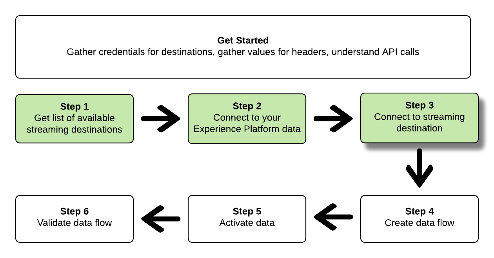

# Conectar-se a destinos de streaming e ativar dados usando a API de Serviço de Fluxo

>[!IMPORTANT]
> 
>Para se conectar a um destino, é necessário o **[!UICONTROL Gerenciar destinos]** [permissão de controle de acesso](/help/access-control/home.md#permissions).
>
>Para ativar os dados, é necessário **[!UICONTROL Gerenciar destinos]**, **[!UICONTROL Ativar destinos]**, **[!UICONTROL Exibir perfis]**, e **[!UICONTROL Exibir segmentos]** [permissões de controle de acesso](/help/access-control/home.md#permissions).
>
>Leia o [visão geral do controle de acesso](/help/access-control/ui/overview.md) ou entre em contato com o administrador do produto para obter as permissões necessárias.

Este tutorial demonstra como usar chamadas de API para se conectar aos dados do Adobe Experience Platform, criar uma conexão com um destino de armazenamento da nuvem de transmissão ([Amazon Kinesis](../catalog/cloud-storage/amazon-kinesis.md) ou [Hubs de Eventos do Azure](../catalog/cloud-storage/azure-event-hubs.md)), crie um fluxo de dados para o novo destino criado e ative os dados para o novo destino criado.

Este tutorial usa o [!DNL Amazon Kinesis] destino em todos os exemplos, mas as etapas são idênticas para [!DNL Azure Event Hubs].


Se preferir usar a interface do usuário na Platform para se conectar a um destino e ativar dados, consulte a [Conectar um destino](../ui/connect-destination.md) e [Ativar dados do público-alvo para destinos de exportação de segmento de transmissão](../ui/activate-segment-streaming-destinations.md) tutoriais.

## Introdução

Este guia requer uma compreensão funcional dos seguintes componentes do Adobe Experience Platform:

* [[!DNL Experience Data Model (XDM) System]](../../xdm/home.md): a estrutura padronizada pela qual o Experience Platform organiza os dados de experiência do cliente.
* [[!DNL Catalog Service]](../../catalog/home.md): [!DNL Catalog] é o sistema de registro para localização e linhagem de dados no Experience Platform.
* [Sandboxes](../../sandboxes/home.md): o Experience Platform fornece sandboxes virtuais que particionam uma única instância da Platform em ambientes virtuais separados para ajudar a desenvolver aplicativos de experiência digital.

As seções a seguir fornecem informações adicionais que você precisará saber para ativar dados para destinos de transmissão na Platform.

### Coletar credenciais necessárias

Para concluir as etapas deste tutorial, você deve ter as credenciais a seguir prontas, dependendo do tipo de destinos aos quais você está se conectando e ativando segmentos.

* Para [!DNL Amazon Kinesis] conexões: `accessKeyId`, `secretKey`, `region` ou `connectionUrl`
* Para [!DNL Azure Event Hubs] conexões: `sasKeyName`, `sasKey`, `namespace`

### Leitura de chamadas de API de amostra {#reading-sample-api-calls}

Este tutorial fornece exemplos de chamadas de API para demonstrar como formatar suas solicitações. Isso inclui caminhos, cabeçalhos necessários e cargas de solicitação formatadas corretamente. O exemplo de JSON retornado nas respostas da API também é fornecido. Para obter informações sobre as convenções usadas na documentação para chamadas de API de exemplo, consulte a seção sobre [como ler chamadas de API de exemplo](../../landing/troubleshooting.md#how-do-i-format-an-api-request) no guia de solução de problemas de Experience Platform.

### Colete valores para cabeçalhos obrigatórios e opcionais {#gather-values}

Para fazer chamadas para APIs da Platform, primeiro conclua o [tutorial de autenticação](https://www.adobe.com/go/platform-api-authentication-en). Concluir o tutorial de autenticação fornece os valores para cada um dos cabeçalhos necessários em todas as chamadas de API de Experience Platform, conforme mostrado abaixo:

* Autorização: Portador `{ACCESS_TOKEN}`
* x-api-key: `{API_KEY}`
* x-gw-ims-org-id: `{ORG_ID}`

Os recursos no Experience Platform podem ser isolados em sandboxes virtuais específicas. Em solicitações para APIs da Platform, é possível especificar o nome e a ID da sandbox em que a operação ocorrerá. Esses parâmetros são opcionais.

* x-sandbox-name: `{SANDBOX_NAME}`

>[!NOTE]
>
>Para obter mais informações sobre sandboxes no Experience Platform, consulte a [documentação de visão geral da sandbox](../../sandboxes/home.md).

Todas as solicitações que contêm uma carga (POST, PUT, PATCH) exigem um cabeçalho de tipo de mídia adicional:

* Tipo de conteúdo: `application/json`

### Documentação do Swagger {#swagger-docs}

Você pode encontrar a documentação de referência que acompanha todas as chamadas de API neste tutorial no Swagger. Consulte a [Documentação da API do serviço de fluxo no Adobe I/O](https://www.adobe.io/experience-platform-apis/references/flow-service/). Recomendamos que você use este tutorial e a página de documentação do Swagger em paralelo.

## Obter a lista de destinos de streaming disponíveis {#get-the-list-of-available-streaming-destinations}


Como primeira etapa, você deve decidir para qual destino de streaming ativar os dados. Para começar, execute uma chamada para solicitar uma lista de destinos disponíveis aos quais você pode conectar e ativar segmentos. Execute a seguinte solicitação do GET para o `connectionSpecs` para retornar uma lista de destinos disponíveis:

**Formato da API**

```http
GET /connectionSpecs
```

**Solicitação**

```shell
curl --location --request GET 'https://platform.adobe.io/data/foundation/flowservice/connectionSpecs' \
--header 'accept: application/json' \
--header 'x-gw-ims-org-id: {ORG_ID}' \
--header 'x-api-key: {API_KEY}' \
--header 'x-sandbox-name: {SANDBOX_NAME}' \
--header 'Authorization: Bearer {ACCESS_TOKEN}'
```


**Resposta**

Uma resposta bem-sucedida contém uma lista de destinos disponíveis e seus identificadores exclusivos (`id`). Armazene o valor do destino que você planeja usar, pois ele será necessário em outras etapas. Por exemplo, se você deseja conectar e entregar segmentos a [!DNL Amazon Kinesis] ou [!DNL Azure Event Hubs], procure o seguinte trecho na resposta:

```json
{
    "id": "86043421-563b-46ec-8e6c-e23184711bf6",
  "name": "Amazon Kinesis",
  ...
  ...
}

{
    "id": "bf9f5905-92b7-48bf-bf20-455bc6b60a4e",
  "name": "Azure Event Hubs",
  ...
  ...
}
```

## Conectar-se aos dados do Experience Platform {#connect-to-your-experience-platform-data}


Em seguida, você deve se conectar aos dados do Experience Platform para poder exportar os dados do perfil e ativá-los no destino de sua preferência. Consiste em duas subetapas descritas abaixo.

1. Primeiro, você deve executar uma chamada para autorizar o acesso aos seus dados no Experience Platform, configurando uma conexão base.
2. Em seguida, usando a ID de conexão básica, você fará outra chamada na qual criará uma conexão de origem, que estabelece a conexão com seus dados de Experience Platform.


### Autorize o acesso aos seus dados no Experience Platform

**Formato da API**

```http
POST /connections
```

**Solicitação**

```shell
curl --location --request POST 'https://platform.adobe.io/data/foundation/flowservice/connections' \
--header 'Authorization: Bearer {ACCESS_TOKEN}' \
--header 'x-api-key: {API_KEY}' \
--header 'x-gw-ims-org-id: {ORG_ID}' \
--header 'x-sandbox-name: {SANDBOX_NAME}' \
--header 'Content-Type: application/json' \
--data-raw '{
            "name": "Base connection to Experience Platform",
            "description": "This call establishes the connection to Experience Platform data",
            "connectionSpec": {
                "id": "{CONNECTION_SPEC_ID}",
                "version": "1.0"
            }
}'
```


* `{CONNECTION_SPEC_ID}`: Use a ID de especificação de conexão para o Serviço de perfil - `8a9c3494-9708-43d7-ae3f-cda01e5030e1`.

**Resposta**

Uma resposta bem-sucedida contém o identificador exclusivo da conexão base (`id`). Armazene esse valor conforme necessário na próxima etapa para criar a conexão de origem.

```json
{
    "id": "1ed86558-59b5-42f7-9865-5859b552f7f4"
}
```

### Conectar-se aos dados do Experience Platform {#connect-to-platform-data}

**Formato da API**

```http
POST /sourceConnections
```

**Solicitação**

```shell
curl --location --request POST 'https://platform.adobe.io/data/foundation/flowservice/sourceConnections' \
--header 'Authorization: Bearer {ACCESS_TOKEN}' \
--header 'x-api-key: {API_KEY}' \
--header 'x-gw-ims-org-id: {ORG_ID}' \
--header 'x-sandbox-name: {SANDBOX_NAME}' \
--header 'Content-Type: application/json' \
--data-raw '{
            "name": "Connecting to Profile Service",
            "description": "Optional",
            "connectionSpec": {
                "id": "{CONNECTION_SPEC_ID}",
                "version": "1.0"
            },
            "baseConnectionId": "{BASE_CONNECTION_ID}",
            "data": {
                "format": "json"
            },
            "params": {}
}'
```

* `{BASE_CONNECTION_ID}`: use a ID que você obteve na etapa anterior.
* `{CONNECTION_SPEC_ID}`: Use a ID de especificação de conexão para o Serviço de perfil - `8a9c3494-9708-43d7-ae3f-cda01e5030e1`.

**Resposta**

Uma resposta bem-sucedida retorna o identificador exclusivo (`id`) para a conexão de origem recém-criada ao Serviço de perfil. Isso confirma que você se conectou com êxito aos dados do Experience Platform. Armazene esse valor conforme necessário em uma etapa posterior.

```json
{
    "id": "ed48ae9b-c774-4b6e-88ae-9bc7748b6e97"
}
```


## Conectar ao destino de streaming {#connect-to-streaming-destination}



Nesta etapa, você está configurando uma conexão com o destino de transmissão desejado. Consiste em duas subetapas descritas abaixo.

1. Primeiro, você deve executar uma chamada para autorizar o acesso ao destino de streaming, configurando uma conexão base.
2. Em seguida, usando a ID de conexão básica, você fará outra chamada na qual criará uma conexão de destino, que especifica o local na conta de armazenamento onde os dados exportados serão entregues, bem como o formato dos dados que serão exportados.

### Autorizar acesso ao destino de streaming

**Formato da API**

```http
POST /connections
```

**Solicitação**

>[!IMPORTANT]
>
>O exemplo abaixo inclui comentários de código com o prefixo `//`. Esses comentários destacam onde valores diferentes devem ser usados para destinos de transmissão diferentes. Remova os comentários antes de usar o trecho.

```shell
curl --location --request POST 'https://platform.adobe.io/data/foundation/flowservice/connections' \
--header 'Authorization: Bearer {ACCESS_TOKEN}' \
--header 'x-api-key: {API_KEY}' \
--header 'x-gw-ims-org-id: {ORG_ID}' \
--header 'x-sandbox-name: {SANDBOX_NAME}' \
--header 'Content-Type: application/json' \
--data-raw '{
    "name": "Connection for Amazon Kinesis/ Azure Event Hubs",
    "description": "summer advertising campaign",
    "connectionSpec": {
        "id": "{_CONNECTION_SPEC_ID}",
        "version": "1.0"
    },
    "auth": {
        "specName": "{AUTHENTICATION_CREDENTIALS}",
        "params": { // use these values for Amazon Kinesis connections
            "accessKeyId": "{ACCESS_ID}",
            "secretKey": "{SECRET_KEY}",
            "region": "{REGION}"
        },
        "params": { // use these values for Azure Event Hubs connections
            "sasKeyName": "{SAS_KEY_NAME}",
            "sasKey": "{SAS_KEY}",
            "namespace": "{EVENT_HUB_NAMESPACE}"
        }        
    }
}'
```

* `{CONNECTION_SPEC_ID}`: use a ID de especificação de conexão que você obteve na etapa [Obter a lista de destinos disponíveis](#get-the-list-of-available-destinations).
* `{AUTHENTICATION_CREDENTIALS}`: preencha o nome do destino de streaming: `Aws Kinesis authentication credentials` ou `Azure EventHub authentication credentials`.
* `{ACCESS_ID}`: *Para [!DNL Amazon Kinesis] conexões.* A ID de acesso do local de armazenamento do Amazon Kinesis.
* `{SECRET_KEY}`: *Para [!DNL Amazon Kinesis] conexões.* A chave secreta do local de armazenamento do Amazon Kinesis.
* `{REGION}`: *Para [!DNL Amazon Kinesis] conexões.* A região em seu [!DNL Amazon Kinesis] conta na qual a Platform transmitirá seus dados.
* `{SAS_KEY_NAME}`: *Para [!DNL Azure Event Hubs] conexões.* Preencha o nome da chave SAS. Saiba mais sobre autenticação no [!DNL Azure Event Hubs] com chaves SAS no [Documentação do Microsoft](https://docs.microsoft.com/en-us/azure/event-hubs/authenticate-shared-access-signature).
* `{SAS_KEY}`: *Para [!DNL Azure Event Hubs] conexões.* Preencha sua chave SAS. Saiba mais sobre autenticação no [!DNL Azure Event Hubs] com chaves SAS no [Documentação do Microsoft](https://docs.microsoft.com/en-us/azure/event-hubs/authenticate-shared-access-signature).
* `{EVENT_HUB_NAMESPACE}`: *Para [!DNL Azure Event Hubs] conexões.* Preencha o [!DNL Azure Event Hubs] namespace em que a Platform transmitirá seus dados. Para obter mais informações, consulte [Criar um namespace de Hubs de Eventos](https://docs.microsoft.com/en-us/azure/event-hubs/event-hubs-create#create-an-event-hubs-namespace) no [!DNL Microsoft] documentação.

**Resposta**

Uma resposta bem-sucedida contém o identificador exclusivo da conexão base (`id`). Armazene esse valor conforme necessário na próxima etapa para criar uma conexão de destino.

```json
{
    "id": "1ed86558-59b5-42f7-9865-5859b552f7f4"
}
```

### Especificar local de armazenamento e formato de dados

**Formato da API**

```http
POST /targetConnections
```

**Solicitação**

>[!IMPORTANT]
>
>O exemplo abaixo inclui comentários de código com o prefixo `//`. Esses comentários destacam onde valores diferentes devem ser usados para destinos de transmissão diferentes. Remova os comentários antes de usar o trecho.

```shell
curl --location --request POST 'https://platform.adobe.io/data/foundation/flowservice/targetConnections' \
--header 'Authorization: Bearer {ACCESS_TOKEN}' \
--header 'x-api-key: {API_KEY}' \
--header 'x-gw-ims-org-id: {ORG_ID}' \
--header 'Content-Type: application/json' \
--data-raw '{
    "name": "Amazon Kinesis/ Azure Event Hubs target connection",
    "description": "Connection to Amazon Kinesis/ Azure Event Hubs",
    "baseConnectionId": "{BASE_CONNECTION_ID}",
    "connectionSpec": {
        "id": "{CONNECTION_SPEC_ID}",
        "version": "1.0"
    },
    "data": {
        "format": "json"
    },
    "params": { // use these values for Amazon Kinesis connections
        "stream": "{NAME_OF_DATA_STREAM}", 
        "region": "{REGION}"
    },
    "params": { // use these values for Azure Event Hubs connections
        "eventHubName": "{EVENT_HUB_NAME}"
    }
}'
```

* `{BASE_CONNECTION_ID}`: use a ID de conexão básica que você obteve na etapa acima.
* `{CONNECTION_SPEC_ID}`: use a especificação de conexão obtida na etapa [Obter a lista de destinos disponíveis](#get-the-list-of-available-destinations).
* `{NAME_OF_DATA_STREAM}`: *Para [!DNL Amazon Kinesis] conexões.* Forneça o nome do fluxo de dados existente no [!DNL Amazon Kinesis] conta. O Platform exportará dados para esse fluxo.
* `{REGION}`: *Para [!DNL Amazon Kinesis] conexões.* A região na sua conta do Amazon Kinesis onde a Platform transmitirá seus dados.
* `{EVENT_HUB_NAME}`: *Para [!DNL Azure Event Hubs] conexões.* Preencha o [!DNL Azure Event Hub] nomeie o local em que a Platform transmitirá seus dados. Para obter mais informações, consulte [Criar um hub de eventos](https://docs.microsoft.com/en-us/azure/event-hubs/event-hubs-create#create-an-event-hub) no [!DNL Microsoft] documentação.

**Resposta**

Uma resposta bem-sucedida retorna o identificador exclusivo (`id`) para a conexão de destino recém-criada com o destino de transmissão. Armazene esse valor conforme necessário nas etapas posteriores.

```json
{
    "id": "12ab90c7-519c-4291-bd20-d64186b62da8"
}
```

## Criar um fluxo de dados


Usando as IDs obtidas nas etapas anteriores, agora é possível criar um fluxo de dados entre os dados de Experience Platform e o destino no qual você ativará os dados. Pense nessa etapa como a construção do pipeline, por meio do qual os dados fluirão posteriormente, entre o Experience Platform e o destino desejado.

Para criar um fluxo de dados, execute uma solicitação POST, como mostrado abaixo, enquanto fornece os valores mencionados abaixo na carga.

Execute a seguinte solicitação POST para criar um fluxo de dados.

**Formato da API**

```http
POST /flows
```

**Solicitação**

```shell
curl -X POST \
'https://platform.adobe.io/data/foundation/flowservice/flows' \
-H 'Authorization: Bearer {ACCESS_TOKEN}' \
-H 'x-api-key: {API_KEY}' \
-H 'x-gw-ims-org-id: {ORG_ID}' \
-H 'x-sandbox-name: {SANDBOX_NAME}' \
-H 'Content-Type: application/json' \
-d  '{
  "name": "Azure Event Hubs",
  "description": "Azure Event Hubs",
  "flowSpec": {
    "id": "{FLOW_SPEC_ID}",
    "version": "1.0"
  },
  "sourceConnectionIds": [
    "{SOURCE_CONNECTION_ID}"
  ],
  "targetConnectionIds": [
    "{TARGET_CONNECTION_ID}"
  ],
  "transformations": [
    {
      "name": "GeneralTransform",
      "params": {
        "profileSelectors": {
          "selectors": [
            
          ]
        },
        "segmentSelectors": {
          "selectors": [
            
          ]
        }
      }
    }
  ]
}
```

* `{FLOW_SPEC_ID}`: a ID de especificação do fluxo para destinos baseados em perfil é `71471eba-b620-49e4-90fd-23f1fa0174d8`. Use esse valor na chamada de.
* `{SOURCE_CONNECTION_ID}`: use a ID de conexão de origem obtida na etapa [Conectar ao Experience Platform](#connect-to-your-experience-platform-data).
* `{TARGET_CONNECTION_ID}`: Use a ID de conexão de destino que você obteve na etapa [Conectar ao destino de streaming](#connect-to-streaming-destination).

**Resposta**

Uma resposta bem-sucedida retorna a ID (`id`) do fluxo de dados recém-criado e uma `etag`. Anote os dois valores. como você fará com eles na próxima etapa, para ativar segmentos.

```json
{
    "id": "8256cfb4-17e6-432c-a469-6aedafb16cd5",
    "etag": "8256cfb4-17e6-432c-a469-6aedafb16cd5"
}
```


## Ativar dados para o novo destino {#activate-data}


Após criar todas as conexões e o fluxo de dados, agora é possível ativar os dados do perfil para a plataforma de streaming. Nesta etapa, você seleciona quais segmentos e quais atributos de perfil está enviando para o destino e pode agendar e enviar dados para o destino.

Para ativar segmentos para o novo destino, você deve executar uma operação PATCH JSON, semelhante ao exemplo abaixo. Você pode ativar vários segmentos e atributos de perfil em uma chamada. Para saber mais sobre o PATCH JSON, consulte a [Especificação RFC](https://tools.ietf.org/html/rfc6902).

**Formato da API**

```http
PATCH /flows
```

**Solicitação**

```shell
curl --location --request PATCH 'https://platform.adobe.io/data/foundation/flowservice/flows/{DATAFLOW_ID}' \
--header 'Authorization: Bearer {ACCESS_TOKEN}' \
--header 'x-api-key: {API_KEY}' \
--header 'x-gw-ims-org-id: {ORG_ID}' \
--header 'Content-Type: application/json' \
--header 'x-sandbox-name: {SANDBOX_NAME}' \
--header 'If-Match: "{ETAG}"' \
--data-raw '[
  {
    "op": "add",
    "path": "/transformations/0/params/segmentSelectors/selectors/-",
    "value": {
      "type": "PLATFORM_SEGMENT",
      "value": {
        "name": "Name of the segment that you are activating",
        "description": "Description of the segment that you are activating",
        "id": "{SEGMENT_ID}"
      }
    }
  },
  {
    "op": "add",
    "path": "/transformations/0/params/profileSelectors/selectors/-",
    "value": {
      "type": "JSON_PATH",
      "value": {
        "operator": "EXISTS",
        "path": "{PROFILE_ATTRIBUTE}"
      }
    }
  }
]
```

| Propriedade | Descrição |
| --------- | ----------- |
| `{DATAFLOW_ID}` | No URL, use a ID do fluxo de dados criado na etapa anterior. |
| `{ETAG}` | Obtenha o `{ETAG}` da resposta da etapa anterior, [Criar um fluxo de dados](#create-dataflow). O formato de resposta na etapa anterior tem aspas em escape. Você deve usar os valores sem escape no cabeçalho da solicitação. Consulte o exemplo abaixo: <br> <ul><li>Exemplo de resposta: `"etag":""7400453a-0000-1a00-0000-62b1c7a90000""`</li><li>Valor a ser usado na solicitação: `"etag": "7400453a-0000-1a00-0000-62b1c7a90000"`</li></ul> <br> O valor da tag é atualizado com cada atualização bem-sucedida de um fluxo de dados. |
| `{SEGMENT_ID}` | Forneça a ID de segmento que você deseja exportar para esse destino. Para recuperar IDs de segmento para os segmentos que você deseja ativar, consulte [recuperar uma definição de segmento](https://www.adobe.io/experience-platform-apis/references/segmentation/#operation/retrieveSegmentDefinitionById) na referência da API Experience Platform. |
| `{PROFILE_ATTRIBUTE}` | Por exemplo, `"person.lastName"` |
| `op` | A chamada de operação usada para definir a ação necessária para atualizar o fluxo de dados. As operações incluem: `add`, `replace`, e `remove`. Para adicionar um segmento a um fluxo de dados, use o `add` operação. |
| `path` | Define a parte do fluxo que deve ser atualizada. Ao adicionar um segmento a um fluxo de dados, use o caminho especificado no exemplo. |
| `value` | O novo valor com o qual você deseja atualizar seu parâmetro. |
| `id` | Especifique a ID do segmento que você está adicionando ao fluxo de dados de destino. |
| `name` | *Opcional*. Especifique o nome do segmento que você está adicionando ao fluxo de dados de destino. Observe que esse campo não é obrigatório e que você pode adicionar um segmento com êxito ao fluxo de dados de destino sem fornecer seu nome. |

**Resposta**

Procure uma resposta 202 OK. Nenhum corpo de resposta é retornado. Para validar se a solicitação estava correta, consulte a próxima etapa, Validar o fluxo de dados.

## Validar o fluxo de dados


Como etapa final do tutorial, você deve validar se os segmentos e atributos de perfil foram mapeados corretamente para o fluxo de dados.

Para validar isso, execute a seguinte solicitação GET:

**Formato da API**

```http
GET /flows
```

**Solicitação**

```shell
curl --location --request PATCH 'https://platform.adobe.io/data/foundation/flowservice/flows/{DATAFLOW_ID}' \
--header 'Authorization: Bearer {ACCESS_TOKEN}' \
--header 'x-api-key: {API_KEY}' \
--header 'x-gw-ims-org-id: {ORG_ID}' \
--header 'Content-Type: application/json' \
--header 'x-sandbox-name: prod' \
--header 'If-Match: "{ETAG}"' 
```

* `{DATAFLOW_ID}`: use o fluxo de dados da etapa anterior.
* `{ETAG}`: use a tag da etapa anterior.

**Resposta**

A resposta retornada deve incluir na variável `transformations` parâmetro os segmentos e atributos de perfil que você submeteu na etapa anterior. Uma amostra `transformations` O parâmetro da resposta do pode ser semelhante ao seguinte:

```json
"transformations": [
    {
        "name": "GeneralTransform",
        "params": {
            "profileSelectors": {
                        "selectors": [
                            {
                                "type": "JSON_PATH",
                                "value": {
                                    "path": "personalEmail.address",
                                    "operator": "EXISTS"
                                }
                            },
                            {
                                "type": "JSON_PATH",
                                "value": {
                                    "path": "person.lastname",
                                    "operator": "EXISTS"
                                }
                            }
                        ]
                    },
            "segmentSelectors": {
                "selectors": [
                    {
                        "type": "PLATFORM_SEGMENT",
                        "value": {
                            "name": "Men over 50",
                            "description": "",
                            "id": "72ddd79b-6b0a-4e97-a8d2-112ccd81bd02"
                        }
                    }
                ]
            }
        }
    }
],
```

**Dados exportados**

>[!IMPORTANT]
>
> Além dos atributos de perfil e dos segmentos na etapa [Ativar dados para o novo destino](#activate-data), os dados exportados no [!DNL AWS Kinesis] e [!DNL Azure Event Hubs] também incluirá informações sobre o mapa de identidade. Representa as identidades dos perfis exportados (por exemplo, [ECID](https://experienceleague.adobe.com/docs/id-service/using/intro/id-request.html), ID móvel, Google ID, endereço de email, etc.). Veja um exemplo abaixo.

```json
{
  "person": {
    "email": "yourstruly@adobe.com"
  },
  "segmentMembership": {
    "ups": {
      "72ddd79b-6b0a-4e97-a8d2-112ccd81bd02": {
        "lastQualificationTime": "2020-03-03T21:24:39Z",
        "status": "exited"
      },
      "7841ba61-23c1-4bb3-a495-00d695fe1e93": {
        "lastQualificationTime": "2020-03-04T23:37:33Z",
        "status": "existing"
      }
    }
  },
  "identityMap": {
    "ecid": [
      {
        "id": "14575006536349286404619648085736425115"
      },
      {
        "id": "66478888669296734530114754794777368480"
      }
    ],
    "email_lc_sha256": [
      {
        "id": "655332b5fa2aea4498bf7a290cff017cb4"
      },
      {
        "id": "66baf76ef9de8b42df8903f00e0e3dc0b7"
      }
    ]
  }
}
```

## Usar [!DNL Postman] coleções para conectar a destinos de streaming  {#collections}

Para se conectar aos destinos de transmissão descritos neste tutorial de forma mais simples, é possível usar o [[!DNL Postman]](https://www.postman.com/).

[!DNL Postman] O é uma ferramenta que você pode usar para fazer chamadas de API e gerenciar bibliotecas de chamadas e ambientes predefinidos.

Para este tutorial específico, o seguinte [!DNL Postman] coleções foram anexadas:

* [!DNL AWS Kinesis] [!DNL Postman] coleção
* [!DNL Azure Event Hubs] [!DNL Postman] coleção

Clique em [aqui](../assets/api/streaming-destination/DestinationPostmanCollection.zip) para baixar o arquivo de coleções.

Cada coleção inclui as solicitações e as variáveis de ambiente necessárias para [!DNL AWS Kinesis], e [!DNL Azure Event Hub], respectivamente.

### Como usar o [!DNL Postman] coleções {#how-to-use-postman-collections}

Para se conectar com sucesso aos destinos usando o [!DNL Postman] coleções, siga estas etapas:

* Baixar e instalar [!DNL Postman];
* [Baixar](../assets/api/streaming-destination/DestinationPostmanCollection.zip) e descompacte as coleções anexadas;
* Importar as coleções das pastas correspondentes para o [!DNL Postman];
* Preencha as variáveis de ambiente de acordo com as instruções neste artigo;
* Execute o [!DNL API] solicitações de [!DNL Postman], com base nas instruções deste artigo.

## Manipulação de erros de API {#api-error-handling}

Os endpoints de API neste tutorial seguem os princípios gerais de mensagem de erro da API Experience Platform. Consulte [Códigos de status da API](/help/landing/troubleshooting.md#api-status-codes) e [erros no cabeçalho da solicitação](/help/landing/troubleshooting.md#request-header-errors) no guia de solução de problemas da Platform para obter mais informações sobre como interpretar respostas de erro.

## Próximas etapas {#next-steps}

Ao seguir este tutorial, você conectou com sucesso o Platform a um dos seus destinos de transmissão preferidos e configurou um fluxo de dados para o respectivo destino. Os dados de saída agora podem ser usados no destino para análises de clientes ou quaisquer outras operações de dados que você deseje executar. Consulte as seguintes páginas para obter mais detalhes:

* [Visão geral dos destinos](../home.md)
* [Visão geral do Catálogo de destinos](../catalog/overview.md)
