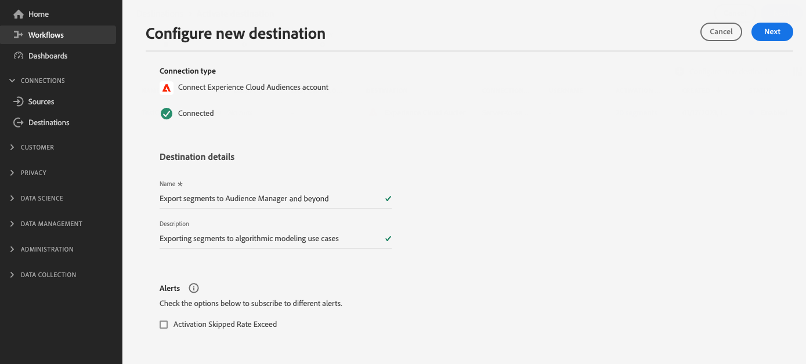

# [!UICONTROL Públicos do Experience Cloud] conexão

>[!AVAILABILITY]
>
> Este destino está disponível para [Adobe Real-time Customer Data Platform Prime e Ultimate](https://helpx.adobe.com/legal/product-descriptions/real-time-customer-data-platform.html?lang=pt-BR) clientes.

Use esse destino para ativar públicos do Real-Time CDP para o Audience Manager e o Adobe Analytics.

Para enviar públicos-alvo para a Adobe Analytics, você precisa de uma licença Audience Manager. Para obter mais detalhes, consulte [visão geral do Audience Analytics](https://experienceleague.adobe.com/docs/analytics/integration/audience-analytics/mc-audiences-aam.html?lang=en).

Para enviar públicos-alvo para outras soluções Adobe, use as conexões diretas do Real-Time CDP com [Adobe Target](../personalization/adobe-target-connection.md), [Adobe Advertising](../advertising/adobe-advertising-cloud-connection.md), [Adobe Campaign](../email-marketing/adobe-campaign.md) e [Marketo Engage](../adobe/marketo-engage.md).

>[!IMPORTANT]
>
>Esse destino substitui o [integração herdada de compartilhamento de público](https://experienceleague.adobe.com/docs/audience-manager/user-guide/implementation-integration-guides/integration-experience-platform/aam-aep-audience-sharing.html#aep-segments-in-aam) da Real-time Customer Data Platform para várias soluções de Experience Cloud.
> 
>Se você já estiver compartilhando públicos do Real-Time CDP com o Audience Manager e outras soluções de Experience Cloud pelo [integração herdada de compartilhamento de público](https://experienceleague.adobe.com/docs/audience-manager/user-guide/implementation-integration-guides/integration-experience-platform/aam-aep-audience-sharing.html#aep-segments-in-aam), entre em contato com o Atendimento ao cliente para desativar a integração herdada antes de usar esse destino.

## Casos de uso e benefícios {#use-cases}

Para ajudá-lo a entender melhor como e quando você deve usar o [!UICONTROL Públicos do Experience Cloud] destino, aqui estão exemplos de casos de uso que os clientes do Real-Time CDP podem resolver usando esse destino.

### Habilitar casos de uso da Plataforma de Gerenciamento de Dados {#dmp-use-cases}

No Audience Manager, você pode usar os públicos-alvo da Real-Time CDP para casos de uso da Plataforma de gerenciamento de dados, como:

* Adicionando [dados de terceiros](https://experienceleague.adobe.com/docs/audience-manager/user-guide/overview/data-types-collected.html#third-party-data) aos seus segmentos;
* [Modelagem algorítmica](https://experienceleague.adobe.com/docs/audience-manager/user-guide/features/algorithmic-models/look-alike-modeling/understanding-models.html);
* Ativar públicos para destinos baseados em cookies que ainda não são compatíveis com o catálogo de destinos do Real-Time CDP.

### Controle granular de públicos exportados {#segments-control}

Para selecionar quais públicos-alvo serão exportados para Audience Manager e além, use a nova integração de compartilhamento de público-alvo de autoatendimento por meio do destino Experience Cloud Audiences.  Isso permite determinar quais públicos-alvo você deseja compartilhar com outras soluções Experience Cloud e quais públicos-alvo você deseja manter no Real-Time CDP exclusivamente.

A integração de compartilhamento de público-alvo herdada não permitiu um controle granular de quais públicos-alvo devem ser exportados para Audience Manager e além.

### Compartilhar públicos da Real-Time CDP com a Adobe Analytics {#share-audiences-with-analytics}

Os públicos-alvo enviados para o destino do Experience Cloud Audiences não aparecem automaticamente no Adobe Analytics.

Antes de enviar públicos-alvo para a Adobe Analytics, é necessário [implementar o serviço de identidade do Experience Cloud para Analytics e Audience Manager](https://experienceleague.adobe.com/docs/id-service/using/implementation/setup-aam-analytics.html?lang=en).

>[!IMPORTANT]
>
>Para enviar públicos do Real-Time CDP para o Adobe Analytics por meio do destino Experience Cloud Audiences, é necessário ter uma licença Audience Manager.

### Compartilhar públicos da Real-Time CDP com outras soluções de Experience Cloud {#share-segments-with-other-solutions}

Você pode usar o cartão de destino do Real-Time CDP Audiences para compartilhar públicos-alvo com outras soluções Experience Cloud.

No entanto, a Adobe recomenda usar os seguintes cartões de destino dedicados se você quiser compartilhar públicos com essas soluções:

* [Adobe Campaign](../email-marketing/adobe-campaign.md)
* [Adobe Target](../personalization/adobe-target-connection.md)
* [Advertising Cloud](../advertising/adobe-advertising-cloud-connection.md)
* [Marketo](../adobe/marketo-engage.md)

## Pré-requisitos {#prerequisites}

>[!IMPORTANT]
>
> * Você precisa de uma licença de Audience Manager para ativar o [Casos de uso da Plataforma de gerenciamento de dados](#dmp-use-cases) acima referidos.
> * Você *fazer* precisa de uma licença Audience Manager para compartilhar públicos da Real-Time CDP com a Adobe Analytics.
> * Você *não precisam* uma licença de Audience Manager para compartilhar públicos-alvo da Real-Time CDP com a Adobe Advertising Cloud, Adobe Target, Marketo e outras soluções Experience Cloud, mencionadas na [seção acima](#share-segments-with-other-solutions).

### Para clientes que estão usando a solução de compartilhamento de público herdada

Se você já estiver compartilhando públicos do Real-Time CDP com o Audience Manager e outras soluções de Experience Cloud pelo [integração herdada de compartilhamento de público](https://experienceleague.adobe.com/docs/audience-manager/user-guide/implementation-integration-guides/integration-experience-platform/aam-aep-audience-sharing.html#aep-segments-in-aam), você deve entrar em contato com o Atendimento ao cliente para desativar a integração herdada.

O tempo de resposta para resolver o ticket de desprovisionamento é de seis dias úteis ou menos. Depois que a integração herdada existente for desativada, você poderá prosseguir para [criar uma conexão](#connect) por meio do cartão de destino de autoatendimento.

>[!IMPORTANT]
>
>A exportação de público do Real-Time CDP para outras soluções é interrompida no tempo entre a resolução do tíquete e o momento em que uma nova conexão é estabelecida por meio do cartão de destino. Você pode minimizar esse tempo de inatividade criando a conexão por meio do cartão de destino depois que o ticket for fechado.

## Limitações e chamadas de retorno conhecidas {#known-limitations}

Observe as seguintes limitações conhecidas e chamadas importantes ao usar o cartão de Públicos-alvo do Experience Cloud:

* Atualmente, há suporte para um único destino de Públicos-alvo de Experience Cloud. A tentativa de configurar uma segunda conexão de destino resulta em um erro.
* Ao se conectar ao destino, você pode ver uma opção para [ativar alertas de fluxo de dados](../../ui/alerts.md). Embora visível na interface do usuário, a variável **a opção ativar alertas não é suportada no momento**.
* **Suporte ao preenchimento retroativo de público**: a primeira exportação para Audience Manager ou outras soluções de Experience Cloud inclui uma população histórica dos públicos-alvo. Usuários do [integração herdada de compartilhamento de público](https://experienceleague.adobe.com/docs/audience-manager/user-guide/implementation-integration-guides/integration-experience-platform/aam-aep-audience-sharing.html#aep-segments-in-aam) que estão configurando esse destino devem esperar uma diferença de preenchimento retroativo de aproximadamente seis horas.
* Públicos-alvo originados de [Composição de público](../../../segmentation/ui/audience-composition.md) não são compatíveis diretamente. Para ativar públicos-alvo compostos para esse destino, você deve criar uma definição de público-alvo por meio de [Construtor de segmentos](../../../segmentation/ui/segment-builder.md) com base no público-alvo composto e ativar o público-alvo recém-criado.

### Latência ao ativar públicos {#audience-activation-latency}

Há uma latência de quatro horas entre o momento em que os públicos-alvo são ativados pela primeira vez no Real-Time CDP e o momento em que estão prontos para serem usados no Audience Manager e em outras soluções de Experience Cloud.

Pode levar até 24 horas para que os públicos-alvo estejam totalmente disponíveis em Audience Manager para todos os casos de uso. Pode levar até 48 horas para que os públicos-alvo do Experience Cloud Audiences apareçam nos relatórios de Audience Manager.

Os metadados, como nomes de público-alvo, estão disponíveis no Audience Manager em minutos após a configuração da exportação para o destino do Experience Cloud Audiences.

## Identidades suportadas {#supported-identities}

Os perfis exportados para o [!UICONTROL Públicos do Experience Cloud] destino são mapeados de acordo com as identidades descritas na tabela abaixo. Saiba mais sobre [identidades](/help/identity-service/features/namespaces.md).

| Identidade de destino | Descrição | Considerações |
|---|---|---|
| ECID | Experience Cloud ID | Um namespace que representa a ECID. Esse namespace também pode ser referenciado pelos seguintes aliases: &quot;Adobe Marketing Cloud ID&quot;, &quot;Adobe Experience Cloud ID&quot;, &quot;Adobe Experience Platform ID&quot;. Consulte o seguinte documento em [ECID](/help/identity-service/features/ecid.md) para obter mais informações. |
| GAID | GOOGLE ADVERTISING ID | Perfis assimilados na Real-Time CDP com uma identidade principal da Google Advertising ID (GAID) podem ser exportados para esse destino. |
| IDFA | Apple ID para anunciantes | Os perfis assimilados na Real-Time CDP com uma identidade principal da Apple ID para anunciantes (IDFA) podem ser exportados para esse destino. |
| email_lc_sha256 | Endereços de email com hash com o algoritmo SHA256 | Os perfis assimilados na Real-Time CDP com uma identidade principal de endereço de email com hash podem ser exportados para esse destino. |

{style="table-layout:auto"}

## Públicos-alvo compatíveis {#supported-audiences}

Esta seção descreve que tipo de público-alvo você pode exportar para esse destino.

| Origem do público | Suportado | Descrição |
| ---------|----------|----------|
| [!DNL Segmentation Service] | ✓ | Públicos-alvo gerados pelo Experience Platform [Serviço de segmentação](../../../segmentation/home.md). |
| Uploads personalizados | ✓ | Públicos-alvo [importado](../../../segmentation/ui/audience-portal.md#import-audience) para o Experience Platform de arquivos CSV. |

{style="table-layout:auto"}

## Tipo e frequência de exportação {#export-type-frequency}

Consulte a tabela abaixo para obter informações sobre o tipo e a frequência da exportação de destino.

| Item | Tipo | Notas |
|---------|----------|---------|
| Tipo de exportação | **[!UICONTROL Exportação de público]** | Você está exportando todos os membros de um público-alvo com as identidades listadas na seção acima. |
| Frequência de exportação | **[!UICONTROL Streaming]** | Os destinos de transmissão são conexões baseadas em API &quot;sempre ativas&quot;. Quando um perfil é atualizado no Real-Time CDP com base na avaliação do público-alvo, o conector envia a atualização downstream para a plataforma de destino. Leia mais sobre [destinos de transmissão](/help/destinations/destination-types.md#streaming-destinations). |

{style="table-layout:auto"}

## Conectar ao destino {#connect}

>[!IMPORTANT]
> 
>Para se conectar ao destino, você precisa da variável **[!UICONTROL Exibir destinos]** e **[!UICONTROL Gerenciar destinos]** [permissões de controle de acesso](/help/access-control/home.md#permissions). Leia o [visão geral do controle de acesso](/help/access-control/ui/overview.md) ou entre em contato com o administrador do produto para obter as permissões necessárias.

Para se conectar a esse destino, siga as etapas descritas no [tutorial de configuração de destino](../../ui/connect-destination.md). No workflow de configuração de destino, preencha os campos listados nas duas seções abaixo.

### Autenticar para o destino {#authenticate}

Para autenticar no destino, selecione **[!UICONTROL Configurar]** na exibição cartão de destino no catálogo e selecione **[!UICONTROL Conectar ao destino]**.

### Preencher detalhes do destino {#destination-details}

Para configurar detalhes para o destino, preencha os campos obrigatórios e opcionais abaixo. Um asterisco ao lado de um campo na interface do usuário indica que o campo é obrigatório.

* **[!UICONTROL Nome]**: um nome pelo qual você reconhecerá esse destino no futuro.
* **[!UICONTROL Descrição]**: uma descrição que ajudará você a identificar esse destino no futuro.

## Ativar públicos-alvo para esse destino {#activate}

>[!IMPORTANT]
> 
>Para ativar os dados, é necessário **[!UICONTROL Exibir destinos]**, **[!UICONTROL Ativar destinos]**, **[!UICONTROL Exibir perfis]**, e **[!UICONTROL Exibir segmentos]** [permissões de controle de acesso](/help/access-control/home.md#permissions). Leia o [visão geral do controle de acesso](/help/access-control/ui/overview.md) ou entre em contato com o administrador do produto para obter as permissões necessárias.

Ler [Ativar perfis e públicos para destinos de exportação de público de transmissão](/help/destinations/ui/activate-segment-streaming-destinations.md) para obter instruções sobre como ativar públicos-alvo para esse destino. Não [etapa de mapeamento](/help/destinations/ui/activate-segment-streaming-destinations.md#mapping) é obrigatório e não [etapa de agendamento](/help/destinations/ui/activate-segment-streaming-destinations.md#scheduling) O está disponível para este destino.

## Validar exportação de dados {#exported-data}

Para validar uma exportação de dados bem-sucedida, você pode verificar se os públicos-alvo conseguiram chegar à solução de Experience Cloud desejada.

### Validar dados no Audience Manager

Os públicos-alvo da Real-Time CDP aparecem no Audience Manager como [sinais](https://experienceleague.adobe.com/docs/audience-manager/user-guide/implementation-integration-guides/integration-experience-platform/aam-aep-audience-sharing.html#aep-segments-as-aam-signals), [características](https://experienceleague.adobe.com/docs/audience-manager/user-guide/implementation-integration-guides/integration-experience-platform/aam-aep-audience-sharing.html#aep-segments-as-aam-traits), e [segmentos](https://experienceleague.adobe.com/docs/audience-manager/user-guide/implementation-integration-guides/integration-experience-platform/aam-aep-audience-sharing.html#aep-segments-as-aam-segments). Você pode verificar no Audience Manager se os dados foram exibidos conforme descrito nos links de documentação acima.

Os nomes de segmento começam a ser preenchidos no Audience Manager 15 minutos após os públicos-alvo serem enviados pelo Real-Time CDP.

A população do segmento começa a fluir para o Audience Manager em 6 horas a partir do envio do Real-Time CDP e é atualizada a cada 24 horas no Audience Manager.

A população completa estará visível em Audience Manager após 72 horas e as populações continuarão a fluir para Audience Manager, a menos que o público-alvo seja removido do destino no Real-Time CDP.

## Uso e governança de dados {#data-usage-governance}

Todos [!DNL Real-Time CDP] os destinos estão em conformidade com as políticas de uso de dados ao manipular seus dados. Para obter informações detalhadas sobre como [!DNL Adobe Experience Platform] fiscaliza a governança de dados, leia o [Visão geral da governança de dados](/help/data-governance/home.md).

A governança de dados no Real-Time CDP é aplicada por ambos [rótulos de uso de dados](/help/data-governance/labels/reference.md) e de marketing.
Os rótulos de uso de dados são transferidos para aplicativos, mas as ações de marketing não. Isso significa que, uma vez direcionados ao Audience Manager, os públicos-alvo do Real-Time CDP poderão ser exportados para qualquer destino disponível. No Audience Manager, é possível usar [controles de exportação de dados](https://experienceleague.adobe.com/docs/audience-manager/user-guide/features/data-export-controls.html) para bloquear a exportação de públicos para determinados destinos.

Públicos marcados com a [!DNL HIPAA] ações de marketing não são enviadas do Real-Time CDP para o Audience Manager.

### Gerenciamento de permissões no Audience Manager

Os públicos-alvo e características no Audience Manager estão sujeitos a [Controles de acesso com base em função](https://experienceleague.adobe.com/docs/audience-manager/user-guide/features/administration/administration-overview.html) (RBAC).

Os públicos exportados do Real-Time CDP são atribuídos a uma fonte de dados específica no Audience Manager, chamada **[!UICONTROL Segmentos Experience Platform]**.

Para permitir que apenas determinados usuários acessem os públicos-alvo, use [Controles de acesso com base em função](https://experienceleague.adobe.com/docs/audience-manager/user-guide/features/administration/administration-overview.html) para configurar o acesso do usuário aos públicos-alvo e características criadas a partir dos públicos-alvo da Real-Time CDP.
