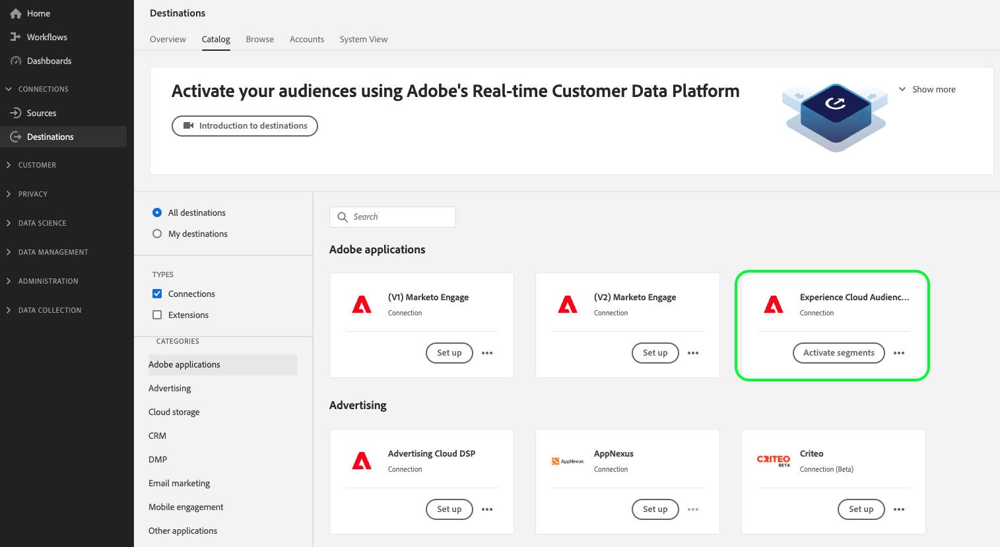

# [!UICONTROL Experience Cloud Audiences] conexão

>[!AVAILABILITY]
>
> Este destino está disponível para [clientes do Adobe Real-Time Customer Data Platform Prime e do Ultimate](https://helpx.adobe.com/br/legal/product-descriptions/real-time-customer-data-platform.html?lang=pt-BR).

Use este destino para ativar públicos do [!DNL Real-Time CDP] para o Audience Manager e o [!DNL Adobe Analytics].

Para enviar públicos-alvo para [!DNL Adobe Analytics], você precisa de uma licença do Audience Manager. Para obter mais detalhes, consulte a [visão geral do Audience Analytics](https://experienceleague.adobe.com/docs/analytics/integration/audience-analytics/mc-audiences-aam.html?lang=pt-BR).

Para enviar públicos para outras soluções da Adobe, use as conexões diretas do [!DNL Real-Time CDP] com a [Adobe Target](../personalization/adobe-target-connection.md), [Adobe Advertising](../advertising/adobe-advertising-dsp-connection.md), [Adobe Campaign](../email-marketing/adobe-campaign.md) e [Marketo Engage](../adobe/marketo-engage.md).

>[!IMPORTANT]
>
>Este destino substitui a [integração de compartilhamento de público-alvo herdada](https://experienceleague.adobe.com/docs/audience-manager/user-guide/implementation-integration-guides/integration-experience-platform/aam-aep-audience-sharing.html?lang=pt-BR#aep-segments-in-aam) do [!DNL Real-Time Customer Data Platform] para várias soluções da Experience Cloud.
> 
>Se você já estiver compartilhando públicos-alvo do [!DNL Real-Time CDP] com a Audience Manager e outras soluções da Experience Cloud por meio da [integração de compartilhamento de público-alvo herdada](https://experienceleague.adobe.com/docs/audience-manager/user-guide/implementation-integration-guides/integration-experience-platform/aam-aep-audience-sharing.html?lang=pt-BR#aep-segments-in-aam), entre em contato com o Atendimento ao Cliente para desabilitar a integração herdada antes de usar esse destino.

## Casos de uso e benefícios {#use-cases}

Para ajudá-lo a entender melhor como e quando você deve usar o destino [!UICONTROL Experience Cloud Audiences], veja a seguir exemplos de casos de uso que os clientes do [!DNL Real-Time CDP] podem resolver usando esse destino.

### Habilitar casos de uso da Plataforma de Gerenciamento de Dados {#dmp-use-cases}

No Audience Manager, você pode usar [!DNL Real-Time CDP] públicos-alvo para casos de uso da Plataforma de gerenciamento de dados, como:

* Adicionando [dados de terceiros](https://experienceleague.adobe.com/docs/audience-manager/user-guide/overview/data-types-collected.html?lang=pt-BR#third-party-data) aos seus segmentos;
* [Modelagem algorítmica](https://experienceleague.adobe.com/docs/audience-manager/user-guide/features/algorithmic-models/look-alike-modeling/understanding-models.html?lang=pt-BR);
* Ativar seus públicos para destinos baseados em cookies que ainda não têm suporte no catálogo de destinos do [!DNL Real-Time CDP].

### Controle granular de públicos exportados {#segments-control}

Para selecionar quais públicos-alvo serão exportados para o Audience Manager e muito mais, use a nova integração de compartilhamento de público-alvo de autoatendimento por meio do destino do Experience Cloud Audiences.  Use-a para determinar quais públicos-alvo você deseja compartilhar com outras soluções da Experience Cloud e quais públicos-alvo você deseja manter no [!DNL Real-Time CDP] exclusivamente.

A integração de compartilhamento de público-alvo herdada não permitia um controle granular de quais públicos-alvo deveriam ser exportados para a Audience Manager e muito além.

### Compartilhar [!DNL Real-Time CDP] públicos-alvo com [!DNL Adobe Analytics] {#share-audiences-with-analytics}

Os públicos enviados para o destino do Experience Cloud Audiences não aparecem automaticamente no [!DNL Adobe Analytics].

Antes de enviar públicos-alvo para [!DNL Adobe Analytics], você deve [implementar o Serviço de Identidade da Experience Cloud para o Analytics e o Audience Manager](https://experienceleague.adobe.com/docs/id-service/using/implementation/setup-aam-analytics.html?lang=pt-BR).

>[!IMPORTANT]
>
>Para enviar públicos-alvo de [!DNL Real-Time CDP] para [!DNL Adobe Analytics] por meio do destino do Experience Cloud Audiences, você deve ter uma licença do Audience Manager.

### Compartilhar [!DNL Real-Time CDP] públicos-alvo com outras soluções da Experience Cloud {#share-segments-with-other-solutions}

Você pode usar o cartão de destino do [!DNL Real-Time CDP] Audiences para compartilhar públicos com outras soluções da Experience Cloud.

No entanto, a Adobe recomenda usar os seguintes cartões de destino dedicados se você quiser compartilhar públicos com essas soluções:

* [Adobe Campaign](../email-marketing/adobe-campaign.md)
* [Adobe Target](../personalization/adobe-target-connection.md)
* [Adobe Advertising DSP](../advertising/adobe-advertising-dsp-connection.md)
* [Marketo](../adobe/marketo-engage.md)

## Pré-requisitos {#prerequisites}

>[!IMPORTANT]
>
> * Você precisa de uma licença do Audience Manager para habilitar os [casos de uso da Plataforma de Gerenciamento de Dados](#dmp-use-cases) mencionados mais acima.
> * Você *precisa* de uma licença do Audience Manager para compartilhar [!DNL Real-Time CDP] públicos-alvo com [!DNL Adobe Analytics].
> * Você *não precisa* de uma licença do Audience Manager para compartilhar públicos do [!DNL Real-Time CDP] com o [!DNL Adobe Advertising Cloud], [!DNL Adobe Target], Marketo e outras soluções da Experience Cloud, mencionadas na [seção acima](#share-segments-with-other-solutions).

### Para clientes que estão usando a solução de compartilhamento de público herdada {#legacy-audience-sharing}

Se você já estiver compartilhando públicos-alvo do [!DNL Real-Time CDP] com a Audience Manager e outras soluções da Experience Cloud por meio da [integração de compartilhamento de público-alvo herdada](https://experienceleague.adobe.com/docs/audience-manager/user-guide/implementation-integration-guides/integration-experience-platform/aam-aep-audience-sharing.html?lang=pt-BR#aep-segments-in-aam), entre em contato com o Atendimento ao cliente para desabilitar a integração herdada.

O tempo de resposta para resolver o ticket de desprovisionamento é de seis dias úteis ou menos. Depois que a integração herdada existente for desabilitada, você poderá prosseguir para [criar uma conexão](#connect) por meio do cartão de destino de autoatendimento.

>[!IMPORTANT]
>
>A exportação de público-alvo do [!DNL Real-Time CDP] para outras soluções é interrompida no tempo entre a resolução do tíquete e o momento em que uma nova conexão é estabelecida pelo cartão de destino. Você pode minimizar esse tempo de inatividade criando a conexão por meio do cartão de destino depois que o ticket for fechado.

## Limitações e chamadas de retorno conhecidas {#known-limitations}

Observe as seguintes limitações conhecidas e chamadas importantes ao usar o cartão Públicos-alvo da Experience Cloud:

* Atualmente, você pode configurar o destino dos Públicos-alvo da Experience Cloud em uma única sandbox por organização. Tentar configurar uma segunda conexão de destino em outra sandbox resulta em um erro.
* Ao se conectar ao destino, você pode ver uma opção para [habilitar alertas de fluxo de dados](../../ui/alerts.md). Embora visível na interface do usuário, a **opção para habilitar alertas não tem suporte no momento**.
* **Suporte ao preenchimento retroativo de público-alvo**: a primeira exportação para o Audience Manager ou outras soluções da Experience Cloud inclui uma população histórica dos públicos-alvo. Os usuários da [integração de compartilhamento de público-alvo herdada](https://experienceleague.adobe.com/docs/audience-manager/user-guide/implementation-integration-guides/integration-experience-platform/aam-aep-audience-sharing.html?lang=pt-BR#aep-segments-in-aam) que estão configurando este destino devem esperar uma diferença de preenchimento retroativo de aproximadamente seis horas.
* Públicos-alvo originados de [Composição de Público-alvo](../../../segmentation/ui/audience-composition.md) não são suportados diretamente. Para ativar públicos-alvo compostos para esse destino, você deve criar uma definição de público-alvo por meio do [Construtor de segmentos](../../../segmentation/ui/segment-builder.md) com base no público-alvo composto e ativar o público-alvo recém-criado.

### Latência ao ativar públicos {#audience-activation-latency}

Há uma latência de quatro horas entre o momento em que os públicos-alvo são ativados pela primeira vez em [!DNL Real-Time CDP] e o momento em que estão prontos para serem usados na Audience Manager e em outras soluções da Experience Cloud.

Pode levar até 24 horas para que os públicos-alvo estejam totalmente disponíveis no Audience Manager para todos os casos de uso. Pode levar até 48 horas para que os públicos-alvo do Experience Cloud Audiences apareçam nos relatórios do Audience Manager.

Os metadados, como nomes de público-alvo, estão disponíveis no Audience Manager em minutos após a configuração da exportação para o destino do Experience Cloud Audiences.

## Identidades suportadas {#supported-identities}

Os perfis exportados para o destino [!UICONTROL Experience Cloud Audiences] são mapeados para as identidades descritas na tabela abaixo. Saiba mais sobre [identidades](/help/identity-service/features/namespaces.md).

| Identidade de destino | Descrição | Considerações |
|---|---|---|
| ECID | Experience Cloud ID | Um namespace que representa a ECID. Este namespace também pode ser referenciado pelos seguintes aliases: &quot;Adobe Marketing Cloud ID&quot;, &quot;[!DNL Adobe Experience Cloud] ID&quot;, &quot;[!DNL Adobe Experience Platform] ID&quot;. Consulte o seguinte documento no [ECID](/help/identity-service/features/ecid.md) para obter mais informações. |
| GAID | GOOGLE ADVERTISING ID | Perfis assimilados em [!DNL Real-Time CDP] com uma identidade principal de Google Advertising ID (GAID) podem ser exportados para este destino. |
| IDFA | Apple ID para anunciantes | Perfis assimilados em [!DNL Real-Time CDP] com uma identidade primária de Apple ID para Anunciantes (IDFA) podem ser exportados para este destino. |
| email_lc_sha256 | Endereços de email com hash com o algoritmo SHA256 | Perfis assimilados em [!DNL Real-Time CDP] com uma identidade principal de endereço de email com hash podem ser exportados para este destino. |

{style="table-layout:auto"}

## Públicos-alvo compatíveis {#supported-audiences}

Esta seção descreve que tipo de público-alvo você pode exportar para esse destino.

| Origem do público | Suportado | Descrição |
|---------|----------|----------|
| [!DNL Segmentation Service] | Sim | Públicos-alvo gerados pelo [Serviço de Segmentação](../../../segmentation/home.md) da Experience Platform. |
| Todas as outras origens de público-alvo | Não | Esta categoria inclui todas as origens de público-alvo fora dos públicos-alvo gerados pelo [!DNL Segmentation Service]. Leia sobre as [várias origens do público-alvo](/help/segmentation/ui/audience-portal.md#customize). Alguns exemplos incluem: <ul><li> carregar audiências personalizadas [importadas](../../../segmentation/ui/audience-portal.md#import-audience) para o Experience Platform de arquivos CSV,</li><li> públicos-alvo semelhantes, </li><li> públicos federados, </li><li> públicos-alvo gerados em outros aplicativos Experience Platform, como [!DNL Adobe Journey Optimizer], </li><li> e muito mais. </li></ul> |

{style="table-layout:auto"}

Públicos-alvo compatíveis por tipo de dados de público-alvo:

| Tipo de dados de público | Suportado | Descrição | Casos de uso |
|--------------------|-----------|-------------|-----------|
| [Públicos-alvo](/help/segmentation/types/people-audiences.md) | Sim | Com base nos perfis de clientes, permitindo direcionar grupos específicos de pessoas para campanhas de marketing. | Compradores frequentes, abandonadores de carrinho |
| [Públicos-alvo da conta](/help/segmentation/types/account-audiences.md) | Não | Direcione indivíduos em organizações específicas para estratégias de marketing baseadas em conta. | Marketing B2B |
| [Públicos-alvo potenciais](/help/segmentation/types/prospect-audiences.md) | Não | Direcione indivíduos que ainda não são clientes, mas compartilham características com seu público-alvo. | Prospecção com dados de terceiros |
| [Exportações do conjunto de dados](/help/catalog/datasets/overview.md) | Não | Coleções de dados estruturados armazenados no Data Lake [!DNL Adobe Experience Platform]. | Relatórios, fluxos de trabalho de ciência de dados |

{style="table-layout:auto"}

## Tipo e frequência de exportação {#export-type-frequency}

Consulte a tabela abaixo para obter informações sobre o tipo e a frequência da exportação de destino.

| Item | Tipo | Notas |
|---------|----------|---------|
| Tipo de exportação | **[!UICONTROL Audience export]** | Você está exportando todos os membros de um público-alvo com as identidades listadas na seção acima. |
| Frequência de exportação | **[!UICONTROL Streaming]** | Os destinos de transmissão são conexões baseadas em API &quot;sempre ativas&quot;. Quando um perfil é atualizado em [!DNL Real-Time CDP] com base na avaliação do público-alvo, o conector envia a atualização downstream para a plataforma de destino. Leia mais sobre [destinos de streaming](/help/destinations/destination-types.md#streaming-destinations). |

{style="table-layout:auto"}

## Conectar ao destino {#connect}

>[!IMPORTANT]
>
>Para se conectar ao destino, você precisa das **[!UICONTROL View Destinations]** e **[!UICONTROL Manage Destinations]** [permissões de controle de acesso](/help/access-control/home.md#permissions). Leia a [visão geral do controle de acesso](/help/access-control/ui/overview.md) ou contate o administrador do produto para obter as permissões necessárias.

Para se conectar a este destino, siga as etapas descritas no [tutorial de configuração de destino](../../ui/connect-destination.md). No workflow de configuração de destino, preencha os campos listados nas duas seções abaixo.

### Autenticar para o destino {#authenticate}

Para autenticar no destino, selecione **[!UICONTROL Set up]** na exibição de cartão de destino no catálogo e selecione **[!UICONTROL Connect to destination]**.

### Preencher detalhes do destino {#destination-details}

Para configurar detalhes para o destino, preencha os campos obrigatórios e opcionais abaixo. Um asterisco ao lado de um campo na interface do usuário indica que o campo é obrigatório.

* **[!UICONTROL Name]**: Um nome pelo qual você reconhecerá este destino no futuro.
* **[!UICONTROL Description]**: uma descrição que ajudará você a identificar este destino no futuro.

## Ativar públicos-alvo para esse destino {#activate}

>[!IMPORTANT]
>
>Para ativar dados, você precisa das **[!UICONTROL View Destinations]**, **[!UICONTROL Activate Destinations]**, **[!UICONTROL View Profiles]** e **[!UICONTROL View Segments]** [permissões de controle de acesso](/help/access-control/home.md#permissions). Leia a [visão geral do controle de acesso](/help/access-control/ui/overview.md) ou contate o administrador do produto para obter as permissões necessárias.

Leia [Ativar perfis e públicos-alvo para destinos de exportação de público-alvo de streaming](/help/destinations/ui/activate-segment-streaming-destinations.md) para obter instruções sobre como ativar públicos-alvo para este destino. Nenhuma [etapa de mapeamento](/help/destinations/ui/activate-segment-streaming-destinations.md#mapping) é necessária e nenhuma [etapa de agendamento](/help/destinations/ui/activate-segment-streaming-destinations.md#scheduling) está disponível para este destino.

## Validar exportação de dados {#exported-data}

Para validar uma exportação de dados bem-sucedida, você pode verificar se os públicos-alvo conseguiram chegar à solução da Experience Cloud desejada.

### Validar dados no Audience Manager {#validate-audience-manager}

Seus [!DNL Real-Time CDP] públicos-alvo aparecem no Audience Manager como [sinais](https://experienceleague.adobe.com/docs/audience-manager/user-guide/implementation-integration-guides/integration-experience-platform/aam-aep-audience-sharing.html?lang=pt-BR#aep-segments-as-aam-signals), [características](https://experienceleague.adobe.com/docs/audience-manager/user-guide/implementation-integration-guides/integration-experience-platform/aam-aep-audience-sharing.html?lang=pt-BR#aep-segments-as-aam-traits) e [segmentos](https://experienceleague.adobe.com/docs/audience-manager/user-guide/implementation-integration-guides/integration-experience-platform/aam-aep-audience-sharing.html?lang=pt-BR#aep-segments-as-aam-segments). Você pode verificar no Audience Manager se os dados foram exibidos conforme descrito nos links de documentação acima.

Os nomes de segmento começam a ser preenchidos no Audience Manager 15 minutos após os públicos-alvo serem enviados de [!DNL Real-Time CDP].

A população do segmento começa a fluir para o Audience Manager em 6 horas a partir do envio de [!DNL Real-Time CDP] e é atualizada a cada 24 horas no Audience Manager.

A população completa estará visível no Audience Manager após 72 horas e as populações continuarão a fluir para o Audience Manager, a menos que o público seja removido do destino em [!DNL Real-Time CDP].

## Uso e governança de dados {#data-usage-governance}

Todos os destinos do [!DNL Real-Time CDP] são compatíveis com as políticas de uso de dados ao manipular seus dados. Para obter informações detalhadas sobre como o [!DNL Adobe Experience Platform] fiscaliza a governança de dados, leia a [Visão geral da Governança de Dados](/help/data-governance/home.md).

A governança de dados em [!DNL Real-Time CDP] é imposta por [rótulos de uso de dados](/help/data-governance/labels/reference.md) e ações de marketing.
Os rótulos de uso de dados são transferidos para aplicativos, mas as ações de marketing não. Isso significa que, uma vez recebidos no Audience Manager, os públicos-alvo de [!DNL Real-Time CDP] poderão ser exportados para qualquer destino disponível. No Audience Manager, você pode usar [controles de exportação de dados](https://experienceleague.adobe.com/docs/audience-manager/user-guide/features/data-export-controls.html?lang=pt-BR) para impedir que públicos-alvo sejam exportados para determinados destinos.

Os públicos marcados com a ação de marketing [!DNL HIPAA] não são enviados do [!DNL Real-Time CDP] para a Audience Manager.

### Gerenciamento de permissões no Audience Manager {#audience-manager-permissions}

Os públicos-alvo e características no Audience Manager estão sujeitos a [Controles de Acesso com Base em Função](https://experienceleague.adobe.com/docs/audience-manager/user-guide/features/administration/administration-overview.html?lang=pt-BR) (RBAC).

Os públicos exportados de [!DNL Real-Time CDP] são atribuídos a uma fonte de dados específica no Audience Manager chamada **[!UICONTROL Experience Platform Segments]**.

Para permitir que apenas determinados usuários acessem os públicos-alvo, use os [Controles de Acesso com Base em Função](https://experienceleague.adobe.com/docs/audience-manager/user-guide/features/administration/administration-overview.html?lang=pt-BR) para configurar o acesso do usuário aos públicos-alvo e características criadas por [!DNL Real-Time CDP] públicos-alvo.
