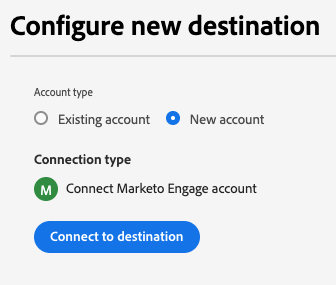

# Conexão com o Marketo Engage

## Visão geral {#overview}

O [!DNL Marketo Engage] é a única solução CXM (gerenciamento de experiência do cliente) completa para marketing, publicidade, análises e comércio. Ele permite automatizar e gerenciar atividades do gerenciamento de clientes potenciais de CRM e do envolvimento do cliente para o marketing baseado em conta e a atribuição de receita.

Use esse destino para a sincronização em tempo real de dados de público-alvo e atributos de perfil entre o Adobe Experience Platform e o Marketo Engage.

## Casos de uso {#use-cases}

Para ajudá-lo a entender melhor como e quando você deve usar o destino [!DNL Marketo Engage], veja a seguir exemplos de casos de uso que os clientes da Adobe Experience Platform podem resolver usando esse destino.

### Casos de uso de sincronização de público-alvo {#audience-sync-use-cases}

**Reconectar somente clientes em potencial conhecidos**

A equipe de marketing deseja executar uma campanha de retorno direcionada a clientes potenciais que não se envolveram em mais de 90 dias, mas já existem no Marketo.

Eles podem ativar os públicos para o Marketo Engage e usar o tipo de sincronização **[!UICONTROL Somente público]**.

### Casos de uso de sincronização de público-alvo e perfil {#audience-profile-sync-use-cases}

**Reconectar clientes em potencial conhecidos e atualizar clientes em potencial**

A equipe de marketing deseja iniciar uma campanha de reengajamento para contatos existentes do Marketo que demonstraram interesse com base nas visitas ao site. Eles também desejam atualizar as informações de clientes potenciais (como preferências, informações demográficas), mas não criar novas pessoas no Marketo.

Eles podem ativar os públicos para o Marketo Engage e usar o tipo de sincronização **[!UICONTROL Público-alvo e Perfil]** combinado com a ação **[!UICONTROL Atualizar somente pessoas existentes]** para garantir que eles segmentem apenas os públicos-alvo que já existem no Marketo.

**Reengajar e expandir alcance com sincronização completa de perfil**

A equipe de marketing deseja ativar um público-alvo de interesse do produto para uma nova campanha. Embora muitos dos perfis já existam no Marketo, alguns são novos e só estão presentes no Real-Time CDP. Para as pessoas existentes, eles querem ter certeza de que estão atualizando essas pessoas no Marketo, mas também criar novos perfis.

Eles podem ativar seus públicos no Marketo Engage e usar o tipo de sincronização **[!UICONTROL Público-alvo e Perfil]** combinado com a ação **[!UICONTROL Atualizar pessoas existentes e criar novas pessoas]** para garantir que eles direcionem clientes potenciais existentes do Marketo e criem novos para os novos públicos exportados do Real-Time CDP.

## Pré-requisitos {#prerequisites}

O usuário que configura o destino deve ter a permissão [Editar Pessoa](https://experienceleague.adobe.com/pt-br/docs/marketo/using/product-docs/administration/users-and-roles/descriptions-of-role-permissions#access-database) em sua instância e partição do Marketo.

## Identidades suportadas {#supported-identities}

[!DNL Marketo Engage] dá suporte à ativação das identidades descritas na tabela abaixo. Saiba mais sobre [identidades](/help/identity-service/features/namespaces.md).

| Identidade de destino | Descrição | Considerações |
|---|---|---|
| `DedupeField` | O campo usado para identificar e corresponder clientes potenciais existentes no Marketo. | Durante a etapa [mapping](#mapping), mapeie qualquer campo de origem (como `Email` ou outros identificadores personalizados) que você deseja usar como campo de desduplicação para esta identidade de destino. Para obter melhores resultados, escolha um campo que esteja disponível e seja exclusivo de forma consistente em todos os perfis do cliente. Não há suporte para `ECID` como campo de desduplicação. |

{style="table-layout:auto"}

## Públicos-alvo compatíveis {#supported-audiences}

Esta seção descreve quais tipos de públicos-alvo você pode exportar para esse destino. As duas tabelas abaixo indicam a quais públicos este conector dá suporte, por _origem do público-alvo_ e _tipos de perfil incluídos no público-alvo_:

| Origem do público | Suportado | Descrição |
|---------|----------|----------|
| [!DNL Segmentation Service] | ✓ | Públicos-alvo gerados pelo [Serviço de Segmentação](../../../segmentation/home.md) da Experience Platform. |
| Todas as outras origens de público-alvo | ✓ | Esta categoria inclui todas as origens de público-alvo fora dos públicos-alvo gerados pelo [!DNL Segmentation Service]. Leia sobre as [várias origens do público-alvo](/help/segmentation/ui/audience-portal.md#customize). Alguns exemplos incluem: <ul><li> carregar audiências personalizadas [importadas](../../../segmentation/ui/audience-portal.md#import-audience) para o Experience Platform de arquivos CSV,</li><li> públicos-alvo semelhantes, </li><li> públicos federados, </li><li> públicos-alvo gerados em outros aplicativos da Experience Platform, como o Adobe Journey Optimizer, </li><li> e muito mais. </li></ul>   |

{style="table-layout:auto"}

Públicos-alvo compatíveis por tipo de dados de público-alvo:

| Tipo de dados de público | Suportado | Descrição | Casos de uso |
|--------------------|-----------|-------------|-----------|
| [Públicos-alvo](/help/segmentation/types/people-audiences.md) | Sim | Com base nos perfis de clientes, permitindo direcionar grupos específicos de pessoas para campanhas de marketing. | Compradores frequentes, abandonadores de carrinho |
| [Públicos-alvo da conta](/help/segmentation/types/account-audiences.md) | Não | Direcione indivíduos em organizações específicas para estratégias de marketing baseadas em conta. | Marketing B2B |
| [Públicos-alvo potenciais](/help/segmentation/types/prospect-audiences.md) | Não | Direcione indivíduos que ainda não são clientes, mas compartilham características com seu público-alvo. | Prospecção com dados de terceiros |
| [Exportações do conjunto de dados](/help/catalog/datasets/overview.md) | Não | Coleções de dados estruturados armazenados no Data Lake do Adobe Experience Platform. | Relatórios, fluxos de trabalho de ciência de dados |

{style="table-layout:auto"}

## Tipo e frequência de exportação {#export-type-frequency}

Consulte a tabela abaixo para obter informações sobre o tipo e a frequência da exportação de destino.

| Item | Tipo | Notas |
---------|----------|---------|
| Tipo de exportação | **[!UICONTROL Exportação de público-alvo]** | Você está exportando todos os membros de um público com os identificadores (email, ECID) usados no destino [!DNL Marketo Engage]. |
| Frequência de exportação | **[!UICONTROL Streaming]** | Os destinos de transmissão são conexões baseadas em API &quot;sempre ativas&quot;. Assim que um perfil for atualizado no Experience Platform com base na avaliação do público-alvo, o conector enviará a atualização downstream para a plataforma de destino. Leia mais sobre [destinos de streaming](/help/destinations/destination-types.md#streaming-destinations). |

{style="table-layout:auto"}

## Comportamento de correspondência de lead {#lead-matching}

Entender como a correspondência de clientes potenciais do Marketo funciona ajuda você a escolher a configuração correta para seu caso de uso. O comportamento correspondente depende das configurações de **[!UICONTROL Tipo de sincronização]** e **[!UICONTROL Ação da pessoa]** selecionadas.

O Marketo usa o **[!UICONTROL campo de desduplicação do Marketo]** selecionado para corresponder perfis do Experience Platform com clientes potenciais existentes do Marketo. O processo de correspondência pesquisa todas as partições na instância do Marketo para encontrar leads existentes. Consulte a tabela abaixo para entender como os clientes em potencial são criados e atualizados na instância do Marketo, dependendo da configuração selecionada.

| Tipo de sincronização | Ação de pessoa | Comportamento de correspondência |
|-----------|---------------|-------------------|
| **[!UICONTROL Somente perfil]** | **[!UICONTROL Atualizar pessoas existentes e criar novas pessoas]** | <ul><li>Atualiza clientes potenciais existentes com novos dados de perfil</li><li>Cria novos clientes em potencial na partição selecionada para perfis sem correspondência</li></ul> |
| **[!UICONTROL Somente perfil]** | **[!UICONTROL Atualizar somente pessoas existentes]** | <ul><li>Atualiza clientes potenciais existentes com novos dados de perfil</li><li>Nenhum cliente potencial novo criado para perfis sem correspondência</li></ul> |
| **[!UICONTROL Somente público-alvo]** | N/D | <ul><li>Adiciona clientes em potencial existentes a listas de público-alvo</li><li>Nenhum cliente potencial novo criado para perfis sem correspondência</li></ul> |
| **[!UICONTROL Público-alvo e perfil]** | **[!UICONTROL Atualizar pessoas existentes e criar novas pessoas]** | <ul><li>Atualiza clientes potenciais existentes com novos dados de perfil</li><li>Adiciona clientes em potencial existentes a listas de público-alvo</li><li>Cria novos clientes em potencial na partição selecionada para perfis sem correspondência</li><li>Adiciona novos leads às listas de público-alvo</li></ul> |
| **[!UICONTROL Público-alvo e perfil]** | **[!UICONTROL Atualizar somente pessoas existentes]** | <ul><li>Atualiza clientes potenciais existentes com novos dados de perfil</li><li>Adiciona clientes em potencial existentes a listas de público-alvo</li><li>Nenhum cliente potencial novo criado para perfis sem correspondência</li></ul> |

{style="table-layout:auto"}

### Considerações importantes

* **Seleção de campo de eliminação de duplicação**: escolha um campo que esteja consistentemente disponível e exclusivo em seus perfis de cliente (por exemplo: endereço de email, ID do cliente)
* **Tratamento de partição**: ao criar novos clientes potenciais, eles são colocados na partição selecionada (ou na partição **[!UICONTROL Padrão]** se você não tiver selecionado uma partição)
* **Tratamento de duplicados**: se vários clientes potenciais do Marketo corresponderem ao mesmo perfil, somente o cliente potencial atualizado mais recentemente será atualizado
* **Correspondência entre partições**: o sistema pesquisa em todas as partições para localizar clientes potenciais existentes, independentemente da partição selecionada para novos clientes potenciais

## Conectar ao destino {#connect}

>[!IMPORTANT]
> 
>* Para se conectar ao destino, você precisa de **[!UICONTROL Exibir Destinos]** e **[!UICONTROL Gerenciar Destinos]** [permissões de controle de acesso](/help/access-control/home.md#permissions).
>
>* Para ativar dados, você precisa de **[!UICONTROL Exibir Destinos]**, **[!UICONTROL Ativar Destinos]**, **[!UICONTROL Exibir Perfis]** e **[!UICONTROL Exibir Segmentos]** [permissões de controle de acesso](/help/access-control/home.md#permissions). Leia a [visão geral do controle de acesso](/help/access-control/ui/overview.md) ou contate o administrador do produto para obter as permissões necessárias.

Para se conectar a este destino, siga as etapas descritas no [tutorial de configuração de destino](../../ui/connect-destination.md). No workflow de configuração de destino, preencha os campos listados nas duas seções abaixo.

### Autenticar para o destino {#authenticate}

Para autenticar no destino, selecione **[!UICONTROL Conectar ao destino]**.

### Preencher detalhes do destino {#destination-details}

Para configurar detalhes para o destino, preencha os campos obrigatórios e opcionais abaixo. Um asterisco ao lado de um campo na interface do usuário indica que o campo é obrigatório.

* **[!UICONTROL Nome]**: um nome pelo qual você reconhecerá este destino no futuro.
* **[!UICONTROL Descrição]**: uma descrição que ajudará você a identificar este destino no futuro.
* **[!UICONTROL Munchkin ID]**: selecione o [!DNL Marketo Munchkin ID] que deseja usar para este destino.
* **[!UICONTROL Workspace ID]**: selecione sua ID do espaço de trabalho do Marketo.
* **[!UICONTROL Tipo de sincronização]**: selecione o tipo de sincronização que você deseja usar para este destino:
   * **[!UICONTROL Público-alvo e perfil]**: selecione esta opção quando quiser adicionar membros de público-alvo a listas do Marketo e manter suas informações de perfil atualizadas.
   * **[!UICONTROL Somente perfil]**: selecione esta opção quando quiser manter os perfis de clientes potenciais da Marketo atualizados com as informações mais recentes da Experience Platform.
   * **[!UICONTROL Somente público-alvo]**: selecione esta opção quando quiser adicionar membros do público-alvo às listas do Marketo sem atualizar suas informações de perfil.
* **[!UICONTROL Partição]**: *A seleção de partição está disponível somente ao escolher **[!UICONTROL Somente perfil]**&#x200B;ou **[!UICONTROL Tipos de sincronização de Público-alvo e perfil]***. Selecione uma ID de partição do Marketo associada ao espaço de trabalho escolhido. Isso permite especificar qual partição de cliente potencial no Marketo receberá os dados exportados. Se você não escolher uma partição específica, seus dados serão enviados para a partição **[!UICONTROL Padrão]** no Marketo.
* **[!UICONTROL Campo de eliminação de duplicação do Marketo]**: selecione o campo de eliminação de duplicação do Marketo que deseja usar ao atualizar clientes potenciais existentes no Marketo. Este seletor mostra os campos marcados como campos de desduplicação no Marketo. Se quiser que um campo específico do Marketo seja exibido como um campo de desduplicação, você deve marcar o campo como um [campo pesquisável](https://experienceleague.adobe.com/pt-br/docs/marketo-developer/marketo/rest/lead-database/lead-database) no Marketo.

  >[!NOTE]
  >
  >Marketo `Lead ID` e Experience Cloud IDs (`ECID`) não têm suporte para desduplicação.

* **[!UICONTROL Ação da pessoa]**: selecione a ação do Marketo que deseja executar ao exportar dados.
   * **[!UICONTROL Atualizar pessoas existentes e criar novas pessoas]**: selecione essa opção para atualizar clientes potenciais existentes do Marketo e criar novos clientes potenciais para membros do público-alvo que ainda não estejam no Marketo. Novos clientes em potencial serão criados na partição selecionada. Se você não selecionou uma partição, novos clientes em potencial serão criados na partição **[!UICONTROL Padrão]**.
   * **[!UICONTROL Atualizar somente pessoas existentes]**: selecione essa opção quando desejar atualizar somente clientes potenciais existentes da Marketo sem criar novos. Se vários clientes em potencial corresponderem ao mesmo perfil, somente o cliente em potencial do Marketo atualizado mais recentemente será atualizado com seus dados do Experience Platform.

### Ativar alertas {#enable-alerts}

Você pode ativar os alertas para receber notificações sobre o status do fluxo de dados para o seu destino. Selecione um alerta na lista para assinar e receber notificações sobre o status do seu fluxo de dados. Para obter mais informações sobre alertas, leia o manual sobre [assinatura de alertas de destinos usando a interface](../../ui/alerts.md).

Quando terminar de fornecer detalhes da conexão de destino, selecione **[!UICONTROL Avançar]**.

## Ativar públicos-alvo para esse destino {#activate}

>[!IMPORTANT]
> 
>* Para ativar dados, você precisa de **[!UICONTROL Exibir Destinos]**, **[!UICONTROL Ativar Destinos]**, **[!UICONTROL Exibir Perfis]** e **[!UICONTROL Exibir Segmentos]** [permissões de controle de acesso](/help/access-control/home.md#permissions). Leia a [visão geral do controle de acesso](/help/access-control/ui/overview.md) ou contate o administrador do produto para obter as permissões necessárias.
>* Para exportar *identidades*, você precisa da **[!UICONTROL permissão Exibir Gráfico de Identidade]** [controle de acesso](/help/access-control/home.md#permissions).   {width="100" zoomable="yes"}

Leia [Ativar perfis e públicos-alvo para destinos de exportação de público-alvo de streaming](/help/destinations/ui/activate-segment-streaming-destinations.md) para obter instruções sobre como ativar públicos-alvo para este destino.

### Mapeamentos necessários {#required-mappings}

Durante a etapa de mapeamento, mapeie qualquer campo de origem (como `email` ou outros identificadores personalizados) que você deseja usar como campo de desduplicação para a identidade de destino `DedupeField`. Para obter melhores resultados, escolha um campo que esteja disponível e seja exclusivo de forma consistente em todos os perfis do cliente.

Para que o Marketo crie clientes em potencial com sucesso, você também deve mapear os seguintes atributos de destino necessários:

* `firstName`: O nome do cliente potencial
* `lastName`: O sobrenome do cliente potencial
* `email`: O endereço de email do cliente potencial

Se você estiver usando `email` como campo de desduplicação, também deverá mapear os atributos `firstName` e `lastName` conforme mostrado na imagem abaixo.

Se você estiver usando um campo de desduplicação diferente, mapeie manualmente todos os três atributos necessários (`firstName`, `lastName`, `email`) conforme mostrado na imagem abaixo.

## Dados exportados / Validar exportação de dados {#exported-data}

Depois de exportar os públicos para o Marketo Engage, faça logon na conta do Marketo para verificar se os públicos-alvo foram ativados conforme esperado. Verifique as partições e os espaços de trabalho dos clientes potenciais relevantes no Marketo para confirmar se os dados do público-alvo aparecem corretamente e se as ações desejadas (como atualizar ou criar pessoas) foram executadas.

Se não vir os dados esperados, revise as configurações de mapeamento e exportação no Adobe Experience Platform e tente exportar novamente.

## Uso e governança de dados {#data-usage-governance}

Todos os destinos do [!DNL Adobe Experience Platform] são compatíveis com as políticas de uso de dados ao manipular seus dados. Para obter informações detalhadas sobre como o [!DNL Adobe Experience Platform] fiscaliza a governança de dados, leia a [Visão geral da Governança de Dados](/help/data-governance/home.md).
