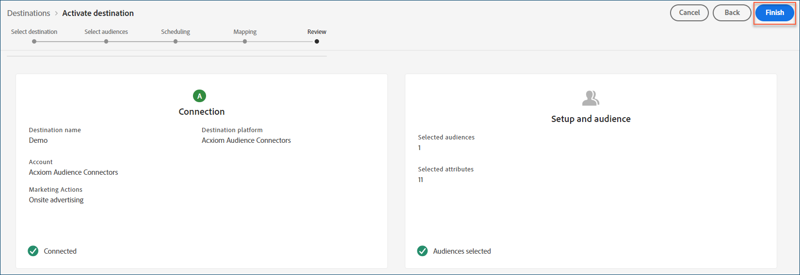

# [!DNL Acxiom Audience Connection] destino

>[!NOTE]
>
>O destino [!DNL Acxiom Audience Connection] está na versão beta. Esse conector de destino e a página de documentação são criados e mantidos pela equipe [!DNL Acxiom]. Para fazer consultas ou solicitações de atualização, entre em contato diretamente com a Acxiom [aqui](mailto:acxiom-adobe-help@acxiom.com).

Use o destino [!DNL Acxiom Audience Connection] para aprimorar públicos com a tecnologia [!DNL Acxiom's] [Real ID™](https://www.acxiom.com/real-id/real-id/) e ativar públicos para várias plataformas, como [!DNL Altice], [!DNL Ampersand], [!DNL Comcast] e muito mais.

Este tutorial fornece instruções para criar um conector de destino [!DNL Acxiom Audience Connection] usando a interface do usuário [!DNL Adobe Experience Platform]. Esse conector é usado para criar e distribuir públicos-alvo para destinos selecionados.

## Casos de uso {#use-cases}

Para ajudá-lo a entender melhor como e quando você deve usar o destino [!DNL Acxiom Audience Connection], este é um exemplo de caso de uso que os clientes [!DNL Adobe Experience Platform] podem resolver usando este conector.

### Enviar públicos-alvo do Experience Platform para a sua conta da Acxiom {#send-audiences}

Use este conector de destino se você for um profissional de marketing que deseja enviar públicos-alvo de [!DNL Experience Platform] para sua conta do [!DNL Acxiom], para aquisição entre canais.

Por exemplo, o departamento de Operações de marketing de uma marca global de serviços financeiros está interessado na aquisição de clientes entre canais por meio de várias plataformas de publicidade. Eles podem usar o conector de destino [!DNL Acxiom Audience Connection] para enviar públicos de [!DNL Experience Platform] para [!DNL Acxiom], aprimorar os públicos com a tecnologia [!DNL Acxiom's Real ID] e ativar os públicos para várias plataformas, como [!DNL Altice], [!DNL Ampersand], [!DNL Comcast] e muito mais.

## Pré-requisitos {#prerequisites}

* **Confirmar Termos de Uso:** Antes de configurar um novo destino do [!DNL Acxiom Audience Connection], você deve ler e assinar o Contrato de Termos de Uso do [!DNL Acxiom's]. Você receberá o link para o contrato assim que a ordem de venda executada for concluída. Até que você assine o contrato, você não verá o cartão de destino [!DNL Acxiom Audience Connection] no catálogo de destino do Experience Platform. Depois que você aceitar e assinar o contrato, o [!DNL Adobe] concluirá o processo de integração e você verá o cartão de destino [!DNL Acxiom Audience Connection].
* **Conhece sua ID da organização da Adobe:** Sua ID da organização [!DNL Adobe] é necessária para concluir seus Termos de Contrato do Usuário. Consulte o tópico [!DNL Adobe's] *Organizações na Experience Cloud* para obter detalhes sobre como [exibir a ID da sua organização](https://experienceleague.adobe.com/pt-br/docs/core-services/interface/administration/organizations#concept_EA8AEE5B02CF46ACBDAD6A8508646255).

## Destinos suportados {#supported-destinations}

O destino [!DNL Acxiom Audience Connection] atualmente oferece suporte à ativação de público-alvo para as seguintes plataformas. 

* [!DNL Altice]
* [!DNL Ampersand]
* [!DNL Comcast]
* [!DNL Cox]
* [[!DNL LG Ads]](#lg-ads)
* [!DNL Spectrum]
* [!DNL Viant]

## Conectar ao destino {#connect}

A autenticação para o destino [!DNL Acxiom's Audience Connection] é tratada automaticamente em segundo plano para sua conveniência.

## Configurações específicas de destino {#destination-settings}

Alguns destinos do [!DNL Acxiom Audience Connection] exigem informações adicionais. As seções abaixo fornecem orientação detalhada sobre como configurar essas opções.

### [!DNL LG Ads] {#lg-ads}

Para configurar detalhes para o destino, preencha os campos abaixo.

* **Categoria do segmento**: a categoria ou vertical de destino na qual seu segmento se enquadra. Exemplo: serviços financeiros, automotivo, saúde, etc.

## Ativar públicos-alvo para esse destino {#activate}

>[!IMPORTANT]
> 
>* Para ativar dados, você precisa de **[!UICONTROL Exibir Destinos]**, **[!UICONTROL Ativar Destinos]**, **[!UICONTROL Exibir Perfis]** e **[!UICONTROL Exibir Segmentos]** [permissões de controle de acesso](/help/access-control/home.md#permissions). Leia a [visão geral do controle de acesso](/help/access-control/ui/overview.md) ou contate o administrador do produto para obter as permissões necessárias.
>* Para exportar *identidades*, você precisa da **[!UICONTROL permissão Exibir Gráfico de Identidade]** [controle de acesso](/help/access-control/home.md#permissions).   {width="100" zoomable="yes"}

Leia [Ativar dados de público-alvo para destinos de exportação de perfil em lote](/help/destinations/ui/activate-batch-profile-destinations.md) para obter instruções sobre como ativar públicos-alvo para esse destino.

>[!NOTE]
>
>O destino [!DNL Acxiom Audience Connection] dá suporte apenas a exportações completas de arquivos.

### Mapear atributos e identidades {#map}

Para que o destino [!DNL Acxiom Audience Connection] receba corretamente os dados de público-alvo, você deve mapear os campos de origem do Experience Platform para os campos de destino [!DNL Acxiom Audience Connection] corretos.

[!DNL Acxiom Audience Connection] permite o mapeamento somente para os seguintes campos de destino. Os campos de destino descritos na tabela abaixo devem ser mapeados na ordem mostrada abaixo.

| Nome do campo | Descrição | Obrigatório | Ordem dos campos | Comprimento máximo |
|---|---|---|---|---|          
| Nome | Nome do indivíduo | Não | 1 | 255 |
| Meio | Nome do meio ou inicial do indivíduo | Não | 2 | 50 |
| Sobrenome | Sobrenome do indivíduo | Sim | 3 | 255 |
| Sufixo de geração | Sufixo do indivíduo | Não | 4 | 10 |
| Linha de Endereço 1 | Endereço 1 campo de residência principal | Sim | 5 | 255 |
| Linha de Endereço 2 | Endereço 2 campo de residência principal | Não | 6 | 255 |
| Cidade | Cidade da residência principal | Sim | 7 | 255 |
| Estado | Abreviatura do Estado de residência principal | Sim | 8 | 2 |
| Código postal | Código postal completo da residência principal | Sim | 9 | 10 |
| Email | Email primário Por padrão, esse campo é usado como uma chave de desduplicação para tornar os registros exclusivos | Não | 10 | 255 |
| Telefone | Número de telefone do indivíduo (código de área + número)  Por padrão, esse campo é usado como uma chave de desduplicação para tornar os registros exclusivos. | Não | 11 | 10 |

Na coluna **[!UICONTROL Campo Source]**, digite o nome de cada um dos atributos de origem que você deseja mapear para o campo de destino correspondente ou selecione o ícone de seta para abrir a tela **[!UICONTROL Selecionar campo de origem]**. 

Depois de mapear todos os campos, selecione **[!UICONTROL Avançar]**.

Se você não estiver usando o esquema padrão [!DNL Adobe's], consulte a documentação do [Guia da Interface do Usuário do Serviço de Consulta](../../../query-service/ui/overview.md) para obter informações sobre como usar o serviço de consulta para preencher o esquema padrão [!DNL Adobe] com seus nomes de campo.

### Revisar {#review}

Depois de concluir todas as etapas acima, você terá a oportunidade de revisar o status da conexão de destino e os detalhes do público-alvo antes de ativá-lo (distribuí-lo). Os públicos selecionados aparecerão na parte inferior de uma lista. Cada público será uma chamada separada para a API [!DNL Acxiom Audience Connection].

Se você estiver satisfeito com os resultados, selecione **[!UICONTROL Concluir]** para ativar seu destino.

## Solução de problemas {#troubleshooting}

Se o representante de destino não puder localizar o público-alvo, contate o representante do [!DNL Adobe] para obter assistência.

Será necessário fornecer as seguintes informações ao representante do [!DNL Adobe]:

* Nome do público-alvo
* Nome do destino
* Data de ativação do público
* Nome do arquivo exportado

## Próximas etapas {#next-steps}

Ao seguir este tutorial, você ativou com êxito um público-alvo para a plataforma de destino selecionada. Em seguida, entre em contato com o representante da plataforma de destino para começar a configurar o Campaign.

## Uso e governança de dados {#data-usage-governance}

Todos os destinos do [!DNL Adobe Experience Platform] são compatíveis com as políticas de uso de dados ao manipular seus dados. Para obter informações detalhadas sobre como o [!DNL Adobe Experience Platform] fiscaliza a governança de dados, leia a [Visão geral da Governança de Dados](https://experienceleague.adobe.com/pt-br/docs/experience-platform/data-governance/home).
