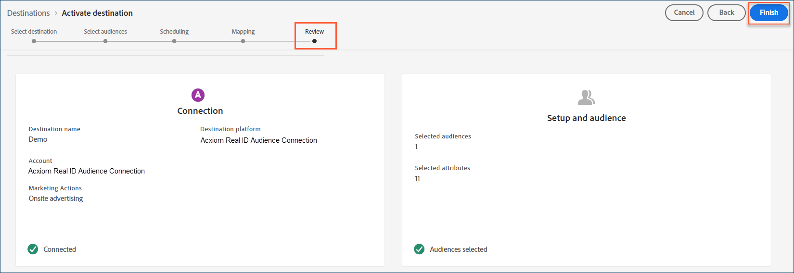

# [!DNL Acxiom Real ID™ Audience Connection] destino

Use o destino [!DNL Acxiom Real ID Audience Connection] para aprimorar os públicos-alvo com a tecnologia [Real ID™](https://www.acxiom.com/real-id/real-id/) de [!DNL Acxiom]. Em seguida, ative esses públicos-alvo em plataformas como [!DNL Altice], [!DNL Ampersand], [!DNL Comcast] e muito mais.

>[!NOTE]
>
>Esse conector de destino e a página de documentação são criados e mantidos pela equipe [!DNL Acxiom]. Para qualquer consulta ou solicitação de atualização, contate [!DNL Acxiom] diretamente em [acxiom-adobe-help@acxiom.com](mailto:acxiom-adobe-help@acxiom.com).

Siga estas etapas para criar um conector de destino [!DNL Acxiom Real ID Audience Connection] usando a interface de usuário [!DNL Adobe Experience Platform]. Use esse conector para criar e distribuir públicos para destinos selecionados.

## Casos de uso {#use-cases}

Use este destino se você tiver o [!DNL Real ID] de [!DNL Acxiom] carregado em [!DNL Real-Time CDP] como um identificador. Os seguintes casos de uso mostram como você pode usar o destino [!DNL Acxiom Real ID Audience Connection].

### Enviar públicos-alvo de [!DNL Experience Platform] para sua conta do [!DNL Acxiom] {#send-audiences}

Use este conector de destino para enviar públicos-alvo do [!DNL Experience Platform] para a sua conta do [!DNL Acxiom] para aquisição entre canais.

Por exemplo, o departamento de Operações de marketing de uma marca global de serviços financeiros está interessado na aquisição de clientes entre canais por meio de várias plataformas de publicidade. Eles podem usar o conector de destino [!DNL Acxiom Real ID Audience Connection] para enviar públicos de [!DNL Experience Platform] para [!DNL Acxiom], aprimorar os públicos com a tecnologia [!DNL Real ID] de [!DNL Acxiom] e ativar os públicos para várias plataformas, como [!DNL Altice], [!DNL Ampersand], [!DNL Comcast] e muito mais.

## Pré-requisitos {#prerequisites}

Antes de configurar o destino [!DNL Acxiom Real ID Audience Connection], conclua os seguintes pré-requisitos.

* **Confirmar termos de uso:** Leia e assine o Contrato de Termos de Uso de [!DNL Acxiom]. Você receberá o link para o contrato assim que a ordem de venda executada for concluída. Até você assinar o contrato, o cartão de destino [!DNL Acxiom Real ID Audience Connection] não aparecerá no catálogo de destino [!DNL Experience Platform]. Depois que você aceitar e assinar o contrato, o [!DNL Adobe] concluirá a configuração e o cartão de destino do [!DNL Acxiom Real ID Audience Connection] ficará visível.
* **Conhece sua [!DNL Adobe] ID da organização:** Sua [!DNL Adobe] ID da organização é necessária para concluir seu Contrato de Termos de Uso. Consulte o tópico *Organizações no Experience Cloud* de [!DNL Adobe] para obter detalhes sobre como [exibir a ID da sua organização](https://experienceleague.adobe.com/pt-br/docs/core-services/interface/administration/organizations#concept_EA8AEE5B02CF46ACBDAD6A8508646255).
* **Obtenha uma licença para o produto [!DNL Real ID] de [!DNL Acxiom]:** Depois de obter uma licença, disponibilize o [!DNL Real ID] de [!DNL Acxiom] no [!DNL Real-Time CDP]. Consulte [Acxiom Data Enhancement](/help/destinations/catalog/data-partner/acxiom-data-enhancement.md) para obter detalhes.

## Identidades suportadas {#supported-identities}

O destino de Conexão de Público-Alvo [!DNL Real ID] de [!DNL Acxiom] dá suporte às seguintes ativações de identidade. Saiba mais sobre [identidades](/help/identity-service/features/namespaces.md).

| Identidade do público alvo | Descrição | Considerações |
| --------------- | ----------- | -------------- |
| [!DNL Real ID] | [!DNL Real ID] | Mapeie um campo de origem para esta identidade de destino. Seu campo de origem pode ser um [!DNL Acxiom] [!DNL Real ID] ou um identificador personalizado. |

{style="table-layout:auto"}

## Públicos-alvo compatíveis {#supported-audiences}

Esta seção descreve quais tipos de públicos-alvo você pode exportar para esse destino.

| Origem do público | Suportado | Descrição |
| --------------- | --------- | ----------- |
| [!DNL Segmentation Service] | Sim | Públicos gerados por meio do [!DNL Experience Platform] [Serviço de segmentação](/help/segmentation/home.md). |
| Todas as outras origens de público-alvo | Sim | Esta categoria inclui todas as origens de público-alvo fora dos públicos-alvo gerados pelo [!DNL Segmentation Service]. Leia sobre as [várias origens do público-alvo](/help/segmentation/ui/audience-portal.md#customize). Alguns exemplos incluem: <ul><li>carregar audiências personalizadas [importadas](/help/segmentation/ui/audience-portal.md#import-audience) para [!DNL Experience Platform] de arquivos CSV,</li><li>públicos-alvo semelhantes,</li><li>públicos federados,</li><li>públicos-alvo gerados em outros aplicativos [!DNL Experience Platform], como [!DNL Adobe Journey Optimizer],</li><li>e muito mais.</li></ul> |

{style="table-layout:auto"}

### Públicos-alvo compatíveis por tipo de dados {#supported-audiences-data-type}

A tabela a seguir descreve quais tipos de dados de público-alvo você pode exportar para esse destino.

| Tipo de dados de público | Suportado | Descrição | Casos de uso |
| -------------------- | --------- | ----------- | --------- |
| [Públicos-alvo](/help/segmentation/types/people-audiences.md) | Sim | Com base nos perfis de clientes. Use-os para direcionar grupos específicos de pessoas para campanhas de marketing. | Compradores frequentes, abandonadores de carrinho |
| [Públicos-alvo da conta](/help/segmentation/types/account-audiences.md) | Não | Direcione indivíduos em organizações específicas para estratégias de marketing baseadas em conta. | Marketing B2B |
| [Públicos-alvo potenciais](/help/segmentation/types/prospect-audiences.md) | Não | Direcione indivíduos que ainda não são clientes, mas compartilham características com seu público-alvo. | Prospecção com dados de terceiros |
| [Exportações do conjunto de dados](/help/catalog/datasets/overview.md) | Não | Coleções de dados estruturados armazenados no Data Lake [!DNL Adobe Experience Platform]. | Relatórios, fluxos de trabalho de ciência de dados |

{style="table-layout:auto"}

## Tipo e frequência de exportação {#export-type-frequency}

A tabela a seguir descreve o tipo e a frequência da exportação de destino.

| Item | Tipo | Notas |
| ---- | ---- | ----- |
| Tipo de exportação | **[!UICONTROL Audience export]** | Exporta todos os membros de um público com os identificadores usados no destino [!DNL Acxiom Real ID Audience Connection]. |
| Frequência de exportação | **[!UICONTROL Batch]** | Os destinos em lote exportam arquivos para plataformas downstream em incrementos de três, seis, oito, doze ou vinte e quatro horas. Leia mais sobre [destinos com base em arquivo de lote](/help/destinations/destination-types.md#file-based). |

{style="table-layout:auto"}

## Destinos compatíveis {#supported-destinations}

Ative públicos para as seguintes plataformas por meio do destino [!DNL Acxiom Real ID Audience Connection].

* [!DNL Altice]
* [[!DNL Amazon]](#amazon)
* [!DNL Ampersand]
* [!DNL Comcast]
* [!DNL Cox]
* [[!DNL Facebook]](#facebook)
* [[!DNL LG Ads]](#lg-ads)
* [[!DNL Pinterest]](#pinterest)
* [!DNL Spectrum]
* [!DNL Viant]
* [[!DNL Vizio]](#vizio)

## Conectar ao destino {#connect}

O [!DNL Experience Platform] manipula a autenticação automaticamente para o destino do [!DNL Acxiom Real ID Audience Connection].

>[!IMPORTANT]
>
>Para se conectar ao destino, você precisa das **[!UICONTROL View Destinations]** e **[!UICONTROL Manage Destinations]** [permissões de controle de acesso](/help/access-control/home.md#permissions). Leia a [visão geral do controle de acesso](/help/access-control/ui/overview.md) ou contate o administrador do produto para obter as permissões necessárias.

## Configurações específicas de destino {#destination-settings}

Alguns destinos do [!DNL Acxiom Real ID Audience Connection] exigem informações adicionais. As seções a seguir fornecem orientação detalhada sobre como configurar essas opções.

### [!DNL Amazon] {#amazon}

Para configurar detalhes para o destino, preencha os campos a seguir.

* **[!UICONTROL Publisher Account ID]**: Insira a ID da conta do publicador associada a este destino.

  ![Captura de tela do painel de detalhes do destino [!DNL Amazon] mostrando o campo ID da Conta do Publicador.](../../assets/catalog/advertising/acxiom-real-id-audience-connection/real_id_amazon_destination_details.png){zoomable="yes"}

### [!DNL Facebook] {#facebook}

Para configurar detalhes para o destino, preencha os campos a seguir.

* **[!UICONTROL Destination Account ID]**: Insira a ID da conta de destino para este destino.

  ![Captura de tela do painel de detalhes do destino [!DNL Facebook] mostrando o campo de ID da conta de destino.](../../assets/catalog/advertising/acxiom-real-id-audience-connection/real_id_facebook_destination_details.png){zoomable="yes"}

### [!DNL LG Ads] {#lg-ads}

Para configurar detalhes para o destino, preencha os campos a seguir.

* **[!UICONTROL Segment Category]**: A categoria ou vertical de destino na qual seu segmento se enquadra. Exemplo: serviços financeiros, automotivo ou saúde.

  ![Captura de tela do painel de detalhes do destino [!DNL LG Ads] mostrando o campo Categoria do segmento.](../../assets/catalog/advertising/acxiom-real-id-audience-connection/real_id_lg_ads_destination_details.png){zoomable="yes"}

### [!DNL Pinterest] {#pinterest}

Para configurar detalhes para o destino, preencha os campos a seguir.

* **[!UICONTROL Destination Account ID]**: Insira a ID da conta de destino para este destino.

  ![Captura de tela do painel de detalhes do destino [!DNL Pinterest] mostrando o campo de ID da conta de destino.](../../assets/catalog/advertising/acxiom-real-id-audience-connection/real_id_pinterest_destination_details.png){zoomable="yes"}

### [!DNL Vizio] {#vizio}

Para configurar detalhes para o destino, preencha os campos a seguir.

* **[!UICONTROL Advertiser Name]**: Digite o nome do anunciante para este destino.

  ![Captura de tela do painel de detalhes de destino [!DNL Vizio] mostrando o campo Nome do Anunciante.](../../assets/catalog/advertising/acxiom-real-id-audience-connection/real_id_vizio_destination_details.png){zoomable="yes"}

## Ativar públicos-alvo para esse destino {#activate}

Leia [Ativar dados de público-alvo para destinos de exportação de perfil em lote](/help/destinations/ui/activate-batch-profile-destinations.md) para obter instruções sobre como ativar públicos-alvo para esse destino.

>[!IMPORTANT]
>
>* Para ativar dados, você precisa das **[!UICONTROL View Destinations]**, **[!UICONTROL Activate Destinations]**, **[!UICONTROL View Profiles]** e **[!UICONTROL View Segments]** [permissões de controle de acesso](/help/access-control/home.md#permissions). Leia a [visão geral do controle de acesso](/help/access-control/ui/overview.md) ou contate o administrador do produto para obter as permissões necessárias.
>* Para exportar *identidades*, você precisa da **[!UICONTROL View Identity Graph]** [permissão de controle de acesso](/help/access-control/home.md#permissions).   {width="100" zoomable="yes"}

>[!NOTE]
>
>O destino [!DNL Acxiom Real ID Audience Connection] dá suporte apenas a exportações completas de arquivos.

### Mapear atributos e identidades {#map}

Para que o destino [!DNL Acxiom Real ID Audience Connection] receba corretamente os dados de público-alvo, mapeie o campo de origem de [!DNL Experience Platform] para o campo de destino [!DNL Acxiom Real ID Audience Connection] correto.

O campo de destino **[!UICONTROL Real ID]** é preenchido automaticamente na etapa de mapeamento. Mapeie seu campo de origem a ele: um namespace de identificador personalizado ou um [!DNL Acxiom] [!DNL Real ID] real armazenado no esquema do seu perfil.

| Nome do campo | Descrição | Obrigatório |
| ---------- | ----------- | -------- |
| [!DNL Real ID] | [!DNL Real ID] é um identificador alfanumérico exclusivo de 36 bytes do gráfico de resolução de identidade proprietário de [!DNL Acxiom]. É um identificador que representa uma pessoa, residência ou endereço. | Sim |

{style="table-layout:auto"}

Na coluna **[!UICONTROL Source Field]**, digite o nome do atributo de origem que deseja mapear para o campo de destino **[!UICONTROL Real ID]**. Ou selecione **[!UICONTROL Select source field]** para procurar campos de origem disponíveis. Depois selecione **[!UICONTROL Next]**.

![Captura de tela da tela de mapeamento mostrando a coluna [!UICONTROL Source Field] e o painel [!UICONTROL Select source field].](../../assets/catalog/advertising/acxiom-real-id-audience-connection/real_id_mapping_screen.png){zoomable="yes"}

Se você não estiver usando o esquema padrão de [!DNL Adobe], consulte o [Guia da Interface do Usuário do Serviço de Consulta](/help/query-service/ui/overview.md) para preencher o esquema padrão de [!DNL Adobe] com seus nomes de campo.

### Analisar o destino {#review}

Após concluir todas as etapas, revise o status da conexão de destino e os detalhes do público-alvo antes de ativá-lo. Os públicos selecionados aparecem em uma lista. Cada público é uma chamada separada para a API [!DNL Acxiom Real ID Audience Connection].

Quando os resultados parecerem corretos, selecione **[!UICONTROL Finish]** para ativar seu destino.

{zoomable="yes"}

## Solução de problemas {#troubleshooting}

Se o representante de destino não puder localizar o público-alvo, contate o representante do [!DNL Adobe] para obter assistência.

Forneça as seguintes informações ao representante do [!DNL Adobe]:

* Nome do público-alvo
* Nome do destino
* Data de ativação do público
* Nome do arquivo exportado

## Próximas etapas {#next-steps}

Você ativou com êxito um público-alvo para a plataforma de destino selecionada. Em seguida, entre em contato com o representante da plataforma de destino para começar a configurar o Campaign.

## Uso e governança de dados {#data-usage-governance}

Todos os destinos do [!DNL Adobe Experience Platform] são compatíveis com as políticas de uso de dados ao manipular seus dados. Para obter informações detalhadas sobre como o [!DNL Adobe Experience Platform] fiscaliza a governança de dados, leia a [Visão geral da Governança de Dados](/help/data-governance/home.md).
