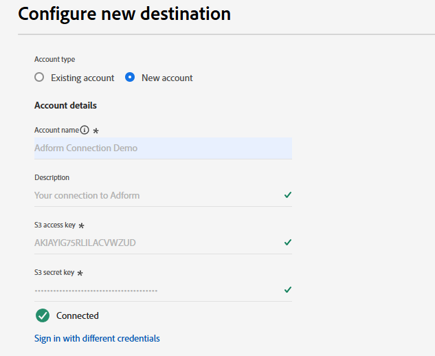

# Adform connection {#adform}

## Visão geral {#overview}

A Adform é líder no fornecimento de soluções de compra e venda de mídia programática. Conectando o Adform à Adobe Experience Platform, você pode ativar seus públicos-alvo primários por meio do Adform com base na Experience Cloud ID (ECID).

>[!IMPORTANT]
>
>O conector de destino e a página de documentação são criados e mantidos pela equipe do Adform. Para qualquer consulta ou solicitação de atualização, contate-os diretamente em `support@adform.com`.

## Casos de uso {#use-cases}

Para ajudá-lo a entender melhor como e quando você deve usar o destino Adform, veja a seguir exemplos de casos de uso que os clientes do Adobe Experience Platform podem resolver usando esse destino.

### Ativação de público do Adobe Real-Time CDP {#use-case-1}

Use esse destino para enviar públicos-alvo da Adobe Real-Time CDP para o Adform para ativação com base na Experience Cloud ID (ECID) e na Adobe ID Fusion. O ID Fusion da Adobe é o serviço de resolução de ID da Adobe que permite ativar os públicos-alvo primários com base na Experience Cloud ID (ECID).

Um caso comum é o redirecionamento dos visitantes do site para o site ou aplicativo com base na Experience Cloud ID (ECID). Basta enviar a Experience Cloud ID (ECID) para a Adform por meio das [extensões de Adform](https://exchange.adobe.com/apps/ec/600102/adform-s2s-site-tracking) ou [do lado do cliente](https://experienceleague.adobe.com/en/docs/experience-platform/destinations/catalog/analytics/adform) prontamente disponíveis. Depois disso, você poderá compartilhar públicos com o Adobe Platform por meio do destino do Adobe para ativação, com base exclusivamente na Experience Cloud ID (ECID).

## Pré-requisitos {#prerequisites}

* Você precisa ser um cliente existente do Adobe Form para usar esse destino.
* Você precisa ter suas credenciais da Conexão de dados do Adobe Audience Base.
   * Se você não tiver credenciais da Conexão de dados da base de público-alvo da Adobe, entre em contato com seu representante da Adobe.
* Para uma sincronização adequada, você precisa ter uma conexão de [Streaming de Eventos](https://exchange.adobe.com/apps/ec/600102/adform-s2s-site-tracking) ou [lado do cliente](https://experienceleague.adobe.com/en/docs/experience-platform/destinations/catalog/analytics/adform) de suas entidades para o Rastreamento de Site da Adobe.
   * Se você não tiver uma conexão de transmissão de eventos ou do lado do cliente de suas entidades para o Rastreamento de site da Adobe, entre em contato com o representante da Adobe.
   * A Adform fornece extensões do Adobe Experience Cloud para [Streaming de Eventos](https://exchange.adobe.com/apps/ec/600102/adform-s2s-site-tracking) e [lado do cliente](https://experienceleague.adobe.com/en/docs/experience-platform/destinations/catalog/analytics/adform).

## Identidades suportadas {#supported-identities}

O Adform é compatível com a ativação de identidades descritas na tabela abaixo. Saiba mais sobre [identidades](/help/identity-service/features/namespaces.md).

| Identidade de destino | Descrição | Considerações |
|---|---|---|
| ECID | Experience Cloud ID | Um namespace que representa a ECID. Esse namespace também pode ser referenciado pelos seguintes aliases: &quot;Adobe Marketing Cloud ID&quot;, &quot;Adobe Experience Cloud ID&quot;, &quot;Adobe Experience Platform ID&quot;. Consulte o seguinte documento no [ECID](/help/identity-service/features/ecid.md) para obter mais informações. |

{style="table-layout:auto"}

## Públicos-alvo compatíveis {#supported-audiences}

Esta seção descreve que tipo de público-alvo você pode exportar para esse destino.

| Origem do público | Suportado | Descrição |
---------|----------|----------|
| [!DNL Segmentation Service] | ✓ | Públicos-alvo gerados pelo [Serviço de Segmentação](../../../segmentation/home.md) da Experience Platform. |
| Uploads personalizados | ✓ | Públicos [importados](../../../segmentation/ui/overview.md#import-audience) para o Experience Platform de arquivos CSV. |

{style="table-layout:auto"}

## Tipo e frequência de exportação {#export-type-frequency}

Consulte a tabela abaixo para obter informações sobre o tipo e a frequência da exportação de destino.

| Item | Tipo | Notas |
---------|----------|---------|
| Tipo de exportação | **[!UICONTROL Segment export]** | Você está exportando todos os membros de um segmento (público-alvo) com os identificadores (nome, número de telefone ou outros) usados no destino *YourDestination*. |
| Frequência de exportação | **[!UICONTROL Batch]** | Os destinos em lote exportam arquivos para plataformas downstream em incrementos de três, seis, oito, doze ou vinte e quatro horas. Leia mais sobre [destinos com base em arquivo de lote](/help/destinations/destination-types.md#file-based). |

{style="table-layout:auto"}

## Conectar ao destino {#connect}

>[!IMPORTANT]
> 
>Para se conectar ao destino, você precisa da **[!UICONTROL View Destinations]** e da **[!UICONTROL Manage Destinations]** [permissão de controle de acesso](/help/access-control/home.md#permissions). Leia a [visão geral do controle de acesso](/help/access-control/ui/overview.md) ou contate o administrador do produto para obter as permissões necessárias.

Para se conectar a este destino, siga as etapas descritas no [tutorial de configuração de destino](../../ui/connect-destination.md). No workflow de configuração de destino, preencha os campos listados nas duas seções abaixo.

### Autenticar para o destino {#authenticate}

Para autenticar no destino, preencha os campos obrigatórios e selecione **[!UICONTROL Connect to destination]**.

* **[!UICONTROL Account name]**: Digite um nome de conta pelo qual você possa identificar esta conexão de destino no futuro.
* **[!UICONTROL S3 Access Key ID]**: Preencha a Chave de Acesso S3 fornecida pela Adform.
* **[!UICONTROL S3 Secret Access Key]**: Preencha a Chave de Acesso Secreta S3 fornecida pela Adform.

### Preencher detalhes do destino {#destination-details}

Para configurar detalhes para o destino, preencha os campos obrigatórios e opcionais abaixo. Um asterisco ao lado de um campo na interface do usuário indica que o campo é obrigatório.

* **[!UICONTROL Name]**: Um nome pelo qual você reconhecerá este destino no futuro.
* **[!UICONTROL Description]**: uma descrição que ajudará você a identificar este destino no futuro.
* **[!UICONTROL Provider Name]**: O nome da sua conta do Adform fornecido pelo Adform.

### Ativar alertas {#enable-alerts}

Você pode ativar os alertas para receber notificações sobre o status do fluxo de dados para o seu destino. Selecione um alerta na lista para assinar e receber notificações sobre o status do seu fluxo de dados. Para obter mais informações sobre alertas, consulte o manual sobre [assinatura de alertas de destinos usando a interface](../../ui/alerts.md).

Quando terminar de fornecer detalhes da conexão de destino, selecione **[!UICONTROL Next]**.

## Ativar públicos-alvo para esse destino {#activate}

>[!IMPORTANT]
> 
>* Para ativar dados, você precisa das **[!UICONTROL View Destinations]**, **[!UICONTROL Activate Destinations]**, **[!UICONTROL View Profiles]** e **[!UICONTROL View Segments]** [permissões de controle de acesso](/help/access-control/home.md#permissions). Leia a [visão geral do controle de acesso](/help/access-control/ui/overview.md) ou contate o administrador do produto para obter as permissões necessárias.
>* Para exportar *identidades*, você precisa da **[!UICONTROL View Identity Graph]** [permissão de controle de acesso](/help/access-control/home.md#permissions).   {width="100" zoomable="yes"}

Leia [Ativar dados de público-alvo para destinos de exportação de perfil em lote](/help/destinations/ui/activate-batch-profile-destinations.md) para obter instruções sobre como ativar segmentos de público-alvo para esse destino.

### Mapear atributos e identidades {#map}

* **ECID** (Experience Cloud ID)

Durante a etapa de mapeamento, use apenas o mapeamento de identidade de destino [!DNL ECID]. Não inclua outros campos de identidade, pois isso impedirá que a ativação seja concluída com êxito.

## Dados exportados / Validar exportação de dados {#exported-data}

O conector de destino exporta somente a identidade ECID para o destino. Nenhuma outra identidade é exportada. Para verificar se a exportação de dados foi bem-sucedida, faça logon na conta da Base de público-alvo do Adobe e verifique se os públicos-alvo estão disponíveis.

## Uso e governança de dados {#data-usage-governance}

Todos os destinos do [!DNL Adobe Experience Platform] são compatíveis com as políticas de uso de dados ao manipular seus dados. Para obter informações detalhadas sobre como o [!DNL Adobe Experience Platform] fiscaliza a governança de dados, leia a [Visão geral da Governança de Dados](/help/data-governance/home.md).

## Recursos adicionais {#additional-resources}

Para obter informações adicionais sobre a Adobe Audience Base, consulte a [documentação da Adobe Audience Base](https://www.adformhelp.com/hc/en-us/categories/9738365991697-Data-Management-Platform).