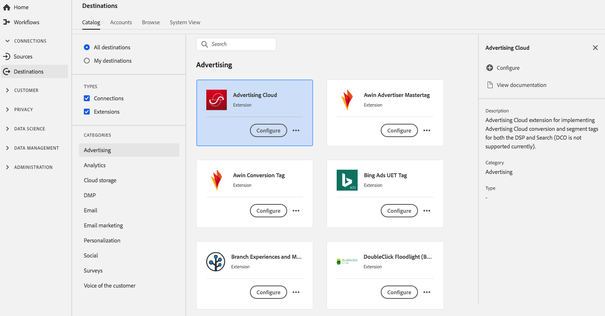

# Extensão do [!DNL Adobe Advertising] {#adobe-advertising-cloud-extension}

## Visão geral {#overview}

Esta é a extensão [!DNL Adobe Advertising] para implementar conversão de publicidade e tags de público-alvo para a DSP e para a Pesquisa (no momento, não há suporte para DCO).

[!DNL Adobe Advertising] é uma extensão de publicidade em [!DNL Adobe Experience Platform].

Esse destino é uma extensão de tag. Para obter mais informações sobre como as extensões funcionam na Experience Platform, consulte a [visão geral das extensões de tag](../launch-extensions/overview.md).

## Pré-requisitos {#prerequisites}

Essa extensão está disponível no catálogo de Destinos para todos os clientes que compraram o Experience Platform.

Para usar essa extensão, você precisa acessar as tags na Experience Platform. As marcas são oferecidas a [!DNL Adobe Experience Cloud] clientes como um recurso incluso com valor agregado. Entre em contato com o administrador da organização para obter acesso aos recursos da Coleção de Dados na interface do usuário e solicite a concessão da permissão **[!UICONTROL manage_properties]** para que você possa instalar extensões.

## Instalar extensão {#install-extension}

Para instalar a extensão [!DNL Adobe Advertising]:

Na [interface do Experience Platform](https://platform.adobe.com/), vá para **[!UICONTROL Destinations]** > **[!UICONTROL Catalog]**.

Selecione a extensão no catálogo ou use a barra de pesquisa.

Selecione o destino e, em seguida, selecione **[!UICONTROL Configure]** no painel direito. Se o controle **[!UICONTROL Configure]** estiver esmaecido, você não tem a permissão **[!UICONTROL manage_properties]**. Consulte [Pré-requisitos](#prerequisites).

Selecione a propriedade da tag na qual você deseja instalar a extensão. Você também tem a opção de criar uma nova propriedade. Uma propriedade é uma coleção de regras, elementos de dados, extensões configuradas, ambientes e bibliotecas. Saiba mais sobre as propriedades na [documentação de tags](../../../tags/ui/administration/companies-and-properties.md).

O fluxo de trabalho direciona você à interface da Coleção de dados para concluir a instalação.

Você também pode instalar a extensão diretamente na [Interface da Coleção de Dados](https://experience.adobe.com/#/data-collection/). Consulte o guia em [adicionando uma nova extensão](../../../tags/ui/managing-resources/extensions/overview.md#add-a-new-extension) para obter mais informações.

## Como usar a extensão {#how-to-use}

Depois de instalar a extensão, você pode começar a configurar regras. Na interface da Coleção de dados, é possível configurar regras para as extensões instaladas para enviar dados do evento para o destino da extensão somente em determinadas situações. Para obter mais informações sobre como configurar regras para suas extensões, consulte a visão geral sobre [regras](../../../tags/ui/managing-resources/rules.md) na documentação de tags.

## Configurar, atualizar e excluir extensão {#configure-upgrade-delete}

É possível configurar, atualizar e excluir extensões na interface da coleção de dados.

>[!TIP]
>
>Se a extensão já estiver instalada em uma de suas propriedades, a interface ainda exibirá **[!UICONTROL Install]** para a extensão. Inicie o fluxo de trabalho de instalação conforme descrito em [Instalar extensão](#install-extension) para configurar ou excluir sua extensão.

Para atualizar sua extensão, consulte o manual no [processo de atualização da extensão](../../../tags/ui/managing-resources/extensions/extension-upgrade.md) na documentação das tags.
