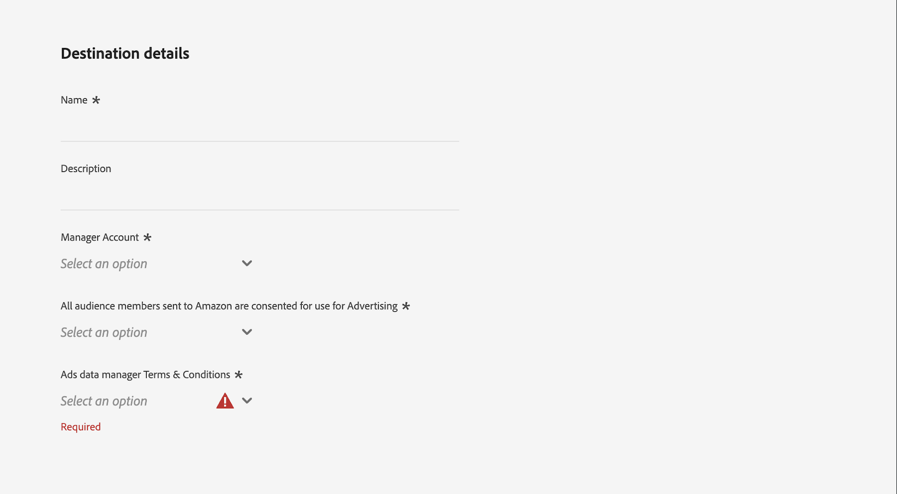

# Conexão com o Amazon Ads v2 {#amazon-ads-v2}

## Visão geral {#overview}

O [!DNL Amazon Ads v2] permite que os anunciantes assimilem, gerenciem, ativem e reutilizem com eficiência os dados de público-alvo nos produtos [!DNL Amazon Ads].

>[!IMPORTANT]
>
>[!DNL Amazon Ads v2] é o destino atual de todas as novas conexões de [!DNL Amazon Ads]. Se você tiver uma conexão [(Legacy) [!DNL Amazon Ads]](./amazon-ads.md) existente, ela continuará a funcionar sem as alterações necessárias. O [!DNL Amazon Ads v2] se conecta ao [!DNL Ads Data Manager], que fornece suporte para tipos de identidade expandidos, campos relacionados a endereços e compartilhamento de dados entre produtos [!DNL Amazon Ads], melhorando o direcionamento e as taxas de correspondência de público-alvo em comparação ao [(Herdado) [!DNL Amazon Ads]](./amazon-ads.md).
>
>Após o final de abril de 2026, o [!DNL Amazon Ads v2] será renomeado para [!DNL Amazon Ads] e o cartão herdado ficará oculto, deixando um único cartão de destino no catálogo. Os fluxos de dados herdados existentes continuarão a funcionar e você poderá gerenciá-los na guia **[!UICONTROL Browse]** depois dessa data.

A integração [!DNL Amazon Ads v2] com [!DNL Adobe Experience Platform] fornece uma conexão direta para assimilar membros de público-alvo em [!DNL Amazon Ads]. Os públicos carregados estão disponíveis no console [!DNL Ads Data Manager (ADM)] em [!DNL Amazon Ads]. Você pode usar o console do [!DNL Ads Data Manager] para compartilhar dados entre diferentes produtos do [!DNL Amazon Ads].

Para saber mais sobre [!DNL Ads Data Manager], consulte:

* [Ads Data Manager - Visão Geral Do Console](https://advertising.amazon.com/API/docs/en-us/adm/1_ads-data-manager-console-overview)
* [Usando o Console do Ads Data Manager](https://advertising.amazon.com/API/docs/en-us/adm/2_ads-data-manager-console)
* [Configuração de conta no Ads Data Manager](https://advertising.amazon.com/API/docs/en-us/adm/2a_ads-data-manager_account_setup)

>[!IMPORTANT]
>
>Esse conector de destino e a página de documentação são criados e mantidos pela equipe *[!DNL Amazon Ads]*. Para qualquer consulta ou solicitação de atualização, contate-os diretamente em *`amc-support@amazon.com`.*

## Casos de uso {#use-cases}

Para ajudá-lo a entender melhor como e quando você deve usar o destino [!DNL Amazon Ads v2], veja a seguir exemplos de casos de uso que os clientes do [!DNL Adobe Experience Platform] podem resolver usando esse destino.

### Assimilação e ativação de público {#activation-and-targeting}

Uma marca de vestuário esportivo quer atingir seus clientes existentes com anúncios relevantes no [!DNL Amazon Ads]. A marca pode assimilar endereços de email de clientes de seu CRM no [!DNL Adobe Experience Platform], criar públicos usando seus dados offline primários e ativar esses públicos para [!DNL Amazon Ads] por meio do destino [!DNL Amazon Ads v2]. Após a ativação, você pode usar esses públicos para direcionar anúncios para esses clientes no inventário do [!DNL Amazon Ads], ajudando a marca a reengajar clientes conhecidos e a gerar compras repetidas. Para saber mais, consulte [Gerenciar dados](https://advertising.amazon.com/API/docs/en-us/adm/6_adm-manage-data).

## Pré-requisitos {#prerequisites}

Para usar a conexão [!DNL Amazon Ads v2] com [!DNL Adobe Experience Platform], você deve ter acesso a **[!DNL Amazon Ads Data Manager]** usando uma [Conta de Gerente](https://advertising.amazon.com/help/G69CDSR9MNSWJH95). Consulte [Introdução ao Amazon Ads Data Manager](https://advertising.amazon.com/API/docs/en-us/adm/1_ads-data-manager-console-overview) para obter detalhes.

### Aceite os termos e condições do Amazon Ads Data Manager {#accept-terms}

Antes de configurar o destino [!DNL Amazon Ads v2], faça logon na sua conta [!DNL Amazon Ads] e aceite os termos e condições do [!DNL Ads Data Manager]. Navegue até o console [!DNL Ads Data Manager] em [!DNL Amazon Ads] e aceite os termos quando solicitado. Se você não aceitar os termos e condições, os públicos-alvo não serão criados no [!DNL Amazon Ads].

## Identidades suportadas {#supported-identities}

O destino [!DNL Amazon Ads v2] oferece suporte à ativação das seguintes identidades. Saiba mais sobre [identidades](/help/identity-service/features/namespaces.md).

| Identidade de destino | Descrição | Considerações |
|---|---|---|
| `phone` | Números de telefone com hash com o algoritmo SHA256 | Os números de telefone com hash SHA256 e texto sem formatação são suportados por [!DNL Adobe Experience Platform]. Quando o campo de origem contiver atributos sem hash, marque a opção **[!UICONTROL Apply transformation]** para que o [!DNL Experience Platform] coloque os dados em hash automaticamente durante a ativação. |
| `email` | Endereços de email (em letras minúsculas) com hash com o algoritmo SHA256 | O [!DNL Adobe Experience Platform] oferece suporte para endereços de email com hash SHA256 e texto sem formatação. Quando o campo de origem contiver atributos sem hash, marque a opção **[!UICONTROL Apply transformation]** para que o [!DNL Experience Platform] coloque os dados em hash automaticamente durante a ativação. |
| `firstname` | Nome do usuário | Os nomes de texto sem formatação e com hash SHA256 são suportados por [!DNL Adobe Experience Platform]. Quando o campo de origem contiver atributos sem hash, marque a opção **[!UICONTROL Apply transformation]** para que o [!DNL Experience Platform] coloque os dados em hash automaticamente durante a ativação. |
| `lastname` | Sobrenome do usuário | Os sobrenomes com hash SHA256 e texto sem formatação são suportados por [!DNL Adobe Experience Platform]. Quando o campo de origem contiver atributos sem hash, marque a opção **[!UICONTROL Apply transformation]** para que o [!DNL Experience Platform] coloque os dados em hash automaticamente durante a ativação. |
| `address` | Endereço do usuário | As ruas com hash SHA256 e texto sem formatação são suportadas por [!DNL Adobe Experience Platform]. Quando o campo de origem contiver atributos sem hash, marque a opção **[!UICONTROL Apply transformation]** para que o [!DNL Experience Platform] coloque os dados em hash automaticamente durante a ativação. |
| `city` | Cidade do usuário | As cidades com hash SHA256 e texto sem formatação são suportadas por [!DNL Adobe Experience Platform]. Quando o campo de origem contiver atributos sem hash, marque a opção **[!UICONTROL Apply transformation]** para que o [!DNL Experience Platform] coloque os dados em hash automaticamente durante a ativação. |
| `state` | Estado ou província do usuário | Os estados de texto sem formatação e hash SHA256 têm suporte no [!DNL Adobe Experience Platform]. Quando o campo de origem contiver atributos sem hash, marque a opção **[!UICONTROL Apply transformation]** para que o [!DNL Experience Platform] coloque os dados em hash automaticamente durante a ativação. |
| `zip` | CEP do usuário | [!DNL Adobe Experience Platform] dá suporte para zips com hash SHA256 e texto sem formatação. Quando o campo de origem contiver atributos sem hash, marque a opção **[!UICONTROL Apply transformation]** para que o [!DNL Experience Platform] coloque os dados em hash automaticamente durante a ativação. |
| `countryCode` | País do usuário (código ISO de 2 caracteres) | Suporta entrada de texto simples. |
| `experianId` | Identificador atribuído por [!DNL Experian] | Suporta entrada de texto simples. |
| `kantarId` | Identificador atribuído por [!DNL Kantar] | Suporta entrada de texto simples. |
| `liveRampId` | Identificador atribuído por [!DNL LiveRamp] | Suporta entrada de texto simples. |
| `maId` | Identificador atribuído por um aplicativo para dispositivos móveis | Suporta entrada de texto simples. |
| `merkleId` | Identificador atribuído por [!DNL Merkle] | Suporta entrada de texto simples. |
| `neustarId` | Identificador atribuído por [!DNL Neustar] | Suporta entrada de texto simples. |
| `realId` | Identificador atribuído pelo gráfico de identidade do Real ID | Suporta entrada de texto simples. |
| `sambaTvId` | Identificador atribuído por [!DNL Samba TV] | Suporta entrada de texto simples. |

{style="table-layout:auto"}

## Públicos-alvo compatíveis {#supported-audiences}

Esta seção descreve quais tipos de públicos-alvo você pode exportar para esse destino.

| Origem do público | Suportado | Descrição |
|---------|----------|----------|
| [!DNL Segmentation Service] | Sim | Públicos gerados por meio do [!DNL Experience Platform] [Serviço de segmentação](/help/segmentation/home.md). |
| Todas as outras origens de público-alvo | Sim | Esta categoria inclui todas as origens de público-alvo fora dos públicos-alvo gerados pelo [!DNL Segmentation Service]. Leia sobre as [várias origens do público-alvo](/help/segmentation/ui/audience-portal.md#customize). Alguns exemplos incluem: <ul><li> carregar audiências personalizadas [importadas](/help/segmentation/ui/audience-portal.md#import-audience) para [!DNL Experience Platform] de arquivos CSV,</li><li> públicos-alvo semelhantes, </li><li> públicos federados, </li><li> públicos-alvo gerados em outros aplicativos [!DNL Experience Platform], como [!DNL Adobe Journey Optimizer], </li><li> e muito mais. </li></ul> |

{style="table-layout:auto"}

Públicos-alvo compatíveis por tipo de dados de público-alvo:

| Tipo de dados de público | Suportado | Descrição | Casos de uso |
|--------------------|-----------|-------------|-----------|
| [Públicos-alvo](/help/segmentation/types/people-audiences.md) | Sim | Com base nos perfis de clientes, permitindo direcionar grupos específicos de pessoas para campanhas de marketing. | Compradores frequentes, abandonadores de carrinho |
| [Públicos-alvo da conta](/help/segmentation/types/account-audiences.md) | Não | Direcione indivíduos em organizações específicas para estratégias de marketing baseadas em conta. | Marketing B2B |
| [Públicos-alvo potenciais](/help/segmentation/types/prospect-audiences.md) | Não | Direcione indivíduos que ainda não são clientes, mas compartilham características com seu público-alvo. | Prospecção com dados de terceiros |
| [Exportações do conjunto de dados](/help/catalog/datasets/overview.md) | Não | Coleções de dados estruturados armazenados no Data Lake [!DNL Adobe Experience Platform]. | Relatórios, fluxos de trabalho de ciência de dados |

{style="table-layout:auto"}

## Tipo e frequência de exportação {#export-type-frequency}

A tabela abaixo descreve o tipo e a frequência da exportação de destino.

| Item | Tipo | Notas |
| ---------|----------|---------|
| Tipo de exportação | **[!UICONTROL Audience export]** | Você está exportando todos os membros de um público com identificadores compatíveis com o [!DNL Amazon Ads]. |
| Frequência de exportação | **[!UICONTROL Streaming]** | Os destinos de transmissão são conexões baseadas em API &quot;sempre ativas&quot;. Atualizações de público em [!DNL Experience Platform] são enviadas imediatamente para [!DNL Ads Data Manager]. |

{style="table-layout:auto"}

## Conectar ao destino {#connect}

>[!IMPORTANT]
>
>Para se conectar ao destino, você precisa das **[!UICONTROL View Destinations]** e **[!UICONTROL Manage Destinations]** [permissões de controle de acesso](/help/access-control/home.md#permissions). Leia a [visão geral do controle de acesso](/help/access-control/ui/overview.md) ou contate o administrador do produto para obter as permissões necessárias.

Para se conectar a este destino, siga as etapas descritas no [tutorial de configuração de destino](/help/destinations/ui/connect-destination.md). No workflow da configuração de destino, preencha os campos listados nas duas seções abaixo.

### Autenticar para o destino {#authenticate}

Para autenticar no destino, preencha os campos obrigatórios e selecione **[!UICONTROL Connect to destination]**.

* **[!UICONTROL Account name]**: Digite um nome que ajude a identificar esta conta de destino. Isso é especialmente útil se você tiver várias conexões com o mesmo destino.
* **[!UICONTROL Description]** (opcional): adicione detalhes que ajudam você ou sua equipe a distinguir contas, como a finalidade da conexão ou o contexto comercial relevante.

Você é redirecionado para a interface [!DNL Amazon Ads v2]. Selecione **[!UICONTROL Allow]** para entrar em sua conta da Amazon.

Após a autenticação, você será redirecionado de volta para [!DNL Adobe Experience Platform] com sua nova conexão.

### Preencher detalhes do destino {#destination-details}

Para configurar detalhes para o destino, preencha os campos obrigatórios e opcionais abaixo. Um asterisco ao lado de um campo na interface do usuário indica que o campo é obrigatório.

* **[!UICONTROL Name]**: Um nome pelo qual você reconhece este destino.
* **[!UICONTROL Description]**: uma descrição que ajuda a identificar este destino.
* **[!UICONTROL Manager Account]**: a ID da conta de gerente de destino na lista suspensa.
* **[!UICONTROL All audience members sent to Amazon are consented for use for Advertising]**: Especificar consentimento para uso de dados (`GRANTED` ou `DENIED`).
* **[!UICONTROL Ads data manager Terms & Conditions]**: Aceite os termos e condições do Data Manager [!DNL Amazon Ads]. Leia a seção [Aceitar termos](#accept-terms) para obter detalhes.

### Ativar alertas {#enable-alerts}

Você pode ativar os alertas para receber notificações sobre o status do fluxo de dados para o seu destino. Selecione um alerta na lista para assinar e receber notificações sobre o status do seu fluxo de dados. Para obter mais informações sobre alertas, leia o manual sobre [assinatura de alertas de destinos usando a interface](/help/destinations/ui/alerts.md).

Quando terminar de fornecer detalhes da conexão de destino, selecione **[!UICONTROL Next]**.

## Ativar públicos-alvo para esse destino {#activate}

>[!IMPORTANT]
>
>* Para ativar dados, você precisa das **[!UICONTROL View Destinations]**, **[!UICONTROL Activate Destinations]**, **[!UICONTROL View Profiles]** e **[!UICONTROL View Segments]** [permissões de controle de acesso](/help/access-control/home.md#permissions). Leia a [visão geral do controle de acesso](/help/access-control/ui/overview.md) ou contate o administrador do produto para obter as permissões necessárias.
>* Para exportar identidades, você precisa da **[!UICONTROL View Identity Graph]** [permissão de controle de acesso](/help/access-control/home.md#permissions).   {width="100" zoomable="yes"}

Leia [Ativar perfis e públicos-alvo para destinos de exportação de público-alvo de streaming](/help/destinations/ui/activate-segment-streaming-destinations.md) para obter instruções sobre como ativar públicos-alvo para este destino.

### Mapeamentos obrigatórios {#map}

O destino [!DNL Amazon Ads v2] exige que você configure os seguintes mapeamentos para uma ativação de dados bem-sucedida.

| Campo de origem | Campo de destino | Descrição |
|---------|----------|---------|
| `IdentityMap: Email_LC_SHA256` ou `IdentityMap: Email` | `Identity: email` | Quando o campo de origem contiver atributos sem hash, marque a opção **[!UICONTROL Apply transformation]** para que o [!DNL Experience Platform] coloque os dados em hash automaticamente durante a ativação. |
| `xdm: homeAddress.countryCode` | `Identity: countryCode` | País do usuário (código ISO de 2 caracteres) |

### Práticas recomendadas de mapeamento {#mapping-best-practices}

Combine identificadores primários (como número de telefone e endereço) com identificadores fornecidos pelo parceiro. Isso permite que [!DNL Amazon Ads] use vários sinais de identidade durante a correspondência de públicos, resultando em melhores taxas de correspondência.

Use identificadores fornecidos pelo parceiro somente quando eles forem preenchidos nos dados de origem. Se um campo de identificador do parceiro mapeado estiver vazio ou não estiver presente em um determinado perfil, ele será ignorado durante a correspondência de públicos-alvo e não contribuirá para as taxas de correspondência.

### Exemplos {#examples}

* Use `kantarId` ao ativar públicos compilados ou enriquecidos usando dados de identidade [!DNL Kantar].
* Use o `merkleId` quando os dados de público-alvo forem originados de soluções de identidade gerenciadas pelo [!DNL Merkle].
* Use `neustarId` quando os dados estiverem vinculados por meio da resolução de identidade [!DNL Neustar].
* Use `experianId` para públicos enriquecidos usando [!DNL Experian] dados de identidade.
* Use `liveRampId` ao ativar públicos que dependem da resolução de identidade [!DNL LiveRamp].
* Use `sambaTvId` ao trabalhar com os dados de público-alvo fornecidos por [!DNL Samba TV].

Esses identificadores normalmente são fornecidos pelos respectivos parceiros como identificadores de texto simples e não exigem hash.

## Validar exportação de dados {#exported-data}

Após a ativação, valide a assimilação de público no **[!DNL Ads Data Manager]Console**.

Navegue até **[!UICONTROL Audiences]** → **[!UICONTROL Uploaded Sources]**. Verifique o status de assimilação do público-alvo, o tamanho e todos os logs de erro. As páginas [Gerenciar Dados](https://advertising.amazon.com/API/docs/en-us/adm/6_adm-manage-data) e [Destinos](https://advertising.amazon.com/API/docs/en-us/adm/7_adm-destinations) da documentação [!DNL Amazon Ads] oferecem mais orientações de validação.

## Uso e governança de dados {#data-usage-governance}

Todos os destinos do [!DNL Adobe Experience Platform] são compatíveis com as políticas de uso de dados ao manipular seus dados. Para obter informações detalhadas sobre como o [!DNL Adobe Experience Platform] fiscaliza a governança de dados, leia a [Visão geral da Governança de Dados](/help/data-governance/home.md).

## Recursos adicionais {#additional-resources}

Para obter mais informações sobre [!DNL Amazon Ads Data Manager], consulte o seguinte recurso:

* [Visão geral do Amazon Ads Data Manager](https://advertising.amazon.com/API/docs/en-us/adm/1_ads-data-manager-console-overview)
