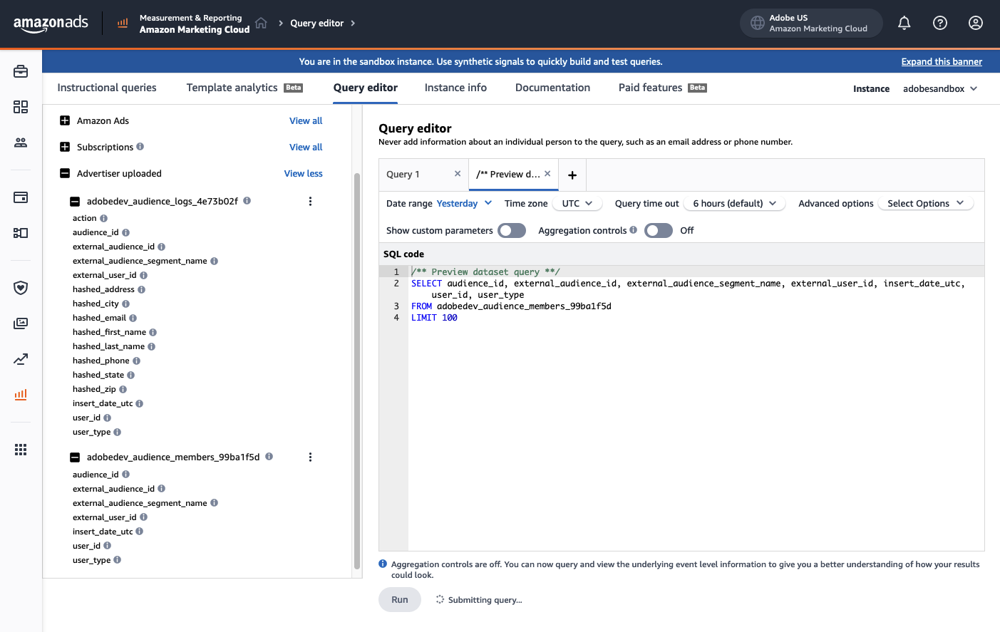

# Conexão do Amazon Ads {#amazon-ads}

## Visão geral {#overview}

O [!DNL Amazon Ads] oferece uma variedade de opções para ajudá-lo a atingir suas metas de publicidade para vendedores registrados, fornecedores, fornecedores de livros, autores de KDP (Kindle Direct Publishing), desenvolvedores de aplicativos e/ou agências.

A integração do [!DNL Amazon Ads] com o Adobe Experience Platform fornece integração pronta para uso com produtos do [!DNL Amazon Ads], incluindo o Amazon DSP (ADSP) e o Amazon Marketing Cloud (AMC).

Ao usar o destino [!DNL Amazon Ads] no Adobe Experience Platform, os usuários podem definir públicos-alvo de anunciante para direcionamento e ativação no Amazon DSP.  Além disso, os usuários podem carregar seus dados no [!DNL Amazon Marketing Cloud] para entender o desempenho por público-alvo, as dimensões fornecidas pelo anunciante, a associação a segmentos do Amazon ou outros sinais disponíveis na AMC. Depois de carregar os públicos-alvo do anunciante para a AMC, os usuários poderão usar o [!DNL Amazon Marketing Cloud] para modificar, aprimorar ou anexar membros do público-alvo usando sinais do Amazon no [!DNL Amazon Marketing Cloud].

A AMC reúne sinais únicos de todas as propriedades próprias e operadas da Amazon, abrangendo mídia, incluindo exibição, vídeo, transmissão de TV, áudio e anúncios patrocinados. Os usuários podem enviar facilmente segmentos com curadoria do Adobe Experience Platform para a AMC a fim de aprimorar o aprendizado, como grupos dentro do mercado, coortes de estilo de vida e padrões de engajamento da marca. Segmentos aumentados podem ser usados para otimizar ativações de mídia no Amazon DSP.

>[!IMPORTANT]
>
>Esse conector de destino e a página de documentação são criados e mantidos pela equipe *[!DNL Amazon Ads]*. Para qualquer consulta ou solicitação de atualização, contate-os diretamente em *`amc-support@amazon.com`.*

## Casos de uso {#use-cases}

Para ajudá-lo a entender melhor como e quando você deve usar o destino *[!DNL Amazon Ads]*, veja a seguir exemplos de casos de uso que os clientes da Adobe Experience Platform podem resolver usando esse destino.

### Ativação e direcionamento {#activation-and-targeting}

Essa integração com o Amazon DSP permite que [!DNL Amazon Ads] anunciantes transmitam públicos-alvo de CDP do anunciante da Adobe Experience Platform para o DSP da Amazon a fim de criar públicos-alvo de anunciante para direcionamento de anúncios. Os públicos podem ser selecionados no DSP do Amazon para direcionamento positivo, bem como direcionamento negativo (supressão).

### Analytics e Measurement {#analytics-and-measurement}

Essa integração com o [!DNL Amazon Marketing Cloud] (AMC) permite que [!DNL Amazon Ads] anunciantes passem segmentos da CDP do Adobe Experience Platform Form para a AMC. Os anunciantes podem então unir as entradas da CDP com sinais do [!DNL Amazon Ads] e realizar análises personalizadas em tópicos como impacto de mídia, segmentos de público-alvo e jornadas do cliente em formato compatível com a privacidade. Por exemplo, um anunciante pode fazer upload de uma lista de seus clientes existentes para entender o desempenho agregado da campanha de publicidade ou estatísticas agregadas de eventos de conversão no Amazon, como visualizar uma página de detalhes do produto, adicionar um produto a um carrinho de compras ou comprar um produto.

### Otimização do Advertising

Essa integração com o [!DNL Amazon Marketing Cloud] (AMC) permite que os anunciantes carreguem suas próprias listas de clientes e, usando o SQL [!DNL Amazon Marketing Cloud], executem análises de sobreposição, supressões, adições ou otimizações para públicos de forma recorrente antes de criar um público pronto para ativação no Amazon DSP para direcionamento.

## Pré-requisitos {#prerequisites}

Para usar a conexão [!DNL Amazon Ads] com o Adobe Experience Platform, os usuários devem primeiro ter acesso a uma Conta de Anunciante do Amazon DSP ou a uma instância [!DNL Amazon Marketing Cloud]. Para provisionar essas instâncias, visite a seguinte página no site do [!DNL Amazon Ads]:

* [Introdução ao Amazon DSP](https://advertising.amazon.com/solutions/products/amazon-dsp)
* [Introdução ao Amazon Marketing Cloud](https://advertising.amazon.com/solutions/products/amazon-marketing-cloud)

## Identidades suportadas {#supported-identities}

A conexão *[!DNL Amazon Ads]* oferece suporte à ativação das identidades descritas na tabela abaixo. Saiba mais sobre [identidades](/help/identity-service//features/namespaces.md). Para obter mais detalhes sobre as identidades suportadas pelo [!DNL Amazon Ads], visite o [Centro de Suporte da Amazon DSP](https://advertising.amazon.com/dsp/help/ss/en/audiences#GA6BC9BW52YFXBNE).

| Identidade de destino | Descrição | Considerações |
|---|---|---|
| phone_sha256 | Números de telefone com hash com o algoritmo SHA256 | Os números de telefone com hash SHA256 e texto sem formatação são compatíveis com o Adobe Experience Platform. Quando o campo de origem contiver atributos sem hash, marque a opção **[!UICONTROL Apply transformation]** para que o [!DNL Experience Platform] coloque os dados em hash automaticamente durante a ativação. |
| email_lc_sha256 | Endereços de email com hash com o algoritmo SHA256 | O Adobe Experience Platform oferece suporte tanto para texto simples quanto para endereços de email com hash SHA256. Quando o campo de origem contiver atributos sem hash, marque a opção **[!UICONTROL Apply transformation]** para que o [!DNL Experience Platform] coloque os dados em hash automaticamente durante a ativação. |
| `firstName` | Nome do usuário | Suporta texto simples ou SHA256. Se o texto simples for usado, habilite [!UICONTROL Apply transformation] na interface do usuário do Adobe. |
| `lastName` | Sobrenome do usuário | Suporta texto simples ou SHA256. Se o texto simples for usado, habilite [!UICONTROL Apply transformation] na interface do usuário do Adobe. |
| `street` | Endereço do usuário no nível da rua | Somente a entrada com hash SHA256 tem suporte. Normalize antes do hash. **não** habilitar a transformação do lado do Adobe. |
| `city` | Cidade do usuário | Suporta texto simples ou SHA256. Se o texto simples for usado, habilite [!UICONTROL Apply transformation] na interface do usuário do Adobe. |
| `state` | Estado ou província do usuário | Suporta texto simples ou SHA256. Se o texto simples for usado, habilite [!UICONTROL Apply transformation] na interface do usuário do Adobe. |
| `zip` | CEP do usuário | Suporta texto simples ou SHA256. Se o texto simples for usado, habilite [!UICONTROL Apply transformation] na interface do usuário do Adobe. |
| `country` | País do usuário | Suporta texto simples ou SHA256. Se o texto simples for usado, habilite [!UICONTROL Apply transformation] na interface do usuário do Adobe. |

{style="table-layout:auto"}

## Tipo e frequência de exportação {#export-type-frequency}

Consulte a tabela abaixo para obter informações sobre o tipo e a frequência da exportação de destino.

| Item | Tipo | Notas |
| ---------|----------|---------|
| Tipo de exportação | **[!UICONTROL Audience export]** | Você está exportando todos os membros de um público com os identificadores (nome, número de telefone ou outros) usados no destino *[!DNL Amazon Ads]*. |
| Frequência de exportação | **[!UICONTROL Streaming]** | Os destinos de transmissão são conexões baseadas em API &quot;sempre ativas&quot;. Assim que um perfil for atualizado no Experience Platform com base na avaliação do público-alvo, o conector enviará a atualização downstream para a plataforma de destino. Leia mais sobre [destinos de streaming](/help/destinations/destination-types.md#streaming-destinations). |

{style="table-layout:auto"}

## Conectar ao destino {#connect}

>[!IMPORTANT]
> 
>Para se conectar ao destino, você precisa das **[!UICONTROL View Destinations]** e **[!UICONTROL Manage Destinations]** [permissões de controle de acesso](/help/access-control/home.md#permissions). Leia a [visão geral do controle de acesso](/help/access-control/ui/overview.md) ou contate o administrador do produto para obter as permissões necessárias.

Para se conectar a este destino, siga as etapas descritas no [tutorial de configuração de destino](../../ui/connect-destination.md). No workflow de configuração de destino, preencha os campos listados nas duas seções abaixo.

### Autenticar para o destino {#authenticate}

Para autenticar no destino, preencha os campos obrigatórios e selecione **[!UICONTROL Connect to destination]**.

Você é levado à interface de conexão [!DNL Amazon Ads] onde primeiro seleciona as contas de anunciante às quais deseja se conectar. Após a conexão, você será redirecionado de volta ao Adobe Experience Platform com uma nova conexão, fornecida com a ID da conta do anunciante selecionada. Selecione a Conta do anunciante apropriada na tela de configuração de destino para continuar.

### Preencher detalhes do destino {#destination-details}

Para configurar detalhes para o destino, preencha os campos obrigatórios e opcionais abaixo. Um asterisco ao lado de um campo na interface do usuário indica que o campo é obrigatório.

* **[!UICONTROL Name]**: Um nome pelo qual você reconhecerá este destino no futuro.
* **[!UICONTROL Description]**: uma descrição que ajudará você a identificar este destino no futuro.
* **[!UICONTROL Amazon Ads Connection]**: Selecione a ID da conta de destino [!DNL Amazon Ads] usada para o destino.

>[!NOTE]
>
>Depois de salvar a configuração de destino, você não poderá alterar a ID do anunciante do [!DNL Amazon Ads], mesmo se autenticar novamente por meio da sua conta do Amazon. Para usar uma ID de Anunciante do [!DNL Amazon Ads] diferente, você deve criar uma nova conexão de destino. Os anunciantes que já estão configurados em uma integração com o ADSP no devem criar um novo fluxo de destino se quiserem que seus públicos sejam entregues à AMC ou a uma conta diferente do ADSP.

* **[!UICONTROL Advertiser Region]**: selecione a região apropriada na qual seu Anunciante está hospedado. Para obter mais informações sobre os marketplaces com suporte em cada região, visite a [documentação do Amazon Ads](https://advertising.amazon.com/API/docs/en-us/info/api-overview#api-endpoints).

* **[!UICONTROL Amazon Ads Consent Signal]**: Confirme se todos os dados enviados por meio desta conexão consentiram em usar dados pessoais para fins de publicidade. &quot;CONCEDIDO&quot; indica o consentimento para que a Amazon use os dados pessoais do cliente para publicidade. Os valores permitidos são &quot;GRANTED&quot; e &quot;DENIED&quot;. Quaisquer registros enviados por meio de conexões com &quot;NEGADO&quot; serão rejeitados para uso posterior dentro do Amazon Ads.

### Ativar alertas {#enable-alerts}

Você pode ativar os alertas para receber notificações sobre o status do fluxo de dados para o seu destino. Selecione um alerta na lista para assinar e receber notificações sobre o status do seu fluxo de dados. Para obter mais informações sobre alertas, consulte o manual sobre [assinatura de alertas de destinos usando a interface](../../ui/alerts.md).

Quando terminar de fornecer detalhes da conexão de destino, selecione **[!UICONTROL Next]**.

## Ativar públicos-alvo para esse destino {#activate}

>[!IMPORTANT]
> 
>* Para ativar dados, você precisa das **[!UICONTROL View Destinations]**, **[!UICONTROL Activate Destinations]**, **[!UICONTROL View Profiles]** e **[!UICONTROL View Segments]** [permissões de controle de acesso](/help/access-control/home.md#permissions). Leia a [visão geral do controle de acesso](/help/access-control/ui/overview.md) ou contate o administrador do produto para obter as permissões necessárias.
>* Para exportar *identidades*, você precisa da **[!UICONTROL View Identity Graph]** [permissão de controle de acesso](/help/access-control/home.md#permissions).   {width="100" zoomable="yes"}

Leia [Ativar perfis e públicos-alvo para destinos de exportação de público-alvo de streaming](/help/destinations/ui/activate-segment-streaming-destinations.md) para obter instruções sobre como ativar públicos-alvo para este destino.

### Mapear atributos e identidades {#map}

A conexão [!DNL Amazon Ads] oferece suporte a endereços de email com hash e números de telefone com hash para fins de correspondência de identidade. A captura de tela abaixo fornece um exemplo de correspondência compatível com a conexão [!DNL Amazon Ads]:

* Para mapear endereços de email com hash, selecione o namespace de identidade `Email_LC_SHA256` como um campo de origem.
* Para mapear números de telefone com hash, selecione o namespace de identidade `Phone_SHA256` como um campo de origem.
* Para mapear endereços de email ou números de telefone sem hash, selecione os namespaces de identidade correspondentes como campos de origem e marque a opção `Apply Transformation` para que o Experience Platform coloque as identidades em hash na ativação.
* *NOVO a partir da versão de setembro de 2024*: o Amazon Ads exige o mapeamento de um campo contendo um valor `countryCode` no formato ISO de 2 caracteres para facilitar o processo de resolução de identidade (por exemplo: US, GB, MX, CA e assim por diante). Conexões sem `countryCode` mapeamentos resultarão em impacto negativo nas taxas de correspondência de identidade.

>[!NOTE]
>
>Para usar esses campos:
> 
>* Todos os valores de identidade devem ser normalizados antes da assimilação. Consulte o [Guia de normalização](https://advertising.amazon.com/help/GCCXMZYCK4RXWS6C).
>* O hash SHA256 é necessário, no lado do cliente ou ao ativar a configuração de transformação do Adobe.
>* A interface do usuário do Adobe fornece uma caixa de seleção para aplicar transformação por campo de identidade durante a configuração do conector.

Você só seleciona um determinado campo de destino uma vez em uma configuração de destino do conector [!DNL Amazon Ads].  Por exemplo, se você enviar um email comercial, não poderá mapear o email pessoal na mesma configuração de destino.

É altamente recomendável mapear quantos campos estiverem disponíveis. Se apenas um atributo de origem estiver disponível, você poderá mapear um único campo. O destino [!DNL Amazon Ads] utiliza todos os campos mapeados para fins de mapeamento, produzindo taxas de correspondência mais altas se mais campos forem fornecidos. Para obter mais informações sobre os identificadores aceitos, visite a [página de ajuda com hash sobre o público-alvo do Amazon Ads](https://advertising.amazon.com/dsp/help/ss/en/audiences#GA6BC9BW52YFXBNE).

## Dados exportados / Validar exportação de dados {#exported-data}

Depois que o público-alvo for carregado, você poderá validar se o público-alvo foi criado e carregado corretamente usando estas etapas:

**Para Amazon DSP**

Navegue até **[!UICONTROL Advertiser ID]** > **[!UICONTROL Audiences]** > **[!UICONTROL Advertiser Audiences]**. Se o público-alvo foi criado com sucesso e atende ao número mínimo de membros do público-alvo, você verá um Status de `Active`. Detalhes adicionais sobre o tamanho e o alcance do público-alvo podem ser encontrados no painel Alcance previsto no lado direito da interface do usuário do Amazon DSP.

**Para[!DNL Amazon Marketing Cloud]**

No navegador de esquema à esquerda, encontre seu público em **[!UICONTROL Advertiser Uploaded]** > **[!UICONTROL aep_audiences]**. Você pode então consultar seu público no editor AMC SQL com a seguinte cláusula:

`select count(user_id) from adobeexperienceplatf_audience_view_000xyz where external_audience_segment_name = '1234567'`

## Uso e governança de dados {#data-usage-governance}

Todos os destinos do [!DNL Adobe Experience Platform] são compatíveis com as políticas de uso de dados ao manipular seus dados. Para obter informações detalhadas sobre como o [!DNL Adobe Experience Platform] fiscaliza a governança de dados, leia a [Visão geral da Governança de Dados](/help/data-governance/home.md).

## Recursos adicionais {#additional-resources}

Para obter a documentação de ajuda adicional, visite os seguintes [!DNL Amazon Ads] recursos de ajuda:

* [Central de ajuda do Amazon DSP](https://www.amazon.com/ap/signin?openid.pape.max_auth_age=28800&openid.return_to=https%3A%2F%2Fadvertising.amazon.com%2Fdsp%2Fhelp%2Fss%2Fen%2Faudiences&openid.identity=http%3A%2F%2Fspecs.openid.net%2Fauth%2F2.0%2Fidentifier_select&openid.assoc_handle=amzn_bt_desktop_us&openid.mode=checkid_setup&openid.claimed_id=http%3A%2F%2Fspecs.openid.net%2Fauth%2F2.0%2Fidentifier_select&openid.ns=http%3A%2F%2Fspecs.openid.net%2Fauth%2F2.0)

## Changelog {#changelog}

Esta seção captura a funcionalidade e as atualizações de documentação significativas feitas neste conector de destino.

+++ Exibir changelog

| Mês de lançamento | Tipo de atualização | Descrição |
|---|---|---|
| Outubro de 2025 | Suporte adicionado a campos de identidade adicionais | Adição de suporte adicional a identificadores pessoais, como `firstName`, `lastName`, `street`, `city`, `state`, `zip` e `country`. O mapeamento desses campos pode melhorar as taxas de correspondência do público-alvo. |
| Fevereiro de 2025 | Adicionado o requisito de adicionar **[!UICONTROL Amazon Ads Consent Signal]** para exportar fluxos de dados e promovido o destino de beta para disponível geral. |  |
| Maio de 2024 | Atualização de funcionalidade e documentação | Adicionada a opção de mapeamento para exportar o parâmetro `countryCode` para o Amazon Ads. Use o `countryCode` na [etapa de mapeamento](#map) para melhorar suas taxas de correspondência de identidade com a Amazon. |
| Março de 2024 | Atualização de funcionalidade e documentação | Adicionada a opção para exportar públicos-alvo a serem usados em [!DNL Amazon Marketing Cloud] (AMC). |
| Maio de 2023 | Atualização de funcionalidade e documentação | <ul><li>Adicionado suporte para seleção de Região do anunciante no [fluxo de trabalho de conexão de destino](#destination-details).</li><li>Atualização da documentação para refletir a adição da seleção da Região do anunciante. Para obter mais informações sobre como selecionar a Região do anunciante correta, consulte a [documentação do Amazon](https://advertising.amazon.com/API/docs/en-us/info/api-overview#api-endpoints).</li></ul> |
| Março de 2023 | Versão inicial | Versão inicial de destino e documentação publicada. |

{style="table-layout:auto"}

+++
