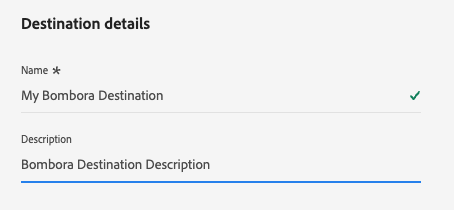
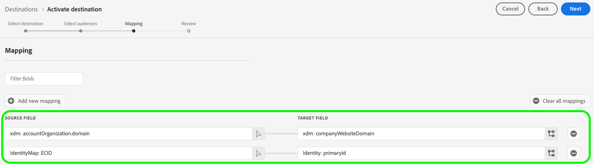

# Conexão Bombora {#bombora}

>[!AVAILABILITY]
>
>A funcionalidade para ativar públicos-alvo para o destino Bombora está disponível para empresas que compram as edições [Business-to-Business](/help/rtcdp/overview.md#rtcdp-b2b) e [Business-to-Person](/help/rtcdp/overview.md#rtcdp-b2p) do Real-Time Customer Data Platform.

Ative perfis para suas campanhas do Bombora para direcionamento de público, personalização e supressão, com base em [públicos-alvo de conta](/help/segmentation/types/account-audiences.md).

## Casos de uso {#use-case}

Para ajudá-lo a entender melhor como e quando você deve usar o destino Bombora, veja a seguir exemplos de casos de uso que os clientes do Adobe Experience Platform podem resolver usando esse destino.

### Integração do DSP {#dsp-integration}

Como comerciante B2B, você pode criar uma lista de contas na Real-time CDP, identificando empresas que mostram alta intenção para seus produtos, em seguida, usar esse destino para ativar essa lista na Bombora.

Por meio da integração da Bombora com DSPs, você pode executar campanhas de publicidade direcionadas usando dados da Bombora. Isso garante que seu investimento em anúncios se concentre em empresas com maior probabilidade de conversão.

### Account-Based Marketing {#abm}

Como profissional de marketing B2B, você pode criar uma lista de contas com base no CRM e em sinais de marketing. Em seguida, você pode usar esse destino para ativar essa lista em Bombora, onde os controles sensíveis à ABM ajudam você a direcionar tomadores de decisão a essas empresas.

### Ativação de marketing baseado em conta multicanal {#multi-channel-abm}

Como profissional de marketing B2B, você pode criar uma lista de contas na Real-time CDP, identificando empresas de alta intenção. Em seguida, você pode usar esse destino para ativar a lista em Bombora para executar campanhas direcionadas em vários canais.

Nas redes sociais pagas, você pode enviar anúncios personalizados para profissionais em contas de público alvo em plataformas como [!DNL LinkedIn] e [!DNL Facebook]. Usando plataformas de anúncios nativas, você pode garantir que o conteúdo chegue aos tomadores de decisão relevantes.

Você também pode estender campanhas para TV avançada, fornecendo anúncios para contas principais.

Essa abordagem de vários canais garante mensagens consistentes entre plataformas, maximizando as taxas de engajamento e conversão.

## Públicos-alvo compatíveis {#supported-audiences}

Esta seção descreve que tipo de público-alvo você pode exportar para esse destino.

| Origem do público | Suportado | Descrição |
|---------|----------|----------|
| [!DNL Segmentation Service] | ✓ | Públicos-alvo gerados pelo [Serviço de Segmentação](../../../segmentation/home.md) da Experience Platform. |
| Uploads personalizados | X | Públicos [importados](../../../segmentation/ui/overview.md#import-audience) para o Experience Platform de arquivos CSV. |

{style="table-layout:auto"}

## Identidades suportadas {#supported-identities}

O Bombora exige o mapeamento da identidade do target descrita na tabela abaixo. Saiba mais sobre [identidades](/help/identity-service/features/namespaces.md).

| Identidade de destino | Descrição |
|---|---|
| `primaryId` | O Bombora requer o mapeamento dessa identidade de destino para que a integração funcione corretamente. Você pode mapear qualquer campo de origem para essa identidade. Esse mapeamento é obrigatório, mas não exporta dados para Bombora. |

{style="table-layout:auto"}

## Tipo e frequência de exportação {#export-type-and-frequency}

Consulte a tabela abaixo para obter informações sobre o tipo e a frequência da exportação de destino.

| Item | Tipo | Notas |
|---------|----------|---------|
| Tipo de exportação | **[!UICONTROL Audience export]** | Você está exportando todos os membros de um público com os identificadores (nome, número de telefone ou outros) usados no destino [!DNL Bombora]. |
| Frequência de exportação | **[!UICONTROL Streaming]** | Os destinos de transmissão são conexões baseadas em API &quot;sempre ativas&quot;. Assim que um perfil for atualizado no Experience Platform com base na avaliação do público-alvo, o conector enviará a atualização downstream para a plataforma de destino. Leia mais sobre [destinos de streaming](/help/destinations/destination-types.md#streaming-destinations). |

{style="table-layout:auto"}

## Pré-requisitos {#prerequisites}

Para exportar públicos-alvo de conta para Bombora, você precisa das informações a seguir.

1. Uma conta do Bombora.
2. Um Bombora **[!UICONTROL client ID]** e **[!UICONTROL client secret]**.

## Conectar ao destino {#connect}

>[!IMPORTANT]
> 
>Para se conectar ao destino, você precisa da **[!UICONTROL View Destinations]** e da **[!UICONTROL Manage Destinations]** [permissão de controle de acesso](/help/access-control/home.md#permissions). Leia a [visão geral do controle de acesso](/help/access-control/ui/overview.md) ou contate o administrador do produto para obter as permissões necessárias.

Para se conectar a este destino, siga as etapas descritas no [tutorial de configuração de destino](../../ui/connect-destination.md). No workflow de configuração de destino, preencha os campos listados nas duas seções abaixo.

### Autenticar para o destino {#authenticate}

Para autenticar no destino, preencha os campos obrigatórios e selecione **[!UICONTROL Connect to destination]**.

* **[!UICONTROL Client ID]**: Insira sua ID de cliente [!DNL Bombora].
* **[!UICONTROL Client secret]**: Insira seu segredo de cliente [!DNL Bombora].

### Preencher detalhes do destino {#destination-details}

Para configurar detalhes para o destino, preencha os campos obrigatórios e opcionais abaixo. Um asterisco ao lado de um campo na interface do usuário indica que o campo é obrigatório.

* **[!UICONTROL Name]**: Um nome pelo qual você reconhecerá este destino no futuro.
* **[!UICONTROL Description]**: uma descrição que ajudará você a identificar este destino no futuro.

Agora você está pronto para ativar seus públicos dentro Bombora.

## Ativar públicos-alvo para esse destino {#activate}

>[!IMPORTANT]
> 
>* Para ativar dados, você precisa das **[!UICONTROL View Destinations]**, **[!UICONTROL Activate Destinations]**, **[!UICONTROL View Profiles]** e **[!UICONTROL View Segments]** [permissões de controle de acesso](/help/access-control/home.md#permissions). Leia a [visão geral do controle de acesso](/help/access-control/ui/overview.md) ou contate o administrador do produto para obter as permissões necessárias.
>* Para exportar *identidades*, você precisa da **[!UICONTROL View Identity Graph]** [permissão de controle de acesso](/help/access-control/home.md#permissions).   {width="100" zoomable="yes"}

Leia [Ativar públicos-alvo da conta](/help/destinations/ui/activate-account-audiences.md) para obter instruções sobre como ativar públicos-alvo da conta para este destino.

### Mapeamentos obrigatórios {#mapping}

O destino do Bombora requer que você configure os seguintes mapeamentos para uma ativação de dados bem-sucedida.

| Campo de origem | Campo de destino | Descrição |
|---------|----------|---------|
| Qualquer valor | `Identity: primaryId` | Esse mapeamento é obrigatório para a Experience Platform estabelecer uma conexão com Bombora. Esse valor não é exportado para Bombora, mas é necessário para a configuração de destino. Você pode selecionar qualquer atributo para o campo de origem. |
| `xdm: accountOrganization.domain` | `xdm: companyWebsiteDomain` | Bombora usa endereços de site ou domínio para criar uma lista de contas. |

## Observações adicionais e chamadas de retorno importantes {#additional-notes}

Se um público-alvo da conta com o mesmo nome foi ativado anteriormente para o Bombora, você receberá um erro se tentar ativá-lo novamente por meio de um fluxo de dados diferente para o destino do Bombora.
