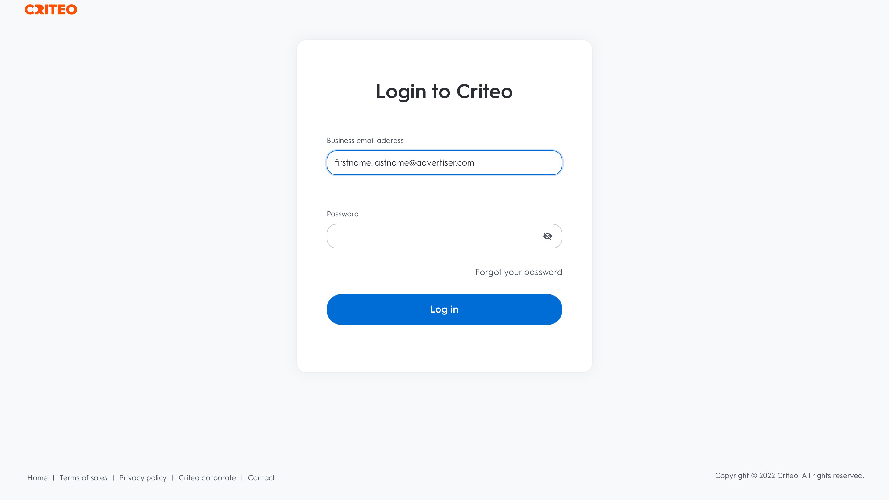

# (Beta) Conexão de critério

## Visão geral {#overview}

>[!IMPORTANT]
>
>Esta página de documentação foi criada por Criteo. No momento, esse é um produto beta e a funcionalidade está sujeita a alterações. Para quaisquer consultas ou pedidos de atualização, contacte diretamente o Criteo [here](mailto:criteoTechnicalPartnerships@criteo.com).

O Criteo capacita a publicidade confiável e impactante para trazer experiências mais avançadas para todos os consumidores através da Internet aberta. Com o maior conjunto de dados de comércio do mundo e a melhor IA do setor, o Criteo garante que cada ponto de contato na jornada de compras seja personalizado para alcançar os clientes com o anúncio certo, na hora certa.

## Pré-requisitos {#prerequisites}

* Você precisa ter uma conta de usuário de administrador em [Centro de gerenciamento de critérios](https://marketing.criteo.com).
* Você precisará da ID do anunciante do Criteo (entre em contato com o Criteo se não tiver essa ID).

## Limitações {#limitations}

* No momento, o Critério não oferece suporte à remoção de usuários de públicos-alvo.
* Apenas aceita o critério [!DNL SHA-256]Emails com hash e texto sem formatação (a ser transformado em [!DNL SHA-256] antes de enviar). Não envie PII (Informações pessoais identificáveis, como nomes ou números de telefone).


## Identidades suportadas {#supported-identities}

O critério suporta a ativação das identidades descritas na tabela abaixo. Saiba mais sobre [identidades](https://experienceleague.adobe.com/docs/experience-platform/identity/namespaces.html?lang=en#getting-started).

| Identidade do Target | Descrição | Considerações |
| --- | --- | --- |
| `email_sha256` | Endereços de email com hash com o algoritmo SHA-256 | O Adobe Experience Platform oferece suporte para texto sem formatação e endereços de email com hash SHA-256. Quando o campo de origem contém atributos com hash, verifique a [!UICONTROL Aplicar transformação] , para que a Platform faça o hash automático dos dados na ativação. |

## Tipo e frequência de exportação {#export-type-frequency}

Consulte a tabela abaixo para obter informações sobre o tipo e a frequência da exportação de destino.

| Item | Tipo | Notas |
| --- | --- | --- |
| Tipo de exportação | Exportar segmento | Você está exportando todos os membros de um segmento (público-alvo) com os identificadores (nome, número de telefone ou outros) usados na [!DNL Criteo] destino. |
| Frequência de exportação | Streaming | Os destinos de transmissão são conexões &quot;sempre ativas&quot; baseadas em API. Assim que um perfil é atualizado no Experience Platform com base na avaliação do segmento, o conector envia a atualização downstream para a plataforma de destino. Leia mais sobre [destinos de transmissão](../../destination-types.md#streaming-destinations). |

## Casos de uso {#use-cases}

Para ajudá-lo a entender melhor como usar a variável [!DNL Criteo] destino, aqui estão algumas metas que os clientes da Adobe Experience Platform podem alcançar com [!DNL Criteo]:

### Caso de uso 1 : Obter tráfego

Mostre sua empresa com ofertas de produtos relevantes e criações flexíveis. Com recomendações inteligentes de produtos, seus anúncios exibirão automaticamente os produtos com maior probabilidade de acionar visitas e envolvimento. O direcionamento flexível permite criar públicos-alvo a partir do conjunto de dados de comércio do Criteo ou de suas próprias listas de prospecto e segmentos de CDP do Adobe.

### Caso de uso 2 : Aumentar conversões do site

Quando os visitantes saírem do seu site, lembre-os do que estão faltando com o redirecionamento de anúncios que aumenta as conversões mostrando ofertas especiais e ofertas hiper-relevantes, onde quer que sejam. Conecte seu segmento de CDP do Adobe para engajar novamente clientes existentes ou direcionar consumidores semelhantes aos seus compradores mais leais.

## Conectar-se ao Critério {#connect}

Para se conectar a esse destino, siga as etapas descritas na [tutorial de configuração de destino](../../ui/connect-destination.md).

### Autenticar para o critério

As etapas para conexão são as seguintes:

1. Faça logon no Adobe Experience Platform e se conecte ao destino Criteo.

   

1. Você será redirecionado para Criteo para autorizar a conexão. Talvez seja necessário fazer logon primeiro com suas credenciais de Critério:

   

   

   


### Parâmetros de conexão {#connection-parameters}

Depois de autenticar para o destino, preencha os seguintes parâmetros de conexão.


| Campo | Descrição | Obrigatório |
| --- | --- | --- |
| Nome | Um nome para ajudá-lo a reconhecer esse destino no futuro. O nome escolhido aqui será o [!DNL Audience] no Centro de Gestão de Projetos e não pode ser modificado numa fase posterior. | Sim |
| Descrição | Uma descrição para ajudar a identificar esse destino no futuro. | Não |
| Versão da API | Versão da API de critério. Selecione Visualizar. | Sim |
| ID do anunciante | ID de anunciante de critério da sua organização. Entre em contato com o gerente de conta do Criteo para obter essas informações. | Sim |

## Ativar segmentos para este destino {#activate-segments}

Ler [Ativar perfis e segmentos para destinos de exportação de segmentos de fluxo](../../ui/activate-segment-streaming-destinations.md) para obter instruções sobre como ativar segmentos de público-alvo para este destino.

## Dados exportados {#exported-data}

Você pode ver os segmentos exportados na variável [Centro de gestão de critérios](https://marketing.criteo.com/audience-manager/dashboard).

O organismo de pedido recebido pela [!DNL Criteo] a conexão é semelhante a esta:

```json
{ 
  "data": { 
    "type": "ContactlistWithUserAttributesAmendment", 
    "attributes": { 
      "operation": "add", 
      "identifierType": "sha256email", 
      "identifiers": [ 
        { 
          "identifier": "1c8494bbc4968277345133cca6ba257b9b3431b8a84833a99613cf075a62a16d", 
          "attributes": [{ "key": "customValue", "value": "1" }] 
        } 
      ] 
    } 
  } 
} 
```

## Uso e governança de dados {#data-usage}

Todos os destinos do Adobe Experience Platform são compatíveis com as políticas de uso de dados ao manipular os dados. Para obter informações detalhadas sobre como o Adobe Experience Platform aplica o controle de dados, leia a [Visão geral da governança de dados](https://experienceleague.adobe.com/docs/experience-platform/data-governance/home.html?lang=en).

## Recursos adicionais

* [Central de ajuda de critérios](https://help.criteo.com/kb/en)
* [Portal do desenvolvedor de critérios](https://developers.criteo.com/marketing-solutions/v2022.04/reference/modifyaudienceuserswithattributes)
