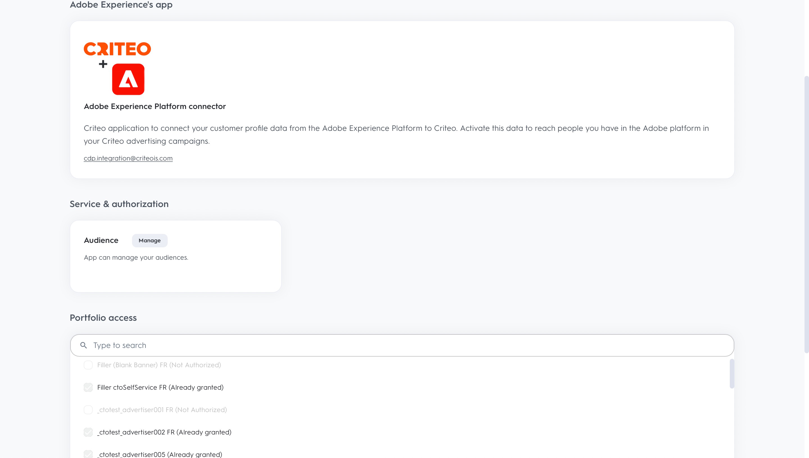

# (Beta) Conexão de critério

## Visão geral {#overview}

>[!IMPORTANT]
>
>Esse conector de destino e a página de documentação são criados e mantidos pela Criteo. No momento, esse é um produto beta e a funcionalidade está sujeita a alterações. Para quaisquer consultas ou solicitações de atualização, entre em contato diretamente com a Criteo [aqui](mailto:criteoTechnicalPartnerships@criteo.com).

O Criteo capacita a publicidade confiável e impactante para trazer experiências mais ricas para cada consumidor através da internet aberta. Com o maior conjunto de dados de comércio do mundo e a melhor IA do setor, o Criteo garante que cada ponto de contato na jornada de compras seja personalizado para alcançar os clientes com o anúncio certo, na hora certa.

## Pré-requisitos {#prerequisites}

* Você precisa ter uma conta de usuário administrador ativada [Centro de gerenciamento de critérios](https://marketing.criteo.com).
* Você precisará da sua ID de anunciante da Criteo (pergunte ao contato da Criteo se não tiver essa ID).
* Você precisará fornecer [!DNL GUM caller ID], caso deseje usar [!DNL GUM ID] como identificador.

## Limitações {#limitations}

* Somente o critério aceita [!DNL SHA-256]emails com hash e de texto sem formatação (a serem transformados em [!DNL SHA-256] antes de enviar). Não envie informações de identificação pessoal (como nomes ou números de telefone).
* O critério precisa de pelo menos um identificador a ser fornecido pelo cliente. Ele prioriza [!DNL GUM ID] como identificador sobre email com hash, pois contribui para uma melhor taxa de correspondência.


## Identidades suportadas {#supported-identities}

O critério é compatível com a ativação das identidades descritas na tabela abaixo. Saiba mais sobre [identidades](https://experienceleague.adobe.com/docs/experience-platform/identity/namespaces.html?lang=en#getting-started).

| Identidade de destino | Descrição | Considerações |
| --- | --- | --- |
| `email_sha256` | Endereços de email com hash com o algoritmo SHA-256 | O Adobe Experience Platform oferece suporte tanto para texto simples quanto para endereços de email com hash SHA-256. Quando o campo de origem contiver atributos sem hash, verifique a [!UICONTROL Aplicar transformação] para que a Platform coloque os dados em hash automaticamente na ativação. |
| `gum_id` | Critério [!DNL GUM] identificador de cookie | [!DNL GUM IDs] permitir que os clientes mantenham uma correspondência entre o sistema de identificação de usuários e a identificação de usuários do Criteo ([!DNL UID]). Se o tipo de identificador for `gum_id`, um parâmetro adicional, a variável [!DNL GUM Caller ID], também devem ser incluídos. Entre em contato com a equipe de conta da Criteo para obter as informações apropriadas [!DNL GUM Caller ID] ou para obter mais informações sobre isso [!DNL GUM ID] sincronizar, se necessário. |

## Tipo e frequência de exportação {#export-type-frequency}

Consulte a tabela abaixo para obter informações sobre o tipo e a frequência da exportação de destino.

| Item | Tipo | Notas |
| --- | --- | --- |
| Tipo de exportação | Exportação de público | Você está exportando todos os membros de um público-alvo com os identificadores (nome, número de telefone ou outros) usados no [!DNL Criteo] destino. |
| Frequência de exportação | Streaming | Os destinos de transmissão são conexões baseadas em API &quot;sempre ativas&quot;. Assim que um perfil é atualizado em Experience Platform com base na avaliação do público-alvo, o conector envia a atualização downstream para a plataforma de destino. Leia mais sobre [destinos de transmissão](../../destination-types.md#streaming-destinations). |

## Casos de uso {#use-cases}

Para ajudá-lo a entender melhor como usar o [!DNL Criteo] destino, aqui estão algumas metas que os clientes do Adobe Experience Platform podem atingir com [!DNL Criteo]:

### Caso de uso 1: obter tráfego

Mostre sua empresa com ofertas de produtos relevantes e criações flexíveis. Com recomendações de produtos inteligentes, seus anúncios apresentarão automaticamente os produtos com maior probabilidade de acionar visitas e engajamento. O direcionamento flexível permite criar públicos-alvo a partir do conjunto de dados de comércio da Criteo ou de suas próprias listas de clientes potenciais e segmentos da CDP Adobe.

### Caso de uso 2: aumentar as conversões de site

Quando os visitantes saírem do site, lembre-os do que estão perdendo com anúncios de redirecionamento que aumentam as conversões ao mostrar ofertas especiais e ofertas hiper-relevantes, onde quer que estejam. Conecte seu público-alvo da CDP do Adobe para reengajar clientes existentes ou direcionar consumidores semelhantes aos seus compradores mais fiéis.

## Conectar-se ao critério {#connect}

>[!IMPORTANT]
> 
>Para se conectar ao destino, você precisa da variável **[!UICONTROL Gerenciar destinos]** [permissão de controle de acesso](/help/access-control/home.md#permissions). Leia o [visão geral do controle de acesso](/help/access-control/ui/overview.md) ou entre em contato com o administrador do produto para obter as permissões necessárias.

Para se conectar a esse destino, siga as etapas descritas no [tutorial de configuração de destino](../../ui/connect-destination.md).

### Autenticar para o critério

As etapas para se conectar são as seguintes:

1. Faça logon no Adobe Experience Platform e conecte-se ao destino do Critério.

   

1. Você será redirecionado para Critério para autorizar a conexão. Talvez seja necessário primeiro fazer logon com suas credenciais de Critério:

   

   

   


### Parâmetros de conexão {#connection-parameters}

Após a autenticação no destino, preencha os seguintes parâmetros de conexão.


| Campo | Descrição | Obrigatório |
| --- | --- | --- |
| Nome | Um nome para ajudá-lo a reconhecer este destino no futuro. O nome escolhido aqui será o [!DNL Audience] nome no Centro de Gerenciamento de Critérios e não pode ser modificado em um estágio posterior. | Sim |
| Descrição | Uma descrição para ajudar a identificar este destino no futuro. | Não |
| ID do anunciante | ID de anunciante de critérios de sua organização. Entre em contato com o gerente de conta da Criteo para obter essas informações. | Sim |
| Critério [!DNL GUM caller ID] | [!DNL GUM Caller ID] da sua organização. Entre em contato com a equipe de conta da Criteo para obter as informações apropriadas [!DNL GUM Caller ID] ou para obter mais informações sobre isso [!DNL GUM] sincronizar, se necessário. | Sim, sempre [!DNL GUM ID] é fornecido como um identificador |

### Ativar alertas {#enable-alerts}

Você pode ativar os alertas para receber notificações sobre o status do fluxo de dados para o seu destino. Selecione um alerta na lista para assinar e receber notificações sobre o status do seu fluxo de dados. Para obter mais informações sobre alertas, consulte o manual sobre [assinatura de alertas de destinos usando a interface do](../../ui/alerts.md).

Quando terminar de fornecer detalhes da conexão de destino, selecione **[!UICONTROL Próxima]**.

## Ativar públicos para este destino {#activate-segments}

>[!IMPORTANT]
> 
>* Para ativar os dados, é necessário **[!UICONTROL Gerenciar destinos]**, **[!UICONTROL Ativar destinos]**, **[!UICONTROL Exibir perfis]**, e **[!UICONTROL Exibir segmentos]** [permissões de controle de acesso](/help/access-control/home.md#permissions). Leia o [visão geral do controle de acesso](/help/access-control/ui/overview.md) ou entre em contato com o administrador do produto para obter as permissões necessárias.
>* Para exportar *identidades*, você precisará do **[!UICONTROL Exibir gráfico de identidade]** [permissão de controle de acesso](/help/access-control/home.md#permissions). <br> {width="100" zoomable="yes"}

Ler [Ativar perfis e públicos para destinos de exportação de público de transmissão](../../ui/activate-segment-streaming-destinations.md) para obter instruções sobre como ativar públicos-alvo para esse destino.

## Dados exportados {#exported-data}

Você pode ver os públicos-alvo exportados na [Centro de gerenciamento de critérios](https://marketing.criteo.com/audience-manager/dashboard).

O corpo da solicitação de adição de um perfil de usuário recebido pelo [!DNL Criteo] A conexão do é semelhante a esta:

```json
{
  "data": {
    "type": "ContactlistWithUserAttributesAmendment",
    "attributes": {
      "operation": "add",
      "identifierType": "gum",
      "gumCallerId": "123",
      "identifiers": [
        {
          "identifier": "456",
          "attributes": [
            { "key": "ctoid_GumCaller", "value": "123" },
            { "key": "ctoid_Gum", "value": "456" },
            {
              "key": "ctoid_HashedEmail",
              "value": "98833030dc03751f2b2c1a0017078975fdae951aa6908668b3ec422040f2d4be"
            }
          ]
        }
      ]
    }
  }
}
```

O corpo da solicitação de remoção do perfil de usuário recebido pelo [!DNL Criteo] A conexão do é semelhante a esta:

```json
{
  "data": {
    "type": "ContactlistWithUserAttributesAmendment",
    "attributes": {
      "operation": "remove",
      "identifierType": "gum",
      "gumCallerId": "123",
      "identifiers": [
        {
          "identifier": "456",
          "attributes": [
            { "key": "ctoid_GumCaller", "value": "123" },
            { "key": "ctoid_Gum", "value": "456" },
            {
              "key": "ctoid_HashedEmail",
              "value": "98833030dc03751f2b2c1a0017078975fdae951aa6908668b3ec422040f2d4be"
            }
          ]
        }
      ]
    }
  }
}
```

## Uso e governança de dados {#data-usage}

Todos os destinos do Adobe Experience Platform estão em conformidade com as políticas de uso de dados ao manipular seus dados. Para obter informações detalhadas sobre como o Adobe Experience Platform fiscaliza a governança de dados, leia o [Visão geral da governança de dados](https://experienceleague.adobe.com/docs/experience-platform/data-governance/home.html?lang=pt-BR).

## Recursos adicionais

* [Central de ajuda do Criteo](https://help.criteo.com/kb/en)
* [Portal do desenvolvedor de critérios](https://developers.criteo.com)
