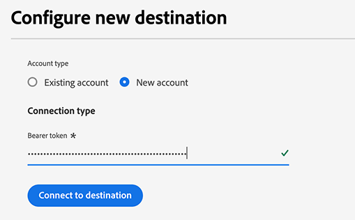

# Conexão de pessoas do Demandbase {#demandbase-people}

Ative perfis para suas campanhas do Demandbase para direcionamento de público, personalização e supressão.

>[!IMPORTANT]
>
>Para casos de uso B2B nos quais você precisa [ativar públicos-alvo da conta](../../ui/activate-account-audiences.md), use o conector de destino [Demandbase](demandbase.md).

## Caso de uso {#use-case}

Os profissionais de marketing podem usar o Adobe Real-Time CDP para criar uma Lista de pessoas de contatos primários e ativá-la no Demandbase para envolvimento otimizado e orquestrado em sua plataforma do lado da demanda (DSP) e outros canais, como o LinkedIn.

Essa abordagem permite que os profissionais de marketing priorizem os gastos de campanha em indivíduos conhecidos originados de seu próprio CRM ou sistema de automação de marketing, garantindo que os esforços de marketing se concentrem em clientes potenciais de alto valor.

Depois de ativado, o Demandbase otimiza a entrega de anúncios, refinando as estratégias de direcionamento para maximizar as taxas de engajamento, alcance e conversão, melhorando, em última análise, a eficiência da campanha.

## Identidades suportadas {#supported-identities}

A conexão [!DNL Demandbase People] oferece suporte à ativação das identidades descritas na tabela abaixo. Saiba mais sobre [identidades](/help/identity-service/features/namespaces.md).

| Identidade de destino | Descrição | Considerações |
|---|---|---|
| email | Endereços de email de texto sem formatação | A conexão [!DNL Demandbase People] dá suporte somente a endereços de email de texto sem formatação. |

{style="table-layout:auto"}

## Públicos-alvo compatíveis {#supported-audiences}

Esta seção descreve que tipo de público-alvo você pode exportar para esse destino.

| Origem do público | Suportado | Descrição |
|---------|----------|----------|
| [!DNL Segmentation Service] | ✓ | Públicos-alvo gerados pelo [Serviço de Segmentação](../../../segmentation/home.md) da Experience Platform. |
| Uploads personalizados | X | Públicos [importados](../../../segmentation/ui/overview.md#import-audience) para o Experience Platform de arquivos CSV. |

{style="table-layout:auto"}

## Tipo e frequência de exportação {#export-type-and-frequency}

Consulte a tabela abaixo para obter informações sobre o tipo e a frequência da exportação de destino.

| Item | Tipo | Notas |
|--------------|-----------|---------------------------|
| Tipo de exportação | Exportação de público | Você está exportando todos os membros de um público com os identificadores (nome, número de telefone ou outros) usados no destino *Demandbase*. |
| Frequência | Transmissão | Os destinos de transmissão são conexões baseadas em API &quot;sempre ativas&quot;. Assim que um perfil for atualizado no Experience Platform com base na avaliação do público-alvo, o conector enviará a atualização downstream para a plataforma de destino. Leia mais sobre [destinos de streaming](/help/destinations/destination-types.md#streaming-destinations). |

{style="table-layout:auto"}

## Pré-requisitos {#prerequisites}

Para exportar públicos para o Demandbase, é necessário o seguinte:

1. Uma conta do Demandbase.
2. Um token de API do Demandbase. Você pode gerar um token de API com seu usuário no Demandbase. Para gerar um token, navegue até [Meu perfil > Token de API](https://web.demandbase.com/o/ad/at) depois de fazer logon na sua conta do Demandbase.

## Conectar ao destino {#connect}

>[!IMPORTANT]
> 
>Para se conectar ao destino, você precisa da **[!UICONTROL View Destinations]** e da **[!UICONTROL Manage Destinations]** [permissão de controle de acesso](/help/access-control/home.md#permissions). Leia a [visão geral do controle de acesso](/help/access-control/ui/overview.md) ou contate o administrador do produto para obter as permissões necessárias.

Para se conectar a este destino, siga as etapas descritas no [tutorial de configuração de destino](../../ui/connect-destination.md). No workflow de configuração de destino, preencha os campos listados nas duas seções abaixo.

### Autenticar para o destino {#authenticate}

Para autenticar no destino, preencha os campos obrigatórios e selecione **[!UICONTROL Connect to destination]**.

* **[!UICONTROL Bearer token]**: Preencha o token do portador para autenticar no destino. Exiba [pré-requisitos](#prerequisites) para obter informações sobre como obter o token.

### Preencher detalhes do destino {#destination-details}

Para configurar detalhes para o destino, preencha os campos obrigatórios e opcionais abaixo. Um asterisco ao lado de um campo na interface do usuário indica que o campo é obrigatório.

* **[!UICONTROL Name]**: Um nome pelo qual você reconhecerá este destino no futuro.
* **[!UICONTROL Description]**: uma descrição que ajudará você a identificar este destino no futuro.

Agora você está pronto para ativar seus públicos-alvo no Demandbase People.

## Ativar públicos-alvo para esse destino {#activate}

>[!IMPORTANT]
> 
>* Para ativar dados, você precisa das **[!UICONTROL View Destinations]**, **[!UICONTROL Activate Destinations]**, **[!UICONTROL View Profiles]** e **[!UICONTROL View Segments]** [permissões de controle de acesso](/help/access-control/home.md#permissions). Leia a [visão geral do controle de acesso](/help/access-control/ui/overview.md) ou contate o administrador do produto para obter as permissões necessárias.
>* Para exportar *identidades*, você precisa da **[!UICONTROL View Identity Graph]** [permissão de controle de acesso](/help/access-control/home.md#permissions).   {width="100" zoomable="yes"}

Leia [Ativar perfis e públicos-alvo para destinos de exportação de público-alvo de streaming](/help/destinations/ui/activate-segment-streaming-destinations.md) para obter instruções sobre como ativar públicos-alvo para este destino.

### Mapeamentos obrigatórios {#mandatory-mappings}

Ao ativar públicos para o destino [!DNL Demandbase People], você deve configurar o seguinte mapeamento de campo obrigatório na etapa de mapeamento:

| Campo de origem | Campo de destino | Descrição |
|--------------|--------------|-------------|
| `xdm: workEmail.address` | `Identity: email` | O email comercial da pessoa |

### Mapeamentos recomendados {#recommended-mappings}

Para obter a precisão de correspondência ideal, inclua os seguintes mapeamentos opcionais no fluxo de ativação, além do [mapeamento obrigatório](#mandatory-mappings) acima.

| Campo de origem | Campo de destino | Descrição |
|--------------|--------------|-------------|
| `xdm: b2b.personKey.sourceKey` | `xdm: externalPersonId` | O identificador exclusivo da pessoa |
| `xdm: person.name.lastName` | `xdm: lastName` | O sobrenome da pessoa |
| `xdm: person.name.firstName` | `xdm: firstName` | O nome da pessoa |

### Práticas recomendadas de mapeamento {#mapping-best-practices}

Ao mapear campos para [!DNL Demandbase People], considere o seguinte comportamento correspondente:

* **Correspondência primária**: se `externalPersonId` estiver presente, o Demandbase o usará como o identificador principal para a correspondência de pessoas.
* **Correspondência de fallback**: se `externalPersonId` não estiver disponível, o Demandbase usará o campo `email` para identificação.
* **Obrigatório vs. recomendado**: embora apenas `email` seja exigido pelo Demandbase, a Adobe recomenda mapear todos os campos disponíveis da tabela de mapeamentos recomendada acima, para melhorar a precisão da correspondência e o desempenho da campanha.

Esses mapeamentos são necessários para que o destino funcione corretamente e devem ser configurados antes de você poder continuar com o fluxo de trabalho de ativação.

## Observações adicionais e chamadas de retorno importantes {#additional-notes}

* **Medidas de proteção da API do Demandbase**: se você tiver exportado públicos para o Demandbase e as exportações forem bem-sucedidas no Experience Platform, mas nem todos os dados atingirem o Demandbase, você poderá ter encontrado uma limitação de API no Demandbase. Entre em contato com eles para obter esclarecimentos.
* **Exclusão de lista**: as listas de pessoas são exclusivas; portanto, você não pode recriar uma nova lista com um nome já em uso. Quando você remover pessoas de uma lista, elas não estarão mais disponíveis, mas não serão excluídas.
* **Tempo de ativação**: o carregamento de dados no Demandbase está sujeito a processamento noturno.
* **Nomeação do público-alvo**: se um público-alvo de pessoas com o mesmo nome tiver sido ativado anteriormente no Demandbase, você não poderá ativá-lo novamente por meio de um fluxo de dados diferente para o destino do Demandbase.
