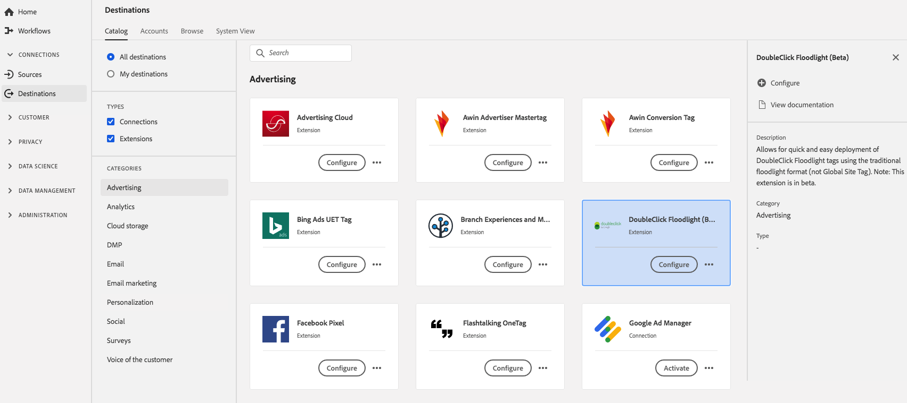

# Extensão do [!DNL DoubleClick Floodlight] (Beta)

## Visão geral {#overview}

Essa extensão permite a implantação rápida e fácil de [!DNL DoubleClick Floodlight] tags usando o formato tradicional de luz de inundação (não a Tag de Site Global). Observação: essa extensão está na versão beta.

[!DNL DoubleClick Floodlight] (Beta) é uma extensão de publicidade no Adobe Experience Platform. Para obter mais informações sobre a funcionalidade de extensão, consulte a documentação de suporte do [!DNL Google] para o [DoubleClick Floodlight](https://support.google.com/dcm/answer/2823388?hl=en).

Esse destino é uma extensão de tag. Para obter mais informações sobre como as extensões funcionam na Experience Platform, consulte a [visão geral das extensões de tag](../launch-extensions/overview.md).

## Pré-requisitos {#prerequisites}

Esta extensão está disponível no catálogo [!DNL Destinations] para todos os clientes que compraram o Experience Platform.

Para usar essa extensão, você precisa acessar as tags na Adobe Experience Platform. As tags são oferecidas aos clientes do Adobe Experience Cloud como um recurso incluso de valor agregado. Entre em contato com o administrador da organização para obter acesso às tags e solicite a concessão da permissão **[!UICONTROL manage_properties]** para que você possa instalar extensões.

## Instalar extensão {#install-extension}

Para instalar a extensão DoubleClick Floodlight (Beta):

Na [interface do Experience Platform](https://platform.adobe.com/), vá para **[!UICONTROL Destinos]** > **[!UICONTROL Catálogo]**.

Selecione a extensão no catálogo ou use a barra de pesquisa.

Clique no destino para realçá-lo e selecione **[!UICONTROL Configurar]** no painel direito. Se o controle **[!UICONTROL Configurar]** estiver esmaecido, você não terá a permissão **[!UICONTROL manage_properties]**. Consulte [Pré-requisitos](#prerequisites).

Selecione a propriedade na qual deseja instalar a extensão. Você também tem a opção de criar uma nova propriedade. Uma propriedade é uma coleção de regras, elementos de dados, extensões configuradas, ambientes e bibliotecas. Saiba mais sobre as propriedades na [seção da página Propriedades](../../../tags/ui/administration/companies-and-properties.md#properties-page) da documentação de tags.

O fluxo de trabalho o orienta pelas etapas necessárias para concluir a instalação.

Você também pode instalar a extensão diretamente na [Interface da Coleção de Dados](https://experience.adobe.com/#/data-collection/). Para obter mais informações, consulte a seção sobre [adição de uma nova extensão](../../../tags/ui/managing-resources/extensions/overview.md#add-a-new-extension) na documentação das tags.

## Como usar a extensão {#how-to-use}

Depois de instalar a extensão, você pode começar a configurar regras.

Você pode configurar regras para as extensões instaladas para enviar dados do evento para o destino da extensão somente em determinadas situações. Para obter mais informações sobre como configurar regras para suas extensões, consulte a [documentação de tags](../../../tags/ui/managing-resources/rules.md).

## Configurar, atualizar e excluir extensão {#configure-upgrade-delete}

É possível configurar, atualizar e excluir extensões na interface da coleção de dados.

>[!TIP]
>
>Se a extensão já estiver instalada em uma de suas propriedades, a interface do usuário do Experience Platform ainda exibirá **[!UICONTROL Instalar]** para a extensão. Inicie o fluxo de trabalho de instalação conforme descrito em [Instalar extensão](#install-extension) para configurar ou excluir sua extensão.

Para atualizar sua extensão, consulte o manual no [processo de atualização da extensão](../../../tags/ui/managing-resources/extensions/extension-upgrade.md) na documentação das tags.
